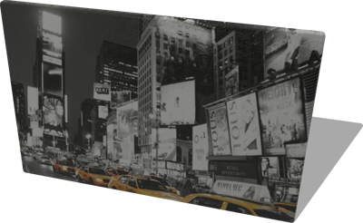

# Paintings

## LandscapePainting

A painting (0.05 x 1.5 x 1 m).

%figure



%end

Derived from [Solid](../reference/solid.md).

```
LandscapePainting {
  SFVec3f    translation 0 0 0.5
  SFRotation rotation    0 0 1 0
  SFString   name        "landscape painting"
  SFColor    color       1 1 1
  MFString   textureUrl  "textures/landscape_painting.jpg"
}
```

> **File location**: "[WEBOTS\_HOME/projects/objects/paintings/protos/LandscapePainting.proto]({{ url.github_tree }}/projects/objects/paintings/protos/LandscapePainting.proto)"

> **License**: Copyright Cyberbotics Ltd. Licensed for use only with Webots.
[More information.](https://cyberbotics.com/webots_assets_license)

### LandscapePainting Field Summary

- `color`: Defines the color of the painting.

- `textureUrl`: Defines the texure used for the painting.

## PortraitPainting

A painting (0.05 x 0.82 x 1.01 m).

%figure


%end

Derived from [Solid](../reference/solid.md).

```
PortraitPainting {
  SFVec3f    translation 0 0 0.505
  SFRotation rotation    0 0 1 0
  SFString   name        "portrait painting"
  SFColor    color       1 1 1
  MFString   textureUrl  "textures/portrait_painting.jpg"
}
```

> **File location**: "[WEBOTS\_HOME/projects/objects/paintings/protos/PortraitPainting.proto]({{ url.github_tree }}/projects/objects/paintings/protos/PortraitPainting.proto)"

> **License**: Copyright Cyberbotics Ltd. Licensed for use only with Webots.
[More information.](https://cyberbotics.com/webots_assets_license)

### PortraitPainting Field Summary

- `color`: Defines the color of the painting.

- `textureUrl`: Defines the texure used for the painting.

