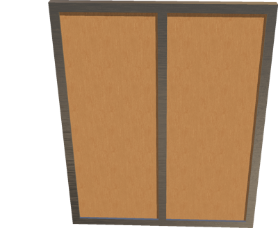
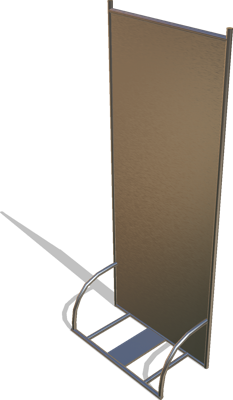

# Panels

## Panel

Customizable simple panel.

%figure



%end

Derived from [Solid](../reference/solid.md).

```
Panel {
  SFVec3f    translation      0 0 0
  SFRotation rotation         0 1 0 0
  SFString   name             "panel"
  SFVec3f    size             1.2 1.5 0.05
  SFFloat    borderHeight     0.05
  SFFloat    internalWidth    0.02
  SFInt32    panelsCount      2
  SFNode     appearance       VarnishedPine { textureTransform TextureTransform { scale 5 5 } }
  SFNode     borderAppearance BrushedAluminium {}
  MFColor    recognitionColors []
}
```

> **File location**: "[WEBOTS\_HOME/projects/objects/panels/protos/Panel.proto]({{ url.github_tree }}/projects/objects/panels/protos/Panel.proto)"

> **License**: Copyright Cyberbotics Ltd. Licensed for use only with Webots.
[More information.](https://cyberbotics.com/webots_assets_license)

### Panel Field Summary

- `size`: Defines the size of the panel.

- `borderHeight`: Defines the height of the border.

- `internalWidth`: Defines the width of the panel (without border).

- `panelsCount`: Defines the number of panels.

- `appearance`: Defines the appearance of the panel body.

- `borderAppearance`: Defines the appearance of the panel border(s).

## PanelWithTubes

A gray panel with tubes.

%figure



%end

Derived from [Solid](../reference/solid.md).

```
PanelWithTubes {
  SFVec3f    translation 0 0 0
  SFRotation rotation    0 1 0 0
  SFString   name        "panel with tubes"
  SFNode     appearance  BrushedAluminium { textureTransform TextureTransform { scale 3 3 } }
  MFColor    recognitionColors []
}
```

> **File location**: "[WEBOTS\_HOME/projects/objects/panels/protos/PanelWithTubes.proto]({{ url.github_tree }}/projects/objects/panels/protos/PanelWithTubes.proto)"

> **License**: Copyright Cyberbotics Ltd. Licensed for use only with Webots.
[More information.](https://cyberbotics.com/webots_assets_license)

### PanelWithTubes Field Summary

- `appearance`: Defines the appearance of the panel.

