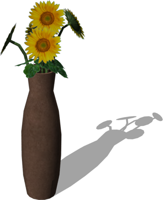
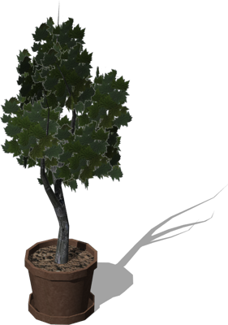

# Plants

## BunchOfSunFlowers

Five sun flowers into a pot (0.17 x 0.17 x 0.95 m).

%figure



%end

Derived from [Solid](../reference/solid.md).

```
BunchOfSunFlowers {
  SFVec3f    translation            0 0 0
  SFRotation rotation               0 0 1 0
  SFString   name                   "bunch of sunflowers"
  MFString   flowerTextureUrl       "textures/bunch_of_sun_flowers_flower.png"
  MFString   leavesTextureUrl       "textures/bunch_of_sun_flowers_leaves.png"
  SFNode     physics                NULL
}
```

> **File location**: "[WEBOTS\_HOME/projects/objects/plants/protos/BunchOfSunFlowers.proto]({{ url.github_tree }}/projects/objects/plants/protos/BunchOfSunFlowers.proto)"

> **License**: Copyright Cyberbotics Ltd. Licensed for use only with Webots.
[More information.](https://cyberbotics.com/webots_assets_license)

### BunchOfSunFlowers Field Summary

- `flowerTextureUrl`: Defines the textures used for the flowers.

- `leavesTextureUrl`: Defines the textures used for the leaves.

## FlowerPot

A flower pot.

%figure


%end

Derived from [Solid](../reference/solid.md).

```
FlowerPot {
  SFVec3f    translation          0 0 0
  SFRotation rotation             0 0 1 0
  SFString   name                 "flower pot"
  SFNode     physics              NULL
}
```

> **File location**: "[WEBOTS\_HOME/projects/objects/plants/protos/FlowerPot.proto]({{ url.github_tree }}/projects/objects/plants/protos/FlowerPot.proto)"

> **License**: Copyright Cyberbotics Ltd. Licensed for use only with Webots.
[More information.](https://cyberbotics.com/webots_assets_license)

## PottedTree

A potted tree (0.3 x 0.3 x 1.3 m).

%figure



%end

Derived from [Solid](../reference/solid.md).

```
PottedTree {
  SFVec3f    translation          0 0 0
  SFRotation rotation             0 0 1 0
  SFString   name                 "potted tree"
  SFColor    potAndTreeColor      1 1 1
  MFString   potAndTreeTextureUrl "textures/potted_tree_pot_and_tree.jpg"
  SFColor    leavesColor          1 1 1
  MFString   leavesTextureUrl     "textures/potted_tree_leaves.png"
  SFNode     physics              NULL
}
```

> **File location**: "[WEBOTS\_HOME/projects/objects/plants/protos/PottedTree.proto]({{ url.github_tree }}/projects/objects/plants/protos/PottedTree.proto)"

> **License**: Copyright Cyberbotics Ltd. Licensed for use only with Webots.
[More information.](https://cyberbotics.com/webots_assets_license)

### PottedTree Field Summary

- `potAndTreeColor`: Defines the color of the pot and the three.

- `potAndTreeTextureUrl`: Defines the textures used for of the pot and the three.

- `leavesColor`: Defines the color of the leaves.

- `leavesTextureUrl`: Defines the textures used for of the leaves.

