# Road

## Road PROTO

A fully customizable road, the number of lanes, the dimensions and the path of the road is configurable.
For each line separating two lanes it is possible to configure if this one is continuous or dashed.
B-Spline can be used in order to interpolate the path of the road and an optional border can be enable.
The boundingObject of each border and the road itself can be independently enable or disable.
This model was sponsored by the CTI project RO2IVSim ([http://transport.epfl.ch/simulator-for-mobile-robots-and-intelligent-vehicles](http://transport.epfl.ch/simulator-for-mobile-robots-and-intelligent-vehicles)).

%figure

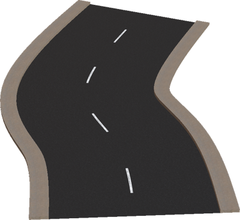

%end

Derived from [Solid](../reference/solid.md).

```
Road {
         SFVec3f              translation               0 0 0
         SFRotation           rotation                  0 0 1 0
         SFString             name                      "road"
         SFString             id                        ""
         SFString             startJunction             ""
         SFString             endJunction               ""
         SFFloat              width                     7
         SFInt32              numberOfLanes             2
         SFInt32              numberOfForwardLanes      1
         SFFloat              speedLimit                -1.0
         MFNode               lines                     [ RoadLine { } ]
         SFFloat              roadBorderHeight          0.15
         MFFloat              roadBorderWidth           [ 0.8 ]
         SFBool               road                      TRUE
         SFBool               rightBorder               TRUE
         SFBool               leftBorder                TRUE
         SFBool               rightBarrier              FALSE
         SFBool               leftBarrier               FALSE
         SFBool               bottom                    FALSE
         MFVec3f              wayPoints                 [ 0 0 0, 1 0 0 ]
         MFFloat              roadTilt                  [ 0, 0]
         MFFloat              startingAngle             []
         MFFloat              endingAngle               []
         MFString             startLine                 []
         MFString             endLine                   []
         SFInt32              splineSubdivision         4
         SFNode               appearance                Asphalt { }
         SFNode               pavementAppearance        Pavement { }
         MFString             bottomTexture             []
         SFString             turnLanesForward          ""
         SFString             turnLanesBackward         ""
         SFBool               locked                    TRUE
         SFBool               roadBoundingObject        FALSE
         SFBool               rightBorderBoundingObject FALSE
         SFBool               leftBorderBoundingObject  FALSE
         SFBool               rightBarrierBoundingObject TRUE
         SFBool               leftBarrierBoundingObject TRUE
         SFBool               castShadows               FALSE
         SFString             contactMaterial           "default"
}
```

> **File location**: "[WEBOTS\_HOME/projects/objects/road/protos/Road.proto]({{ url.github_tree }}/projects/objects/road/protos/Road.proto)"

> **License**: Copyright Cyberbotics Ltd. Licensed for use only with Webots.
[More information.](https://cyberbotics.com/webots_assets_license)

### Road Field Summary

- `name`: Optionally defines the street name.

- `id`: Optionally defines a unique ID. A unique ID is required to use the SUMO exporter.

- `startJunction`: Optionally defines a reference to the Crossroad connected at the first Road waypoint. Setting correctly this field is required to use the SUMO exporter.

- `endJunction`: Optionally defines a reference to the Crossroad connected at the last Road waypoint. Setting correctly this field is required to use the SUMO exporter.

- `width`: Defines the total width of the road (excluding sidewalk).

- `numberOfLanes`: Defines the number of lanes (used for the texture mapping).

- `numberOfForwardLanes`: Defines the number of forward lanes. (this is an information with no impact on the graphical shape).

- `speedLimit`: Optionally defines the speed limit. The recommended unit is meter per seconds.

- `lines`: Defines the property of each line separating two lanes. This field accepts a list of `RoadLine` nodes.

- `roadBorderHeight`: Defines the height of the sidewalk.

- `roadBorderWidth`: Defines the width of the sidewalk associated to each way-point (if there are less values than way-points, the last value is used for the last remaining way-points).

- `road`: Defines the width of the sidewalk associated to each way-point (if there are less values than way-points, the last value is used for the last remaining way-points).

- `rightBorder`: Defines whether the road should have a right sidewalk.

- `leftBorder`: Defines whether the road should have a left sidewalk.

- `rightBarrier`: Defines whether the road should have a right barrier.

- `leftBarrier`: Defines whether the road should have a left barrier.

- `bottom`: Defines whether the road bottom should be displayed (useful in case of bridge).

- `wayPoints`: Defines the path of the road.

- `roadTilt`: Defines the tilting angle corresponding to each way-point (if there are less values than way-points, 0 is used for the last remaining way-points).

- `startingAngle`: Optionally defines the angle of the road at the first way-point.

- `endingAngle`: Optionally defines the angle of the road at the lasst way-point.

- `startLine`: Optionally defines the texture used for the road line at the first way-point for each lane. If the string is empty, no road line will be added for the corresponding lane. The two textures `textures/road_line_dashed.png` and `textures/road_line_triangle.png` may be used in this field.

- `endLine`: Optionally defines the texture used for the road line at the last way-point for each lane. If the string is empty, no road line will be added for the corresponding lane.

- `splineSubdivision`: Defines the degree of interpolation using B-Splines (if the value is lower than 0, the interpolation is disabled).

- `appearance`: Defines the appearance of the road.

- `pavementAppearance`: Defines the appearance of the sidewalk.

- `bottomTexture`: Defines the texture to be used for the bottom of the road.

- `turnLanesForward`: Defines painted arrows before the end of the lanes using the same format as the OSM "turn:lanes:forward" key (e.g. "through|left;through|none"). Please refer to the corresponding OSM tag: http://wiki.openstreetmap.org/wiki/Key:turn.

- `turnLanesBackward`: Same as `turnLanesForward` but for the OSM "turn:lanes:backward" key.

- `roadBoundingObject`: Defines whether the road should have a bounding object.

- `rightBorderBoundingObject`: Defines whether the right sidewalk should have a bounding object.

- `leftBorderBoundingObject`: Defines whether the left sidewalk should have a bounding object.

- `rightBarrierBoundingObject`: Defines whether the right crash barrier (if any) should have a bounding object.

- `leftBarrierBoundingObject`: Defines whether the left crash barrier (if any) should have a bounding object.

- `castShadows`: Defines whether the road should cast shadows.

## AddLaneRoadSegment

A simple segment of road allowing to add (or remove) one lane to the road.
The side where the new lane is added is configurable as well as a lot of others parameters of a regular road.
This model was sponsored by the CTI project RO2IVSim ([http://transport.epfl.ch/simulator-for-mobile-robots-and-intelligent-vehicles](http://transport.epfl.ch/simulator-for-mobile-robots-and-intelligent-vehicles)).

%figure

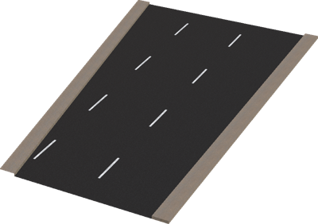

%end

Derived from [Solid](../reference/solid.md).

```
AddLaneRoadSegment {
         SFVec3f     translation               0 0 0
         SFRotation  rotation                  0 0 1 0
         SFString    name                      "road"
         SFString    id                        ""
         MFString    connectedRoadIDs          []
         SFFloat     width                     7
         SFFloat     length                    20
         SFInt32     numberOfLanes             2
         SFFloat     speedLimit                -1.0
         SFBool      newLaneLeft               TRUE
         MFNode      lines                     [ RoadLine { }, RoadLine { } ]
         SFFloat     roadBorderHeight          0.15
         SFFloat     roadBorderWidth           0.8
         SFBool      rightBorder               TRUE
         SFBool      leftBorder                TRUE
         SFBool      rightBarrier              FALSE
         SFBool      leftBarrier               FALSE
         SFBool      bottom                    FALSE
         MFString    startLine                 []
         MFString    endLine                   []
         SFNode      appearance                Asphalt { }
         SFNode      pavementAppearance        Pavement { }
         MFString    bottomTexture             []
         SFBool      locked                    TRUE
         SFBool      roadBoundingObject        FALSE
         SFBool      rightBorderBoundingObject FALSE
         SFBool      leftBorderBoundingObject  FALSE
         SFBool      rightBarrierBoundingObject TRUE
         SFBool      leftBarrierBoundingObject TRUE
         SFBool      castShadows               FALSE
         SFString    contactMaterial           "default"
}
```

> **File location**: "[WEBOTS\_HOME/projects/objects/road/protos/AddLaneRoadSegment.proto]({{ url.github_tree }}/projects/objects/road/protos/AddLaneRoadSegment.proto)"

> **License**: Copyright Cyberbotics Ltd. Licensed for use only with Webots.
[More information.](https://cyberbotics.com/webots_assets_license)

### AddLaneRoadSegment Field Summary

- `name`: Defines the junction name.

- `id`: Optionally defines a unique ID. A unique ID is required to use the SUMO exporter.

- `connectedRoadIDs`: Optionally defines a list of the identifiers of the connected Road. This is required to use the SUMO exporter.

- `width`: Defines the total width of the road (excluding sidewalk).

- `length`: Defines the total length of the segment.

- `numberOfLanes`: Defines the number of lanes before addition of the new one (used for the texture mapping).

- `speedLimit`: Optionally defines the speed limit. The recommended unit is meter per seconds.

- `newLaneLeft`: Defines on which side is added the new lane.

- `lines`: Defines the property of each line separating two lanes. This field accepts a list of `RoadLine` nodes.

- `roadBorderHeight`: Defines the height of the sidewalk.

- `roadBorderWidth`: Defines the width of the sidewalk.

- `rightBorder`: Defines whether the road should have a right sidewalk.

- `leftBorder`: Defines whether the road should have a left sidewalk.

- `rightBarrier`: Defines whether the road should have a right barrier.

- `leftBarrier`: Defines whether the road should have a left barrier.

- `bottom`: Defines whether the road bottom should be displayed (useful in case of bridge).

- `startLine`: Optionally defines the texture used for the road line at the first way-point for each lane. If the string is empty, no road line will be added for the corresponding lane. The two textures `textures/road_line_dashed.png` and `textures/road_line_triangle.png` may be used in this field.

- `endLine`: Optionally defines the texture used for the road line at the last way-point for each lane. If the string is empty, no road line will be added for the corresponding lane.

- `appearance`: Defines the appearance of the road.

- `pavementAppearance`: Defines the appearance of the sidewalk.

- `bottomTexture`: Defines the texture to be used for the bottom of the road.

- `roadBoundingObject`: Defines whether the road should have a bounding object.

- `rightBorderBoundingObject`: Defines whether the right sidewalk should have a bounding object.

- `leftBorderBoundingObject`: Defines whether the left sidewalk should have a bounding object.

- `rightBarrierBoundingObject`: Defines whether the right crash barrier (if any) should have a bounding object.

- `leftBarrierBoundingObject`: Defines whether the left crash barrier (if any) should have a bounding object.

- `castShadows`: Defines whether the road should cast shadows.

## AddLanesRoadSegment

A simple segment of road allowing to add (or remove) several lanes to the road.
The side where the new lanes are added is configurable as well as a lot of others parameters of a regular road.
This model was sponsored by the CTI project RO2IVSim ([http://transport.epfl.ch/simulator-for-mobile-robots-and-intelligent-vehicles](http://transport.epfl.ch/simulator-for-mobile-robots-and-intelligent-vehicles)).

%figure

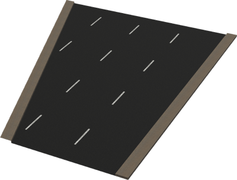

%end

Derived from [Solid](../reference/solid.md).

```
AddLanesRoadSegment {
         SFVec3f     translation               0 0 0
         SFRotation  rotation                  0 0 1 0
         SFString    name                      "road"
         SFString    id                        ""
         MFString    connectedRoadIDs          []
         SFFloat     width                     7
         SFFloat     length                    20
         SFInt32     numberOfLanes             2
         SFInt32     numberOfNewLanes          2
         SFFloat     speedLimit                -1.0
         SFBool      newLaneLeft               TRUE
         MFNode      lines                     [ RoadLine { } ]
         SFFloat     roadBorderHeight          0.15
         SFFloat     roadBorderWidth           0.8
         SFBool      rightBorder               TRUE
         SFBool      leftBorder                TRUE
         SFBool      rightBarrier              FALSE
         SFBool      leftBarrier               FALSE
         SFBool      bottom                    FALSE
         MFString    startLine                 []
         MFString    endLine                   []
         SFNode      appearance                Asphalt { }
         SFNode      pavementAppearance        Pavement { }
         MFString    bottomTexture             []
         SFBool      locked                    TRUE
         SFBool      roadBoundingObject        FALSE
         SFBool      rightBorderBoundingObject FALSE
         SFBool      leftBorderBoundingObject  FALSE
         SFBool      rightBarrierBoundingObject TRUE
         SFBool      leftBarrierBoundingObject TRUE
         SFBool      castShadows               FALSE
         SFString    contactMaterial           "default"
}
```

> **File location**: "[WEBOTS\_HOME/projects/objects/road/protos/AddLanesRoadSegment.proto]({{ url.github_tree }}/projects/objects/road/protos/AddLanesRoadSegment.proto)"

> **License**: Copyright Cyberbotics Ltd. Licensed for use only with Webots.
[More information.](https://cyberbotics.com/webots_assets_license)

### AddLanesRoadSegment Field Summary

- `name`: Defines the junction name.

- `id`: Optionally defines a unique ID. A unique ID is required to use the SUMO exporter.

- `connectedRoadIDs`: Optionally defines a list of the identifiers of the connected Road. This is required to use the SUMO exporter.

- `width`: Defines the total width of the road (excluding sidewalk).

- `length`: Defines the total length of the segment.

- `numberOfLanes`: Defines the number of lanes before addition of the new one(s) (used for the texture mapping).

- `numberOfNewLanes`: Defines the number of lanes to add.

- `speedLimit`: Optionally defines the speed limit. The recommended unit is meter per seconds.

- `newLaneLeft`: Defines on which side are added the new lanes.

- `lines`: Defines the property of each line separating two lanes. This field accepts a list of `RoadLine` nodes.

- `roadBorderHeight`: Defines the height of the sidewalk.

- `roadBorderWidth`: Defines the width of the sidewalk.

- `rightBorder`: Defines whether the road should have a right sidewalk.

- `leftBorder`: Defines whether the road should have a left sidewalk.

- `rightBarrier`: Defines whether the road should have a right barrier.

- `leftBarrier`: Defines whether the road should have a left barrier.

- `bottom`: Defines whether the road bottom should be displayed (useful in case of bridge).

- `startLine`: Optionally defines the texture used for the road line at the first way-point for each lane. If the string is empty, no road line will be added for the corresponding lane. The two textures `textures/road_line_dashed.png` and `textures/road_line_triangle.png` may be used in this field.

- `endLine`: Optionally defines the texture used for the road line at the last way-point for each lane. If the string is empty, no road line will be added for the corresponding lane.

- `appearance`: Defines the appearance of the road.

- `pavementAppearance`: Defines the appearance of the sidewalk.

- `bottomTexture`: Defines the texture to be used for the bottom of the road.

- `roadBoundingObject`: Defines whether the road should have a bounding object.

- `rightBorderBoundingObject`: Defines whether the right sidewalk should have a bounding object.

- `leftBorderBoundingObject`: Defines whether the left sidewalk should have a bounding object.

- `rightBarrierBoundingObject`: Defines whether the right crash barrier (if any) should have a bounding object.

- `leftBarrierBoundingObject`: Defines whether the left crash barrier (if any) should have a bounding object.

- `castShadows`: Defines whether the road should cast shadows.

## CrashBarrier

A customizable crash barrier.

%figure

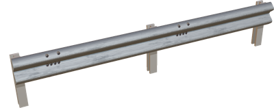

%end

Derived from [Solid](../reference/solid.md).

```
CrashBarrier {
  SFVec3f     translation             0 0 0
  SFRotation  rotation                0 0 1 0
  SFString    name                    "crash barrier"
  SFFloat     poleGap                 2
  SFNode      poleAppearance          PBRAppearance { roughness 0.7 }
  MFVec3f     path                    [0 0 0, 5 0 0]
  SFBool      barrierOnRightSide      TRUE
  SFInt32     subdivision             -1
  SFBool      enableBoundingObject    FALSE
}
```

> **File location**: "[WEBOTS\_HOME/projects/objects/road/protos/CrashBarrier.proto]({{ url.github_tree }}/projects/objects/road/protos/CrashBarrier.proto)"

> **License**: Copyright Cyberbotics Ltd. Licensed for use only with Webots.
[More information.](https://cyberbotics.com/webots_assets_license)

### CrashBarrier Field Summary

- `poleGap`: Defines the gap between two consecutive poles.

- `poleAppearance`: Defines the appearance of the poles.

- `path`: Defines the 3D path of the crash barrier.

- `barrierOnRightSide`: Defines the side of the barrier.

- `subdivision`: Defines the degree of interpolation using B-Splines (if the value is lower than 0, the interpolation is disabled).

- `enableBoundingObject`: Defines whether the crash barrier should have a bounding object.

## Crossroad

A customizable crossroad which can contain optionally references to its connected roads and a shape.

%figure

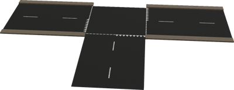

%end

Derived from [Solid](../reference/solid.md).

```
Crossroad {
  SFVec3f    translation      0 0 0
  SFRotation rotation         0 0 1 0
  SFString   name             "crossroad"
  SFString   id               ""
  SFFloat    speedLimit       -1.0
  MFVec3f    shape            [ 0 0 0, 0 1 0, 1 0 0 ]
  MFString   connectedRoadIDs []
  SFBool     boundingObject   FALSE
  SFBool     bottom           FALSE
  SFNode     appearance       Asphalt { }
  SFBool     locked           TRUE
  SFBool     castShadows      FALSE
  SFString   contactMaterial  "default"
}
```

> **File location**: "[WEBOTS\_HOME/projects/objects/road/protos/Crossroad.proto]({{ url.github_tree }}/projects/objects/road/protos/Crossroad.proto)"

> **License**: Copyright Cyberbotics Ltd. Licensed for use only with Webots.
[More information.](https://cyberbotics.com/webots_assets_license)

### Crossroad Field Summary

- `name`: Defines the the crossroad name.

- `id`: Optionally defines a unique ID. A unique ID is required to use the SUMO exporter.

- `speedLimit`: Optionally defines the speed limit. The recommended unit is meter per seconds.

- `shape`: Defines the shape of the crossroad.

- `connectedRoadIDs`: Optionally defines a list of the identifiers of the connected Road. This is required to use the SUMO exporter.

- `boundingObject`: Defines whether the road should have a bounding object.

- `bottom`: Defines whether the road bottom should be displayed (useful in case of bridge).

- `appearance`: Defines the appearance of the road.

- `castShadows`: Defines whether the road should cast shadows.

## CurvedRoadSegment

A simple curved road, the number of lanes, the curvature and the dimensions are configurable, an optional border can be enable.
This model was sponsored by the CTI project RO2IVSim ([http://transport.epfl.ch/simulator-for-mobile-robots-and-intelligent-vehicles](http://transport.epfl.ch/simulator-for-mobile-robots-and-intelligent-vehicles)).

%figure

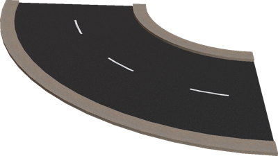

%end

Derived from [Solid](../reference/solid.md).

```
CurvedRoadSegment {
         SFVec3f              translation               0 0 0
         SFRotation           rotation                  0 0 1 0
         SFString             name                      "road"
         SFString             id                        ""
         SFString             startJunction             ""
         SFString             endJunction               ""
         SFFloat              width                     7
         SFInt32              numberOfLanes             2
         SFInt32              numberOfForwardLanes      1
         SFFloat              speedLimit                -1.0
         MFNode               lines                     [ RoadLine { } ]
         SFFloat              roadBorderHeight          0.15
         MFFloat              roadBorderWidth           [ 0.8 ]
         SFBool               rightBorder               TRUE
         SFBool               leftBorder                TRUE
         SFBool               rightBarrier              FALSE
         SFBool               leftBarrier               FALSE
         SFBool               bottom                    FALSE
         SFFloat              curvatureRadius           10
         SFFloat              totalAngle                1.5708
         MFString             startLine                 []
         MFString             endLine                   []
         SFInt32              subdivision               16
         SFFloat              tilt                      0
         SFNode               appearance                Asphalt { }
         SFNode               pavementAppearance        Pavement { }
         MFString             bottomTexture             []
         SFBool               locked                    TRUE
         SFBool               roadBoundingObject        FALSE
         SFBool               rightBorderBoundingObject FALSE
         SFBool               leftBorderBoundingObject  FALSE
         SFBool               rightBarrierBoundingObject TRUE
         SFBool               leftBarrierBoundingObject TRUE
         SFBool               castShadows               FALSE
         SFString             contactMaterial           "default"
}
```

> **File location**: "[WEBOTS\_HOME/projects/objects/road/protos/CurvedRoadSegment.proto]({{ url.github_tree }}/projects/objects/road/protos/CurvedRoadSegment.proto)"

> **License**: Copyright Cyberbotics Ltd. Licensed for use only with Webots.
[More information.](https://cyberbotics.com/webots_assets_license)

### CurvedRoadSegment Field Summary

- `name`: Defines the road name.

- `id`: Optionally defines a unique ID. A unique ID is required to use the SUMO exporter.

- `startJunction`: Optionally defines a reference to the Crossroad connected at the first Road waypoint. Setting correctly this field is required to use the SUMO exporter.

- `endJunction`: Optionally defines a reference to the Crossroad connected at the last Road waypoint. Setting correctly this field is required to use the SUMO exporter.

- `width`: Defines the total width of the road (excluding sidewalk).

- `numberOfLanes`: Defines the number of lanes (used for the texture mapping).

- `numberOfForwardLanes`: Defines the number of forward lanes. (this is an information with no impact on the graphical shape).

- `speedLimit`: Optionally defines the speed limit. The recommended unit is meter per seconds.

- `lines`: Defines the property of each line separating two lanes. This field accepts a list of `RoadLine` nodes.

- `roadBorderHeight`: Defines the height of the sidewalk.

- `roadBorderWidth`: Defines the width of the sidewalk.

- `rightBorder`: Defines whether the road should have a right sidewalk.

- `leftBorder`: Defines whether the road should have a left sidewalk.

- `rightBarrier`: Defines whether the road should have a right barrier.

- `leftBarrier`: Defines whether the road should have a left barrier.

- `bottom`: Defines whether the road bottom should be displayed (useful in case of bridge).

- `curvatureRadius`: Defines the radius of the curve.

- `totalAngle`: Defines the angle covered by the road (length = totalAngle * curvatureRadius).

- `startLine`: Optionally defines the texture used for the road line at the first way-point for each lane. If the string is empty, no road line will be added for the corresponding lane. The two textures `textures/road_line_dashed.png` and `textures/road_line_triangle.png` may be used in this field.

- `endLine`: Optionally defines the texture used for the road line at the last way-point for each lane. If the string is empty, no road line will be added for the corresponding lane.

- `subdivision`: Defines the degree of interpolation using B-Splines (if the value is lower than 0, the interpolation is disabled).

- `tilt`: Defines the maximum tilt of the road.

- `appearance`: Defines the appearance of the road.

- `pavementAppearance`: Defines the appearance of the sidewalk.

- `bottomTexture`: Defines the texture to be used for the bottom of the road.

- `roadBoundingObject`: Defines whether the road should have a bounding object.

- `rightBorderBoundingObject`: Defines whether the right sidewalk should have a bounding object.

- `leftBorderBoundingObject`: Defines whether the left sidewalk should have a bounding object.

- `rightBarrierBoundingObject`: Defines whether the right crash barrier (if any) should have a bounding object.

- `leftBarrierBoundingObject`: Defines whether the left crash barrier (if any) should have a bounding object.

- `castShadows`: Defines whether the road should cast shadows.

## HelicoidalRoadSegment

A simple and configurable helicoidal road showing how to use the Road PROTO in order to create 3D roads.
This model was sponsored by the CTI project RO2IVSim ([http://transport.epfl.ch/simulator-for-mobile-robots-and-intelligent-vehicles](http://transport.epfl.ch/simulator-for-mobile-robots-and-intelligent-vehicles)).

%figure

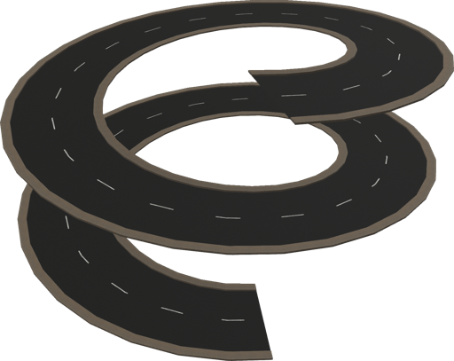

%end

Derived from [Solid](../reference/solid.md).

```
HelicoidalRoadSegment {
         SFVec3f              translation               0 0 0
         SFRotation           rotation                  0 0 1 0
         SFString             name                      "road"
         SFString             id                        ""
         SFString             startJunction             ""
         SFString             endJunction               ""
         SFFloat              width                     7
         SFInt32              numberOfLanes             2
         SFInt32              numberOfForwardLanes      1
         SFFloat              speedLimit                -1.0
         MFNode               lines                     [ RoadLine { } ]
         SFFloat              roadBorderHeight          0.15
         MFFloat              roadBorderWidth           [ 0.8 ]
         SFBool               rightBorder               TRUE
         SFBool               leftBorder                TRUE
         SFBool               bottom                    FALSE
         SFFloat              height                    20
         SFFloat              radius                    15
         SFFloat              heigthStep                5
         MFString             startLine                 []
         MFString             endLine                   []
         SFFloat              subdivision               64
         SFNode               appearance                Asphalt { }
         SFNode               pavementAppearance        Pavement { }
         MFString             bottomTexture             []
         SFBool               locked                    TRUE
         SFBool               roadBoundingObject        FALSE
         SFBool               rightBorderBoundingObject FALSE
         SFBool               leftBorderBoundingObject  FALSE
         SFBool               castShadows               FALSE
         SFString             contactMaterial           "default"
}
```

> **File location**: "[WEBOTS\_HOME/projects/objects/road/protos/HelicoidalRoadSegment.proto]({{ url.github_tree }}/projects/objects/road/protos/HelicoidalRoadSegment.proto)"

> **License**: Copyright Cyberbotics Ltd. Licensed for use only with Webots.
[More information.](https://cyberbotics.com/webots_assets_license)

### HelicoidalRoadSegment Field Summary

- `name`: Defines the road name.

- `id`: Optionally defines a unique ID. A unique ID is required to use the SUMO exporter.

- `startJunction`: Optionally defines a reference to the Crossroad connected at the first Road waypoint. Setting correctly this field is required to use the SUMO exporter.

- `endJunction`: Optionally defines a reference to the Crossroad connected at the last Road waypoint. Setting correctly this field is required to use the SUMO exporter.

- `width`: Defines the total width of the road (excluding sidewalk).

- `numberOfLanes`: Defines the number of lanes (used for the texture mapping).

- `numberOfForwardLanes`: Defines the number of forward lanes. (this is an information with no impact on the graphical shape).

- `speedLimit`: Optionally defines the speed limit. The recommended unit is meter per seconds.

- `lines`: Defines the property of each line separating two lanes. This field accepts a list of `RoadLine` nodes.

- `roadBorderHeight`: Defines the height of the sidewalk.

- `roadBorderWidth`: Defines the width of the sidewalk.

- `rightBorder`: Defines whether the road should have a right sidewalk.

- `leftBorder`: Defines whether the road should have a left sidewalk.

- `bottom`: Defines whether the road bottom should be displayed (useful in case of bridge).

- `height`: Defines the height of the helicoid.

- `radius`: Defines the radius of the helicoid.

- `heigthStep`: Defines the vertical step of the helicoid.

- `startLine`: Optionally defines the texture used for the road line at the first way-point for each lane. If the string is empty, no road line will be added for the corresponding lane. The two textures `textures/road_line_dashed.png` and `textures/road_line_triangle.png` may be used in this field.

- `endLine`: Optionally defines the texture used for the road line at the last way-point for each lane. If the string is empty, no road line will be added for the corresponding lane.

- `subdivision`: Defines the subdivision of the helicoid.

- `appearance`: Defines the appearance of the road.

- `pavementAppearance`: Defines the appearance of the sidewalk.

- `bottomTexture`: Defines the texture to be used for the bottom of the road.

- `roadBoundingObject`: Defines whether the road should have a bounding object.

- `rightBorderBoundingObject`: Defines whether the right sidewalk should have a bounding object.

- `leftBorderBoundingObject`: Defines whether the left sidewalk should have a bounding object.

- `castShadows`: Defines whether the road should cast shadows.

## LaneSeparation

A simple segment of road allowing to divide a road into two smaller ones (or to assemble two roads into a bigger one).
The number of lanes of each of the two smaller roads is independently configurable as well as a lot of others parameters of a regular road.
This model was sponsored by the CTI project RO2IVSim ([http://transport.epfl.ch/simulator-for-mobile-robots-and-intelligent-vehicles](http://transport.epfl.ch/simulator-for-mobile-robots-and-intelligent-vehicles)).

%figure

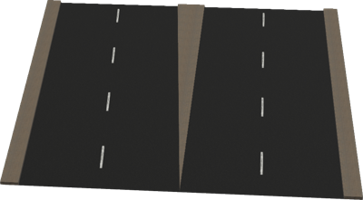

%end

Derived from [Solid](../reference/solid.md).

```
LaneSeparation {
         SFVec3f     translation                 0 0 0
         SFRotation  rotation                    0 0 1 0
         SFString    name                        "road"
         SFString    id                          ""
         MFString    connectedRoadIDs            []
         SFFloat     width                       14
         SFFloat     length                      5
         SFInt32     numberOfLanes               4
         SFInt32     numberOfleavingLanes        2
         SFFloat     speedLimit                -1.0
         SFBool      newLaneLeft                 TRUE
         MFNode      lines                       [ RoadLine { } ]
         SFFloat     roadBorderHeight            0.15
         SFFloat     roadBorderWidth             0.8
         SFBool      rightBorder                 TRUE
         SFBool      leftBorder                  TRUE
         SFBool      centralBorder               TRUE
         SFBool      rightBarrier                FALSE
         SFBool      leftBarrier                 FALSE
         SFBool      bottom                      FALSE
         MFString    startLine                   []
         MFString    endLine                     []
         SFNode      appearance                  Asphalt { }
         SFNode      pavementAppearance          Pavement { }
         MFString    bottomTexture               []
         SFBool      locked                      TRUE
         SFBool      roadBoundingObject          FALSE
         SFBool      rightBorderBoundingObject   FALSE
         SFBool      leftBorderBoundingObject    FALSE
         SFBool      centralBorderBoundingObject FALSE
         SFBool      rightBarrierBoundingObject  TRUE
         SFBool      leftBarrierBoundingObject   TRUE
         SFBool      castShadows                 FALSE
         SFString    contactMaterial             "default"
}
```

> **File location**: "[WEBOTS\_HOME/projects/objects/road/protos/LaneSeparation.proto]({{ url.github_tree }}/projects/objects/road/protos/LaneSeparation.proto)"

> **License**: Copyright Cyberbotics Ltd. Licensed for use only with Webots.
[More information.](https://cyberbotics.com/webots_assets_license)

### LaneSeparation Field Summary

- `name`: Defines the junction name.

- `id`: Optionally defines a unique ID. A unique ID is required to use the SUMO exporter.

- `connectedRoadIDs`: Optionally defines a list of the identifiers of the connected Road. This is required to use the SUMO exporter.

- `width`: Defines the total width of the road (excluding sidewalk).

- `length`: Defines the length of the segment.

- `numberOfLanes`: Defines the total number of lanes (used for the texture mapping).

- `numberOfleavingLanes`: Defines the number of lanes leaving the road.

- `speedLimit`: Optionally defines the speed limit. The recommended unit is meter per seconds.

- `newLaneLeft`: Defines on which sied the lanes are leaving the road.

- `lines`: Defines the property of each line separating two lanes. This field accepts a list of `RoadLine` nodes.

- `roadBorderHeight`: Defines the height of the sidewalk.

- `roadBorderWidth`: Defines the width of the sidewalk.

- `rightBorder`: Defines whether the road should have a right sidewalk.

- `leftBorder`: Defines whether the road should have a left sidewalk.

- `centralBorder`: Defines whether the road should have a central sidewalk.

- `rightBarrier`: Defines whether the road should have a right barrier.

- `leftBarrier`: Defines whether the road should have a left barrier.

- `bottom`: Defines whether the road bottom should be displayed (useful in case of bridge).

- `startLine`: Optionally defines the texture used for the road line at the first way-point for each lane. If the string is empty, no road line will be added for the corresponding lane. The two textures `textures/road_line_dashed.png` and `textures/road_line_triangle.png` may be used in this field.

- `endLine`: Optionally defines the texture used for the road line at the last way-point for each lane. If the string is empty, no road line will be added for the corresponding lane.

- `appearance`: Defines the appearance of the road.

- `pavementAppearance`: Defines the appearance of the sidewalk.

- `bottomTexture`: Defines the texture to be used for the bottom of the road.

- `roadBoundingObject`: Defines whether the road should have a bounding object.

- `rightBorderBoundingObject`: Defines whether the right sidewalk should have a bounding object.

- `leftBorderBoundingObject`: Defines whether the left sidewalk should have a bounding object.

- `centralBorderBoundingObject`: Defines whether the central sidewalk should have a bounding object.

- `rightBarrierBoundingObject`: Defines whether the right crash barrier (if any) should have a bounding object.

- `leftBarrierBoundingObject`: Defines whether the left crash barrier (if any) should have a bounding object.

- `castShadows`: Defines whether the road should cast shadows.

## RoadIntersection

A simple and customizable roads intersection, all the road are crossing at the same point and equally separated in orientation.

%figure

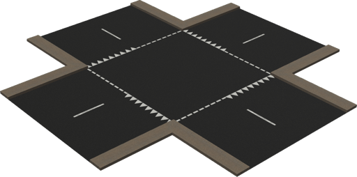

%end

Derived from [Solid](../reference/solid.md).

```
RoadIntersection {
         SFVec3f              translation                    0 0 0
         SFRotation           rotation                       0 0 1 0
         SFString             name                           "road intersection"
         SFString             id                             ""
         MFString             connectedRoadIDs               []
         SFInt32              roadNumber                     4
         SFFloat              roadsWidth                     7
         SFFloat              speedLimit                     -1.0
         SFBool               startRoads                     TRUE
         MFFloat              startRoadsLength               [5]
         SFInt32              startRoadsNumberOfLanes        2
         MFString             startRoadsStartLine            [ "textures/road_line_dashed.png",
                                                               "textures/road_line_triangle.png" ]
         MFString             startRoadsEndLine              []
         MFNode               startRoadsLine                 [ RoadLine { } ]
         SFBool               startRoadBorder                TRUE
         SFFloat              startRoadBorderHeight          0.15
         SFFloat              startRoadBorderWidth           0.8
         SFBool               startRoadBorderboundingObject  FALSE
         SFBool               boundingObject                 FALSE
         SFBool               castShadows                    FALSE
         SFString             contactMaterial                "default"
         SFBool               bottom                         FALSE
         SFBool               locked                         TRUE
         SFNode               appearance                     Asphalt { }
}
```

> **File location**: "[WEBOTS\_HOME/projects/objects/road/protos/RoadIntersection.proto]({{ url.github_tree }}/projects/objects/road/protos/RoadIntersection.proto)"

> **License**: Copyright Cyberbotics Ltd. Licensed for use only with Webots.
[More information.](https://cyberbotics.com/webots_assets_license)

### RoadIntersection Field Summary

- `name`: Defines the intersection name.

- `id`: Optionally defines a unique ID. A unique ID is required to use the SUMO exporter.

- `connectedRoadIDs`: Optionally defines a list of the identifiers of the connected Road. This is required to use the SUMO exporter.

- `roadNumber`: Defines the number of intersecting roads.

- `roadsWidth`: Defines the width of the intersecting roads.

- `speedLimit`: Optionally defines the speed limit. The recommended unit is meter per seconds.

- `startRoads`: Defines if the beginning of each roads should be included or not.

- `startRoadsLength`: Defines the length of the intersecting roads. The same length is used for all the roads if this field has only one item.

- `startRoadsNumberOfLanes`: Defines the number of lanes of the roads(used for the texture mapping).

- `startRoadsStartLine`: Optionally defines the texture used for the road line at the first way-point for each lane. If the string is empty, no road line will be added for the corresponding lane. The two textures `textures/road_line_dashed.png` and `textures/road_line_triangle.png` may be used in this field.

- `startRoadsEndLine`: Optionally defines the texture used for the road line at the last way-point for each lane. If the string is empty, no road line will be added for the corresponding lane.

- `startRoadsLine`: Defines the property of each line separating two lanes. This field accepts a list of `RoadLine` nodes.

- `startRoadBorder`: Defines whether the intersecting road should have a sidewalks.

- `startRoadBorderHeight`: Defines the width of the intersecting road sidewalks.

- `startRoadBorderWidth`: Defines the height of the intersecting road sidewalks.

- `startRoadBorderboundingObject`: Defines whether the sidewalks should have a bounding object.

- `boundingObject`: Defines whether the intersecting roads should have a bounding object.

- `castShadows`: Defines whether the intersection should cast shadows.

- `bottom`: Defines whether the intersection bottom should be displayed (useful in case of bridge).

- `appearance`: Defines the appearance of the road.

## RoadLine

Defines the properties of a road line.
This node should be used in the `lines` field of a road node.

%figure

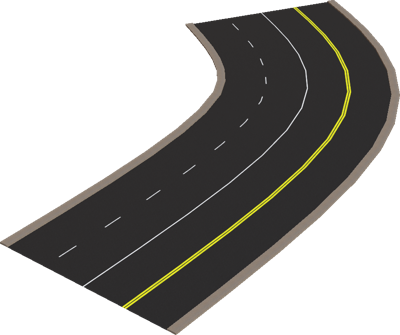

%end

Derived from [Group](../reference/group.md).

```
RoadLine {
  unconnectedField SFColor                                            color 1 1 1
  unconnectedField SFString type  "dashed"
  unconnectedField SFFloat                                            width 0.15
}
```

> **File location**: "[WEBOTS\_HOME/projects/objects/road/protos/RoadLine.proto]({{ url.github_tree }}/projects/objects/road/protos/RoadLine.proto)"

> **License**: Copyright Cyberbotics Ltd. Licensed for use only with Webots.
[More information.](https://cyberbotics.com/webots_assets_license)

### RoadLine Field Summary

- `color`: Defines the color of the line.

- `type`: Defines the type of the road, should be `dashed`, `continuous`, `double` or `none`. This field accepts the following values: `"dashed"`, `"continuous"`, `"double"`, and `"none"`.

- `width`: Defines the with of the line.

## RoadPillars

Generic and customizable road pillars which can be used for easily creating bridges or elevated roads.
The boundingObject can be optionally enable or not.
This model was sponsored by the CTI project RO2IVSim ([http://transport.epfl.ch/simulator-for-mobile-robots-and-intelligent-vehicles](http://transport.epfl.ch/simulator-for-mobile-robots-and-intelligent-vehicles)).

%figure


%end

Derived from [Solid](../reference/solid.md).

```
RoadPillars {
  SFVec3f    translation        0 0 0
  SFRotation rotation           0 0 1 0
  SFString   name               "road pillar"
  SFFloat    height             5
  SFFloat    width              8
  SFFloat    depth              2
  SFFloat    pylonsRadius       0.6
  SFFloat    pylonsDistance     6
  SFFloat    pylonsInclination  0.1
  SFFloat    upperTilt          0
  SFNode     appearance         RoughConcrete { textureTransform TextureTransform { scale 4 1} }
  SFBool     boundingObject     TRUE
}
```

> **File location**: "[WEBOTS\_HOME/projects/objects/road/protos/RoadPillars.proto]({{ url.github_tree }}/projects/objects/road/protos/RoadPillars.proto)"

> **License**: Copyright Cyberbotics Ltd. Licensed for use only with Webots.
[More information.](https://cyberbotics.com/webots_assets_license)

### RoadPillars Field Summary

- `height`: Defines the height of the pillar.

- `width`: Defines the width of the pillar.

- `depth`: Defines the depth of the pillar.

- `pylonsRadius`: Defines the radius of the two pylons.

- `pylonsDistance`: Defines the distance between the two pylons (should be smaller than the width).

- `pylonsInclination`: Defines the inclination angle of the pylons.

- `upperTilt`: Defines the tilt of the upper support.

- `appearance`: Defines the appearance of the pillar.

- `boundingObject`: Defines whether the pillar should have a bounding object.

## Roundabout

A simple and customizable roundabout, all the roads are equally separated in orientation.

%figure

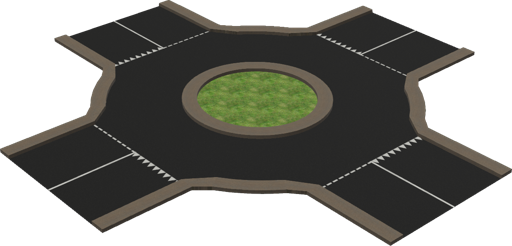

%end

Derived from [Solid](../reference/solid.md).

```
Roundabout {
         SFVec3f              translation              0 0 0
         SFRotation           rotation                 0 0 1 0
         SFString             name                     "roundabout"
         SFString             id                       ""
         MFString             connectedRoadIDs         []
         SFInt32              subdivision              16
         SFFloat              speedLimit               -1.0
         SFBool               bottom                   FALSE
         SFBool               border                   TRUE
         SFFloat              borderWidth              0.8
         SFFloat              borderHeight             0.2
         SFFloat              innerRadius              4
         SFFloat              outerRadius              8
         SFBool               center                   TRUE
         MFString             centerTexture            "https://raw.githubusercontent.com/cyberbotics/webots/R2022b/projects/default/worlds/textures/grass.jpg"
         SFVec2f              centerTextureScale       4 4
         SFInt32              roadNumber               4
         MFFloat              startRoadsLength         [5]
         SFFloat              startRoadsWidth          7
         SFInt32              startRoadsNumberOfLanes  2
         MFString             startRoadsStartLine      [ "textures/road_line_dashed.png",
                                                         "textures/road_line_triangle.png" ]
         MFString             startRoadsEndLine        []
         MFNode               startRoadsLine           [ RoadLine { } ]
         SFBool               roadBoundingObject       FALSE
         SFBool               borderBoundingObject     FALSE
         SFBool               centerBoundingObject     FALSE
         SFBool               castShadows              FALSE
         SFString             contactMaterial          "default"
         SFBool               locked                   TRUE
         SFNode               appearance               Asphalt { }
}
```

> **File location**: "[WEBOTS\_HOME/projects/objects/road/protos/Roundabout.proto]({{ url.github_tree }}/projects/objects/road/protos/Roundabout.proto)"

> **License**: Copyright Cyberbotics Ltd. Licensed for use only with Webots.
[More information.](https://cyberbotics.com/webots_assets_license)

### Roundabout Field Summary

- `name`: Defines the roundabout name.

- `id`: Optionally defines a unique ID. A unique ID is required to use the SUMO exporter.

- `connectedRoadIDs`: Optionally defines a list of the identifiers of the connected Road. This is required to use the SUMO exporter.

- `speedLimit`: Optionally defines the speed limit. The recommended unit is meter per seconds.

- `bottom`: Defines whether the road bottom should be displayed (useful in case of bridge).

- `border`: Defines whether the roundabout should have sidewalks.

- `borderWidth`: Defines the width of the sidewalks.

- `borderHeight`: Defines the height of the sidewalks.

- `innerRadius`: Defines the inner radius of the roundabout.

- `outerRadius`: Defines the outer radius of the roundabout.

- `center`: Defines whether the roundabout should have a central sidewalk.

- `centerTexture`: Defines the texture to be used for the central part of the roundabout.

- `centerTextureScale`: Defines the scale of the texture used for the central part of the roundabout.

- `roadNumber`: Defines the number of roads connected to the roundabout.

- `startRoadsLength`: Defines the length of the roads connected to the roundabout. The same length is used for all the roads if this field has only one item.

- `startRoadsWidth`: Defines the width of the roads connected to the roundabout.

- `startRoadsNumberOfLanes`: Defines the number of lanes of the roads (used for the texture mapping).

- `startRoadsStartLine`: Optionally defines the texture used for the road line at the first way-point for each lane. If the string is empty, no road line will be added for the corresponding lane. The two textures `textures/road_line_dashed.png` and `textures/road_line_triangle.png` may be used in this field.

- `startRoadsEndLine`: Optionally defines the texture used for the road line at the last way-point for each lane. If the string is empty, no road line will be added for the corresponding lane.

- `startRoadsLine`: Defines the property of each line separating two lanes. This field accepts a list of `RoadLine` nodes.

- `roadBoundingObject`: Defines whether the road should have a bounding object.

- `borderBoundingObject`: Defines whether the outer sidewalks should have a bounding object.

- `centerBoundingObject`: Defines whether the central sidewalk should have a bounding object.

- `castShadows`: Defines whether the road should cast shadows.

- `appearance`: Defines the appearance of the road.

## StraightRoadSegment

A simple straight road, the number of lanes and the dimensions are configurable.
Furthermore, an optional border can be enabled.
This model was sponsored by the CTI project RO2IVSim ([http://transport.epfl.ch/simulator-for-mobile-robots-and-intelligent-vehicles](http://transport.epfl.ch/simulator-for-mobile-robots-and-intelligent-vehicles)).

%figure

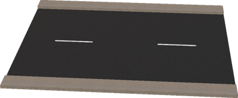

%end

Derived from [Solid](../reference/solid.md).

```
StraightRoadSegment {
         SFVec3f              translation               0 0 0
         SFRotation           rotation                  0 0 1 0
         SFString             name                      "road"
         SFString             id                        ""
         SFString             startJunction             ""
         SFString             endJunction               ""
         SFFloat              width                     7
         SFInt32              numberOfLanes             2
         SFInt32              numberOfForwardLanes      1
         SFFloat              speedLimit                -1.0
         MFNode               lines                     [ RoadLine { } ]
         SFFloat              roadBorderHeight          0.15
         SFFloat              startingRoadBorderWidth   0.8
         SFFloat              endingRoadBorderWidth     0.8
         SFBool               rightBorder               TRUE
         SFBool               leftBorder                TRUE
         SFBool               rightBarrier              FALSE
         SFBool               leftBarrier               FALSE
         SFBool               bottom                    FALSE
         SFFloat              length                    10
         MFString             startLine                 []
         MFString             endLine                   []
         SFFloat              startingRoadTilt          0
         SFFloat              endingRoadTilt            0
         SFNode               appearance                Asphalt { }
         SFNode               pavementAppearance        Pavement { }
         MFString             bottomTexture             []
         SFBool               locked                    TRUE
         SFBool               roadBoundingObject        FALSE
         SFBool               rightBorderBoundingObject FALSE
         SFBool               leftBorderBoundingObject  FALSE
         SFBool               rightBarrierBoundingObject TRUE
         SFBool               leftBarrierBoundingObject TRUE
         SFBool               castShadows               FALSE
         SFString             contactMaterial           "default"
}
```

> **File location**: "[WEBOTS\_HOME/projects/objects/road/protos/StraightRoadSegment.proto]({{ url.github_tree }}/projects/objects/road/protos/StraightRoadSegment.proto)"

> **License**: Copyright Cyberbotics Ltd. Licensed for use only with Webots.
[More information.](https://cyberbotics.com/webots_assets_license)

### StraightRoadSegment Field Summary

- `name`: Defines the road name.

- `id`: Optionally defines a unique ID. A unique ID is required to use the SUMO exporter.

- `startJunction`: Optionally defines a reference to the Crossroad connected at the first Road waypoint. Setting correctly this field is required to use the SUMO exporter.

- `endJunction`: Optionally defines a reference to the Crossroad connected at the last Road waypoint. Setting correctly this field is required to use the SUMO exporter.

- `width`: Defines the total width of the road (excluding sidewalk).

- `numberOfLanes`: Defines the number of lanes (used for the texture mapping).

- `numberOfForwardLanes`: Defines the number of forward lanes. (this is an information with no impact on the graphical shape).

- `speedLimit`: Optionally defines the speed limit. The recommended unit is meter per seconds.

- `lines`: Defines the property of each line separating two lanes. This field accepts a list of `RoadLine` nodes.

- `roadBorderHeight`: Defines the height of the sidewalk.

- `startingRoadBorderWidth`: Defines the width of the sidewalk at the start.

- `endingRoadBorderWidth`: Defines the width of the sidewalk at the end.

- `rightBorder`: Defines whether the road should have a right sidewalk.

- `leftBorder`: Defines whether the road should have a left sidewalk.

- `rightBarrier`: Defines whether the road should have a right barrier.

- `leftBarrier`: Defines whether the road should have a left barrier.

- `bottom`: Defines whether the road bottom should be displayed (useful in case of bridge).

- `length`: Defines the length of the road.

- `startLine`: Optionally defines the texture used for the road line at the first way-point for each lane. If the string is empty, no road line will be added for the corresponding lane. The two textures `textures/road_line_dashed.png` and `textures/road_line_triangle.png` may be used in this field.

- `endLine`: Optionally defines the texture used for the road line at the last way-point for each lane. If the string is empty, no road line will be added for the corresponding lane.

- `startingRoadTilt`: Defines the tilt of the road at the beginning.

- `endingRoadTilt`: Defines the tilt of the road at the end.

- `appearance`: Defines the appearance of the road.

- `pavementAppearance`: Defines the appearance of the sidewalk.

- `bottomTexture`: Defines the texture to be used for the bottom of the road.

- `roadBoundingObject`: Defines whether the road should have a bounding object.

- `rightBorderBoundingObject`: Defines whether the right sidewalk should have a bounding object.

- `leftBorderBoundingObject`: Defines whether the left sidewalk should have a bounding object.

- `rightBarrierBoundingObject`: Defines whether the right crash barrier (if any) should have a bounding object.

- `leftBarrierBoundingObject`: Defines whether the left crash barrier (if any) should have a bounding object.

- `castShadows`: Defines whether the road should cast shadows.

