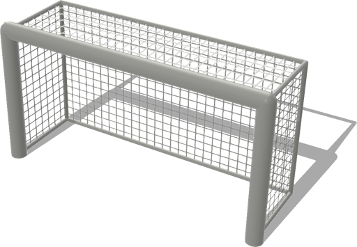
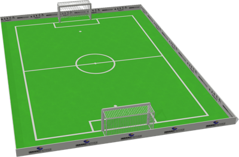

# Robotstadium

## RobotstadiumGoal

Robot soccer goal inspired from the RoboCup 2013-2014 Standard Platform League.
The color of the goal and the support polygons can be modified.

%figure



%end

Derived from [Solid](../reference/solid.md).

```
RobotstadiumGoal {
  SFVec3f    translation 0 0 0
  SFRotation rotation    0 1 0 0
  SFString   name        "robotstadium goal"
  SFFloat    postRadius  0.05
  SFColor    frameColor  1 1 1
  MFColor    recognitionColors []
}
```

> **File location**: "[WEBOTS\_HOME/projects/objects/robotstadium/protos/RobotstadiumGoal.proto]({{ url.github_tree }}/projects/objects/robotstadium/protos/RobotstadiumGoal.proto)"

> **License**: Copyright Cyberbotics Ltd. Licensed for use only with Webots.
[More information.](https://cyberbotics.com/webots_assets_license)

### RobotstadiumGoal Field Summary

- `postRadius`: Defines the radius of the goal posts.

- `frameColor`: Defines the color of the goal frame.

## RobotstadiumSoccerField

Robot soccer field inspired from the RoboCup 2014 Standard Platform League.
The soccer field is built on a total carpet area of length 10.4 m and width 7.4 m.
The field dimensions (within the white lines) are 9 x 6 m.

%figure



%end

Derived from [Solid](../reference/solid.md).

```
RobotstadiumSoccerField {
  SFVec3f    translation     0 0 0
  SFRotation rotation        0 1 0 0
  SFString   name            "robotstadium soccer field"
  SFString   contactMaterial "default"
  SFColor    frame1Color     1 1 1
  SFColor    frame2Color     1 1 1
  SFFloat    postRadius      0.05
  MFColor    recognitionColors []
}
```

> **File location**: "[WEBOTS\_HOME/projects/objects/robotstadium/protos/RobotstadiumSoccerField.proto]({{ url.github_tree }}/projects/objects/robotstadium/protos/RobotstadiumSoccerField.proto)"

> **License**: Copyright Cyberbotics Ltd. Licensed for use only with Webots.
[More information.](https://cyberbotics.com/webots_assets_license)

### RobotstadiumSoccerField Field Summary

- `frame1Color`: Defines the color of the first goal frame.

- `frame2Color`: Defines the color of the second goal frame.

- `postRadius`: Defines the radius of the goal posts.

