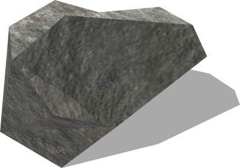
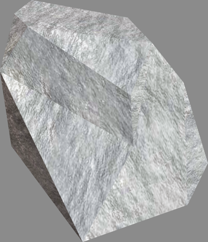

# Rocks

## Rock10cm

A rock (10 cm).

%figure



%end

Derived from [Solid](../reference/solid.md).

```
Rock10cm {
  SFVec3f    translation      0 0.05 0
  SFRotation rotation         0 1 0 0
  SFString   name             "rock 10 cm"
  MFString   texture          "textures/rock.jpg"
  SFColor    color            1 1 1
  SFNode     physics          NULL
  SFBool     locked           FALSE
  MFColor    recognitionColors []
}
```

> **File location**: "[WEBOTS\_HOME/projects/objects/rocks/protos/Rock10cm.proto]({{ url.github_tree }}/projects/objects/rocks/protos/Rock10cm.proto)"

> **License**: Copyright Cyberbotics Ltd. Licensed for use only with Webots.
[More information.](https://cyberbotics.com/webots_assets_license)

### Rock10cm Field Summary

- `texture`: Defines the texture used for the rock.

- `color`: Defines the base color of the rock.

## Rock17cm

A rock (17 cm).

%figure



%end

Derived from [Solid](../reference/solid.md).

```
Rock17cm {
  SFVec3f    translation       0 0 0
  SFRotation rotation          0 1 0 0
  SFString   name             "rock 17 cm"
  MFString   texture          "textures/rock.jpg"
  SFColor    color            1 1 1
  SFNode     physics          NULL
  SFBool     locked           FALSE
  MFColor    recognitionColors []
}
```

> **File location**: "[WEBOTS\_HOME/projects/objects/rocks/protos/Rock17cm.proto]({{ url.github_tree }}/projects/objects/rocks/protos/Rock17cm.proto)"

> **License**: Copyright Cyberbotics Ltd. Licensed for use only with Webots.
[More information.](https://cyberbotics.com/webots_assets_license)

### Rock17cm Field Summary

- `texture`: Defines the texture used for the rock.

- `color`: Defines the base color of the rock.

