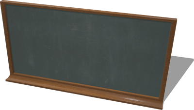
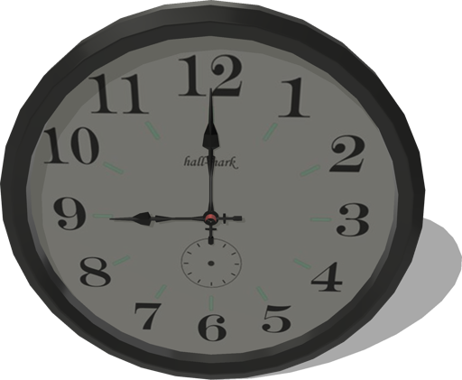

# School Furniture

## Blackboard

A blackboard (about 1.3 x 2.5 m).

%figure



%end

Derived from [Solid](../reference/solid.md).

```
Blackboard {
  SFVec3f    translation 0 0 0
  SFRotation rotation    0 0 1 0
  SFString   name        "blackboard"
  SFBool     castShadows TRUE
}
```

> **File location**: "[WEBOTS\_HOME/projects/objects/school\_furniture/protos/Blackboard.proto]({{ url.github_tree }}/projects/objects/school_furniture/protos/Blackboard.proto)"

> **License**: Copyright Cyberbotics Ltd. Licensed for use only with Webots.
[More information.](https://cyberbotics.com/webots_assets_license)

### Blackboard Field Summary

- `castShadows`: Defines whether this object should cast shadows.

## Book

A book (0.02 x 0.15 x 0.2 m).

%figure


%end

Derived from [Solid](../reference/solid.md).

```
Book {
  SFVec3f    translation 0 0.1 0
  SFRotation rotation    0 0 1 0
  SFString   name        "book"
  SFColor    color       1 1 1
  MFString   textureUrl  "textures/book.jpg"
  SFFloat    mass        0.3
}
```

> **File location**: "[WEBOTS\_HOME/projects/objects/school\_furniture/protos/Book.proto]({{ url.github_tree }}/projects/objects/school_furniture/protos/Book.proto)"

> **License**: Copyright Cyberbotics Ltd. Licensed for use only with Webots.
[More information.](https://cyberbotics.com/webots_assets_license)

### Book Field Summary

- `color`: Defines the color of the book.

- `textureUrl`: Defines the texture used for the book.

- `mass`: Defines the mass of the book in kg.

## Clock

A clock (radius 16.5 cm).

%figure



%end

Derived from [Solid](../reference/solid.md).

```
Clock {
  SFVec3f    translation 0 0 0
  SFRotation rotation    0 0 1 0
  SFString   name        "clock"
}
```

> **File location**: "[WEBOTS\_HOME/projects/objects/school\_furniture/protos/Clock.proto]({{ url.github_tree }}/projects/objects/school_furniture/protos/Clock.proto)"

> **License**: Copyright Cyberbotics Ltd. Licensed for use only with Webots.
[More information.](https://cyberbotics.com/webots_assets_license)

