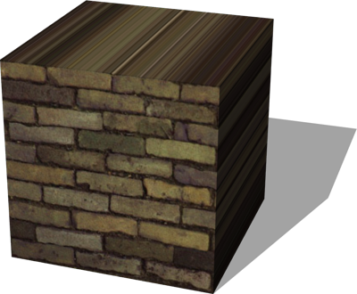

# Shapes

## TexturedBoxShape

Box with customizable texture mapping on selected faces.
If the boolean value associated with a face (`frontFace`, `leftFace`, etc.) is FALSE, then the uniform color specified in `faceColor` field will be applied instead of the texture.
This is an extension of the TexturedBox geometry PROTO.
Available texture mappings:
- `cube` mapping: see texture at projects/samples/geometries/worlds/textures/cube\_mapping.jpg
- `compact` cube mapping: see texture at projects/samples/geometries/worlds/textures/compact\_mapping.jpg
- `flat` mapping: projecting the texture on the front face.
- `metric` mapping: similar to default mapping but the texture is not deformed to match each face size.
- `default` mapping: same texture on all the faces.

A demo of these mappings is available in projects/samples/geometries/worlds/textured\_boxes.wbt.

%figure



%end

Derived from [Group](../reference/group.md).

```
TexturedBoxShape {
  SFVec3f  size             0.1 0.1 0.1
  MFString textureUrl       "textures/old_brick_wall.jpg"
  SFInt32  textureFiltering 4
  SFNode   textureTransform NULL
  SFString textureMapping   "flat"
  SFColor  faceColor        0.8 0.8 0.8
  SFBool   frontFace        TRUE
  SFBool   backFace         TRUE
  SFBool   leftFace         TRUE
  SFBool   rightFace        TRUE
  SFBool   topFace          TRUE
  SFBool   bottomFace       TRUE
}
```

> **File location**: "[WEBOTS\_HOME/projects/objects/shapes/protos/TexturedBoxShape.proto](https://github.com/cyberbotics/webots/tree/master/projects/objects/shapes/protos/TexturedBoxShape.proto)"

> **License**: Copyright Cyberbotics Ltd. Licensed for use only with Webots.
[More information.](https://cyberbotics.com/webots_assets_license)

### TexturedBoxShape Field Summary

- `size`: Defines the size of the box.

- `textureUrl`: Defines the texture used for the box.

- `textureFiltering`: Defines the filtering level for the texture used for the box.

- `textureTransform`: Defines the texture transform for the texture used for the box.

- `textureMapping`: Defines the texture mapping. This field accepts the following values: `"cube"`, `"compact"`, `"flat"`, `"metric"`, `"default"` and `"none"`.

- `faceColor`: Defines the color of the faces of the box.

- `frontFace`: Defines whether the front face is included.

- `backFace`: Defines whether the back face is included.

- `leftFace`: Defines whether the left face is included.

- `rightFace`: Defines whether the right face is included.

- `topFace`: Defines whether the top face is included.

- `bottomFace`: Defines whether the bottom face is included.

