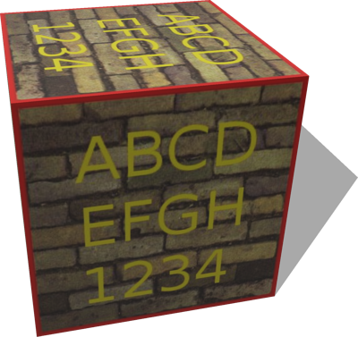
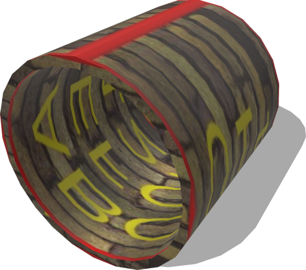
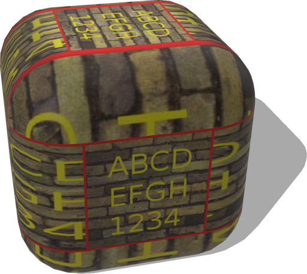
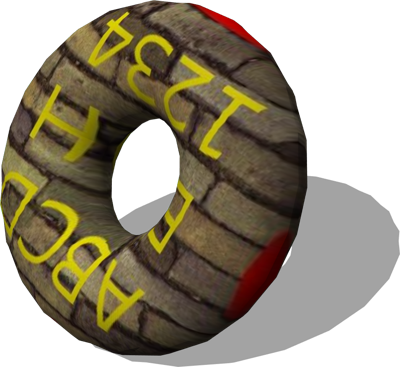

# Solids

## SolidBox

A box object implemented at the Solid-node level.
The box has similar properties as the VRML Box node in term of axis and fields.
The UV-mapping is defined in a metric way (the textures are not deformed - the reference is the longest edge).

%figure



%end

Derived from [Solid](../reference/solid.md).

```
SolidBox {
  SFVec3f    translation           0 0 0
  SFRotation rotation              0 1 0 0
  SFString   name                  "box"
  SFVec3f    size                  2 2 2
  SFString   contactMaterial       "default"
  SFNode     appearance            PBRAppearance { baseColorMap ImageTexture { url [ "textures/tagged_wall.jpg" ] } metalness 0 roughness 0.5 }
  SFNode     physics               NULL
  SFBool     enableBoundingObject  TRUE
  SFBool     castShadows           TRUE
  MFColor    recognitionColors     []
}
```

> **File location**: "[WEBOTS\_HOME/projects/objects/solids/protos/SolidBox.proto]({{ url.github_tree }}/projects/objects/solids/protos/SolidBox.proto)"

> **License**: Copyright Cyberbotics Ltd. Licensed for use only with Webots.
[More information.](https://cyberbotics.com/webots_assets_license)

### SolidBox Field Summary

- `size`: Defines the size of the box.                                                                                                             # Defines the number of polygons used to represent the box and so its resolution.

- `appearance`: Defines the appearance of the box.

- `enableBoundingObject`: Defines whether the solid should have a bounding object.

- `castShadows`: Defines whether this object should cast shadows.

## SolidPipe

A pipe object implemented at the Solid-node level.
Graphically, the SolidPipe is an IndexedFaceSet.
Physically, the SolidPipe is a set of N boxes, where N is the subdivision field.
The 'accuracy' field defines how much boxes position can differ on y-axis: a 0 value represents an error-free model but it will slow down the simulation.

%figure



%end

Derived from [Solid](../reference/solid.md).

```
SolidPipe {
  SFVec3f    translation           0 0 0
  SFRotation rotation              0 1 0 0
  SFString   name                  "pipe"
  SFFloat    height                2
  SFFloat    radius                1
  SFFloat    thickness             0.1
  SFInt32    subdivision           24
  SFFloat    accuracy              0.0001
  SFString   contactMaterial       "default"
  SFNode     appearance            PBRAppearance { baseColorMap ImageTexture { url [ "textures/tagged_wall.jpg" ] } metalness 0 roughness 0.5 }
  SFNode     physics               NULL
  SFBool     enableBoundingObject  TRUE
  MFColor    recognitionColors     []
}
```

> **File location**: "[WEBOTS\_HOME/projects/objects/solids/protos/SolidPipe.proto]({{ url.github_tree }}/projects/objects/solids/protos/SolidPipe.proto)"

> **License**: Copyright Cyberbotics Ltd. Licensed for use only with Webots.
[More information.](https://cyberbotics.com/webots_assets_license)

### SolidPipe Field Summary

- `height`: Defines the height of the pipe.

- `radius`: Defines the radius of the pipe.

- `thickness`: Defines the thickness of the pipe.

- `subdivision`: Defines the number of polygons used to represent the pipe and so its resolution.

- `accuracy`: Defines how much boxes position can differ on y-axis: a 0 value represents an error-free model but it will slow down the simulation.

- `appearance`: Defines the appearance of the pipe.

- `enableBoundingObject`: Defines whether the solid should have a bounding object.

## SolidRoundedBox

A box object with rounded corners and edges implemented at the Solid-node level.
The box has similar properties as the VRML Box node in term of axis and fields.

%figure



%end

Derived from [Solid](../reference/solid.md).

```
SolidRoundedBox {
  SFVec3f    translation           0 0 0
  SFRotation rotation              0 1 0 0
  SFString   name                  "rounded box"
  SFVec3f    size                  2 2 2
  SFFloat    borderRadius          0.5
  SFInt32    subdivision           24
  SFString   contactMaterial       "default"
  SFNode     appearance            PBRAppearance { baseColorMap ImageTexture { url [ "textures/tagged_wall.jpg" ] } metalness 0 roughness 0.5 }
  SFNode     physics               NULL
  SFBool     enableBoundingObject  TRUE
  MFColor    recognitionColors     []
}
```

> **File location**: "[WEBOTS\_HOME/projects/objects/solids/protos/SolidRoundedBox.proto]({{ url.github_tree }}/projects/objects/solids/protos/SolidRoundedBox.proto)"

> **License**: Copyright Cyberbotics Ltd. Licensed for use only with Webots.
[More information.](https://cyberbotics.com/webots_assets_license)

### SolidRoundedBox Field Summary

- `size`: Defines the size of the box.

- `borderRadius`: Defines the radius of the box borders.

- `subdivision`: Defines the number of polygons used to represent the box and so its resolution.

- `appearance`: Defines the appearance of the box.

- `enableBoundingObject`: Defines whether the solid should have a bounding object.

## SolidTorus

A torus object implemented at the Solid-node level.
Graphically, the SolidTorus is defined as an IndexedFaceSet.
Physically, the SolidTorus is defined as a set of N spheres, where N is the subdivision field.

%figure



%end

Derived from [Solid](../reference/solid.md).

```
SolidTorus {
  SFVec3f    translation           0 0 0
  SFRotation rotation              0 1 0 0
  SFString   name                  "torus"
  SFFloat    majorRadius           2
  SFFloat    minorRadius           1
  SFInt32    subdivision           24
  SFString   contactMaterial       "default"
  SFNode     appearance            PBRAppearance { baseColorMap ImageTexture { url [ "textures/tagged_wall.jpg" ] } metalness 0 roughness 0.5 }
  SFNode     physics               NULL
  SFBool     enableBoundingObject  TRUE
  MFColor    recognitionColors     []
}
```

> **File location**: "[WEBOTS\_HOME/projects/objects/solids/protos/SolidTorus.proto]({{ url.github_tree }}/projects/objects/solids/protos/SolidTorus.proto)"

> **License**: Copyright Cyberbotics Ltd. Licensed for use only with Webots.
[More information.](https://cyberbotics.com/webots_assets_license)

### SolidTorus Field Summary

- `majorRadius`: Defines the major radius of the torus.

- `minorRadius`: Defines the minor radius of the torus.

- `subdivision`: Defines the number of polygons used to represent the torus and so its resolution.

- `appearance`: Defines the appearance of the torus.

- `enableBoundingObject`: Defines whether the solid should have a bounding object.

