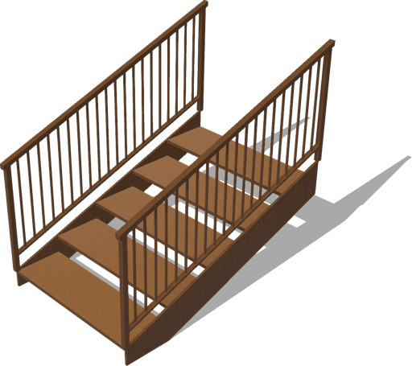
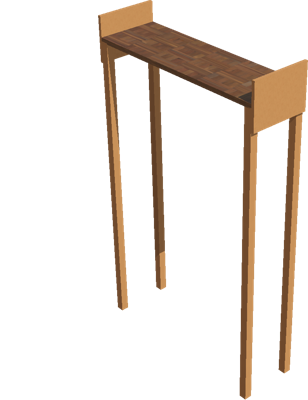
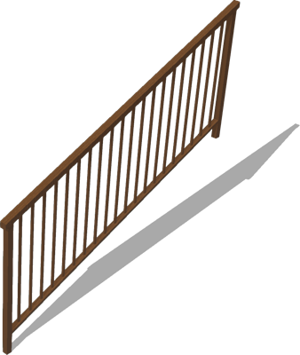

# Stairs

## StraightStairs

Generic and customizable stairs model.

%figure



%end

Derived from [Solid](../reference/solid.md).

```
StraightStairs {
  SFVec3f    translation        0 0 0
  SFRotation rotation           0 1 0 0
  SFString   name               "straight stairs"
  SFVec3f    stepSize           0.4 0.03 1.27
  SFFloat    stepRise           0.15
  SFInt32    nSteps             5
  SFFloat    stringerWidth      0.02
  SFNode     stepAppearance     VarnishedPine { textureTransform TextureTransform { scale 4 4 } }
  SFNode     stringerAppearance VarnishedPine { textureTransform TextureTransform { scale 4 4 } }
  MFNode     leftRail           StraightStairsRail {}
  MFNode     rightRail          StraightStairsRail {}
  SFBool     startingStairs     TRUE
  SFString   contactMaterial    "default"
  MFColor    recognitionColors  []
}
```

> **File location**: "[WEBOTS\_HOME/projects/objects/stairs/protos/StraightStairs.proto]({{ url.github_tree }}/projects/objects/stairs/protos/StraightStairs.proto)"

> **License**: Copyright Cyberbotics Ltd. Licensed for use only with Webots.
[More information.](https://cyberbotics.com/webots_assets_license)

### StraightStairs Field Summary

- `stepSize`: Defines the size of one step.

- `stepRise`: Defines the height difference between two consecutives steps.

- `nSteps`: Defines the number of steps.

- `stringerWidth`: Defines the width of the stringers.

- `stepAppearance`: Defines the appearance of the steps.

- `stringerAppearance`: Defines the appearance of the stringers.

- `leftRail`: Defines the left rail.

- `rightRail`: Defines the right rail.

- `startingStairs`: Defines whether the bottom part of the stairs should be flat.

## StraightStairsLanding

Generic and customizable landing model for straight stairs.

%figure



%end

Derived from [Solid](../reference/solid.md).

```
StraightStairsLanding {
  SFVec3f    translation     0 0 0
  SFRotation rotation        0 1 0 0
  SFString   name            "straight stairs landing"
  SFVec3f    landingSize     0.4 0.03 1.27
  SFFloat    height          2.0
  SFVec2f    stringerSize    0.3 0.02
  SFBool     stringerLeft    TRUE
  SFBool     stringerRight   TRUE
  SFBool     stringerBack    FALSE
  SFVec2f    supportPoleSize 0.05 0.05
  SFNode     appearance      VarnishedPine { textureTransform TextureTransform { scale 4 4 } }
  SFNode     floorAppearance Parquetry {}
  MFNode     rail            []
  SFString   contactMaterial "default"
  MFColor    recognitionColors []
}
```

> **File location**: "[WEBOTS\_HOME/projects/objects/stairs/protos/StraightStairsLanding.proto]({{ url.github_tree }}/projects/objects/stairs/protos/StraightStairsLanding.proto)"

> **License**: Copyright Cyberbotics Ltd. Licensed for use only with Webots.
[More information.](https://cyberbotics.com/webots_assets_license)

### StraightStairsLanding Field Summary

- `landingSize`: Defines the size of the landing.

- `height`: Defines the height of the landing.

- `stringerSize`: Defines the height and width of the stringer.

- `stringerLeft`: Defines whether the left part of the stringer should be included.

- `stringerRight`: Defines whether the right part of the stringer should be included.

- `stringerBack`: Defines whether the back part of the stringer should be included.

- `supportPoleSize`: Defines the size of the support poles.

- `appearance`: Defines the main appearance.

- `floorAppearance`: Defines the floor appearance.

- `rail`: Defines the rail.

## StraightStairsRail

Default stairs handrail.

%figure



%end

Derived from [Solid](../reference/solid.md).

```
StraightStairsRail {
  SFVec3f    translation      0 0 0
  SFRotation rotation         0 1 0 0
  SFString   name             "straight stairs rail"
  SFFloat    run              2.0
  SFFloat    rise             0.75
  SFFloat    width            0.04
  SFFloat    newelHeight      0.93
  SFFloat    balusterHeight   0.8
  SFFloat    balusterRadius   0.01
  SFInt32    nBalusters       20
  SFNode     appearance       VarnishedPine { textureTransform TextureTransform { scale 4 4 } }
  SFString   contactMaterial "default"
  MFColor    recognitionColors []
}
```

> **File location**: "[WEBOTS\_HOME/projects/objects/stairs/protos/StraightStairsRail.proto]({{ url.github_tree }}/projects/objects/stairs/protos/StraightStairsRail.proto)"

> **License**: Copyright Cyberbotics Ltd. Licensed for use only with Webots.
[More information.](https://cyberbotics.com/webots_assets_license)

### StraightStairsRail Field Summary

- `run`: Defines the horizontal lenght of the rail.

- `rise`: Defines the vertical lenght of the rail.

- `width`: Defines the width of the rail.

- `newelHeight`: Defines the height of the top bar.

- `balusterHeight`: Defines the height of the balusters.

- `balusterRadius`: Defines the radius of the balusters.

- `nBalusters`: Defines the number of balusters.

- `appearance`: Defines the appearance of the rail.

