# Street Furniture

## Atm

An ATM.

%figure

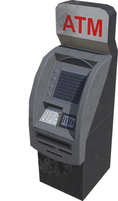

%end

Derived from [Solid](../reference/solid.md).

```
Atm {
  SFVec3f    translation 0 0 0
  SFRotation rotation    0 0 1 0
  SFString   name        "ATM"
}
```

> **File location**: "[WEBOTS\_HOME/projects/objects/street\_furniture/protos/Atm.proto]({{ url.github_tree }}/projects/objects/street_furniture/protos/Atm.proto)"

> **License**: Creative Commons Attribution 4.0 International License.
[More information.](https://creativecommons.org/licenses/by/4.0/legalcode)

## Bench

A bench.

%figure

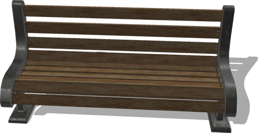

%end

Derived from [Solid](../reference/solid.md).

```
Bench {
  SFVec3f    translation          0 0 0
  SFRotation rotation             0 0 1 0
  SFString   name                 "bench"
  SFColor    metalColor           1 1 1
  SFColor    woodColor            0.5 0.5 0.5
  MFColor    recognitionColors    [0.25 0.17 0.12, 0.17 0.17 0.17]
}
```

> **File location**: "[WEBOTS\_HOME/projects/objects/street\_furniture/protos/Bench.proto]({{ url.github_tree }}/projects/objects/street_furniture/protos/Bench.proto)"

> **License**: Copyright Cyberbotics Ltd. Licensed for use only with Webots.
[More information.](https://cyberbotics.com/webots_assets_license)

### Bench Field Summary

- `metalColor`: Defines the color of the metalic part.

- `woodColor`: Defines the color of the wooden part.

## BusStop

Simple bus stop with customizable appearance and an optional bench.
The original blender model was made by Ringbarkis ([http://www.blendswap.com/blends/view/66783](http://www.blendswap.com/blends/view/66783)).
This model was sponsored by the CTI project RO2IVSim ([http://transport.epfl.ch/simulator-for-mobile-robots-and-intelligent-vehicles](http://transport.epfl.ch/simulator-for-mobile-robots-and-intelligent-vehicles)).

%figure

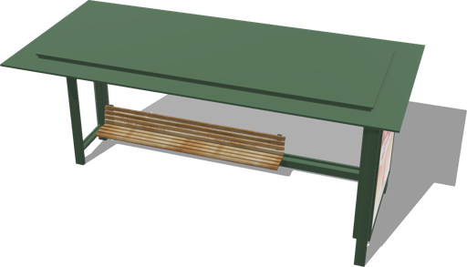

%end

Derived from [Solid](../reference/solid.md).

```
BusStop {
  SFVec3f     translation                 0 0 0
  SFRotation  rotation                    0 0 1 0
  SFString    name                        "bus stop"
  SFBool      bench                       TRUE
  SFNode      appearance                  PBRAppearance { baseColor 0.3 0.45 0.33  metalness 0 roughness 0.5 }
  MFString    internalAdvertisingTexture  "textures/cocacola_advertising.jpg"
  MFString    externalAdvertisingTexture  "textures/cocacola_advertising.jpg"
  SFBool      advertisingLightOn          TRUE
}
```

> **File location**: "[WEBOTS\_HOME/projects/objects/street\_furniture/protos/BusStop.proto]({{ url.github_tree }}/projects/objects/street_furniture/protos/BusStop.proto)"

> **License**: Copyright Cyberbotics Ltd. Licensed for use only with Webots.
[More information.](https://cyberbotics.com/webots_assets_license)

### BusStop Field Summary

- `bench`: Defines whether the bust stop should include a bench.

- `appearance`: Defines the appearance of the bench.

- `internalAdvertisingTexture`: Defines the texture used for the internal advertising.

- `externalAdvertisingTexture`: Defines the texture used for the external advertising.

- `advertisingLightOn`: Defines whether the advertising should have an emissive color.

## ClothRecyclingContainer

A cloth recycling container.

%figure

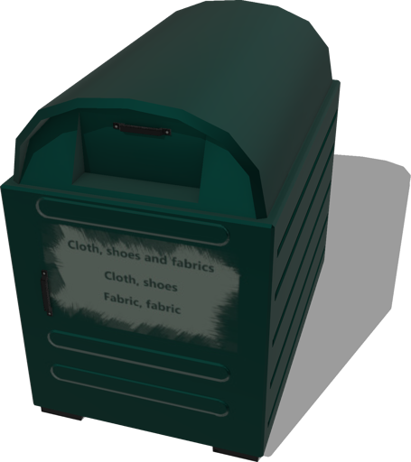

%end

Derived from [Solid](../reference/solid.md).

```
ClothRecyclingContainer {
  SFVec3f    translation 0 0 0
  SFRotation rotation    0 0 1 0
  SFString   name        "cloth recycling container"
}
```

> **File location**: "[WEBOTS\_HOME/projects/objects/street\_furniture/protos/ClothRecyclingContainer.proto]({{ url.github_tree }}/projects/objects/street_furniture/protos/ClothRecyclingContainer.proto)"

> **License**: Creative Commons Attribution 4.0 International License.
[More information.](https://creativecommons.org/licenses/by/4.0/legalcode)

## DrinkingFountain

A drinking fountain.

%figure

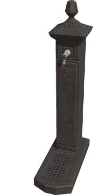

%end

Derived from [Solid](../reference/solid.md).

```
DrinkingFountain {
  SFVec3f    translation 0 0 0
  SFRotation rotation    0 0 1 0
  SFString   name        "drinking fountain"
}
```

> **File location**: "[WEBOTS\_HOME/projects/objects/street\_furniture/protos/DrinkingFountain.proto]({{ url.github_tree }}/projects/objects/street_furniture/protos/DrinkingFountain.proto)"

> **License**: Creative Commons Attribution 4.0 International License.
[More information.](https://creativecommons.org/licenses/by/4.0/legalcode)

## ElectricalCabinet

An electrical cabinet.

%figure

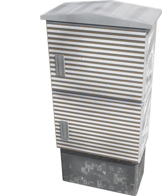

%end

Derived from [Solid](../reference/solid.md).

```
ElectricalCabinet {
  SFVec3f    translation 0 0 0
  SFRotation rotation    0 0 1 0
  SFString   name        "electrical cabinet"
}
```

> **File location**: "[WEBOTS\_HOME/projects/objects/street\_furniture/protos/ElectricalCabinet.proto]({{ url.github_tree }}/projects/objects/street_furniture/protos/ElectricalCabinet.proto)"

> **License**: Creative Commons Attribution 4.0 International License.
[More information.](https://creativecommons.org/licenses/by/4.0/legalcode)

## EmergencyPhone

An emergency phone.

%figure

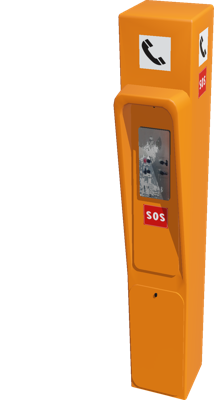

%end

Derived from [Solid](../reference/solid.md).

```
EmergencyPhone {
  SFVec3f    translation          0 0 0
  SFRotation rotation             0 0 1 0
  SFString   name                 "emergency phone"
  SFColor    poleColor            1 0.44 0
  MFColor    recognitionColors    [1 0.44 0]
}
```

> **File location**: "[WEBOTS\_HOME/projects/objects/street\_furniture/protos/EmergencyPhone.proto]({{ url.github_tree }}/projects/objects/street_furniture/protos/EmergencyPhone.proto)"

> **License**: Copyright Cyberbotics Ltd. Licensed for use only with Webots.
[More information.](https://cyberbotics.com/webots_assets_license)

### EmergencyPhone Field Summary

- `poleColor`: Defines the color of the pole.

## Fence

A customizable fence.
Dimensions, path and appearance of the fence can be set.
If subdivision is bigger than 1, B-Splines are used to interpolate path of the fence.
This model was sponsored by the CTI project RO2IVSim ([http://transport.epfl.ch/simulator-for-mobile-robots-and-intelligent-vehicles](http://transport.epfl.ch/simulator-for-mobile-robots-and-intelligent-vehicles)).

%figure

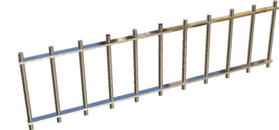

%end

Derived from [Solid](../reference/solid.md).

```
Fence {
  SFVec3f      translation             0 0 0
  SFRotation   rotation                0 0 1 0
  SFString     name                    "fence"
  SFString     model                   "fence"
  MFColor      recognitionColors       [0.8 0.8 0.8]
  SFFloat      height                  1.5
  SFFloat      poleGap                 0.5
  SFFloat      poleRadius              0.04
  SFString     poleShape               "cylinder"
  SFNode       poleAppearance          PBRAppearance {}
  MFVec3f      path                    [0 0 0, 0 5 0]
  SFInt32      subdivision             -1
  SFInt32      horizontalBarsNumber    2
  MFVec2f      horizontalBarShape      [0.02 0.06, 0.02 -0.06, -0.02 -0.06, -0.02 0.06, 0.02 0.06]
  SFNode       horizontalBarAppearance PBRAppearance {}
  SFNode       boundingObject          NULL
  SFFloat      creaseAngle             0.3
}
```

> **File location**: "[WEBOTS\_HOME/projects/objects/street\_furniture/protos/Fence.proto]({{ url.github_tree }}/projects/objects/street_furniture/protos/Fence.proto)"

> **License**: Copyright Cyberbotics Ltd. Licensed for use only with Webots.
[More information.](https://cyberbotics.com/webots_assets_license)

### Fence Field Summary

- `height`: Defines the height of the fence.

- `poleGap`: Defines the distance between two consecutives poles.

- `poleRadius`: Defines the radius of the poles.

- `poleShape`: Defines the shape of the poles. This field accepts the following values: `"cylinder"`, `"square"`, `"diamond"`, and `"H"`.

- `poleAppearance`: Defines the appearance of the poles.

- `path`: Defines the 3D path of the fence.

- `subdivision`: Defines the degree of interpolation using B-Splines (if the value is lower than 0, the interpolation is disabled).

- `horizontalBarsNumber`: Defines the number of horizontal bars.

- `horizontalBarShape`: Defines the shape 2D of the horizontal bars.

- `horizontalBarAppearance`: Defines the appearance of the horizontal bars.

- `creaseAngle`: Defines the creaseAngle of the horizontal bar.

## FireHydrant

A fire hydrant.

%figure

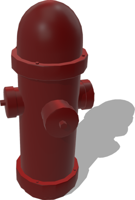

%end

Derived from [Solid](../reference/solid.md).

```
FireHydrant {
  SFVec3f    translation 0 0 0
  SFRotation rotation    0 0 1 0
  SFString   name        "fire hydrant"
  SFNode     appearance  PBRAppearance { baseColor 0.643 0 0 metalness 0 roughness 0.4 }
}
```

> **File location**: "[WEBOTS\_HOME/projects/objects/street\_furniture/protos/FireHydrant.proto]({{ url.github_tree }}/projects/objects/street_furniture/protos/FireHydrant.proto)"

> **License**: Copyright Cyberbotics Ltd. Licensed for use only with Webots.
[More information.](https://cyberbotics.com/webots_assets_license)

### FireHydrant Field Summary

- `appearance`: Defines the appearance of the fire hydrant.

## Fountain

A configurable fountain.

%figure

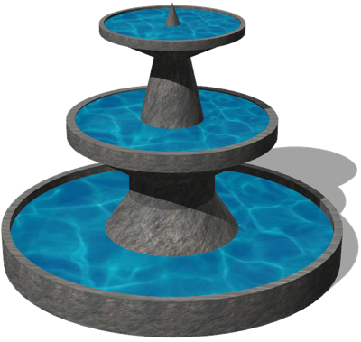

%end

Derived from [Solid](../reference/solid.md).

```
Fountain {
  SFVec3f     translation            0 0 0
  SFRotation  rotation               0 0 1 0
  SFString    name                   "fountain"
  SFFloat     height                 1.5
  SFFloat     radius                 1
  SFInt32     subdivision            16
}
```

> **File location**: "[WEBOTS\_HOME/projects/objects/street\_furniture/protos/Fountain.proto]({{ url.github_tree }}/projects/objects/street_furniture/protos/Fountain.proto)"

> **License**: Copyright Cyberbotics Ltd. Licensed for use only with Webots.
[More information.](https://cyberbotics.com/webots_assets_license)

### Fountain Field Summary

- `height`: Defines the height of the fountain.

- `radius`: Defines the radius of the fountain.

- `subdivision`: Defines subdivision of the fountain cylinders.

## GlassRecyclingContainer

A glass recycling container.

%figure

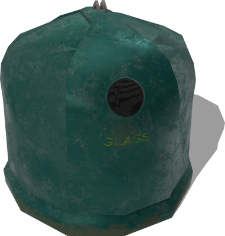

%end

Derived from [Solid](../reference/solid.md).

```
GlassRecyclingContainer {
  SFVec3f    translation 0 0 0
  SFRotation rotation    0 0 1 0
  SFString   name        "glass recycling container"
}
```

> **File location**: "[WEBOTS\_HOME/projects/objects/street\_furniture/protos/GlassRecyclingContainer.proto]({{ url.github_tree }}/projects/objects/street_furniture/protos/GlassRecyclingContainer.proto)"

> **License**: Creative Commons Attribution 4.0 International License.
[More information.](https://creativecommons.org/licenses/by/4.0/legalcode)

## GuardShelter

A guard shelter.

%figure

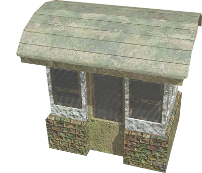

%end

Derived from [Solid](../reference/solid.md).

```
GuardShelter {
  SFVec3f    translation  0 0 0
  SFRotation rotation     0 0 1 0
  SFString   name         "guard shelter"
}
```

> **File location**: "[WEBOTS\_HOME/projects/objects/street\_furniture/protos/GuardShelter.proto]({{ url.github_tree }}/projects/objects/street_furniture/protos/GuardShelter.proto)"

> **License**: Creative Commons Attribution 4.0 International License.
[More information.](https://creativecommons.org/licenses/by/4.0/legalcode)

## IceFreezerContainer

An ice freezer container.

%figure

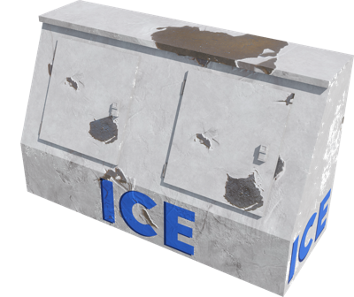

%end

Derived from [Solid](../reference/solid.md).

```
IceFreezerContainer {
  SFVec3f    translation 0 0 0
  SFRotation rotation    0 0 1 0
  SFString   name        "ice freezer container"
}
```

> **File location**: "[WEBOTS\_HOME/projects/objects/street\_furniture/protos/IceFreezerContainer.proto]({{ url.github_tree }}/projects/objects/street_furniture/protos/IceFreezerContainer.proto)"

> **License**: Creative Commons Attribution 4.0 International License.
[More information.](https://creativecommons.org/licenses/by/4.0/legalcode)

## Mailbox

A mailbox.

%figure


%end

Derived from [Solid](../reference/solid.md).

```
Mailbox {
  SFVec3f    translation 0 0 0
  SFRotation rotation    0 0 1 0
  SFString   name        "mailbox"
}
```

> **File location**: "[WEBOTS\_HOME/projects/objects/street\_furniture/protos/Mailbox.proto]({{ url.github_tree }}/projects/objects/street_furniture/protos/Mailbox.proto)"

> **License**: Creative Commons Attribution 4.0 International License.
[More information.](https://creativecommons.org/licenses/by/4.0/legalcode)

## MetallicTrash

A metallic trash with optional physics.

%figure

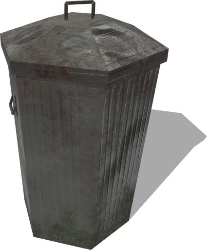

%end

Derived from [Solid](../reference/solid.md).

```
MetallicTrash {
  SFVec3f    translation    0 0 0
  SFRotation rotation       0 0 1 0
  SFString   name           "metallic trash"
  SFBool     enablePhysics  FALSE
}
```

> **File location**: "[WEBOTS\_HOME/projects/objects/street\_furniture/protos/MetallicTrash.proto]({{ url.github_tree }}/projects/objects/street_furniture/protos/MetallicTrash.proto)"

> **License**: Creative Commons Attribution 4.0 International License.
[More information.](https://creativecommons.org/licenses/by/4.0/legalcode)

### MetallicTrash Field Summary

- `enablePhysics`: Defines whether the trash should have physics.

## NewsStand

A news stand.

%figure

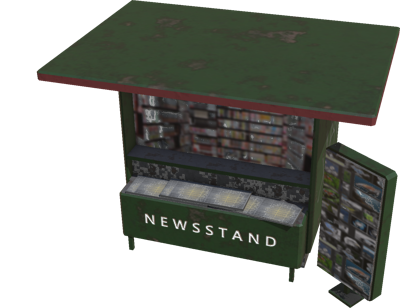

%end

Derived from [Solid](../reference/solid.md).

```
NewsStand {
  SFVec3f    translation 0 0 0
  SFRotation rotation    0 0 1 0
  SFString   name        "news stand"
}
```

> **File location**: "[WEBOTS\_HOME/projects/objects/street\_furniture/protos/NewsStand.proto]({{ url.github_tree }}/projects/objects/street_furniture/protos/NewsStand.proto)"

> **License**: Creative Commons Attribution 4.0 International License.
[More information.](https://creativecommons.org/licenses/by/4.0/legalcode)

## OldBench

An old bench.

%figure

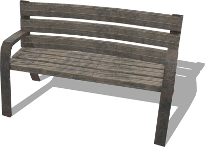

%end

Derived from [Solid](../reference/solid.md).

```
OldBench {
  SFVec3f    translation 0 0 0
  SFRotation rotation    0 0 1 0
  SFString   name        "old bench"
}
```

> **File location**: "[WEBOTS\_HOME/projects/objects/street\_furniture/protos/OldBench.proto]({{ url.github_tree }}/projects/objects/street_furniture/protos/OldBench.proto)"

> **License**: Creative Commons Attribution 4.0 International License.
[More information.](https://creativecommons.org/licenses/by/4.0/legalcode)

## PhoneBooth

A phone booth.

%figure

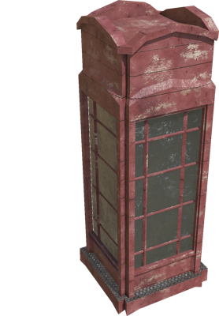

%end

Derived from [Solid](../reference/solid.md).

```
PhoneBooth {
  SFVec3f    translation 0 0 0
  SFRotation rotation    0 0 1 0
  SFString   name        "phone booth"
}
```

> **File location**: "[WEBOTS\_HOME/projects/objects/street\_furniture/protos/PhoneBooth.proto]({{ url.github_tree }}/projects/objects/street_furniture/protos/PhoneBooth.proto)"

> **License**: Creative Commons Attribution 4.0 International License.
[More information.](https://creativecommons.org/licenses/by/4.0/legalcode)

## PublicBin

A public bin.

%figure

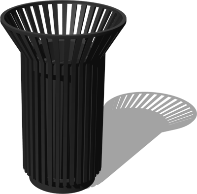

%end

Derived from [Solid](../reference/solid.md).

```
PublicBin {
  SFVec3f    translation          0 0 0
  SFRotation rotation             0 0 1 0
  SFString   name                 "public bin"
  SFColor    color                0.27 0.27 0.27
  MFColor    recognitionColors    [0.27 0.27 0.27]
}
```

> **File location**: "[WEBOTS\_HOME/projects/objects/street\_furniture/protos/PublicBin.proto]({{ url.github_tree }}/projects/objects/street_furniture/protos/PublicBin.proto)"

> **License**: Copyright Cyberbotics Ltd. Licensed for use only with Webots.
[More information.](https://cyberbotics.com/webots_assets_license)

### PublicBin Field Summary

- `color`: Defines the color of the bin.

## PublicToilet

Resizable public toilet with two different displays.

%figure


%end

Derived from [Solid](../reference/solid.md).

```
PublicToilet {
  SFVec3f     translation         0 0 0
  SFRotation  rotation            0 0 1 0
  SFString    name                "public toilet"
  SFFloat     height              3.2
  SFFloat     length              2.1
  SFFloat     width               3.5
  MFString    backDisplayTexture  "https://raw.githubusercontent.com/cyberbotics/webots/R2022b/projects/default/worlds/textures/webots_billboard.jpg"
  SFBool      backDisplayLight    FALSE
  MFNode      frontDisplay        [
    AdvertisingBoard {
      translation 0 0.1 0
      frontTexture ["https://raw.githubusercontent.com/cyberbotics/webots/R2022b/projects/default/worlds/textures/webots_billboard.jpg"]
      backTexture []
      displayBackLight FALSE
      displayWidth 0.9
      displayHeight 0.9
      frameThickness 0.1
    }
  ]
}
```

> **File location**: "[WEBOTS\_HOME/projects/objects/street\_furniture/protos/PublicToilet.proto]({{ url.github_tree }}/projects/objects/street_furniture/protos/PublicToilet.proto)"

> **License**: Copyright Cyberbotics Ltd. Licensed for use only with Webots.
[More information.](https://cyberbotics.com/webots_assets_license)

### PublicToilet Field Summary

- `height`: Defines the height of the toilet.

- `length`: Defines the length of the toilet.

- `width`: Defines the width of the toilet.

- `backDisplayTexture`: Defines the texture used on the back display.

- `backDisplayLight`: Defines whether the back display should have emissive color.

- `frontDisplay`: Defines the content of the front display.

## SimpleBench

A simple bench.

%figure

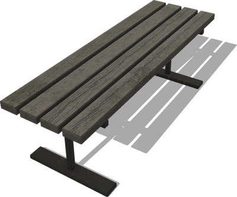

%end

Derived from [Solid](../reference/solid.md).

```
SimpleBench {
  SFVec3f    translation 0 0 0
  SFRotation rotation    0 0 1 0
  SFString   name        "simple bench"
}
```

> **File location**: "[WEBOTS\_HOME/projects/objects/street\_furniture/protos/SimpleBench.proto]({{ url.github_tree }}/projects/objects/street_furniture/protos/SimpleBench.proto)"

> **License**: Creative Commons Attribution 4.0 International License.
[More information.](https://creativecommons.org/licenses/by/4.0/legalcode)

## SmallKiosk

A small kiosk.

%figure

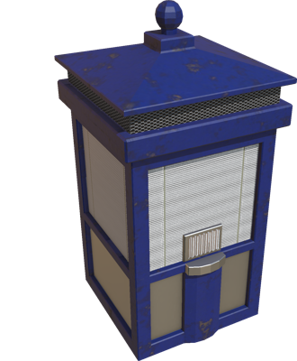

%end

Derived from [Solid](../reference/solid.md).

```
SmallKiosk {
  SFVec3f    translation 0 0 0
  SFRotation rotation    0 0 1 0
  SFString   name        "small kiosk"
}
```

> **File location**: "[WEBOTS\_HOME/projects/objects/street\_furniture/protos/SmallKiosk.proto]({{ url.github_tree }}/projects/objects/street_furniture/protos/SmallKiosk.proto)"

> **License**: Creative Commons Attribution 4.0 International License.
[More information.](https://creativecommons.org/licenses/by/4.0/legalcode)

## SnackStand

A snack stand.

%figure

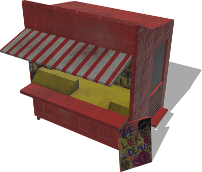

%end

Derived from [Solid](../reference/solid.md).

```
SnackStand {
  SFVec3f    translation 0 0 0
  SFRotation rotation    0 0 1 0
  SFString   name        "snack stand"
  SFString   color       "red"
}
```

> **File location**: "[WEBOTS\_HOME/projects/objects/street\_furniture/protos/SnackStand.proto]({{ url.github_tree }}/projects/objects/street_furniture/protos/SnackStand.proto)"

> **License**: Creative Commons Attribution 4.0 International License.
[More information.](https://creativecommons.org/licenses/by/4.0/legalcode)

### SnackStand Field Summary

- `color`: Defines the color of the stand. The value should be either `red` or `green`.

## StoneBench

A simple bench made of stone.

%figure

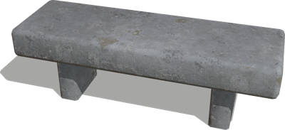

%end

Derived from [Solid](../reference/solid.md).

```
StoneBench {
  SFVec3f    translation 0 0 0
  SFRotation rotation    0 0 1 0
  SFString   name        "stone bench"
}
```

> **File location**: "[WEBOTS\_HOME/projects/objects/street\_furniture/protos/StoneBench.proto]({{ url.github_tree }}/projects/objects/street_furniture/protos/StoneBench.proto)"

> **License**: Creative Commons Attribution 4.0 International License.
[More information.](https://creativecommons.org/licenses/by/4.0/legalcode)

## StoneFountain

A fountain made of stones.

%figure

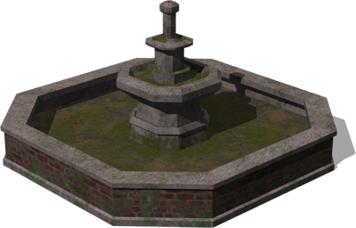

%end

Derived from [Solid](../reference/solid.md).

```
StoneFountain {
  SFVec3f    translation 0 0 0
  SFRotation rotation    0 0 1 0
  SFString   name        "stone fountain"
}
```

> **File location**: "[WEBOTS\_HOME/projects/objects/street\_furniture/protos/StoneFountain.proto]({{ url.github_tree }}/projects/objects/street_furniture/protos/StoneFountain.proto)"

> **License**: Creative Commons Attribution 4.0 International License.
[More information.](https://creativecommons.org/licenses/by/4.0/legalcode)

## TrashBin

A trash bin.

%figure

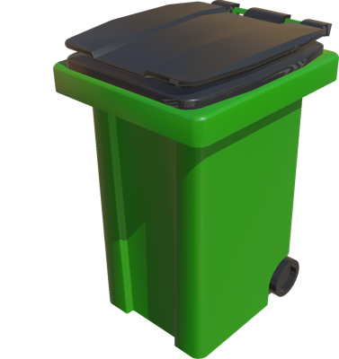

%end

Derived from [Solid](../reference/solid.md).

```
TrashBin {
  SFVec3f    translation          0 0 0
  SFRotation rotation             0 0 1 0
  SFString   name                 "trash bin"
  SFColor    coverColor           0.1 0.1 0.1
  SFColor    binColor             0.08 0.46 0
  MFColor    recognitionColors    [0.08 0.46 0, 0.1 0.1 0.1]
}
```

> **File location**: "[WEBOTS\_HOME/projects/objects/street\_furniture/protos/TrashBin.proto]({{ url.github_tree }}/projects/objects/street_furniture/protos/TrashBin.proto)"

> **License**: Copyright Cyberbotics Ltd. Licensed for use only with Webots.
[More information.](https://cyberbotics.com/webots_assets_license)

### TrashBin Field Summary

- `coverColor`: Defines the color of the top part of the bin.

- `binColor`: Defines the main color of the bin.

## TrashContainer

A trash container with optional physics.

%figure

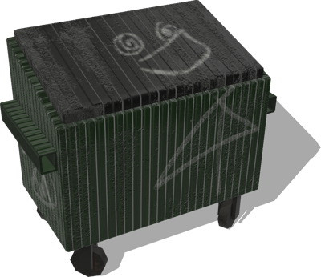

%end

Derived from [Solid](../reference/solid.md).

```
TrashContainer {
  SFVec3f    translation    0 0 0
  SFRotation rotation       0 0 1 0
  SFString   name           "trash container"
  SFBool     enablePhysics  FALSE
}
```

> **File location**: "[WEBOTS\_HOME/projects/objects/street\_furniture/protos/TrashContainer.proto]({{ url.github_tree }}/projects/objects/street_furniture/protos/TrashContainer.proto)"

> **License**: Creative Commons Attribution 4.0 International License.
[More information.](https://creativecommons.org/licenses/by/4.0/legalcode)

### TrashContainer Field Summary

- `enablePhysics`: Defines whether the trash container should have physics.

## UndergroundContainer

An underground container.

%figure

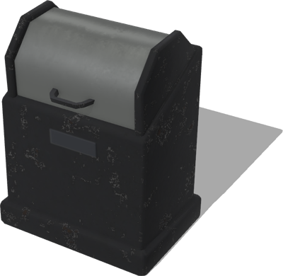

%end

Derived from [Solid](../reference/solid.md).

```
UndergroundContainer {
  SFVec3f    translation 0 0 0
  SFRotation rotation    0 0 1 0
  SFString   name        "underground container"
}
```

> **File location**: "[WEBOTS\_HOME/projects/objects/street\_furniture/protos/UndergroundContainer.proto]({{ url.github_tree }}/projects/objects/street_furniture/protos/UndergroundContainer.proto)"

> **License**: Creative Commons Attribution 4.0 International License.
[More information.](https://creativecommons.org/licenses/by/4.0/legalcode)

## UrbanFence

An urban fence with optional boundingObject.

%figure

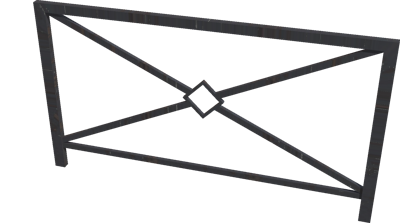

%end

Derived from [Solid](../reference/solid.md).

```
UrbanFence {
  SFVec3f    translation           0 0 0
  SFRotation rotation              0 0 1 0
  SFString   name                  "urban fence"
  SFBool     enableBoundingObject  TRUE
}
```

> **File location**: "[WEBOTS\_HOME/projects/objects/street\_furniture/protos/UrbanFence.proto]({{ url.github_tree }}/projects/objects/street_furniture/protos/UrbanFence.proto)"

> **License**: Creative Commons Attribution 4.0 International License.
[More information.](https://creativecommons.org/licenses/by/4.0/legalcode)

### UrbanFence Field Summary

- `enableBoundingObject`: Defines whether the fence should have a bounding object.

## WorkTrashContainer

A work trash container.

%figure

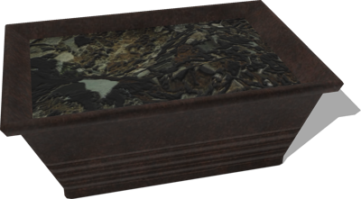

%end

Derived from [Solid](../reference/solid.md).

```
WorkTrashContainer {
  SFVec3f    translation 0 0 0
  SFRotation rotation    0 0 1 0
  SFString   name        "work trash container"
}
```

> **File location**: "[WEBOTS\_HOME/projects/objects/street\_furniture/protos/WorkTrashContainer.proto]({{ url.github_tree }}/projects/objects/street_furniture/protos/WorkTrashContainer.proto)"

> **License**: Creative Commons Attribution 4.0 International License.
[More information.](https://creativecommons.org/licenses/by/4.0/legalcode)

