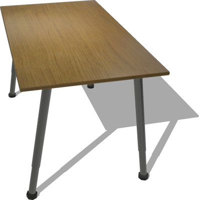
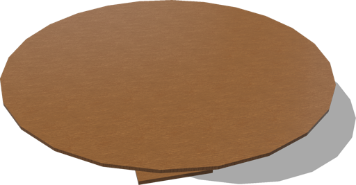
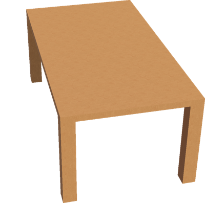

# Tables

## Desk

A desk (1.2 x 0.72 x 0.7 m).

%figure



%end

Derived from [Solid](../reference/solid.md).

```
Desk {
  SFVec3f    translation 0 0 0
  SFRotation rotation    0 1 0 0
  SFString   name        "desk"
  SFColor    color       1 1 1
  SFNode     physics     NULL
}
```

> **File location**: "[WEBOTS\_HOME/projects/objects/tables/protos/Desk.proto]({{ url.github_tree }}/projects/objects/tables/protos/Desk.proto)"

> **License**: Copyright Cyberbotics Ltd. Licensed for use only with Webots.
[More information.](https://cyberbotics.com/webots_assets_license)

### Desk Field Summary

- `color`: Defines the color of the desk.

## RoundTable

A round table (2 x 0.76 x 2 m).

%figure



%end

Derived from [Solid](../reference/solid.md).

```
RoundTable {
  SFVec3f    translation 0 0 0
  SFRotation rotation    0 1 0 0
  SFString   name        "round table"
  SFNode     appearance  VarnishedPine { textureTransform TextureTransform { scale 6 6 } }
  SFNode     physics     NULL
  MFColor    recognitionColors []
}
```

> **File location**: "[WEBOTS\_HOME/projects/objects/tables/protos/RoundTable.proto]({{ url.github_tree }}/projects/objects/tables/protos/RoundTable.proto)"

> **License**: Copyright Cyberbotics Ltd. Licensed for use only with Webots.
[More information.](https://cyberbotics.com/webots_assets_license)

### RoundTable Field Summary

- `name`: Defines the color of the table.

- `appearance`: Defines the appearance of the table.

## Table

Customizable table.

%figure



%end

Derived from [Solid](../reference/solid.md).

```
Table {
  SFVec3f    translation    0 0 0
  SFRotation rotation       0 1 0 0
  SFString   name           "table"
  SFVec3f    size           1.8 0.74 1
  SFVec2f    feetSize       0.1 0.1
  SFFloat    feetPadding    0
  SFFloat    frameThickness 0.05
  SFNode     trayAppearance VarnishedPine { textureTransform TextureTransform { scale 10 10 } }
  SFNode     legAppearance  VarnishedPine { textureTransform TextureTransform { scale 4 5 } }
  MFColor    recognitionColors []
}
```

> **File location**: "[WEBOTS\_HOME/projects/objects/tables/protos/Table.proto]({{ url.github_tree }}/projects/objects/tables/protos/Table.proto)"

> **License**: Copyright Cyberbotics Ltd. Licensed for use only with Webots.
[More information.](https://cyberbotics.com/webots_assets_license)

### Table Field Summary

- `size`: Defines the size of the table.

- `feetSize`: Defines the size of the feet.

- `feetPadding`: Defines the padding of the feet.

- `frameThickness`: Defines the thickness of the frame.

- `trayAppearance`: Defines the appearance of the tray.

- `legAppearance`: Defines the appearance of the feet.

