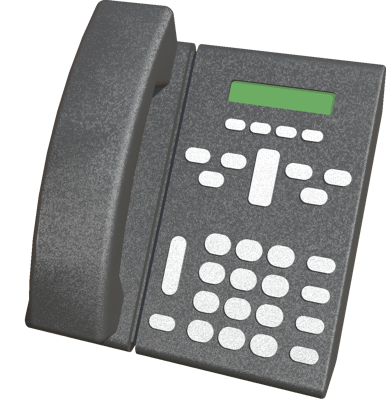

# Telephone

## Telephone PROTO

A model of a telephone, sourced from the GLTF PBR reference implementation, found at [https://github.com/KhronosGroup/glTF-WebGL-PBR](https://github.com/KhronosGroup/glTF-WebGL-PBR).

%figure


%end

Derived from [Solid](../reference/solid.md).

```
Telephone {
  SFVec3f translation 0 0 0
  SFRotation rotation 0 1 0 0
  MFColor    recognitionColors []
}
```

> **File location**: "[WEBOTS\_HOME/projects/objects/telephone/protos/Telephone.proto]({{ url.github_tree }}/projects/objects/telephone/protos/Telephone.proto)"

> **License**: MIT
[More information.](https://opensource.org/licenses/MIT)

## OfficeTelephone

An office telephone with optional physics.

%figure



%end

Derived from [Solid](../reference/solid.md).

```
OfficeTelephone {
  SFVec3f    translation    0 0 0
  SFRotation rotation       0 1 0 0
  SFString   name           "office telephone"
  SFBool     enablePhysics  TRUE
  MFColor    recognitionColors []
}
```

> **File location**: "[WEBOTS\_HOME/projects/objects/telephone/protos/OfficeTelephone.proto]({{ url.github_tree }}/projects/objects/telephone/protos/OfficeTelephone.proto)"

> **License**: Copyright Cyberbotics Ltd. Licensed for use only with Webots.
[More information.](https://cyberbotics.com/webots_assets_license)

### OfficeTelephone Field Summary

- `enablePhysics`: Defines whether the telephone should have physics.

