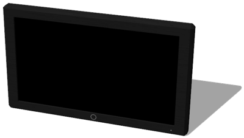

# Television

## Television PROTO

A television (1 x 0.6 x 0.1 m).

%figure



%end

Derived from [Robot](../reference/robot.md).

```
Television {
  SFVec3f    translation   0 0.3 0
  SFRotation rotation      0 0 1 0
  SFString   name          "television"
  SFColor    color         1 1 1
  MFString   textureUrl    "textures/television.jpg"
  SFInt32    displayWidth  128
  SFInt32    displayHeight 64
  SFString   controller    "television_switch_on"
  SFString   window        "<none>"
  SFBool     supervisor     FALSE
}
```

> **File location**: "[WEBOTS\_HOME/projects/objects/television/protos/Television.proto]({{ url.github_tree }}/projects/objects/television/protos/Television.proto)"

> **License**: Copyright Cyberbotics Ltd. Licensed for use only with Webots.
[More information.](https://cyberbotics.com/webots_assets_license)

### Television Field Summary

- `color`: Defines the color of the television.

- `textureUrl`: Defines the texture used for the television.

- `displayWidth`: Defines the width of the internal [Display](../reference/display.md) device.

- `displayHeight`: Defines the height of the internal [Display](../reference/display.md) device.

- `controller`: Defines the controller used to display images using the internal [Display](../reference/display.md) device.

