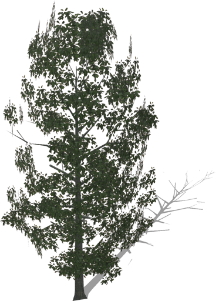
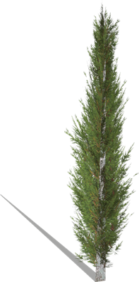
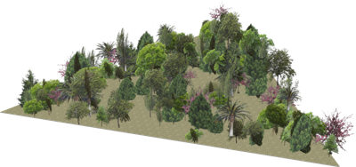
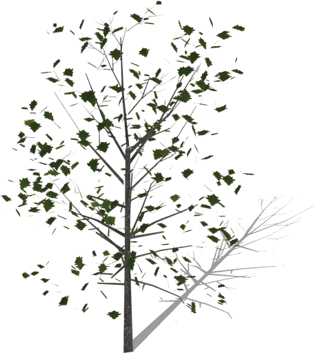
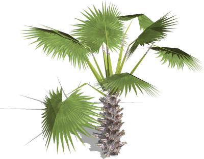
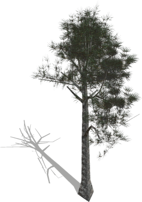
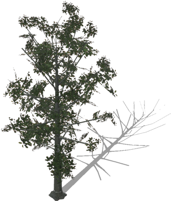
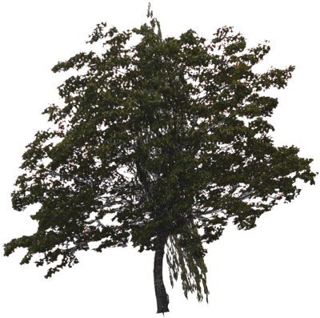
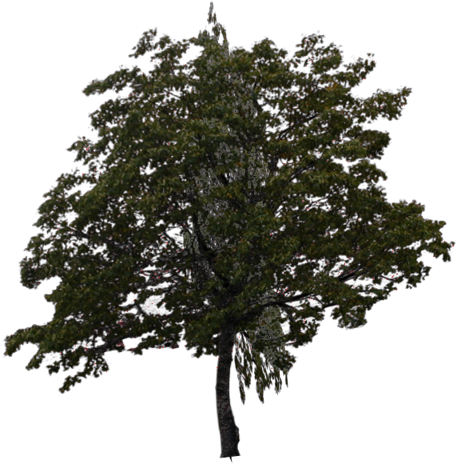

# Trees

## BigSassafras

A big sassafras tree with optional boundingObject.

%figure



%end

Derived from [Solid](../reference/solid.md).

```
BigSassafras {
  SFVec3f    translation           0 0 0
  SFRotation rotation              0 0 1 0
  SFString   name                  "sassafras tree"
  SFBool     enableBoundingObject  TRUE
}
```

> **File location**: "[WEBOTS\_HOME/projects/objects/trees/protos/BigSassafras.proto]({{ url.github_tree }}/projects/objects/trees/protos/BigSassafras.proto)"

> **License**: Creative Commons Attribution 4.0 International License.
[More information.](https://creativecommons.org/licenses/by/4.0/legalcode)

### BigSassafras Field Summary

- `enableBoundingObject`: Defines whether the tree should have a bounding object.

## Cypress

A cypress tree with optional boundingObject.

%figure



%end

Derived from [Solid](../reference/solid.md).

```
Cypress {
  SFVec3f    translation           0 0 0
  SFRotation rotation              0 0 1 0
  SFString   name                  "cypress tree"
  SFBool     enableBoundingObject  TRUE
}
```

> **File location**: "[WEBOTS\_HOME/projects/objects/trees/protos/Cypress.proto]({{ url.github_tree }}/projects/objects/trees/protos/Cypress.proto)"

> **License**: Creative Commons Attribution 4.0 International License.
[More information.](https://creativecommons.org/licenses/by/4.0/legalcode)

### Cypress Field Summary

- `enableBoundingObject`: Defines whether the tree should have a bounding object.

## Forest

Efficient and customizable forest.
Tree types are:
- 'oak tree'
- 'crab apple tree'
- 'cherry tree'
- 'birch tree'
- 'palm tree'
- 'spruce'
- 'white pine'
- 'hackberry tree'
- 'hazel tree'

The 'random' type choose randomly a tree type each time the node is regenerated.
The shape of the forest can either be defined using the 'shape' and 'density' fields or the coordinate of each tree can be defined in external files ( X,Y,Z per tree, one tree per line).
The path to those files must be defined with respect to the world file.
This model was sponsored by the CTI project RO2IVSim ([http://transport.epfl.ch/simulator-for-mobile-robots-and-intelligent-vehicles](http://transport.epfl.ch/simulator-for-mobile-robots-and-intelligent-vehicles)).

%figure



%end

Derived from [Transform](../reference/transform.md).

```
Forest {
  SFVec3f    translation          0 0 0
  SFRotation rotation             0 0 1 0
  MFString   treesFiles           []
  MFVec2f    shape                [-20 -10, 20 -10, 0 25]
  SFFloat    density              0.2
  SFString   type                 "random"
  SFInt32    randomSeed           0
  MFString   groundTexture        "textures/dry_leaf.jpg"
  SFBool     withSnow             FALSE
  SFFloat    maxHeight            6
  SFFloat    minHeight            2
  SFFloat    maxRadius            3
  SFFloat    minRadius            1
}
```

> **File location**: "[WEBOTS\_HOME/projects/objects/trees/protos/Forest.proto]({{ url.github_tree }}/projects/objects/trees/protos/Forest.proto)"

> **License**: Copyright Cyberbotics Ltd. Licensed for use only with Webots.
[More information.](https://cyberbotics.com/webots_assets_license)

### Forest Field Summary

- `treesFiles`: Can be used to define the paths to several files in which are defined the positions of the trees (one tree per line, using the format 'X, Y, Z'). The path to these files must be defined with respect to the world file.

- `shape`: Alternatively, the position of each trees can be defined using the shape field. This field defines the shape of the forest, in that case the position of the trees is randomly generated from this shape.

- `density`: If the forest is defined using the `shape` field, this field defines the density of three to be generated (in trees per meter square).

- `type`: Defines the type of threes, in case of `random` type, the forest will be mixed. This field accepts the following values: `"random"`, `"oak tree"`, `"crab apple tree"`, `"cherry tree"`, `"birch tree"`, `"palm tree"`, `"spruce"`, `"white pine"`, `"hackberry tree"`, and `"hazel tree"`.

- `randomSeed`: Defines the seed of the random number generator. A value of 0 sets the seed to the node id and a value smaller than 0 sets a time based random seed.

- `groundTexture`: Defines the texture of the forest ground. If this field is empty the forest ground is not displayed.

- `withSnow`: Defines whether the texture used should have snow on top.

- `maxHeight`: Defines the maximum height of the trees.

- `minHeight`: Defines the minimum height of the trees.

- `maxRadius`: Defines the maximum radius of the trees.

- `minRadius`: Defines the minimum radius of the trees.

## Oak

A oak tree with optional boundingObject.

%figure



%end

Derived from [Solid](../reference/solid.md).

```
Oak {
  SFVec3f    translation           0 0 0
  SFRotation rotation              0 0 1 0
  SFString   name                  "oak tree"
  SFBool     enableBoundingObject  TRUE
}
```

> **File location**: "[WEBOTS\_HOME/projects/objects/trees/protos/Oak.proto]({{ url.github_tree }}/projects/objects/trees/protos/Oak.proto)"

> **License**: Creative Commons Attribution 4.0 International License.
[More information.](https://creativecommons.org/licenses/by/4.0/legalcode)

### Oak Field Summary

- `enableBoundingObject`: Defines whether the tree should have a bounding object.

## PalmTree

A palm tree with optional boundingObject.

%figure



%end

Derived from [Solid](../reference/solid.md).

```
PalmTree {
  SFVec3f    translation           0 0 0
  SFRotation rotation              0 0 1 0
  SFString   name                  "palm tree"
  SFBool     enableBoundingObject  TRUE
}
```

> **File location**: "[WEBOTS\_HOME/projects/objects/trees/protos/PalmTree.proto]({{ url.github_tree }}/projects/objects/trees/protos/PalmTree.proto)"

> **License**: Creative Commons Attribution 4.0 International License.
[More information.](https://creativecommons.org/licenses/by/4.0/legalcode)

### PalmTree Field Summary

- `enableBoundingObject`: Defines whether the tree should have a bounding object.

## Pine

A pine tree with optional boundingObject.

%figure



%end

Derived from [Solid](../reference/solid.md).

```
Pine {
  SFVec3f    translation           0 0 0
  SFRotation rotation              0 0 1 0
  SFString   name                  "pine tree"
  SFBool     enableBoundingObject  TRUE
}
```

> **File location**: "[WEBOTS\_HOME/projects/objects/trees/protos/Pine.proto]({{ url.github_tree }}/projects/objects/trees/protos/Pine.proto)"

> **License**: Creative Commons Attribution 4.0 International License.
[More information.](https://creativecommons.org/licenses/by/4.0/legalcode)

### Pine Field Summary

- `enableBoundingObject`: Defines whether the tree should have a bounding object.

## Sassafras

A sassafras tree with optional boundingObject.

%figure



%end

Derived from [Solid](../reference/solid.md).

```
Sassafras {
  SFVec3f    translation           0 0 0
  SFRotation rotation              0 0 1 0
  SFString   name                  "sassafras tree"
  SFBool     burnt                 FALSE
  SFBool     enableBoundingObject  TRUE
}
```

> **File location**: "[WEBOTS\_HOME/projects/objects/trees/protos/Sassafras.proto]({{ url.github_tree }}/projects/objects/trees/protos/Sassafras.proto)"

> **License**: Creative Commons Attribution 4.0 International License.
[More information.](https://creativecommons.org/licenses/by/4.0/legalcode)

### Sassafras Field Summary

- `burnt`: Defines whether the tree is burnt (after a wildfire).

- `enableBoundingObject`: Defines whether the tree should have a bounding object.

## SimpleTree

Efficient (with only 8 polygones) and customizable outdoor tree.
Tree types are:
- 'oak tree'
- 'crab apple tree'
- 'cherry tree'
- 'birch tree'
- 'palm tree'
- 'spruce'
- 'white pine'
- 'hackberry tree'
- 'hazel tree'

The 'random' type choose randomly a tree type each time the node is regenerated.

%figure



%end

Derived from [Solid](../reference/solid.md).

```
SimpleTree {
  SFVec3f    translation          0 0 0
  SFRotation rotation             0 0 1 0
  SFString   name                 "tree"
  SFString   type                 "cherry tree"
  SFBool     withSnow             FALSE
  SFFloat    height               4
  SFFloat    radius               2
  SFInt32    subdivision          2
  SFBool     enableBoundingObject TRUE
  SFBool     locked               TRUE
  SFBool     isPickable           TRUE
}
```

> **File location**: "[WEBOTS\_HOME/projects/objects/trees/protos/SimpleTree.proto]({{ url.github_tree }}/projects/objects/trees/protos/SimpleTree.proto)"

> **License**: Copyright Cyberbotics Ltd. Licensed for use only with Webots.
[More information.](https://cyberbotics.com/webots_assets_license)

### SimpleTree Field Summary

- `name`: Defines the name of the tree.

- `type`: Defines the texture to be used. If set to `random`, a type will be randomly selected in the list. This field accepts the following values: `"random"`, `"oak tree"`, `"crab apple tree"`, `"cherry tree"`, `"birch tree"`, `"palm tree"`, `"spruce"`, `"white pine"`, `"hackberry tree"`, and `"hazel tree"`.

- `withSnow`: Defines if the texture used should have snow on top.

- `height`: Defines the height of the tree.

- `radius`: Defines the radius of the tree.

- `subdivision`: Defines the number of faces used to represent the tree.

- `enableBoundingObject`: Defines if the tree should have a bounding object (the bounding object is made of a simple cylinder).

## Tree

Efficient (with only 8 polygons) and fast to load tree.
This PROTO is less configurable than `SimpleTree` but way faster to load.

%figure



%end

Derived from [Solid](../reference/solid.md).

```
Tree {
  SFVec3f    translation          0 0 0
  SFRotation rotation             0 0 1 0
  SFString   name                 "tree"
  SFVec3f    scale                1 1 4
  MFString   texture              "textures/cherry_tree.png"
  SFNode     boundingObject       NULL
  SFBool     locked               TRUE
  SFBool     isPickable           TRUE
}
```

> **File location**: "[WEBOTS\_HOME/projects/objects/trees/protos/Tree.proto]({{ url.github_tree }}/projects/objects/trees/protos/Tree.proto)"

> **License**: Copyright Cyberbotics Ltd. Licensed for use only with Webots.
[More information.](https://cyberbotics.com/webots_assets_license)

### Tree Field Summary

- `name`: Defines the name of the tree.

- `scale`: The first and middle components of the scale define the radius of the tree and the last one defines it's height.

- `texture`: Defines the texture used for the tree.

