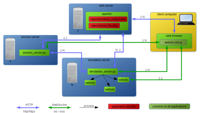

## Prerequisites and Overview

### Prerequisites

The prerequisites for the server machine(s) are the following:

- Ubuntu 20.04 LTS or newer
- Web service dependencies ([installation instructions](https://github.com/cyberbotics/webots/wiki/Linux-Optional-Dependencies#webots-web-service)):

The simulation server machines have to met the [Webots system requirements](system-requirements.md).
They may however be virtual machine, such as AWS instances.
GPU instances are strongly recommended for performance reasons, especially if the simulation involves sensors relying on OpenGL rendering (cameras, lidars, range-finders).

### Overview

In order to run Webots in the cloud, you need to run at least one session server and one or more simulation servers.
The simulation servers should run on different machines while the session server may run on a machine where a simulation server is running.
Both servers are Python scripts named `simulation_server.py` and `session_server.py` and located in "[https://github.com/cyberbotics/webots-server](https://github.com/cyberbotics/webots-server)".

Either Docker or Webots has to be installed on all the machines where a simulation server is running.

%figure "Web simulation server network infrastructure"

%end
