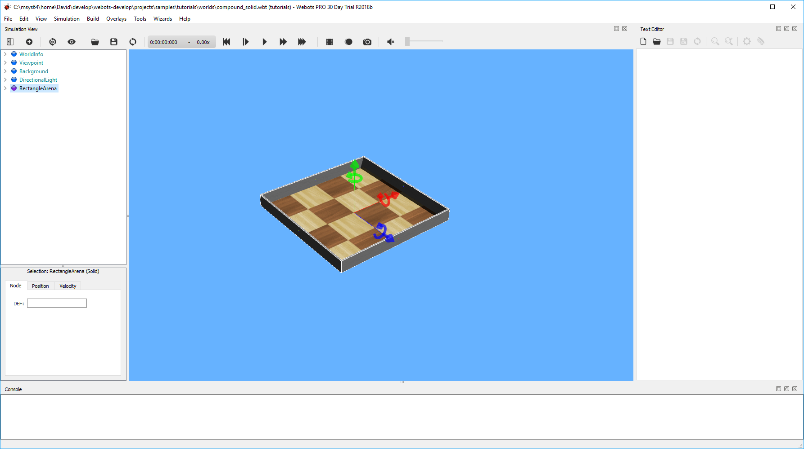

## Prerequisites

In this section, you will learn how to setup your Webots environment.
It is obviously a necessary step to get started with the tutorials.

### Install Webots

Webots has to be installed on your computer.

> **Hands on**: Install Webots by following the instructions given in [this chapter](installing-webots.md).

### Create a Directory for All Your Webots Files

The first step is to create a directory which will contain all your files related to Webots.

> **Hands on**: From your operating system interface, choose a location on your hard disk where you have the writing rights (for example, your "[My]Documents" directory).
Create a directory that will contain all your Webots projects, and name it "my\_webots\_projects".

### Start Webots

You need to learn how to launch Webots.

> **Hands on**: Start Webots by following the instructions given in [this section](starting-webots.md).

<!-- -->

> **Note**: A Guided Tour is available.
If it's the first time you start Webots, a welcome dialog box invites you to choose a demo simulation.
Choose any of them, but it's a good opportunity to take a look at our guided tour (also available using the `Help / Webots Guided Tour...` menu).

Now a simulation is running.

### Create a New Project

The freshly created "my\_webots\_projects" directory will contain all your Webots projects.
Your first Webots project will be the tutorials from this chapter.
So let us now create a project named "tutorials" which will contain all the simulations of this chapter.

> **Note**: As mentioned earlier in this chapter, the solutions of the tutorials are included in the "WEBOTS\_HOME/projects/samples/tutorials" subdirectory of Webots.
Don't look at it now! Hopefully, your own "tutorials" directory should be pretty similar to that one at the end.

<!-- -->

> **Theory**: A **project** is a directory containing all the files related to a set of simulations.
It is the highest container in Webots.
Two simulations should reside in the same project if they share some content (robots, source code, 3D shapes, etc.).

<!-- -->

> **Hands on**: In Webots, open the wizard by selecting the `Wizards / New Project Directory...` menu item.
From this wizard, follow the instructions to create a new project named "tutorials" in the "my\_webots\_projects" directory created before.

<!-- -->

> **Note**: From your desktop, open the project directory and observe its subdirectories.
We will soon explain the purpose of each directory.

### The Webots Graphical User Interface (GUI)

The Webots main window is shown in [this figure](#the-webots-main-window-splits-into-four-dockable-subwindows-the-scene-tree-view-on-the-left-hand-side-including-a-panel-at-the-bottom-for-editing-fields-values-the-3d-view-in-the-center-the-text-editor-on-the-right-hand-side-and-the-console-at-bottom-of-the-window-note-that-some-of-these-subwindows-have-a-toolbar-with-buttons-the-main-menus-appear-on-the-top-of-the-main-window-the-virtual-time-counter-and-the-speedometer-are-displayed-in-the-right-part-of-the-main-toolbar-the-status-text-is-displayed-in-the-bottom-left-of-the-main-window).
Make sure you understand well how the Webots main window is divided into subwindows before continuing.
A more detailed description of the Webots GUI is provided in [this section](the-user-interface.md).

%figure "The Webots main window splits into four dockable subwindows: the scene tree view on the left hand side (including a panel at the bottom for editing fields values), the 3D view in the center, the text editor on the right hand side, and the console at bottom of the window. Note that some of these subwindows have a toolbar with buttons. The main menus appear on the top of the main window. The virtual time counter and the speedometer are displayed in the right part of the main toolbar. The status text is displayed in the bottom left of the main window."

%end
