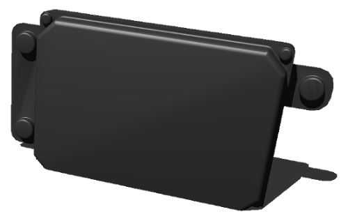
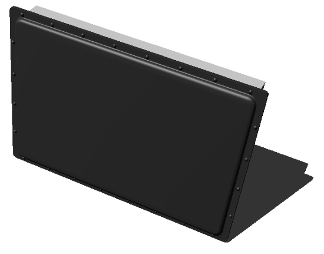

## Radar Sensors

Several radar models are available.

### "Delphi ESR"

The `Delphi ESR` is a radar which can see cars up to 174 meters ahead, has a vertical field of view of 4.5 degrees and an horizontal field of view of up to 90 degrees.
The sensor can operate in two modes: the long range mode uses an horizontal field of view of 20 degrees and a maximum range of 174 meters, the medium range mode uses a field of view of 90 degrees and a maximum range of 60 meters.

%figure "Delphi ESR radar"



%end

```
DelphiESR {
  SFVec3f    translation    0 0 0
  SFRotation rotation       0 1 0 0
  SFString   name           "Delphi ESR"
  SFBool     occlusion      FALSE
  SFBool     longRangeMode  FALSE
}
```

The `occlusion` field can be used to set whether occlusions between the targets and the radar should be checked.

The `longRangeMode` field can be used to set the radar mode.

### "Smartmicro UMRR-0a"

Various types of Smartmicro UMRR-0a are available.
They all have the same fields.

%figure "Smartmicro UMRR-0a radar"



%end

```
SmsUmrr-0a29 / SmsUmrr-0a30 / SmsUmrr-0a31 {
  SFVec3f    translation    0 0 0
  SFRotation rotation       0 1 0 0
  SFString   name           "Sms UMRR 0a29" / "Sms UMRR 0a30" / "Sms UMRR 0a31"
  SFBool     occlusion      FALSE
  SFFloat    cellSpeed      0.0
  SFFloat    angularNoise   0.0
}
```

The `occlusion` field can be used to set whether occlusions between the targets and the radar should be checked.

The `cellSpeed` field can be used to set the minimum radial distance between two targets to be detected as distinct objects.

The `angularNoise` field can be used to set the angular noise.

#### "Smartmicro UMRR-0a type 29"

The `Smartmicro UMRR-0a type 29` radar has an horizontal field of view of 36 degrees, a vertical field of view of 8 degrees and a maximum range of 160 meters.

#### "Smartmicro UMRR-0a type 30"

The `Smartmicro UMRR-0a type 30` radar has an horizontal field of view of 70 degrees, a vertical field of view of 10 degrees and a maximum range of 90 meters.

#### "Smartmicro UMRR-0a type 31"

The `Smartmicro UMRR-0a type 31` radar has an horizontal field of view of 100 degrees, a vertical field of view of 10 degrees and a maximum range of 45 meters.
