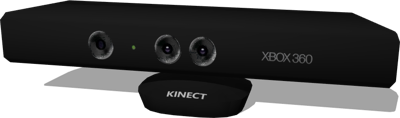

## RangeFinder Sensors

### Microsoft Kinect

%figure "Microsoft Kinect model"



%end

The [Microsoft Kinect](https://en.wikipedia.org/wiki/Kinect) is a motion sensing input device.
It is modeled using a regular RGB [Camera](../reference/camera.md) and a [RangeFinder](../reference/rangefinder.md) device to retrieve the depth information in meters.

Derived from [Solid](../reference/solid.md).
Includes a [Camera](../reference/camera.md), a [RangeFinder](../reference/rangefinder.md) and optionally a [RotationalMotor](../reference/rotationalmotor.md).

```
Kinect {
  SFVec3f    translation   0 0 0
  SFRotation rotation      0 1 0 0
  SFString   name          "kinect"
  SFInt32    width         320
  SFInt32    height        190
  SFFloat    maxRange      3.5
  SFFloat    colorNoise    0.0
  SFFloat    rangeNoise    0.0
  SFString   cameraName    "kinect"
  SFString   tiltMotorName "tilt motor"
  SFBool     foot          TRUE
}
```

- `width`: Defines the `width` field of the [RangeFinder](../reference/rangefinder.md) and [Camera](../reference/camera.md) nodes.
- `height`: Defines the `height` field of the [RangeFinder](../reference/rangefinder.md) and [Camera](../reference/camera.md) nodes.
- `maxRange`: Defines the `maxRange` field of the [RangeFinder](../reference/rangefinder.md).
- `colorNoise`: Defines the `noise` field of the [Camera](../reference/camera.md).
- `rangeNoise`: Defines the `noise` field of the [RangeFinder](../reference/rangefinder.md).
- `cameraName`: Defines the name of the [RangeFinder](../reference/rangefinder.md) and [Camera](../reference/camera.md) nodes. The [RangeFinder](../reference/rangefinder.md) is named `<cameraName> + ' range'` and the [Camera](../reference/camera.md) `<cameraName> + ' color'`.
- `tiltMotorName`: Defines the name of the foot tilt [RotationalMotor](../reference/rotationalmotor.md) (when the `foot` field is enabled).
- `foot`: Defines whether the articulated foot is present.
