# Robots

## Robot List

All the robot models included in Webots are listed here. Users may also add their own custom models.
Please [contact us](https://cyberbotics.com/#contact) if you would like to see your favorite robot here.

| Preview                                              | Name                                      |  Manufacturer        | Description                       |
| :--------------------------------------------------: | ----------------------------------------- | -------------------- | --------------------------------- |
| 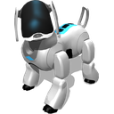        | [Aibo ERS7](aibo-ers7.md)                 | Sony                 | *Dog-like robot*                  |
|            | [ALTINO](altino.md)                       | Saeon                | *Small size car-like robot*       |
| 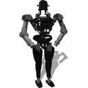            | [Atlas](atlas.md)                         | Boston Dynamics      | *Human-size humanoid*             |
|               | [BB-8](bb8.md)                            | Sphero               | *Spherical robot*                 |
|           | [Bioloid](bioloid.md)                     | Robotis              | *Robotics kit*                    |
|             | [Blimp](blimp.md)                         | EPFL / LIS           | *Zeppelin robot*                  |
|            | [Boe-Bot](boebot.md)                      | Parallax             | *Three-wheeled robot*             |
| 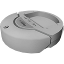           | [Create](create.md)                       | iRobot               | *Vacuum-cleaner like robot*       |
|         | [DARwIn-OP](darwin-op.md)                 | Robotis              | *Small size humanoid*             |
|            | [Elisa 3](elisa3.md)                      | GCTronic             | *Two-wheeled robot*               |
| 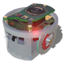            | [e-puck](epuck.md)                        | GCTronic             | *Two-wheeled robot*               |
| 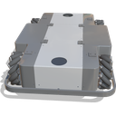          | [Fabtino](fabtino.md)                     | REC                  | *Four-wheeled (mecanum) robot*    |
| 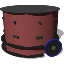        | [FireBird 6](firebird6.md)                | NEX Robotics         | *Two-wheeled robot*               |
| 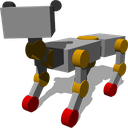         | [GhostDog](ghostdog.md)                   | EPFL / BioRob        | *Dog-like robot*                  |
|          | [Hemisson](hemisson.md)                   | K-Team               | *Two-wheeled robot*               |
|             | [HOAP-2](hoap2.md)                        | Fujitsu              | *Small size humanoid*             |
| 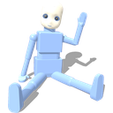             | [iCub](icub.md)                           | RobotCup             | *Human-size humanoid*             |
| 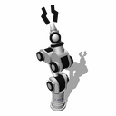              | [IPR](ipr.md)                             | Neuronics            | *Robotics arm*                    |
| 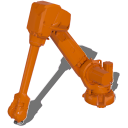       | [IRB 4600/40](irb4600-40.md)              | ABB                  | *Robotics arm*                    |
| 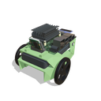           | [JetBot](jetbot.md)                       | NVIDIA               | *Two-wheeled robot*               |
|          | [Khepera I](khepera1.md)                  | K-Team               | *Two-wheeled robot*               |
| 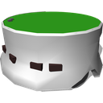         | [Khepera II](khepera2.md)                 | K-Team               | *Two-wheeled robot*               |
|          | [Khepera III](khepera3.md)                | K-Team               | *Two-wheeled robot*               |
| 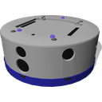         | [Khepera IV](khepera4.md)                 | K-Team               | *Two-wheeled robot*               |
| 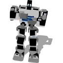          | [KHR-2HV](khr-2hv.md)                     | KONDO                | *Small size humanoid*             |
|           | [KHR-3HV](khr-3hv.md)                     | KONDO                | *Small size humanoid*             |
| 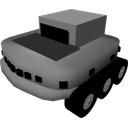            | [Koala](koala.md)                         | K-Team               | *Six-wheeled robot*               |
| 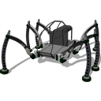           | [Mantis](mantis.md)                       | micromagic           | *Hexapod*                         |
|       | [Mavic 2 PRO](mavic-2-pro.md)             | DJI                  | *Quadcopter drone*                |
|          | [Microbot](microbot.md)                   | PICAXE               | *Two-wheeled robot*               |
| 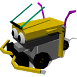       | [Mindstorms](mindstorms.md)               | Lego                 | *Robotics kit*                    |
| 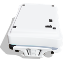           | [MiR100](mir100.md)                       | MiR                  | *Six-wheeled robot*               |
| 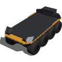            | [Moose](moose.md)                         | Clearpath Robotics   | *Eight-wheeled outdoor robot*     |
| 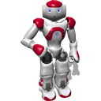              | [Nao](nao.md)                             | SoftBankics          | *Small size humanoid*             |
| 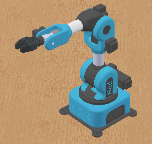              | [Ned](ned.md)                             | Niryo                | *Robotics arm*             |
| 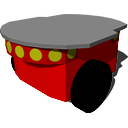         | [Pioneer 2](pioneer2.md)                  | Adept                | *Two-wheeled robot*               |
| 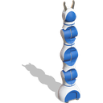           | [P-Rob 3](p-rob3.md)                      | F&P Robotics         | *Robotics arm*                    |
| 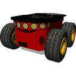      | [Pioneer 3-AT](pioneer-3at.md)            | Adept                | *Four-wheeled robot*              |
| 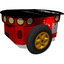      | [Pioneer 3-DX](pioneer-3dx.md)            | Adept                | *Two-wheeled robot*               |
|            | [Portal](portal.md)                       | A4                   | *Sliding portal*                  |
|               | [PR2](pr2.md)                             | Clearpath Robotics   | *Two arms on mobile a platform*   |
| 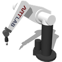             | [PUMA](puma.md)                           | Unimation            | *Robotics arm*                    |
| 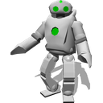             | [QRIO](qrio.md)                           | Sony                 | *Small size humanoid*             |
| 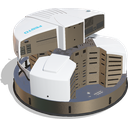        | [Robotino 3](robotino3.md)                | Festo                | *Three-wheeled (mecanum) robot*   |
| 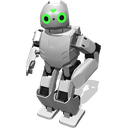      | [Robotis OP2](robotis-op2.md)             | Robotis              | *Small size humanoid*             |
| 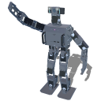      | [Robotis OP3](robotis-op3.md)             | Robotis              | *Small size humanoid*             |
|        | [Salamander](salamander.md)               | EPFL / BioRob        | *Bio-inspired robot*              |
| 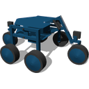           | [Shrimp](shrimp.md)                       | BlueBotics           | *Six-wheeled robot*               |
|         | [Sojourner](sojourner.md)                 | Nasa                 | *Six-wheeled robot*               |
| 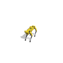             | [Spot](spot.md)                           | Boston Dynamics      | *Dog-like robot*                  |
| 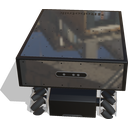  | [Summit-XL Steel](summit-xl-steel.md)     | Robotnik             | *Four-wheeled (mecanum) robot*    |
|          | [Surveyor SRV-1](surveyor.md)             | Surveyor Corporation | *Robot with two tracks*           |
|        | [TIAGo Base](tiago-base.md)               | PAL Robotics         | *Two-wheeled robot*               |
| 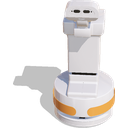       | [TIAGo Iron](tiago-iron.md)               | PAL Robotics         | *Two-wheeled human-like robot*    |
|       | [TIAGo Steel](tiago-steel.md)             | PAL Robotics         | *Two-wheeled human-like robot*    |
| 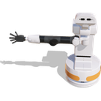   | [TIAGo Titanium](tiago-titanium.md)       | PAL Robotics         | *Two-wheeled human-like robot*    |
| 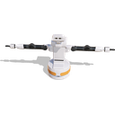          | [TIAGo++ ](tiagopp.md)                    | PAL Robotics         | *Two-wheeled human-like robot*    |
| 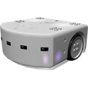          | [Thymio II](thymio2.md)                   | Mobsya               | *Two-wheeled robot*               |
|        | [Tinkerbots](tinkerbots.md)               | Kinematics GMBH      | *Robotics kit*                    |
| 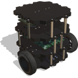 | [Turtlebot3 Burger](turtlebot3-burger.md) | Robotis              | *Two-wheeled robot*               |
| 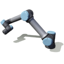              | [UR3e, UR5e and UR10e](ure.md)            | Universal Robots     | *Robotics arm*                    |
|             | [Yamor](yamor.md)                         | EPFL / BioRob        | *Modular robot*                   |
| 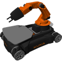           | [youBot](youbot.md)                       | KUKA                 | *Mobile arm*                      |
