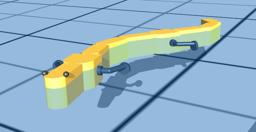

## BioRob Salamander

%robot salamander images/robots/salamander/model.thumbnail.png

The "Salamander" robot is a salamander-like robot developed by the [EPFL BioRob laboratory](https://biorob.epfl.ch/).

### Movie Presentation


### Salamander PROTO

Derived from [Robot](../reference/robot.md).

```
Salamander {
  SFVec3f    translation     0 0 0
  SFRotation rotation        0 1 0 0
  SFString   name            "Salamander"
  SFString   controller      "salamander"
  MFString   controllerArgs  []
  SFString   customData      ""
  SFBool     supervisor      FALSE
  SFBool     synchronization TRUE
  MFNode     extensionSlot   []
}
```

> **File location**: "WEBOTS\_HOME/projects/robots/epfl/biorob/protos/Salamander.proto"

#### Salamander Field Summary

- `extensionSlot`: Extends the robot with new nodes in the extension slot.

### Samples

You will find the following sample in this folder: "WEBOTS\_HOME/projects/robots/epfl/biorob/worlds".

#### salamander.wbt

 A salamander-shaped robot walks down a slope and reaches a pool where it starts to swim.
The controller uses two different types of locomotion: it walks on the ground and swims in the water.
This demo simulates propulsive forces caused by the undulations of the body and the resistance caused by the robot's shape.
In addition, the buoyancy of the robot's body is also simulated using Archimedes' principle.
