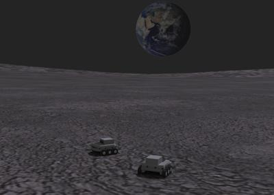

## Demos

This section provides a list of interesting worlds that broadly illustrate Webots capabilities.
Several of these examples have stemmed from research or teaching projects.
You will find the corresponding ".wbt" files in the "[WEBOTS\_HOME/projects/samples/demos/worlds]({{ url.github_tree }}/projects/samples/demos/worlds)" directory, and their controller source code in the "[WEBOTS\_HOME/projects/samples/demos/controllers]({{ url.github_tree }}/projects/samples/demos/controllers)" directory.
For each demo, the world file and its corresponding controller have the same name.

### [anaglyph.wbt]({{ url.github_tree }}/projects/samples/demos/worlds/anaglyph.wbt)

**Keywords**: Stereoscopic camera, anachrome red/cyan filters

 This example demonstrates the merge of two [Camera](../reference/camera.md) images into one, in order to create an [anaglyph image](https://en.wikipedia.org/wiki/Anaglyph_3D).
A stereoscopic camera is mounted on a `iRobot Create` robot.
At each step, both [Camera](../reference/camera.md) images are merged into a [Display](../reference/display.md) device, one is filtered in red, and the other one is filtered in cyan.
This produces an anaglyph 3D image that can be seen with low cost red/cyan 3D glassed.

### [gantry.wbt]({{ url.github_tree }}/projects/samples/demos/worlds/gantry.wbt)

**Keywords**: Gantry robot, gripper, Hanoi towers, linear motors, recursive algorithm

 In this example, a gantry robot plays "Towers of Hanoi" by stacking three colored boxes.
The gantry robot is modeled using a combination of [LinearMotor](../reference/linearmotor.md) and [RotationalMotor](../reference/rotationalmotor.md) devices.
A recursive algorithm is used to solve the Hanoi Towers problem.

### [hexapod.wbt]({{ url.github_tree }}/projects/samples/demos/worlds/hexapod.wbt)

**Keywords**: Legged robot, alternating tripod gait, linear motor

 In this example, an insect-shaped robot is made of a combination of [LinearMotor](../reference/linearmotor.md) and [RotationalMotor](../reference/rotationalmotor.md) devices.
The robot moves using an alternating tripod gait.

### [moon.wbt]({{ url.github_tree }}/projects/samples/demos/worlds/moon.wbt)

**Keywords**: differential wheels, Koala, keyboard, texture

 In this example, two Koala robots (K-Team) circle on a moon-like surface.
You can modify their trajectories with the arrow keys on your keyboard.
The moon-like scenery is made of [IndexedFaceSet](../reference/indexedfaceset.md) nodes.
Both robots use the same controller code.

### [soccer.wbt]({{ url.github_tree }}/projects/samples/demos/worlds/soccer.wbt)

**Keywords**: Soccer, supervisor, differential wheels, label

 In this example, two teams of simple robots play soccer.
A [Supervisor](../reference/supervisor.md) controller is used as the referee; it counts the goals and displays the current score and the remaining time in the 3D view.
This example shows how a [Supervisor](../reference/supervisor.md) controller can be used to read and change the position of objects.

### [stewart\_platform.wbt]({{ url.github_tree }}/projects/samples/demos/worlds/stewart_platform.wbt)

**Keywords**: Stewart platform, linear motion, physics plugin, ball joint, universal joint

 This is an example of a *Stewart platform*.
A Stewart platform is a kind of parallel manipulator that uses an octahedral assembly of linear actuators.
It has six degrees of freedom (*x*, *y*, *z*, pitch, roll, and yaw).
In this example, the Stewart platform is loaded with a few stacked boxes, then the platform moves and the boxes stumble apart.
This simulation attaches both ends of the linear actuators (hydraulic pistons) to the lower and the upper parts of the Stewart platform.
