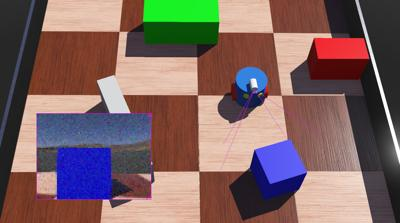
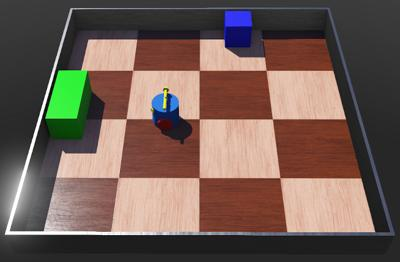
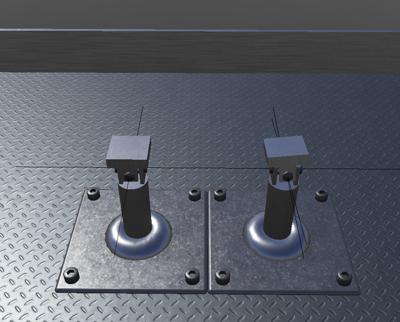
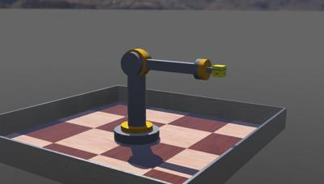
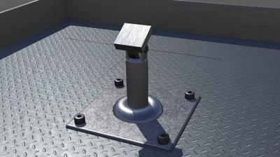
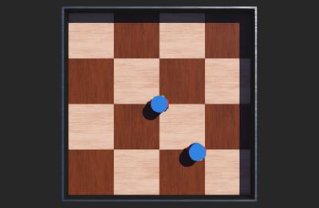
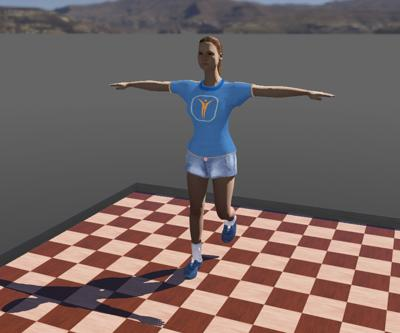
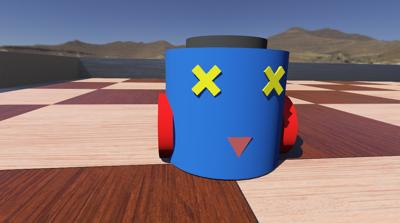
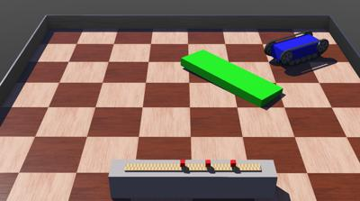

## Devices

The "[WEBOTS\_HOME/projects/samples/devices]({{ url.github_tree }}/projects/samples/devices/)" directory contains Webots worlds that individually demonstrate the Webots devices and their API.

The world files are located in the "[WEBOTS\_HOME/projects/samples/devices/worlds]({{ url.github_tree }}/projects/samples/devices/worlds/)" directory, and their controllers in the "[WEBOTS\_HOME/projects/samples/devices/controllers]({{ url.github_tree }}/projects/samples/devices/controllers/)" directory.
The world files and the corresponding controllers are named according to the device they demonstrate.

Most of the devices below use a simple two-wheeled blue robot called MyBot moving in a closed square arena containing obstacles (see [figure below](#mybot-in-a-squared-arena)).

The studied devices are attached on this robot.
`MyBot` moves and avoid obstacles using two [DistanceSensors](../reference/distancesensor.md) and a technique based on Braitenberg vehicles.

%figure "MyBot in a squared arena."

%end

### [accelerometer.wbt]({{ url.github_tree }}/projects/samples/devices/worlds/accelerometer.wbt)

**Keywords**: [Robot](../reference/robot.md), [Accelerometer](../reference/accelerometer.md)

 In this example, the robot turns on a slope.
Its [Accelerometer](../reference/accelerometer.md) sensor is used to switch on the bottommost LED.

### [altimeter.wbt]({{ url.github_tree }}/projects/samples/devices/worlds/altimeter.wbt)

**Keywords**: [Robot](../reference/robot.md), [Altimeter](../reference/altimeter.md)

 In this example, the robot moves on a slope.
Its [Altimeter](../reference/altimeter.md) sensor is used to switch direction when the robot is close to the slope's border.

### [battery.wbt]({{ url.github_tree }}/projects/samples/devices/worlds/battery.wbt)

**Keywords**: [Robot](../reference/robot.md), [Charger](../reference/charger.md), battery

 In this example, `MyBot` moves in a closed arena filled with obstacles.
The energy consumed by the wheel motors slowly discharges the robot's battery.
When the battery level reaches zero, the robot is powered off and stops moving.
In order to remain powered, the robot must recharge its battery at energy chargers.
[Chargers](../reference/charger.md) are represented by the semi-transparent colored cylinders in the four corners of the arena.
Only a full charger can recharge the robot's battery.
The color of a charger changes with its energy level: it is red when completely empty and green when completely full.

### [brake.wbt]({{ url.github_tree }}/projects/samples/devices/worlds/brake.wbt)

**Keywords**: [Robot](../reference/robot.md), [Brake](../reference/brake.md)

 In this example, a bike wheel turns until it is slowed down by a braking system.
The red blocks graphically represent the braking system, but the wheel is actually braked using the [Brake](../reference/brake.md) device.

### [bumper.wbt]({{ url.github_tree }}/projects/samples/devices/worlds/bumper.wbt)

**Keywords**: [TouchSensor](../reference/touchsensor.md), bumper

 In this example, `MyBot` moves in a closed arena filled with obstacles.
Its "bumper" [TouchSensor](../reference/touchsensor.md) (represented by a black box) detects collisions.
`MyBot` moves back and turns a little each time a collision is detected.

### [camera.wbt]({{ url.github_tree }}/projects/samples/devices/worlds/camera.wbt)

**Keywords**: [Camera](../reference/camera.md), image processing, RGB pixel, Camera noise, PNG, ANSI

 In this example, `MyBot` uses a camera to detect colored objects.
The robot analyzes the RGB color level of each pixel of the camera images.
When it has detected something, it turns, stops for a few seconds and saves the image in a PNG file to the user directory.
It also prints a colored message (using ANSI codes) in the `Console` explaining the type of object it has detected.
White noise is applied on the [Camera](../reference/camera.md).

### [camera\_auto\_focus.wbt]({{ url.github_tree }}/projects/samples/devices/worlds/camera_auto_focus.wbt)

**Keywords**: [Camera](../reference/camera.md), autofocus, depth-of-field

 In this example, `MyBot` demonstrates a [Camera](../reference/camera.md) with autofocus.
The robot uses a [DistanceSensor](../reference/distancesensor.md) to get the distance to the front object and adjusts the [Camera](../reference/camera.md) focal length accordingly.
The objects displayed before or after this distance are blurred.

### [camera\_motion\_blur.wbt]({{ url.github_tree }}/projects/samples/devices/worlds/camera_motion_blur.wbt)

**Keywords**: [Camera](../reference/camera.md), motion blur

 In this example, `MyBot` demonstrates the camera motion blur effect.
The motion blur response time is given by the `Camera.motionBlur` field.

### [camera\_noise\_mask.wbt]({{ url.github_tree }}/projects/samples/devices/worlds/camera_noise_mask.wbt)

**Keywords**: [Camera](../reference/camera.md), noise mask

 In this example, `MyBot` demonstrates noise effect based on noise mask.
The noise mask is determined by the `Camera.noiseMaskUrl` field.

### [camera\_recognition.wbt]({{ url.github_tree }}/projects/samples/devices/worlds/camera_recognition.wbt)

**Keywords**: [Camera](../reference/camera.md), pattern recognition, smart camera

 In this example, `MyBot` demonstrates object recognition capabilities.
The robot camera displays yellow rectangles around the recognized objects.
Information about the objects currently recognized are displayed in the `Console`.
The camera recognizes [Solid](../reference/solid.md) nodes whose `recognitionColors` field is not empty.

### [camera\_segmentation.wbt]({{ url.github_tree }}/projects/samples/devices/worlds/camera_segmentation.wbt)

**Keywords**: [Camera](../reference/camera.md), pattern recognition, image segmentation, smart camera

 In this example, `MyBot` demonstrates image segmentation capabilities based on the [Camera](../reference/camera.md) recognition functionality.
The computed segmented image is shown in the [Display](../reference/display.md) overlay (cyan border) in the 3D scene.
The [Camera](../reference/camera.md) overlay (magenta border) in the 3D scene depicts the original camera image on the back and the recognized objects with segmentation color and yellow bounding box on the front.

### [compass.wbt]({{ url.github_tree }}/projects/samples/devices/worlds/compass.wbt)

**Keywords**: [Compass](../reference/compass.md)

 In this example, `MyBot` moves in a closed arena filled with obstacles.
The robot is equipped with a yellow motorized needle which always indicates towards the north.
The north direction is computed using a [Compass](../reference/compass.md) node.

### [connector.wbt]({{ url.github_tree }}/projects/samples/devices/worlds/connector.wbt)

**Keywords**: [Connector](../reference/connector.md), [RotationalMotor](../reference/rotationalmotor.md), [IndexedLineSet](../reference/indexedlineset.md)

 In this example, a light `MyBot` (light blue) is lifted over two heavier `MyBot`s (dark blue).
All three robots are equipped with a [Connector](../reference/connector.md) placed at the tip of a moveable handle ([HingeJoint](../reference/hingejoint.md)).
An [IndexedLineSet](../reference/indexedlineset.md) is added to every [Connector](../reference/connector.md) in order to show the axes.
When the simulation starts, the light robot approaches the first heavy robot and their connectors dock to one another.
Then both robots rotate their handles simultaneously, hence the light robot gets lifted over the heavy one.
Then the light robot gets passed over another time by the second heavy robot and so on...
All the robots in this simulation use the same controller; the different behaviors are selected according to the robot's name.

### [coupled\_motors.wbt]({{ url.github_tree }}/projects/samples/devices/worlds/coupled_motors.wbt)

**Keywords**: [Motor](../reference/motor.md), coupled motor, multiplier

 In this example is showcased the usage of coupled motors in a gripper.
Although the gripper itself is comprised of two actuators (one for each finger), in practice only one of them is commanded in the controller.
Coupled motors are obtained when two or more motors belonging to the same robot share the same name structure.
By attributing a `multiplier` of -1 to the second motor, the motion is reversed.
Additional information concerning coupled motors and the rules surrounding it are available in the [Motor](../reference/motor.md#coupled-motors) reference page.

### [display.wbt]({{ url.github_tree }}/projects/samples/devices/worlds/display.wbt)

**Keywords**: [Display](../reference/display.md), write in textures, overlay

 This example demonstrates several uses of the [Display](../reference/display.md) device.

- The `MyBot` [Display](../reference/display.md) called "emoticon_display" is displayed as a 2D overlay on top of the 3D window, and is displayed as a texture on the screen mounted on the `MyBot`.
It loads the [emoticons.png]({{ url.github_tree }}/projects/samples/devices/controllers/display/emoticons.png) image which contains a grid of emoticons (as a sprite sheet), and randomly selects an emoticon from this image every 30 steps.
- The `MyBot` [Display](../reference/display.md) called "camera_display" is displayed as a 2D overlay on top of the 3D window.
It copies the [Camera](../reference/camera.md) image, and draws a yellow rectangle and text over it where yellow pixels are detected.
- The [Robot](../reference/robot.md) [Display](../reference/display.md) called "ground display" is displayed as a texture on the floor.
The [Supervisor](../reference/supervisor.md) controller get the position of `MyBot` and draws a green dot at this location.

### [distance\_sensor.wbt]({{ url.github_tree }}/projects/samples/devices/worlds/distance_sensor.wbt)

**Keywords**: [DistanceSensor](../reference/distancesensor.md), Braitenberg

 In this example, eight [DistanceSensors](../reference/distancesensor.md) are mounted at regular intervals around the `MyBot` body.
The robot avoids obstacles using a technique based on Braitenberg vehicles.

### [emitter\_receiver.wbt]({{ url.github_tree }}/projects/samples/devices/worlds/emitter_receiver.wbt)

**Keywords**: [Emitter](../reference/emitter.md), [Receiver](../reference/receiver.md), infra-red transmission

 In this example, there are two robots: one is equipped with an [Emitter](../reference/emitter.md) and the other one with a [Receiver](../reference/receiver.md).
Both robots move among the obstacles while the *emitter* robot sends messages to the *receiver* robot.
The range of the [Emitter](../reference/emitter.md) device is indicated by the radius of the transparent gray sphere around the emitter robot.
The state of the communication between the two robots is displayed in the Console.
You can observe this when the *receiver* robot enters the *emitter*'s sphere while no direct obstacle is present on the route, then the communication is established, otherwise the communication is interrupted.
Note that the communication between "infra-red" [Emitters](../reference/emitter.md) and [Receivers](../reference/receiver.md) can be blocked by an obstacle, this is not the case with "radio" [Emitters](../reference/emitter.md) and [Receivers](../reference/receiver.md).

### [encoders.wbt]({{ url.github_tree }}/projects/samples/devices/worlds/encoders.wbt)

**Keywords**: [PositionSensor](../reference/positionsensor.md), encoders

 This example demonstrates the usage of the wheel encoders of two-wheeled robots.
The controller randomly chooses target encoder positions, then it rotates its wheels until the encoder values reach the chosen target position.
Then the encoders are reset and the controller chooses new random values.
[PositionSensor](../reference/positionsensor.md) nodes applied on [HingeJoint](../reference/hingejoint.md) nodes model the encoders.
The robot does not pay any attention to obstacles.

### [force\_sensor.wbt]({{ url.github_tree }}/projects/samples/devices/worlds/force_sensor.wbt)

**Keywords**: [TouchSensor](../reference/touchsensor.md), force sensor

 This example is nearly the same as [bumper.wbt](#bumper-wbt).
The only difference is that this robot uses a "force" [TouchSensor](../reference/touchsensor.md) instead of a "bumper".
So this robot can measure the force of each collision, which is printed in the `Console`.

### [force3d\_sensor.wbt]({{ url.github_tree }}/projects/samples/devices/worlds/force3d_sensor.wbt)

**Keywords**: [TouchSensor](../reference/touchsensor.md), 3D force sensor

 This example demonstrates how to use a 3D force sensor.
The opaque box in the center of the transparent one is a [Robot](../reference/robot.md) node.
The [TouchSensor](../reference/touchsensor.md) is the child of the [Robot](../reference/robot.md) node.
This setup allow to measure the force on the six sides of the [TouchSensor](../reference/touchsensor.md).
The resulting force vector is displayed in the `Console`.
Moving and rotating the box will change the displayed force.

### [gps.wbt]({{ url.github_tree }}/projects/samples/devices/worlds/gps.wbt)

**Keywords**: [GPS](../reference/gps.md), keyboard, get robot position

 This example shows two different techniques to find the current position of `MyBot`.
The first technique consists in using an on-board [GPS](../reference/gps.md) device.
The second method uses a [Supervisor](../reference/supervisor.md) controller that reads and transmits the position info to the robot.
Note that a [Supervisor](../reference/supervisor.md) controller can read (or change) the position of any object in the simulation at any time.
This example implements both techniques, and you can choose either one or the other with the keyboard.
The <kbd>G</kbd> key prints the robot's [GPS](../reference/gps.md) device position.
The <kbd>S</kbd> key prints the position read by the [Supervisor](../reference/supervisor.md) controller.

### [gps\_lat\_long.wbt]({{ url.github_tree }}/projects/samples/devices/worlds/gps_lat_long.wbt)

**Keywords**: [GPS](../reference/gps.md), WGS84, Latitude-Longitude

 This example shows how to set a `WGS84` reference, and how to retrieve the robot's `WGS84` latitude and longitude in this reference.
The reference is set in the `WorldInfo.gpsCoordinateSytem` and `WorldInfo.gpsReference`.
The resulting position is displayed in the `Console` at each step.

### [gyro.wbt]({{ url.github_tree }}/projects/samples/devices/worlds/gyro.wbt)

**Keywords**: [Gyro](../reference/gyro.md), angular velocity

 This example shows how to measure angular velocity.
A [Gyro](../reference/gyro.md) is mounted on three rotational motors (each motor corresponds to one axis).
The motors a running consecutively for a while.
The resulting angular velocity measured by the gyro is displayed in the `Console`.

### [hinge\_joint\_with\_backlash.wbt]({{ url.github_tree }}/projects/samples/devices/worlds/hinge_joint_with_backlash.wbt)

**Keywords**: Backlash, [HingeJoint](../reference/hingejoint.md)

 This example shows how to use [HingeJointWithBacklash](https://webots.cloud/run?url={{ url.github_tree }}/projects/joints/protos/HingeJointWithBacklash.proto).
The shape of the rotor and shaft of the motor are described in the `startPoint` field whereas the `endPoint` refers to the blue shaft.
When the rotor is motorized, the output axis lags behind due to the effect of backlash intrinsic to the gear train, which is represented by the black cylinder.

### [hinge\_2\_joint\_with\_backlash.wbt]({{ url.github_tree }}/projects/samples/devices/worlds/hinge_2_joint_with_backlash.wbt)

**Keywords**: Backlash, [Hinge2Joint](../reference/hinge2joint.md)

 This example shows how to use [Hinge2JointWithBacklash](https://webots.cloud/run?url={{ url.github_tree }}/projects/joints/protos/Hinge2JointWithBacklash.proto).
The left side robot uses a classic [Hinge2Joint](../reference/hinge2joint.md) whereas the right side one uses [Hinge2JointWithBacklash](https://webots.cloud/run?url={{ url.github_tree }}/projects/joints/protos/Hinge2JointWithBacklash.proto) with a large backlash.
Given the added joint play, in the presence of gravity, at rest the end-point is unstable and therefore slumps down compared to the case without backlash.
In a real scenario, this is analogous to having a large clearance in between the driving and driven gear.

### [hokuyo.wbt]({{ url.github_tree }}/projects/samples/devices/worlds/hokuyo.wbt)

**Keywords**: Hokuyo, [Lidar](../reference/lidar.md), [Display](../reference/display.md) plot

 This example shows how to use [Lidars](../reference/lidar.md) and plot their depth output on a [Display](../reference/display.md) device.
Two `Hokuyo` [Lidars](../reference/lidar.md) are mounted on the `MyBot`.
At each step, the lidars are updated, and their depth output are displayed in distinct [Displays](../reference/display.md).

### [imu.wbt]({{ url.github_tree }}/projects/samples/devices/worlds/imu.wbt)

**Keywords**: [Accelerometer](../reference/accelerometer.md), [Gyro](../reference/gyro.md), [Compass](../reference/compass.md), [InertialUnit](../reference/inertialunit.md), IMU, roll/pitch/yaw angles

 This example demonstrates the difference between [InertialUnit](../reference/inertialunit.md) measurements and the fusion of multiple sensors of an IMU ([Accelerometer](../reference/accelerometer.md), [Gyro](../reference/gyro.md) and [Compass](../reference/compass.md)) to estimate the attitude (roll, pitch and yaw angles).
The sensors are mounted on a 3 DOF (Degrees Of Freedom) arm which moves from one random target to another.
After the 100th target is reached, the attitude is compared between the ground truth ([InertialUnit](../reference/inertialunit.md)), absolute estimation ([Accelerometer](../reference/accelerometer.md) and [Compass](../reference/compass.md)) and relative estimation ([Gyro](../reference/gyro.md)).
The drift on relative estimation is clearly visible.

### [inertial\_unit.wbt]({{ url.github_tree }}/projects/samples/devices/worlds/inertial_unit.wbt)

**Keywords**: [InertialUnit](../reference/inertialunit.md), roll/pitch/yaw angles

 This example demonstrates the use of an [InertialUnit](../reference/inertialunit.md) device.
An [InertialUnit](../reference/inertialunit.md) is mounted on a 3 DOF (Degrees Of Freedom) arm which moves from one random target to another.
Each time a target is reached, the absolute roll, pitch and yaw angles of the [InertialUnit](../reference/inertialunit.md) are displayed in the `Console`.

### [laser\_pointer.wbt]({{ url.github_tree }}/projects/samples/devices/worlds/laser_pointer.wbt)

**Keywords**: [DistanceSensor](../reference/distancesensor.md), laser

 This example demonstrates the use of [DistanceSensor](../reference/distancesensor.md) devices in laser mode.
`MyBot` turns round with two laser pointers enabled.
Red dots are displayed where the laser beam hits obstacles.

### [led.wbt]({{ url.github_tree }}/projects/samples/devices/worlds/led.wbt)

**Keywords**: [LED](../reference/led.md)

 In this example, `MyBot` moves while randomly changing the color of three [LEDs](../reference/led.md) on the top of its body.
Each [LED](../reference/led.md)'s material emissive color and embedded [PointLight](../reference/pointlight.md) are modified accordingly.
The color choice is printed in the `Console`.

### [lidar.wbt]({{ url.github_tree }}/projects/samples/devices/worlds/lidar.wbt)

**Keywords**: [Lidar](../reference/lidar.md)

 In this example, `MyBot` demonstrates the use of a [Lidar](../reference/lidar.md) device.
The [Lidar](../reference/lidar.md) mounted on the `MyBot` scans the environment.
The [Lidar](../reference/lidar.md) point cloud can be shown by enabling the `View / Optional Rendering / Show Lidar Point Cloud`.

### [light\_sensor.wbt]({{ url.github_tree }}/projects/samples/devices/worlds/light_sensor.wbt)

**Keywords**: [LightSensor](../reference/lightsensor.md)

 In this example, `MyBot` uses two [LightSensors](../reference/lightsensor.md) to follow a light source.
The light source can be moved with the mouse; the robot will follow it.

### [linear\_motor.wbt]({{ url.github_tree }}/projects/samples/devices/worlds/linear_motor.wbt)

**Keywords**: [LinearMotor](../reference/linearmotor.md), set motor position

 In this example, a linear motor from position `0` and then progresses by steps of `2 [cm]` until it reaches `20 [cm]`.
Once done, it comes back to position `0` and restarts.
A ruler indicates the linear motor progression.

### [motor.wbt]({{ url.github_tree }}/projects/samples/devices/worlds/motor.wbt)

**Keywords**: [RotationalMotor](../reference/rotationalmotor.md), force control, energy consumption

 In this example, a rotational motor is controlled in force mode to push a cardboard.
The force feedback applied on the motor and the energy consumed by the robot are displayed in the `Console`.

### [motor2.wbt]({{ url.github_tree }}/projects/samples/devices/worlds/motor2.wbt)

**Keywords**: [RotationalMotor](../reference/rotationalmotor.md), [Hinge2Joint](../reference/hinge2joint.md)

 In this example, two rotational motors are controlling a [Hinge2Joint](../reference/hinge2joint.md) in position.

### [motor3.wbt]({{ url.github_tree }}/projects/samples/devices/worlds/motor3.wbt)

**Keywords**: [RotationalMotor](../reference/rotationalmotor.md), [BallJoint](../reference/balljoint.md)

 In this example, three rotational motors are controlling a [BallJoint](../reference/balljoint.md) in position.

### [pen.wbt]({{ url.github_tree }}/projects/samples/devices/worlds/pen.wbt)

**Keywords**: [Pen](../reference/pen.md), keyboard

 In this example, `MyBot` uses a [Pen](../reference/pen.md) device to draw on the floor.
The controller randomly chooses the ink color.
The ink on the floor fades slowly.
Use the `Y` and `X` keys to switch the [Pen](../reference/pen.md) on and off.

### [position\_sensor.wbt]({{ url.github_tree }}/projects/samples/devices/worlds/position_sensor.wbt)

**Keywords**: [PositionSensor](../reference/positionsensor.md), force control

 In this example, `MyBot` uses a [PositionSensor](../reference/positionsensor.md) to maintain a red log in balance.

### [propeller.wbt]({{ url.github_tree }}/projects/samples/devices/worlds/propeller.wbt)

**Keywords**: [Propeller](../reference/propeller.md), rotors, fan

 In this example, 3 helicopters with different designs demonstrate the use of the `Propeller` node.

- *Red helicopter*: It is composed of axial and tail rotors.
- *Green helicopter*: It is composed of 2 coaxial rotors.
- *Blue helicopter*: It is composed of a single axial rotor.

### [radar.wbt]({{ url.github_tree }}/projects/samples/devices/worlds/radar.wbt)

**Keywords**: [Radar](../reference/radar.md)

 In this example, the `MyBot` with the black box detects the `MyBot`s with red boxes.
The black box is a [Radar](../reference/radar.md) device, while the red boxes are [Solids](../reference/solid.md) with a positive `radarCrossSection` (this is required to be detected by the [Radar](../reference/radar.md)).

### [range\_finder.wbt]({{ url.github_tree }}/projects/samples/devices/worlds/range_finder.wbt)

**Keywords**: [RangeFinder](../reference/rangefinder.md)

 In this example, `MyBot` uses a [RangeFinder](../reference/rangefinder.md) to avoid obstacles.
The [RangeFinder](../reference/rangefinder.md) measures the distance to objects, so the robot knows if there is enough room to move forward or not.

### [receiver\_noise.wbt]({{ url.github_tree }}/projects/samples/devices/worlds/receiver_noise.wbt)

**Keywords**: [Receiver](../reference/receiver.md), signal strength, direction noise

 In this example, the `MyBot` at the center uses its [Receiver](../reference/receiver.md) device to get the [Emitter](../reference/emitter.md) device position of the other `MyBot`.
This noisy position is compared to the actual [Emitter](../reference/emitter.md) position measured with a noise-free [GPS](../reference/gps.md).

### [sick.wbt]({{ url.github_tree }}/projects/samples/devices/worlds/sick.wbt)

**Keywords**: [Sick LMS 291](https://webots.cloud/run?url={{ url.github_tree }}/projects/devices/sick/protos/SickLms291.proto), [Lidar](../reference/lidar.md), 3-wheeled robot, lidar plot

 In this example, a 3-wheeled robot mounted with a `Sick LMS 291` lidar sensor moves through an area with obstacles.
The robot use the lidar depth output to avoid collisions.
The lidar depth output is also plot into a [Display](../reference/display.md) device.

### [sick\_point\_cloud.wbt]({{ url.github_tree }}/projects/samples/devices/worlds/sick_point_cloud.wbt)

**Keywords**: [Sick LD MRS](https://webots.cloud/run?url={{ url.github_tree }}/projects/devices/sick/protos/SickLdMrs.proto), [Lidar](../reference/lidar.md), cloud point

 Soda cans are transported on a conveyor belt.
A static robot equipped with a Sick LD-MRS uses the Point Cloud API to count the number of cans in front of it.

### [skin.wbt]({{ url.github_tree }}/projects/samples/devices/worlds/skin.wbt)

**Keywords**: [Skin](../reference/skin.md) animation

 In this example, a human rigged model is animated using the [Skin](../reference/skin.md) device.
In this case the animation is purely graphical and just the left leg bone orientation and the root bone position are modified by the controller.

### [speaker.wbt]({{ url.github_tree }}/projects/samples/devices/worlds/speaker.wbt)

**Keywords**: [Speaker](../reference/speaker.md), WAV

 In this example, a [Speaker](../reference/speaker.md) device is mounted on the `MyBot`.
A WAV file is played on this speaker, while the `MyBot` is moving over the camera.
The intensity of the left and right audio channels differs depending on the robot position.
The Webots sound should be enabled to hear the result on the computer loudspeakers.

### [speaker\_text\_to\_speech.wbt]({{ url.github_tree }}/projects/samples/devices/worlds/speaker_text_to_speech.wbt)

**Keywords**: [Speaker](../reference/speaker.md), text-to-speech, TTS

 In this example, a [Speaker](../reference/speaker.md) device is mounted on the `MyBot`.
A text formated in XML is played in this speaker.
This text is containing voice modulations including pitch, rate and volume modifications.
The Webots sound should be enabled to hear the result on the computer loudspeakers.

### [spherical\_camera.wbt]({{ url.github_tree }}/projects/samples/devices/worlds/spherical_camera.wbt)

**Keywords**: [Camera](../reference/camera.md), spherical projection

 In this example, a spherical [Camera](../reference/camera.md) device is mounted on the `MyBot`.
The resulting projection is shown in a 2D camera overlay.

### [supervisor.wbt]({{ url.github_tree }}/projects/samples/devices/worlds/supervisor.wbt)

**Keywords**: [Supervisor](../reference/supervisor.md), queries on scene tree

 This example shows basic operations of a [Supervisor](../reference/supervisor.md) controller.
The [Supervisor](../reference/supervisor.md) controller starts with displaying the names of the scene tree root nodes.
Then it displays the content of the `WorldInfo.gravity` field.
After two seconds, it moves the [PointLight](../reference/pointlight.md), and then after two more seconds it imports a transformed [Sphere](../reference/sphere.md).
Finally, it moves the [Sphere](../reference/sphere.md) in a circle.

### [track.wbt]({{ url.github_tree }}/projects/samples/devices/worlds/track.wbt)

**Keywords**: [Track](../reference/track.md), caterpillar track, conveyor belt

 This example shows two use cases of the [Track](../reference/track.md) node.
The [Track](../reference/track.md) node is used to model two caterpillar tracks, and a conveyor belt.
