## Environments

This section shows some of the possible environments and objects available in Webots inside composed scenes.
Webots objects are modular and parametrizable, so other environments can be created simply, starting from these examples.
The world files for these examples are located in the "[WEBOTS\_HOME/projects/sample/environments/]({{ url.github_tree }}/projects/samples/environments/)" directory.

Outdoor and urban environments located in the "[WEBOTS\_HOME/projects/vehicles/worlds]({{ url.github_tree }}/projects/vehicles/worlds)" and are not shown here.

In this directory, you will find the following world files:

### [apartment.wbt]({{ url.github_tree }}/projects/samples/environments/indoor/worlds/apartment.wbt)

**Keywords**: Apartment, domestic environment, furniture

%figure "Screenshots of the apartment environment."

|     |     |
|:---:|:---:|
| 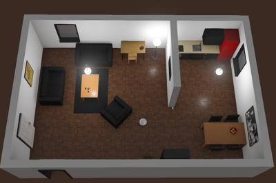 | 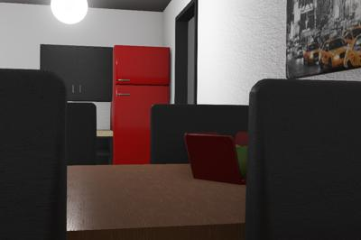 |
|  |  |

%end

This example shows a possible layout for some of the domestic objects included in Webots.
These objects are Webots PROTO nodes, and can be easily moved and resized to create other apartment layouts.
The kitchen and doors are interactive.
This means that a robot could open a drawer, leave an object inside it, and close it.
Light objects such as the books on the shelf or the fruits in the basket can be grabbed by a robot.
An e-puck robot patrols on the table and an iRobot Create robot cleans the ground.

### [break\_room.wbt]({{ url.github_tree }}/projects/samples/environments/indoor/worlds/break_room.wbt)

**Keywords**: Break room, domestic environment, furniture

%figure "Screenshots of the break room environment."

|     |     |
|:---:|:---:|
|  | 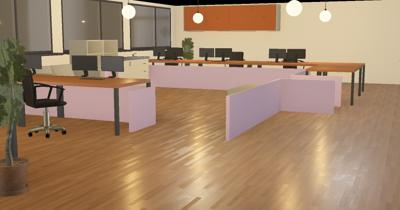 |
|  |  |

%end

This example shows an office break room using the domestic objects included in Webots.
These objects are Webots PROTO nodes, and can be easily moved and resized to create other apartment layouts.
Doors are interactive.
This means that a robot can open a drawer, leave an object inside it, and close it.

### [complete\_apartment.wbt]({{ url.github_tree }}/projects/samples/environments/indoor/worlds/complete_apartment.wbt)

**Keywords**: Apartment, household environment, furniture

%figure "Screenshots of the complete apartment environment."

|     |     |
|:---:|:---:|
| 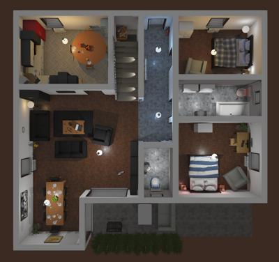 | 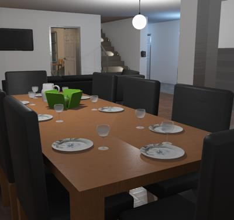 |
| 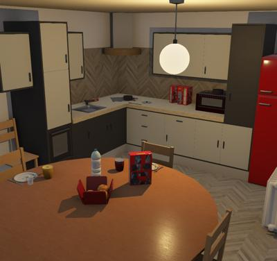 |  |

%end

This example is similar to the previous one but the apartement is more complete, it also contains two bedrooms, one bathroom, one restroom, stairs and a balcony.

> **Note**: This model was sponsored by Kamal Othman & Prof. Ahmad Rad from AISL-SFU

### [factory.wbt]({{ url.github_tree }}/projects/samples/environments/factory/worlds/factory.wbt)

**Keywords**: Factory, workbench, tools, industrial pipes, industrial stairs

%figure "Screenshots of the factory environment."

|     |     |
|:---:|:---:|
| 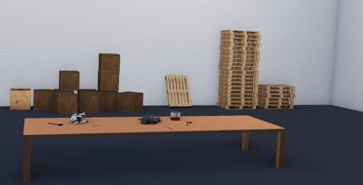 | 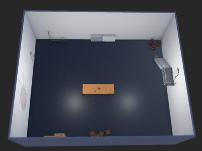 |

%end

This example shows a possible layout for some of the industrial objects included in Webots.
These objects are Webots PROTO nodes, and can be easily moved and resized to create other factory layouts.
The tools and valves are interactive.
This means that a robot could grab a hammer, or turn a valve handle.

### [hall.wbt]({{ url.github_tree }}/projects/samples/environments/factory/worlds/hall.wbt)

**Keywords**: hall, workbench, tools, industrial pipes, industrial stairs

%figure "Screenshots of the hall environment."

|     |     |
|:---:|:---:|
| 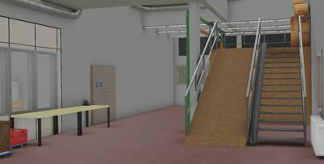 | 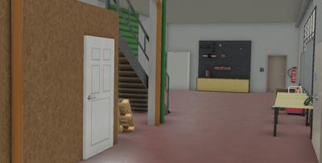 |
| 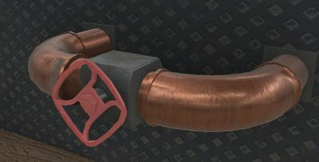 | 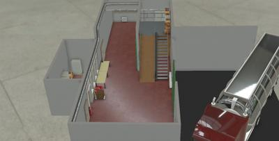 |

%end

This example uses some of the industrial objects included in Webots to create a factory hall.
These objects are Webots PROTO nodes, and can be easily moved and resized to create other configurations.
The tools, valves and doors are interactive.
This means that a robot could grab a hammer, turn a valve handle, climb the stairs or open a door.

This environment is sponsored by the [ROSin european project](http://rosin-project.eu/ftp/cross-platform-ros-simulation-for-mobile-manipulators).

### [kitchen.wbt]({{ url.github_tree }}/projects/samples/environments/indoor/worlds/kitchen.wbt)

**Keywords**: kitchen, utensil

 This example shows a kitchen created by using some of the domestic objects included in Webots.
These objects are Webots PROTO nodes, and can be easily moved and resized to create other kitchen layouts.
A robot can interact with the kitchen utensils, the glasses, the bottles, the plates, the pans or the food.
The shelves doors and drawers are also interactive.
