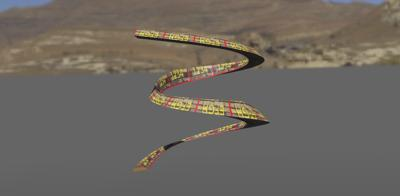
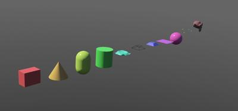
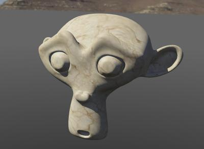
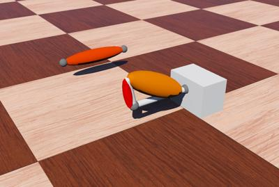
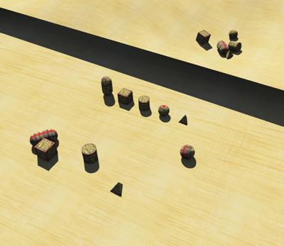
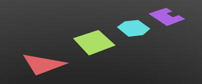
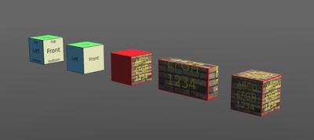

## Geometries

This section shows the geometric primitives available in Webots.
The world files for these examples are located in the "[WEBOTS\_HOME/sample/geometries/worlds]({{ url.github_tree }}/projects/samples/geometries/worlds/)" directory.

In this directory, you will find the following world files :

### [extended\_solids.wbt]({{ url.github_tree }}/projects/samples/geometries/worlds/extended_solids.wbt)

**Keywords**: Extended solids, torus, rounded box, pipe

 This example demonstrates the use of several extended primitives.
These compound primitives are created using procedural PROTO nodes that generate a set of basic Geometry nodes.

In this example, physics laws are applied on these primitives.

### [extrusion.wbt]({{ url.github_tree }}/projects/samples/geometries/worlds/extrusion.wbt)

**Keywords**: Extrusion

 This example demonstrates the use of the `Extrusion` PROTO.
The `Extrusion` PROTO is a procedural PROTO which generates an [IndexedFaceSet](../reference/indexedfaceset.md) node.
The `Extrusion` PROTO fields allow to define a 2D cross-section, and to extrude it along a path.
In this example, the cross-section is a triangle extruded along a spiral path.

### [floating\_geometries.wbt]({{ url.github_tree }}/projects/samples/geometries/worlds/floating_geometries.wbt)

**Keywords**: Fluid simulation

 This example demonstrates the interactions between basic physics primitives and fluids.
Three [Fluid](../reference/fluid.md) nodes are present; two flowing fluids to simulate a river, and a static fluid to simulate a cylindric pool.
The small [Solids](../reference/solid.md) are affected by the fluids' viscosity and by forces generated on the [Archimedes' principle](https://en.wikipedia.org/wiki/Archimedes%27_principle).

### [geometric\_primitives.wbt]({{ url.github_tree }}/projects/samples/geometries/worlds/geometric_primitives.wbt)

**Keywords**: [Box](../reference/box.md), [Capsule](../reference/capsule.md), [Cone](../reference/cone.md), [Cylinder](../reference/cylinder.md), [ElevationGrid](../reference/elevationgrid.md), [IndexedLineSet](../reference/indexedlineset.md), [IndexedFaceSet](../reference/indexedfaceset.md), [Plane](../reference/plane.md), [Sphere](../reference/sphere.md)

 This example demonstrates the geometric primitives natively supported in Webots.
The primitives are inserted into [Pose](../reference/pose.md) and [Shape](../reference/shape.md) nodes.
Therefore they are static, i.e. physics is not applied on them.

### [high\_resolution\_indexedfaceset.wbt]({{ url.github_tree }}/projects/samples/geometries/worlds/high_resolution_indexedfaceset.wbt)

**Keywords**: [IndexedFaceSet](../reference/indexedfaceset.md), High resolution mesh

 This example simply displays a high resolution mesh.
This mesh is a textured high resolution version of the [Blender's mascot, Suzanne](https://en.wikipedia.org/wiki/Blender_(software)#Suzanne).
It is composed of 8000 triangles with UV mapping.
It has been imported from [Blender](https://www.blender.org/).

### [muscle.wbt]({{ url.github_tree }}/projects/samples/geometries/worlds/muscle.wbt)

**Keywords**: [Muscle](../reference/muscle.md)

 This example demonstrates how to use the [Muscle](../reference/muscle.md) node.
The [Muscle](../reference/muscle.md) nodes complete the joints by visualizing colored capsule-like shapes.

Two scenarios are shown:

1. Two muscles are applied on a [HingeJoint](../reference/hingejoint.md) node.
Depending on the joint motion, one muscle is contracted, and the other one is released.
2. A muscle is applied on a [SliderJoint](../reference/sliderjoint.md) node.

### [physics\_primitives.wbt]({{ url.github_tree }}/projects/samples/geometries/worlds/physics_primitives.wbt)

**Keywords**: Collisions, physics primitives

 This example demonstrates a large set of the possible collisions between the basic physics primitives.
Three identical sets of primitives composed of [Box](../reference/box.md), a [Capsule](../reference/capsule.md), a [Cylinder](../reference/cylinder.md), a [Sphere](../reference/sphere.md) and an [IndexedFaceSet](../reference/indexedfaceset.md) nodes fall onto three surfaces respectively; a [Box](../reference/box.md), a [Plane](../reference/plane.md) and an [ElevationGrid](../reference/elevationgrid.md) node.

### [polygons.wbt]({{ url.github_tree }}/projects/samples/geometries/worlds/polygons.wbt)

**Keywords**: [IndexedFaceSet](../reference/indexedfaceset.md), polygon tesselation

 This example shows the polygon tesselation feature.
Four polygons are displayed: a simple triangle, a quad, a convex polygon (hexagon), and a non-convex polygon.
Each polygon is modeled as a list of vertices.
Webots applies a tesselation algorithm on this list, and creates the minimum number of OpenGL triangles.
The triangles can be shown using the `View / Wireframe Rendering` menu item.

### [textured\_boxes.wbt]({{ url.github_tree }}/projects/samples/geometries/worlds/textured_boxes.wbt)

**Keywords**: TexturedBox, texture mapping

 This example shows the possible UV mappings for the `TexturedBox` PROTO.

### [textured\_proto\_shapes.wbt]({{ url.github_tree }}/projects/samples/geometries/worlds/textured_proto_shapes.wbt)

**Keywords**: TexturedBoxShape, texture mapping

 This example shows the differences between the `TexturedBoxShape` and `TexturedBoxShape` PROTO nodes.

### [textured\_shapes.wbt]({{ url.github_tree }}/projects/samples/geometries/worlds/textured_shapes.wbt)

**Keywords**: Texture mapping

 This example shows how textures are applied on basic primitives.
The same [Appearance](../reference/appearance.md) node is applied on all the basic primitives following VRML rules about texture mapping.

### [webots\_box.wbt]({{ url.github_tree }}/projects/samples/geometries/worlds/webots_box.wbt)

**Keywords**: [IndexedFaceSet](../reference/indexedfaceset.md), UV mapping

 This example shows how the Webots box can be modeled using an [IndexedFaceSet](../reference/indexedfaceset.md) node and texture mapping.
