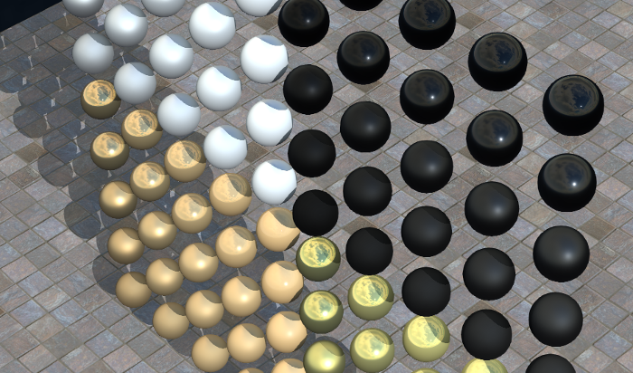

## Rendering

This section shows the advanced 3D rendering capabilities of Webots.
The samples provided here can be used as a starting point to create your own simulations using advanced rendering techniques.
The world files for these examples are located in the "projects/sample/rendering/worlds" directory.

In this directory, you will find the following world file:

### physically\_based\_rendering.wbt

**Keywords**: PBRAppearance, physically based rendering, shadows, ambient occlusion, normal map, bump map, metalness, roughness.

%figure "Screenshots of the physically based rendering sample environment."

|                                                                             |                                                                           |
|-----------------------------------------------------------------------------|---------------------------------------------------------------------------|
|  |  |

%end

This example illustrates the capabilities of the [PBRAppearance](../reference/pbrappearance.md) node that allows to produce [Physically Based Rendering](https://en.wikipedia.org/wiki/Physically_based_rendering) (PBR) in Webots simulations for both the main 3D view and simulated robot cameras.
