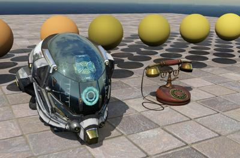
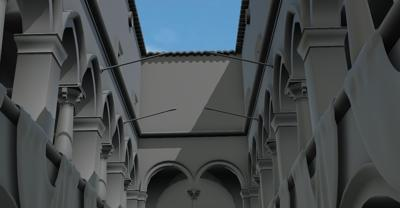

## Rendering

This section shows the advanced 3D rendering capabilities of Webots.
The samples provided here can be used as a starting point to create your own simulations using advanced rendering techniques.
The world files for these examples are located in the "[WEBOTS\_HOME/projects/samples/rendering/worlds]({{ url.github_tree }}/projects/samples/rendering/worlds/)" directory.

In this directory, you will find the following world files:

### [animated\_skin.wbt]({{ url.github_tree }}/projects/samples/rendering/worlds/animated_skin.wbt)

**Keywords**: [PBRAppearance](../reference/pbrappearance.md), skin, animation, salamander, normal map, bump map, metalness, roughness.

 This example shows the use of an animated Skin node on a salamander robot. This Skin node supports the use of the [PBRAppearance](../reference/pbrappearance.md) node to generate very realistic images.

### [physically\_based\_rendering.wbt]({{ url.github_tree }}/projects/samples/rendering/worlds/physically_based_rendering.wbt)

**Keywords**: [PBRAppearance](../reference/pbrappearance.md), physically based rendering, shadows, ambient occlusion, normal map, bump map, metalness, roughness.

%figure "Screenshots of the physically based rendering sample environment."

|     |     |
|:---:|:---:|
|  |  |

%end

This example illustrates the capabilities of the [PBRAppearance](../reference/pbrappearance.md) node that allows to produce [Physically Based Rendering](https://en.wikipedia.org/wiki/Physically_based_rendering) (PBR) in Webots simulations for both the main 3D view and simulated robot cameras.

### [sponza.wbt]({{ url.github_tree }}/projects/samples/rendering/worlds/sponza.wbt)

**Keywords**: [PBRAppearance](../reference/pbrappearance.md), sponza, ambient occlusion, rendering, post-processing.

 This world contains an untextured version of the Sponza Palace in Dubrovnik, Croatia. This model was used while developing our Ambient Occlusion technique to visually test its implementation, but we have included it as a sample as it looks quite good!
