## Sensors

Webots can simulate a lot of standard robotic sensors.
Using the nodes described [below](#generic-sensor-list) and their corresponding API is sufficient in most of the cases.

More specific sensors are built on the top of these generic nodes, thanks to the [PROTO system](../reference/proto.md).
These sensors are listed on [webots.cloud](https://webots.cloud/proto?keyword=sensor) under the *sensor* keyword.
They typically correspond to commercially available devices.

### Camera Sensors

Adding a generic [Camera](../reference/camera.md) node is sufficient for most of the applications.
Generic cameras are customizable (resolution, field of view, noise, etc.) and include a zoom and a focusing mechanism by default.
Special effects like motion blur, various models of noise, lens distortion and the use of a spherical or cylindrical projection are available.
If a [Recognition](../reference/recognition.md) node is added to the camera, the camera can return not only the image but also all objects detected in the camera image and their size and position.
It is therefore very easy to simulate smart cameras such as the Mobileye.

%figure "Smart camera output"

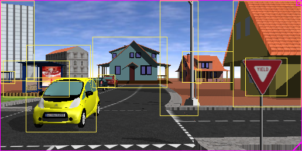

%end

Alternatively, camera models corresponding to real-world device can be found on [webots.cloud](https://webots.cloud/proto?keyword=sensor/camera).

### Lidar Sensors

%figure "Lidar simulation"

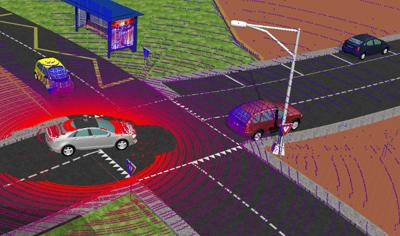

%end

In addition to the generic [Lidar](../reference/lidar.md) node, a wide range of commercial lidar sensors have been modelled and are available from [webots.cloud](https://webots.cloud/proto?keyword=sensor/lidar).

### Generic Sensor List

| Icon | Device | Description |
| :---: | --- | --- |
| 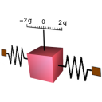 | [Accelerometer](../reference/accelerometer.md) | *Simulates an accelerometer sensor which measures the relative accelerations.* |
| 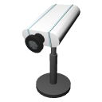 | [Camera](../reference/camera.md) | *Simulates an RGB camera, a linear camera, a gray-scale camera, a fish-eye camera or a smart camera with multiple special effects including noise, depth of field, motion blur or lense flares.* |
| 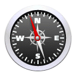 | [Compass](../reference/compass.md) | *Simulates a magnetic sensor which measures the relative direction to the north.* |
| 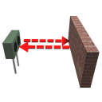 | [DistanceSensor](../reference/distancesensor.md) | *Simulates a distance measuring sensor based on infra-red light, sonar echo, or laser beam.* |
| 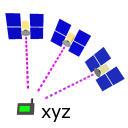 | [GPS](../reference/gps.md) | *Simulates a positioning sensor which measures the absolute position in Webots coordinate system or in the WGS84 coordinate system.* |
| 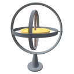 | [Gyro](../reference/gyro.md) | *Simulates a gyroscope sensor which measures the relative angular velocities.* |
| 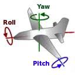 | [InertialUnit](../reference/inertialunit.md) | *Simulates a sensor which measures the relative roll, pitch and yaw angles.* |
| 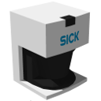 | [Lidar](../reference/lidar.md) | *Simulates a laser-scanner sensor also known as lidar.* |
| 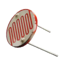 | [LightSensor](../reference/lightsensor.md) | *Simulates a photo-sensitive device which can measure the irradiance of light in a given direction.* |
| 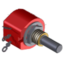 | [PositionSensor](../reference/positionsensor.md) | *Simulates a sensor which can monitor a joint position, such as an encoder or a potentiometer.* |
| 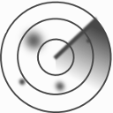 | [Radar](../reference/radar.md) | *Simulates a radar sensor.* |
| 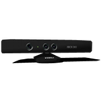 | [RangeFinder](../reference/rangefinder.md) | *Simulates a depth camera also known as range-finder.* |
| 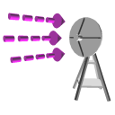 | [Receiver](../reference/receiver.md) | *Simulates radio, serial or infra-red receiver receiving data from other robots.* |
| 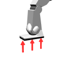 | [TouchSensor](../reference/touchsensor.md) | *Simulates a bumper or a force sensor.* |

