## Sensors

Webots can simulate a lot of standard robotic sensors.
Using the nodes described [below](#generic-sensor-list) and their corresponding API is sufficient in most of the cases.

More specific sensors are built on the top of these generic nodes, thanks to the [PROTO system](../reference/proto.md).
These sensors are listed by category [in the section below](#commercially-available-sensors).

### Generic Sensor List

| Icon | Device | Description |
| :---: | --- | --- |
|  | [Accelerometer](../reference/accelerometer.md) | *Simulates an accelerometer sensor which measures the relative accelerations.* |
|  | [Camera](../reference/camera.md) | *Simulates an RGB camera, a linear camera, a gray-scale camera, a fish-eye camera or a smart camera with multiple special effects including noise, depth of field, motion blur or lense flares.* |
|  | [Compass](../reference/compass.md) | *Simulates a magnetic sensor which measures the relative direction to the north.* |
|  | [DistanceSensor](../reference/distancesensor.md) | *Simulates a distance measuring sensor based on infra-red light, sonar echo, or laser beam.* |
|  | [GPS](../reference/gps.md) | *Simulates a positioning sensor which measures the absolute position in Webots coordinate system or in the WGS84 coordinate system.* |
|  | [Gyro](../reference/gyro.md) | *Simulates a gyroscope sensor which measures the relative angular velocities.* |
|  | [InertialUnit](../reference/inertialunit.md) | *Simulates a sensor which measures the relative roll, pitch and yaw angles.* |
|  | [Lidar](../reference/lidar.md) | *Simulates a laser-scanner sensor also known as lidar.* |
|  | [PositionSensor](../reference/positionsensor.md) | *Simulates a sensor which can monitor a joint position, such as an encoder or a potentiometer.* |
|  | [Radar](../reference/radar.md) | *Simulates a radar sensor.* |
|  | [RangeFinder](../reference/rangefinder.md) | *Simulates a depth camera also known as range-finder.* |
|  | [Receiver](../reference/receiver.md) | *Simulates radio, serial or infra-red receiver receiving data from other robots.* |
|  | [TouchSensor](../reference/touchsensor.md) | *Simulates a bumper or a force sensor.* |

### Commercially Available Sensors

Please [contact us](https://cyberbotics.com/#contact) if you would like to see your favorite sensor here.

#### Camera Sensors

| Preview | Name |  Manufacturer |
| :---: | --- | --- | --- |
| 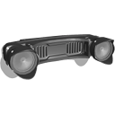 | [S21](camera-sensors.md#multisense-s21) | MultiSense |

#### DistanceSensor Sensors

| Preview | Name |  Manufacturer |
| :---: | --- | --- | --- |
|  | [GP2D120](distancesensor-sensors.md#sharp-gp2d120) | Sharp |
|  | [GP2Y0A02YK0F](distancesensor-sensors.md#sharp-gp2y0a02yk0f) | Sharp |
|  | [GP2Y0A41SK0F](distancesensor-sensors.md#sharp-gp2y0a41sk0f) | Sharp |
| 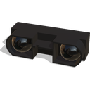 | [GP2Y0A710K0F](distancesensor-sensors.md#sharp-gp2y0a710k0f) | Sharp |

#### Lidar Sensors

| Preview | Name |  Manufacturer |
| :---: | --- | --- | --- |
|  | [LUX](lidar-sensors.md#ibeo-lux) | Ibeo |
| 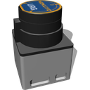 | [Hokuyo URG-04LX](lidar-sensors.md#hokuyo-urg-04lx) | Hokuyo |
| 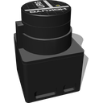 | [Hokuyo URG-04LX-UG01](lidar-sensors.md#hokuyo-urg-04lx-ug01) | Hokuyo |
|  | [Hokuyo UTM-30LX](lidar-sensors.md#hokuyo-utm-30lx) | Hokuyo |
| 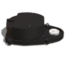 | [LDS-01](lidar-sensors.md#robotis-lds-01) | Robotis |
|  | [LMS 291](lidar-sensors.md#sick-lms-291) | SICK |
| 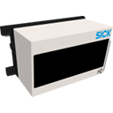 | [LD-MRS](lidar-sensors.md#sick-ld-mrs) | SICK |
| 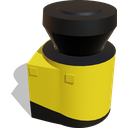 | [S300](lidar-sensors.md#sick-s300) | SICK |
| 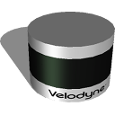 | [VLP Puck](lidar-sensors.md#velodyne-puck) | Velodyne |
| 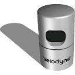 | [HDL 32E](lidar-sensors.md#velodyne-hdl-32e) | Velodyne |
| 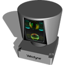 | [HDL 64E](lidar-sensors.md#velodyne-hdl-64e) | Velodyne |

#### Radar Sensors

| Preview | Name |  Manufacturer |
| :---: | --- | --- | --- |
| 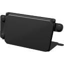 | [ESR](radar-sensors.md#delphi-esr) | Delphi |
| 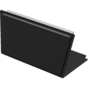 | [UMRR-0a](radar-sensors.md#smartmicro-umrr-0a) | Smartmicro |

#### RangeFinder Sensors

| Preview | Name |  Manufacturer |
| :---: | --- | --- | --- |
| 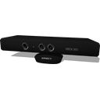 | [Kinect](range-finder-sensors.md#microsoft-kinect) | Microsoft |
