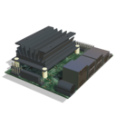
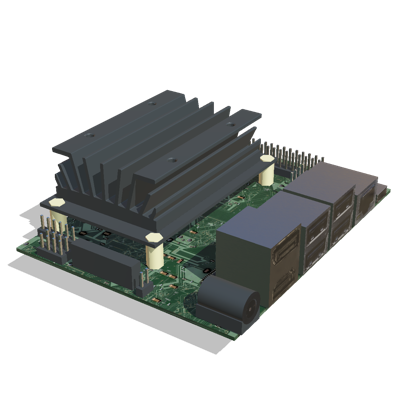

# Single Board Computers

## Single Board Computer List

All the commercially available single board computers models included in Webots are included here.
Users may also add their own custom models.
Please [contact us](https://cyberbotics.com/#contact) if you would like to see your favorite single board computer here.

| Preview | Name |  Manufacturer |
| :---: | --- | --- | --- |
|  | [Jetson Nano](#nvidia-jetson-nano) | NVIDIA |

### NVIDIA Jetson Nano

The `NVIDIA Jetson Nano` is a small, powerful computer to run multiple neural networks in parallel.

%figure "NVIDIA Jetson Nano in Webots"



%end

```
PROTO JetsonNano [
  SFVec3f    translation    0 0 0
  SFRotation rotation       0 1 0 0
  SFString   name           "NVIDIA Jetson Nano"
  SFNode     physics        NULL
  SFString   controller     ""
  SFString   window         ""
  MFNode     extensionSlot  []
]
```

> **File location**: "[WEBOTS\_HOME/projects/devices/nvidia/protos/JetsonNano.proto]({{ url.github_tree }}/projects/devices/nvidia/protos/JetsonNano.proto)"

#### JetsonNano Field Summary

- `extensionSlot`: Extends the board with meshes, solid parts or devices.
