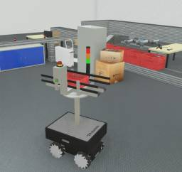

## Robotnik's Summit-XL Steel

%robot summit-xl-steel images/robots/summit_xl_steel/model.thumbnail.png

Designed by Robotnik, [Summit-XL Steel](summit-xl-steel.md) is a four-wheeled (mecanum) robot.
The model is a modular mobile platform used for logistics and indoor transport. It is well-suited for industries, as its design enables it to carry a payload of up to 250 kg.
More information on the Summit-XL Steel robot can be found on the [constructor website](https://robotnik.eu/products/mobile-robots/summit-xl-steel-en/).

### SummitXlSteel PROTO

Derived from [Robot](../reference/robot.md).

```
SummitXlSteel {
  SFVec3f     translation     0 0 0.118
  SFRotation  rotation        0 0 1 0
  SFString    name            "Summit-XL Steel"
  SFString    controller      "void"
  MFString    controllerArgs  []
  SFString    customData      ""
  SFBool      supervisor      FALSE
  SFBool      synchronization TRUE
  MFNode      frontLidarSlot  []
  MFNode      backLidarSlot   []
  MFNode      bodySlot        []
}
```

> **File location**: "[WEBOTS\_HOME/projects/robots/robotnik/summit\_xl\_steel/protos/SummitXlSteel.proto]({{ url.github_tree }}/projects/robots/robotnik/summit_xl_steel/protos/SummitXlSteel.proto)"

#### Summit-XL Steel Field Summary

- `frontLidarSlot`: Extends the robot with a lidar on the front (such as the `SickS300` for example).
- `backLidarSlot`: Extends the robot with a lidar on the back (such as the `SickS300` for example).
- `bodySlot` : Extends the robot with new nodes (such as the `Robotino3Platform` for example).


### Sample

You will find the following sample in this folder: "[WEBOTS\_HOME/projects/robots/robotnik/summit\_xl\_steel/worlds]({{ url.github_tree }}/projects/robots/robotnik/summit_xl_steel/worlds)".

> **Note:** For the mecanum wheels to behave correctly, the following [ContactProperties](../reference/contactproperties.md) should be added in the `contactProperties` field of the [WorldInfo](../reference/worldinfo.md) node:
```
  contactProperties [
    ContactProperties {
      material1 "InteriorWheelMat"
      coulombFriction [
        1.8, 0, 0.2
      ]
      frictionRotation -0.9648 0
      bounce 0
      forceDependentSlip [
        10, 0
      ]
      softCFM 0.0001
    }
    ContactProperties {
      material1 "ExteriorWheelMat"
      coulombFriction [
        1.8, 0, 0.2
      ]
      frictionRotation 0.9648 0
      bounce 0
      forceDependentSlip [
        10, 0
      ]
      softCFM 0.0001
    }
  ]
```

#### summit\_xl\_steel.wbt

 This simulation shows a Summit-XL Steel mounted with a `ConveyorPlatform` that can be controlled to move in an industrial environment using the keyboard.
