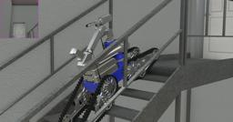

## Telerob Telemax PRO

%robot telemax-pro images/robots/telemax-pro/model.thumbnail.png

The [Telemax PRO robot](https://www.telerob.com/en/products/telemax-family) from [Telerob](https://www.telerob.com) is a tracked robot equipped with a 7-axis manipulator.

### Movie Presentation


### Telemax PRO PROTO

Derived from [Robot](../reference/robot.md).

```
TelemaxPro {
  SFVec3f     translation      0 0.2 0
  SFRotation  rotation         0 1 0 0
  SFColor     color            0.187 0.257 0.953
  SFString    name             "telemax"
  SFString    controller       "telemax_keyboard_controller"
  SFString    controllerArgs   ""
  SFString    customData       ""
  SFBool      supervisor       FALSE
  SFBool      selfCollision    TRUE
  SFBool      synchronization  TRUE
  SFBool      castShadows      TRUE
  SFBool      wheels           FALSE
  MFNode      traySlot         [ TelemaxBattery { } ]
  MFNode      cameraSlot0      [ ]
  MFNode      cameraSlot1      [ ]
  MFNode      cameraSlot2      [ ]
}
```

> **File location**: "WEBOTS\_HOME/projects/robots/telerob/telemax/protos/TelemaxPro.proto"

#### TelemaxPro Field Summary

- `color`: Defines the color of the painted part of the robot.
- `castShadows`: Defines if the lights of the robot should cast shadows or not.
- `wheels`: Defines if the wheels should be included or not.
- `traySlot`: Extends the robot with new nodes located on top of its tray.
- `cameraSlot0`: Extends the robot with new nodes located at the beginning of the arm.
- `cameraSlot1`: Extends the robot with new nodes located at the middle of the arm.
- `cameraSlot2`: Extends the robot with new nodes located at the extremity of the arm.

### Samples

You will find the following sample in this folder: "WEBOTS\_HOME/projects/robots/telerob/telemax_pro/worlds".

#### [telemax.wbt](https://github.com/omichel/webots/tree/master/projects/robots/telerob/telemax_pro/worlds/telemax.wbt)

 This simulation shows the Telemax PRO robot climbing stairs and opening a door.
