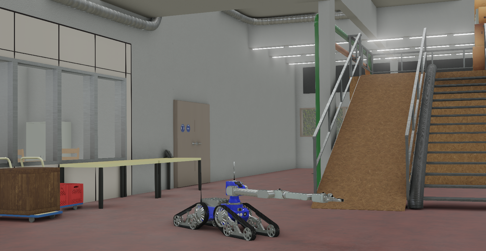

## Telerob Telemax

%robot telemax images/robots/telemax/model.png

The [Telemax robot](https://www.telerob.com/en/products/telemax-family) from [Telerob](https://www.telerob.com) is a tracked robot equipped with a 7-axis manipulator.

### Movie Presentation

  TODO

### Telemax PROTO

Derived from [Robot](../reference/robot.md).

```
Telemax {
  SFVec3f     translation      0 0.2 0
  SFRotation  rotation         0 1 0 0
  SFColor     color            0.187 0.257 0.953
  SFString    name             "telemax"
  SFString    controller       "telemax_keyboard_controller"
  SFString    controllerArgs   ""
  SFString    customData       ""
  SFBool      supervisor       FALSE
  SFBool      selfCollision    TRUE
  SFBool      synchronization  TRUE
  MFNode      traySlot         [ TelemaxBox { } ]
}
```

> **File location**: "WEBOTS\_HOME/projects/robots/telerob/telemax/protos/Telemax.proto"

#### Moose Field Summary

- `color`: Defines the color of the painted part of the robot.
- `traySlot`: Extends the robot with new nodes located on top of its tray.

### Samples

You will find the following sample in this folder: "WEBOTS\_HOME/projects/robots/telerob/telemax/worlds".

#### telemax\_hall.wbt

 This simulation shows the Telemax robot in an indoor environment.
