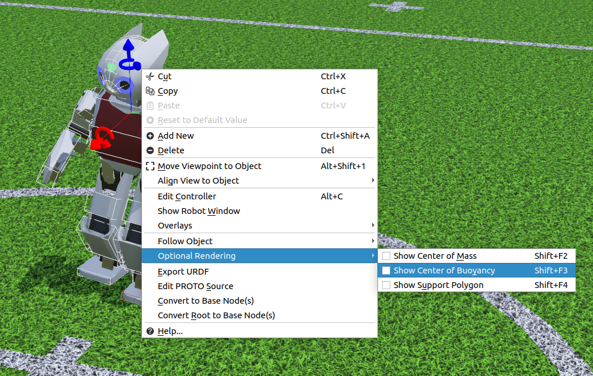
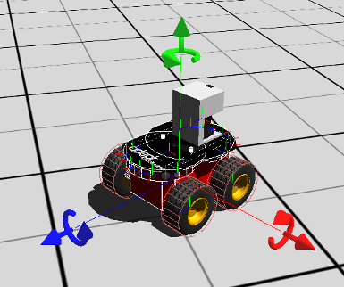
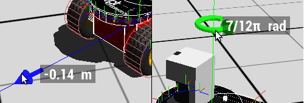
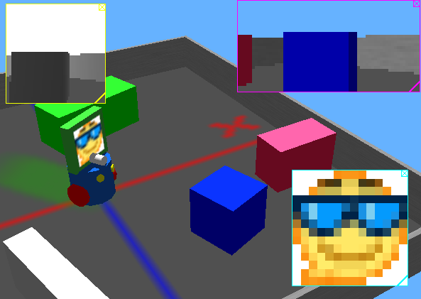
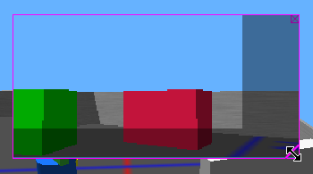
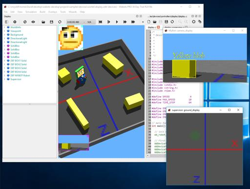

## The 3D Window

### Selecting an Object

A single mouse left click allows you to select a [Solid](../reference/solid.md) object.
The bounding object of a selected solid is represented by white lines.
These lines turn pink if the solid is colliding with another one and blue when the solid is idle, i.e., it comes to rest and it does not interact with any other active solid.
Double-clicking on a [Robot](../reference/robot.md) opens the Robot Window.

If an object has a solid subpart, then it is also possible to select only this subpart by clicking on it once the whole object is already selected, or by clicking on it while holding down the Alt key.
Linux users should also hold down the Control key (Ctrl) together with the Alt key.

#### Context Menu

%figure "The context menu allows you to perform various actions depending on the current selected object"

%end

It is possible to right click on an object in the 3D window to select it and open the context menu.
This menu allows you to perform various actions such as copy the object, delete the object, move the viewpoint to the object and show the robot window (if the object is a [Robot](../reference/robot.md)).

### Navigation in the Scene

Dragging the mouse while pressing a mouse button moves the camera of the 3D window.

- **Camera rotation**: In the 3D window, click on an object with the left mouse button and drag the mouse to rotate the viewpoint around it.
If you click on the background, the camera will rotate around its own position.
- **Camera translation**: In the 3D window, press the right button and drag the mouse to translate the camera.
- **Zooming / Camera rotation**: In the 3D window, press both left and right mouse buttons simultaneously (or just the middle button) and drag the mouse vertically, to zoom in and out.
Dragging the mouse horizontally will rotate the camera around the viewing axis.
Alternatively, the mouse wheel alone can also be used for zooming.

> **Note**: If you are a Mac user with a single button mouse, hold the Alt key and press the mouse button to translate the camera according to the mouse motion.
Hold the control key (Ctrl) down and press the mouse button to zoom / rotate the camera.

### Moving a Solid Object

Currently Webots provides two different ways to move solid objects: axis-aligned handles and keyboard shortcuts.

#### Axis-aligned Handles

When a solid object is selected, some arrow-shaped handles appear in the 3D window (see [this figure](#axis-aligned-handles-to-move-solid-objects)).
These handles can be used to translate and rotate the object along the corresponding axis.
For moving the object you can simply click on the handle and drag it to the desired position.
A label will show the currect relative translation or rotation during the movement, as shown in [this figure](#labels-displaying-relative-translation-and-rotation-when-moving-objects-with-handles).

If the Control key (Ctrl) is pressed, the handles for resizing the solid object will be displayed instead of translation and rotation handles.
These resize handles can also be enabled from the Field Editor.

%figure "Axis-aligned handles to move solid objects"

%end

%figure "Labels displaying relative translation and rotation when moving objects with handles"

%end

#### Translation Using Keyboard Shortcuts

- **Translation**: To move an object parallel to the ground: hold down the Shift key, press the left mouse button and drag.
- **Rotation**: To rotate an object around the world's vertical axis: hold down the Shift key, press the right mouse button and drag.
- **Lift**: To raise or lower an object: hold down the Shift key, press both left and right mouse buttons (or the middle button) and drag.
Alternatively, the mouse wheel combined with the Shift key can also be used.

> **Note**: If you are a Mac user with a single button mouse, hold the Shift key and the Control key (Ctrl) down and press the mouse button to rotate the selected object according to mouse motion.
Hold the Shift key and the Command key (key with Apple symbol) down and press the mouse button to lift the selected object according to mouse motion.

### Applying a Force to a Solid Object with Physics

To apply a force to an object, place the mouse pointer where the force will apply, hold down the Alt key and left mouse button together while dragging the mouse.
Linux users should also hold down the Control key (Ctrl) together with the Alt key.
This way your are drawing a 3D-vector whose end is located on the plane parallel to the view which passes through the point of application.
The intensity of the applied force is directly proportional to the cube of the length of this vector.

### Applying a Torque to a Solid Object with Physics

To apply a torque to an object, place the mouse pointer on it, hold down the Alt key and right mouse button together while dragging the mouse.
Linux users should also hold down the Control key (Ctrl) together with the Alt key.
Also, macOS users with a one-button mouse should hold down the Control key (Ctrl) to emulate the right mouse button.
This way your are drawing a 3D-vector with origin the center of mass and whose end is located on the plane parallel to the view which passes through this center.
The object is prompted to turn around the vector direction, the intensity of the applied torque is directly proportional to the product of the mass by the length of the 3D-vector.

> **Note**: In pause mode, you can simultaneously add a force and a torque to the same selected solid.
Camera rotation can be useful when checking wether your force / torque vector has the desired direction.

### Moving and Resizing Overlays

By default for each Camera, Display and RangeFinder device, an overlay showing the recorded or displayed image is visible in the 3D view.
The device type is indicated by the border color: magenta for Camera devices, cyan for Display devices and yellow for RangeFinder devices, see [this figure](#camera-display-and-rangefinder-overlays).
This overlay can be moved to the desired position on the view by clicking on it and dragging the mouse.
In order to resize the overlay the user has to click on the icon located at the bottom right corner and drag the mouse, during this action the original not scaled image size will be indicated using darker areas, as depicted in [this figure](#camera-overlay-resizing).
Additionally, a close button is available on the top right corner to hide the overlay.
Once the [Robot](../reference/robot.md) is selected, it is also possible to show or hide the overlay images from the `Camera Devices`, `Display Devices` and `RangeFinder Devices` items in the `Overlays` menu or from the [context menu](#context-menu).

%figure "Camera, Display and RangeFinder overlays"

%end

%figure "Camera overlay resizing"

%end

### Show Camera, Display and RangeFinder Images in a Separate Window

Overlay images can also be displayed outside the 3D window, see [this figure](#camera-and-display-image-window).
When double-clicking with the left mouse button on the overlay, a new external window displaying the device image is created and the overlay in the 3D window is disabled.
It is possible to restore the 3D window overlay simply by closing the window.

%figure "Camera and Display image window"

%end
