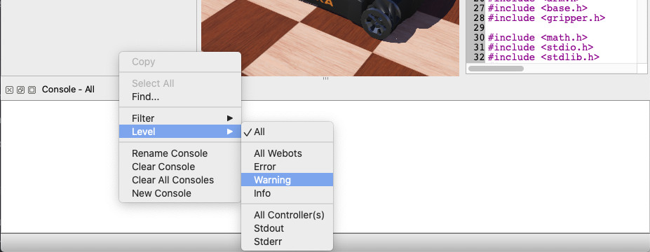

## The Console

The Webots console displays the logs coming from Webots (such as parsing warnings or errors when opening a world, compilation outputs, ODE warnings, etc.) and the outputs of the controllers.
To guarantee that the log printed in the Webots console is deterministic, the output coming from the controllers is not printed immediately when receiving it but it is grouped by controller and printed at the end of the simulation step.
This means that if your simulation contains robot A and robot B, the output of robot A will be printed in the console before the output of robot B independently if some robot B output messages were received before the ones of robot A.

%figure "Console Window"

%end

### Context Menu

By default, the console displays all the Webots logs and controller outputs.
However, the console possesses a context menu which allows the user to define which logs and controller outputs can be displayed.

The `Filter` sub-menu allows the user to define which kind of Webots logs and which robot controllers outputs should be displayed.

The `Level` sub-menu allows the user to define which type of Webots logs (classified by severity) and which type (stdout or stderr) of robot controller outputs should be displayed.

### Multi Consoles

By default, only one console is available, but it might be useful to use more than one console (especially when filtering what is displayed in each console).
A new console can be opened from the `Tools` menu or from the context menu of an already existing console.

Each console is independent and can have its own filter and name (it can be renamed from the context menu).
By default, the consoles are tabbed together, however, it is possible to arrange them as you wish and even to move them in a dedicated window.
