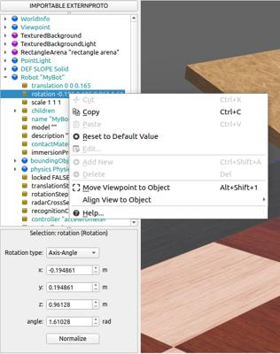
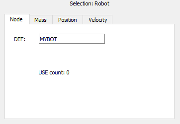

## The Scene Tree

As seen in the previous section, to access the Scene Tree Window you can either choose `Scene Tree` in the `Tools` menu, or press the `Show Scene Tree` button in the main toolbar.
The scene tree contains the information that describes a simulated world, including robots and environment, and its graphical representation.
The scene tree of Webots is structured like a VRML97 file.
It is composed of a list of nodes, each containing fields.
Fields can contain values (text strings, numerical values) or other nodes.

This section describes the user interface of the Scene Tree, and gives an overview of the VRML97 nodes and Webots nodes.

%figure "Scene Tree Window"

%end

The scene tree possesses a context menu which contains a number of useful actions, depending on the selection, including but not limited to: cut, copy and paste operations, resetting fields to their default values, moving the [Viewpoint](../reference/viewpoint.md) to an object, setting the [Viewpoint](../reference/viewpoint.md) to follow an object, or opening the Documentation viewer to view the documentation for the selected node.

Additionally, if the current selection is a [Robot](../reference/robot.md) node (or descendant, or `PROTO` instance based on [Robot](../reference/robot.md)) it is possible to open the corresponding robot window or open the robot's controller in the Text Editor.

### Field Editor

Nodes can be expanded with a double-click.
When a field is selected, its value can be edited at the bottom of the Scene Tree.
Double-clicking or pressing the <kbd>enter</kbd> key on a field selects the first editable item of the field editor panel.
Keyboard focus can be returned to the Scene Tree by tabbing through all of the items in the field editor panel.
For text fields, changes are applied by pressing the <kbd>enter</kbd> key.
This is the same for numeric fields, but the up and down arrow keys can also be used to adjust values up and down, with changes immediately applied.
For checkboxes, values are changed using the `Space` bar.
Applied changes are immediately reflected in the 3D window.
The following buttons are available in the field editor section:

%figure "Webots node editor"

%end

> **Note**:
We recommend to use the Scene Tree to write Webots world files. However, because the nodes and fields are stored in a human readable form, it is also possible to edit world files with a regular text editor.
Some search and replace operations may actually be easier that way.
Please refer to Webots [Reference Manual](../reference/webots-world-files.md) for more info on the available nodes and the world file format.

### IMPORTABLE EXTERNPROTO Panel

The **IMPORTABLE EXTERNPROTO** panel can be opened by clicking the similarly named button just above the scene tree.

%figure "IMPORTABLE EXTERNPROTO"

%end

Every world file must declare in its header the PROTO assets it relies upon using the `EXTERNPROTO` keyword, and providing a URL or path towards each PROTO used.
This list is normally compiled automatically by Webots when a world is saved.
If however additional PROTO nodes might be used during the execution of the simulation, typically by having a supervisor node inserting it into the world, then the user must declare these PROTO nodes as `IMPORTABLE EXTERNPROTO`.
By pressing the *IMPORTABLE EXTERNPROTO* button, the panel shown above will appear, and using the *Insert new* button the relevant PROTO may be searched and added to the list.
This allows webots to download the PROTO, if not already available, prior to it being summoned into the world.
