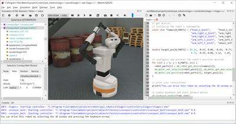

## The User Interface

Webots GUI is composed of four principal windows: the *3D window* that displays and allows you to interact with the 3D simulation, the *Scene tree* which is a hierarchical representation of the current world, the *Text editor* that allows you to edit source code, and finally, the *Console* that displays both compilation and controller outputs.

%figure "Webots GUI"



%end

The GUI has eight menus: `File, Edit, View, Simulation, Build, Overlays, Tools` and `Help`.

### File Menu

The **File** menu allows you to perform usual file operations: loading, saving, etc.

- The **New** submenu allows you to create new simulation files:
  - The **New Project Directory...** menu item first prompts you to choose a filesystem location and then it creates a project directory.
  A project directory contains several subdirectories that are used to store the files related to a particular Webots project, i.e., world files, controller files, data files, plugins, etc. Webots remembers the current project directory and automatically opens and saves any type of file from the corresponding subdirectory of the current project directory.
  - The **New World File...** menu item allows you to create a simple world file in the current simulation project, which may contain some optional components, including a rectangle arena.
  - The **New Robot Controller...** menu item allows you to create a new robot controller program.
  You will first be prompted to choose between a C, C++, Java, Python or *MATLAB*<sup>TM</sup> controller.
  If you choose C or C++ on Windows, Webots will offer you the possibility to create a Makefile / gcc project or a Visual Studio project.
  Then, Webots will ask you to enter the name of your controller and finally it will create all the necessary files (including a template source code file) in your current project directory.
  - The **New Physics Plugin...** menu item will let you create a new physics plugin for your project.
  Webots asks you to choose a programming language (C or C++) and a name for the new physics plugin.
  Then it creates a directory, a template source code file and a Makefile in your current project.
  - The **New PROTO...** menu item will let you create a new PROTO for your project.
  Webots asks you to define a name for the PROTO node, the tags that should be included (if any), and the base node from which the PROTO itself will inherit.
  Based on the choice of base node, Webots will ask you which among its fields should be exposed (i.e., visible from the scene tree) and will create the necessary parameters accordingly.
  Then, Webots will propose you to open the PROTO file in the text editor, so that you can continue to edit it.
  Finally, you will be able to insert an instance of your new PROTO in the scene tree as you would do for any other PROTO.

-  The **Open World...** menu item (and button) opens a file selection dialog that allows you to choose a ".wbt" file to load.

- The **Open Recent World** menu item gives the possibility of reopening a ".wbt" file that was opened recently by choosing it from the list displayed in the submenu.

- The **Open Sample World** menu item opens a dialog listing all the available sample worlds where it is possible to search for a specific ".wbt" file to load by entering the file name or part of it in the search field.

-  The **Save World** menu item (and button) saves the current world using the current filename (the filename that appears at the top of the main window).
On each `Save` the content of the ".wbt" file is overwritten and no backup copies are created by Webots, therefore you should use this button carefully and eventually do safety copies manually.

- The **Save World As...** menu item (and button) saves the current world with a new filename entered by the user.
Note that a ".wbt" file should always be saved in a Webots project directory, and in the "worlds" subdirectory, otherwise it will not be possible to reopen the file.

-  The **Reload World** menu item (and button) reloads the current world from the saved version and restarts the simulation from the beginning.
Please refer to [Reset/Reload Matrix](../reference/supervisor.md#wb_supervisor_simulation_reset) for more details.

    > **Note**:
When opening (or reloading) a world, if the world takes more than 2 seconds to
load a window will pop up and show the progression. Using this window it is
possible to cancel the loading of the world, in that case, the empty world will
be opened instead.

-  The **Reset Simulation** menu item (and button) restores the initial state of the simulation.
The simulation is not entirely destroyed and reconstructed as with a reload, but the initial state of all nodes is restored, which is much faster.
Please refer to [Reset/Reload Matrix](../reference/supervisor.md#wb_supervisor_simulation_reset) for more details.

-  The **New Text File** menu item (and button) opens an empty text file in the text editor.

-  The **Open Text File...** menu item (and button) opens a file selection dialog that allows you to choose a text file (for example a ".java" file) to load.

-  The **Save Text File** menu item (and button) saves the current text file.

-  The **Save Text File As...** menu item (and button) saves the current text file with a new filename entered by the user.

- The **Save All Text Files** menu item saves all the opened and unsaved text files.

-  The **Revert Text File** menu item (and button) reloads the text file from the saved version.

- The **Print Preview...** menu item opens a window allowing you to manage the page layout in order to print files from the text editor.

- The **Print...** menu item opens a window allowing you to print the current file of the text editor.

-  The **Take Screenshot...** item allows you to take a screenshot of the current view in Webots.
It opens a file dialog to save the current view as a PNG or JPG image.

-  The **Make Movie...** item allows you to create MPEG movies (Linux and macOS) or AVI movies (Windows).
Once the movie recording is started, this item is changed in `Stop Movie...`.
During the recording, it is possible to change the running mode and pause the simulation.
However, frames are only captured during Webots steps and not when the simulation is paused.
Other than choosing the resolution and the compression quality of the movie, it is also possible to record the simulation in accelerated mode or in slow motion by setting the `Video acceleration` value in the pop-up dialog.
If the video acceleration value is below 1, the recorded movie will run slower than the simulation.
The maximum slow down, i.e. the minimum acceleration value, is defined by the basic time step of the simulation because it is not possible to record at a higher frame rate than the simulation update rate.
In order to increase the maximum slow down you should reduce the simulation basic time step.
Checking the video caption option will display the acceleration value in the top right corner of the movie.

%figure "'Make Movie...' dialog"


%end

-  The **Share...** item allows you to export the current world as an interactive 3D scene (more information about this topic in [this section](web-scene.md)), or to record a simulation as a 3D animation and publish it on a HTML5 web page.
For both options, it is possible to save the result locally or to upload it automatically to [webots.cloud](https://webots.cloud) where it can be easily shared and seen by other people.
If the animation recording is started, this item is changed to `Stop HTML5 Animation recording.` and can be used to stop the animation recording.
You can get more information about animations in [this section](web-animation.md).

- **Quit** terminates the current simulation and closes Webots.

> **Note:** on Windows, "Exit" is used instead of "Quit".

### Edit Menu

The **Edit** menu provides usual text edition functions to manipulate files opened in the *Text editor*, such as Copy, Paste, Cut, etc.

### View Menu

The **View** menu allows you to control the viewing in the simulation window.

- The **Follow Object** submenu allows you to switch between a fixed (static) viewpoint and a viewpoint that follows a mobile object (usually a robot).
If you want the viewpoint to follow an object, first you need to select the object with the mouse and then check one of the items of the submenu depending on the following behavior you want.
Refer to the [Viewpoint](../reference/viewpoint.md) documentation for more information about the different following behaviors.

-  The **Restore [Viewpoint](../reference/viewpoint.md)** item restores the viewpoint's position and orientation to their initial settings when the file was loaded or reverted.
This feature is handy when you get lost while navigating in the scene, and want to return to the original viewpoint.

-  **Move viewpoint to object** moves the viewpoint to center and zoom on the selected node.
If the selected item is a field, the upper parent node will be targeted.
The object will be at the center of the 3D view and will be completely visible.

- The **Align View to Object** submenu moves and rotates the viewpoint to center the selected node and align the viewpoint on any of the six object-align axes

-  The **Change View** submenu moves the viewpoint to align it on any of the six world-aligned axes around the selected object.
If no object is selected, the viewpoint will be centered on the world origin.
The available options are  **East View**,  **West View**,  **North View**,  **South View**,  **Top View** and  **Bottom View**.

- The **Fullscreen** item enables and disables displaying the 3D window on the entire screen.

- The **Virtual Reality Headset** submenu allows you to use a virtual reality headset such as the HTC Vive or Oculus Rift to view the simulation:
  - The **Enable** item allows you to switch the simulation view to the headset.
  - The **Track headset position** and **Track headset orientation** items specifies if the headset position and orientation should be tracked and applied to the viewpoint.
  - The **View left eye**, **View right eye** and **Empty view** radio buttons allow you to choose what should be displayed in the simulation view.
You can either see the left eye image, right eye image or nothing.
  - The **Anti-aliasing** item allows you to enable anti-aliasing on both eye images (note that anti-aliasing will decrease simulation speed).
  - The headset installation procedure is described [here](computer-peripherals.md).

    > **Note**:
This menu is currently present only on Windows.
If you are on Windows and the menu is not enabled, it indicates that the drivers are not installed or that no headset is connected.

- The **Projection** radio button group allows you to choose between the **Perspective Projection** (default) and the **Orthographic Projection** mode for Webots simulation window.
The *perspective* mode corresponds to a natural projection: in which the farther an object is from the viewer, the smaller it appears in the image.
With the *orthographic* projection, the distance from the viewer does not affect how large an object appears.
Furthermore, with the *orthographic* mode, lines which are parallel in the model are drawn parallel on the screen, therefore this projection is sometimes useful during the modelling phase.
No shadows are rendered in the *orthographic* mode.

- The **Rendering** radio button group allows you to choose between the **Plain Rendering** (default) and the **Wireframe** modes for Webots simulation window.
In *plain rendering* mode, the objects are rendered with their geometrical faces, materials, colors and textures, in the same way they are usually seen by an eye or a camera.
In *wireframe rendering* mode, only the segments of the renderable primitives are rendered.
This mode can be useful to debug your meshes.
If the *wireframe rendering* mode and the `View / Optional Rendering / Show All Bounding Objects` toggle button are both activated, then only bounding objects are drawn (not the renderable primitives).
This can be used to debug a problem with the collision detection.

- The **Optional Rendering** submenu allows you to display, or to hide, supplementary information.
These renderings are displayed only in the main rendering and hide in the robot camera.
They are used to understand better the behavior of the simulation:

  - The **Show Coordinate System** allows you to display, or to hide, the global coordinate system at the bottom right corner of the 3D window as red, green and blue arrows representing the x, y and z axes respectively.

  - The **Show All Bounding Objects** allows you to display, or to hide, all the bounding objects (defined in the *boundingObject* fields of every *Solid* node).
Bounding objects are represented by white lines.
These lines turn rose when a collision occurs and blue when the solid is idle, i.e., it comes to rest and it doesn't interact with any other active solid.

  - The **Show Contact Points** allows you to display, or to hide, the contact points generated by the collision detection engine.
Contact points that do not generate a corresponding contact force are not shown.
A contact force is generated only for objects simulated with physics ([Physics](../reference/physics.md) node required).
A step is required for taking this operation into account.

  - The **Show Connector Axes** allows you to display, or to hide, the connector axes.
The rotation alignments are depicted in black while the y and z axes respectively in green and blue.

  - The **Show Joint Axes** allows you to display, or to hide, the joint axes.
The joint axes are represented by black lines.

  - The **Show RangeFinder Frustums** allows you to display, or to hide, the OpenGL culling frustum and the recorded image for every range-finder in the scene, using a yellow wire frame.
If the range-finder device is disabled or the first image is not available yet, the frustum will be drawn in gray.
The OpenGL culling frustum is a truncated pyramid corresponding to the field of view of a range-finder.
The recorded image is displayed on the plane described by the frustum at a distance corresponding to the minimum range of the range-finder from the device center.
More information about this concept is available in the OpenGL documentation.

  - The **Show Lidar Rays Paths** allows you to display, or to hide, the layers (the laser ray paths) for every lidar in the scene, using a cyan wire frame.
If the lidar device is disabled or the first measurement is not available yet, the layers are drawn in gray.

  - The **Show Lidar Point Cloud** allows you to display, or to hide, the point cloud for every lidar enabled in point cloud mode in the scene.
The point cloud is represented by the location of the points themselves and by the rays from the lidar origin to the points using a gradient from blue (top layer) to red (bottom layer).
This optional rendering is computationally expensive and can therefore significantly slow-down the simulation speed.
Note that if the point cloud contains more than 2500 points, the rays from the lidar origin to the point are not displayed.

  - The **Show Camera Frustums** allows you to display, or to hide, the OpenGL culling frustum and the recorded image for every camera in the scene, using a magenta wire frame.
If the camera device is disabled or the first image is not available yet, the frustum will be drawn in gray.
The OpenGL culling frustum is a truncated pyramid corresponding to the field of view of a camera.
The back of the pyramid is not represented because the far plane is set to infinity.
The recorded image is displayed on the camera's near plane.
More information about this concept is available in the OpenGL documentation.

  - The **Show DistanceSensor Rays** allows you to display, or to hide, the rays casted by the distance sensor devices.
These rays are drawn as red lines (which become green beyond collision points).
Their length corresponds to the maximum range of the device.
If the distance sensor device is disabled or the first measurement is not available yet, the rays will be drawn in gray.

  - The **Show LightSensor Rays** allows you to display, or to hide, the rays casted by the light sensor devices.
These rays are drawn as yellow lines.
If the light sensor device is disabled or the first measurement is not available yet, the rays will be drawn in gray.

  - The **Show Light Positions** allows you to display, or to hide, the position of [PointLight](../reference/pointlight.md) and [SpotLight](../reference/spotlight.md) lights.
[DirectionalLight](../reference/directionallight.md) nodes aren't represented.
[PointLight](../reference/pointlight.md) and [SpotLight](../reference/spotlight.md) nodes are represented by a colored circle surrounded by a flare.

  - The **Show Pen Painting Rays** allows you to display, or to hide, the rays in which the pen devices paint.
These rays are drawn as violet lines if painting is enabled, otherwise as gray lines.

  - The **Show Normals** allows you to display, or to hide, the normals of the [IndexedFaceSet](../reference/indexedfaceset.md) and [Mesh](../reference/mesh.md) nodes. The color of a normal is magenta if it was not creased using the [IndexedFaceSet](../reference/indexedfaceset.md) `creaseAngle`, otherwise, it is yellow. The length of the normal representation is proportional to the [WorldInfo](../reference/worldinfo.md) `lineScale` parameter.

  - The **Show Radar Frustums** allows you to display, or to hide, the radar frustum.
If the radar device is enabled the frustum is drawn in blue, otherwise if the radar is disabled or the first measurement is not available yet, the frustum is drawn in gray.
The radar frustum represents the volume in which a target can be detected by the radar.

  - The **Show Center Of Mass** allows you to display, or to hide, the global center of mass of a selected solid with non NULL [Physics](../reference/physics.md) node.
The center of mass is rendered in dark blue.

  - The **Show Center Of Buoyancy** allows you to display, or to hide, the global center of buoyancy of a selected solid with non NULL [Physics](../reference/physics.md) node.
The center of buoyancy is rendered in purple.

  - The **Show Support Polygon** allows you to display, or to hide, the support polygon of a selected solid with non NULL [Physics](../reference/physics.md) node.
By support polygon we mean the projection of the convex hull of the solid's contact points on the horizontal plane which contains the lowest one.
In addition, the projection of the center of mass in the latter plane is rendered in green if it lies inside the support polygon (static equilibrium), red otherwise.
This rendering option can be activated only for solids with no other solid at their top.

- The **Scene Interactions** submenu allows you to disable some user interactions with the 3D scene, like selecting or moving objects or moving the viewpoint.
These options can be used to improve interacting with the 3D scene by disabling some unneeded functionalities, or to prevent some interactions for example when streaming a simulation over the web.

  - If the **Lock Viewpoint** option is enabled, it prevents you from changing the position and orientation of the [Viewpoint](../reference/viewpoint.md) node when dragging the mouse or moving the mouse wheel on the 3D window.
  This is particularly useful when you don't want to change accidentally the position and orientation of the viewpoint.

  - If the **Disable Selection** option is enabled, it prevents you from changing the selected solid node when clicking on the 3D window.
  This is particularly useful during the modeling phase, when you want to change the viewpoint without modifying the visible and selected fields in the scene tree.

  - The **Disable 3D View Context Menu** option prevents opening the node context menu when right-clicking on the 3D window.
  But the context menu can still be open right-clicking on the node in the scene tree.
  This is particularly useful during web streaming, where the context menu is opened directly on client web interface and it is not needed to open in on the Webots server instance.

  - The **Disable Object Move** option prevents moving object from the 3D window using the translation and rotations handles or the `SHIFT + mouse drag/mouse wheel` method.
  Objects can still be moved by changing the translation and rotation fields from the scene tree.
  This is particularly useful during online competitions, where users should achieve a task without cheating and moving objects or robots manually.

  - The **Disable Force and Torque** option prevents applying a force or torque to an object from the 3D window.
  This is particularly useful during online competitions, where users should achieve a task without cheating and moving objects or robots manually.

  - The **Disable Fast Mode** option prevents running the simulation in fast mode.
  This option could be useful in case of web streaming to save computer power on the server side and making only the stop, step and the real-time modes available to the clients.

> **Note**:
The *Follow Object*, *Follow Object and Rotate*, *Projection*, *Rendering*, *Optional Rendering Items*, and *Scene Interactions Items* options are saved per world whereas the other options are global.

### Simulation Menu

The **Simulation** menu is used to control the simulation mode.

-  The **Pause** menu item (and button) pauses the simulation.

-  The **Step** menu item (and button) executes one basic time step of simulation.
The duration of this step is defined in the **basicTimeStep** field of the [WorldInfo](../reference/worldinfo.md) node, and can be adjusted in the scene tree window to suit your needs.

-  The **Real-time** menu item (and button) runs the simulation at real-time until it is interrupted by `Pause` or `Step`.
In fast mode, the 3D display of the scene is refreshed every *n* basic time steps, where *n* is defined in the `displayRefresh` field of the [WorldInfo](../reference/worldinfo.md) node.

-  The **Fast** menu item (and button) is like `Real-time`, except that it runs as fast as possible.

-  The **Rendering** menu item (and button) disables or enables graphical rendering.
Disabled (black screen) graphical rendering allows for a faster simulation and therefore is well suited for cpu-intensive simulations (genetic algorithms, vision, learning, etc.).

### Build Menu

The **Build** menu provides the functionality to compile (or cross-compile) controller code.
The build menu is described in more details [here](webots-built-in-editor.md).

### Overlays Menu

The **Overlays** menu provides actions specific to rendering device overlays ([Camera](../reference/camera.md), [Display](../reference/display.md), `Rangefinder`).
Some actions of this menu are active only when a robot is selected in the 3D window:

- The **Camera Devices** submenu contains the list of all the camera devices of the selected robot and its descendant robots and lets the user show or hide single camera overlay images by checking or unchecking the corresponding item.
Camera overlays differ from the display overlays because of their magenta border.
Note that if the `Hide All Camera Overlays` item is checked, then the camera device overlays will not be visible in the 3D view independently from the status of `Camera Devices` menu items.
A `Camera Devices` menu item is disabled if the overlay's texture is shown in an external window by double-clicking on it.

- The **RangeFinder Devices** submenu contains the list of all the range-finder devices of the selected robot and its descendant robots and lets the user show or hide single range-finder overlay images by checking or unchecking the corresponding item.
Range-finder overlays differ from the camera overlays because of their yellow border.
Note that if the `Hide All RangeFinder Overlays` item is checked, then the range-finder device overlays will not be visible in the 3D view independently from the status of `RangeFinder Devices` menu items.
A `RangeFinder Devices` menu item is disabled if the overlay's texture is shown in an external window by double-clicking on it.

- The **Display Devices** submenu contains the list of all the display devices of the selected robot and its descendant robots and lets the user show or hide single display overlay images by checking or unchecking the corresponding item.
Display overlays differ from the camera overlays because of their cyan border.
Note that if the `Hide All Display Overlays` item is checked, then the display device overlays will not be visible in the 3D view independently from the status of `Display Devices` menu items.
A `Display Devices` menu item is disabled if the overlay's texture is shown in an external window by double-clicking on it.

On the other hand the following items are always active and apply to all the robots in the world:

- The **Hide All Camera Overlays** option hides all the camera devices overlays in the 3D view independently from the specific robot's device option set in `Camera Devices` submenu.

- The **Hide All RangeFinder Overlays** option hides all the camera devices overlays in the 3D view independently from the specific robot's device option set in `RangeFinder Devices` submenu.

- The **Hide All Display Overlays** option hides all the display devices overlays in the 3D view independently from the specific robot's device option set in `Display Devices` submenu.

### Tools Menu

The **Tools** menu allows you to open various Webots windows.

- The **3D View** menu item shows or hides the 3D window that and allows you to interact with the 3D simulation.

- The **Scene Tree** menu item opens the `Scene Tree` window in which you can edit the virtual world.
Alternatively it is also possible to double-click on some of the objects in the main window: this automatically opens the Scene Tree with the corresponding object selected.

- The **Text Editor** menu item opens the Webots text editor.
This editor can be used for editing and compiling controller source code.

- The **Documentation** menu item shows or hides the offline Webots documentation window.

- The **Restore Layout** menu item restores the factory layout of the panels of the main window.

- The **Clear All Consoles** menu item clears the content of all the opened consoles.

- The **New Console** menu item opens a new console which by default displays all the logs.

- The **Edit Physics Plugin** menu item opens the source code of the physics plugin in the text editor.

- The **Preferences** item pops up a window described in [this section](preferences.md).

### Help Menu

The **Help** menu makes it easier to access the documentation, support and general information.

- The **About...** item opens the `About...` window that displays the license information.

- The **Webots Guided Tour...** menu item starts a guided tour that demonstrates Webots capabilies through a series of examples.

- The **Check for updates...** item pops up a window informing if the Webots version in use is the latest one and providing the link to download the latest version if needed.

- The **OpenGL Information...** menu item gives you information about your current OpenGL hardware and driver.
It can be used to diagnose rendering problems.

The remaining menu items bring up various information as indicated, in the form of HTML pages, PDF documents, etc.

### Main Toolbar

The main toolbar contains a button for adding new nodes to the world, the speedometer (see this [subsection](#speedometer-and-virtual-time)) and shortcuts to items of the `File`, `Simulation` and `View` menus.

-  **Hide/Show Scene Tree**: shows or hides the Scene Tree and resizes the 3D window consequently.

-  **Add**: Adds a node or an object.
More information is available [here](#add-node-window).

### Add Node Window

%figure "Add node"


%end

The add node window appears when the **Add**  node button is pressed.
This window allows you to insert nodes or objects from the vast Webots library into your world.
The list of nodes shown in the window comprises only the nodes which it is possible to insert at the scene tree item position selected prior to opening the add node window.
Therefore if you cannot find a specific node, it is likely because it is not possible for it to be inserted in that position.
The inserted node is created with default values that can be modified afterwards.
When selecting a PROTO node, the **Export** button appears and it allows you to create a local copy of the selected node in the `protos` folder of your project.
The dialog also gives the possibility to load a previously exported node, be it as `.wbo` or `.wrl` format, by clicking on the **Import...** button (more details [here](the-scene-tree.md#field-editor)).

### Speedometer and Virtual Time

A speedometer (see [this figure](#speedometer)) indicates the speed of the simulation on your computer.
It is displayed on the main toolbar, and indicates how fast the simulation runs compared to real time.
In other words, it represents the speed of the virtual time.
If the value of the speedometer is 2, it means that your computer simulation is running twice as fast as the corresponding real robots would.
This information is valid both in `Run` mode and `Fast` mode.
Note: Simulation speed is not displayed when running a simulation in step-by-step mode (`N/A` is displayed instead).

%figure "Speedometer"


%end

To the left of the speedometer, the *virtual time* is displayed using following format:

```
H:MM:SS:MMM
```

Where *H* is the number of hours (may be several digits), *MM* is the number of minutes, *SS* is the number of seconds, and *MMM* is the number of milliseconds (see [this figure](#speedometer)).
If the speedometer value is greater than one, the virtual time is progressing faster than real time.

The basic time step for simulation can be set in the `basicTimeStep` field of the [WorldInfo](../reference/worldinfo.md) node in the scene tree window.
It is expressed in virtual time milliseconds.
The value of this time step defines the length of the time step executed during the `Step` mode.
This step is multiplied by the `displayRefresh` field of the same [WorldInfo](../reference/worldinfo.md) node to define how frequently the display is refreshed.
