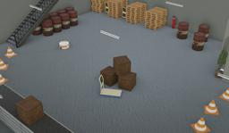

## PAL Robotics' TIAGo Base

%robot tiago-base images/robots/tiago_base/model.thumbnail.png

Designed by PAL Robotics, TIAGo Base is a two-wheeled robot.
The model is a modular mobile platform that automates deliveries in industrial environment. It is completely ROS based and customizable with accessories to adapt to any specific need.

More information on the TIAGo Base robot can be found on their [website](http://pal-robotics.com/robots/tiago-base/) or in the [technical specifications datasheet](http://pal-robotics.com/wp-content/uploads/2019/06/TIAGo-Base_Datasheet.pdf).

### TiagoBase PROTO

Derived from [Robot](../reference/robot.md).

```
TiagoBase {
  SFVec3f      translation     0 0 0
  SFRotation   rotation        1 0 0 -1.5708
  SFString     name            "TIAGo Base"
  SFString     controller      "tiagoBase"
  SFString     controllerArgs  ""
  SFString     customData      ""
  SFBool       supervisor      FALSE
  SFBool       synchronization TRUE
  SFString     model           "TIAGo Base"
  SFString     description     "two-wheeled robot designed by PAL Robotics"
  MFNode       bodyExtension   []
  MFNode       lidarExtension  []
}
```

> **File location**: "WEBOTS\_HOME/projects/robots/pal\_robotics/tiago\_base/protos/TiagoBase.proto"

#### TiagoBase Field Summary

- `bodyExtension`:  Extends the robot with new nodes (such as the `TiagoBody` for example).
- `lidarExtension`: Defines the lidar used {Sick TIM551 or Hokuyo URG 04LX_UG01}.

### Sample

You will find the following sample in this folder: "WEBOTS\_HOME/projects/robots/pal\_robotics/tiago\_base/worlds".

#### tiago\_base.wbt

 This simulation shows a TIAGo Base robot that automatically moves straight ahead but can also be controlled using the keyboard arrows.
