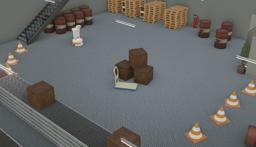

## PAL Robotics' TIAGo Iron

%robot tiago-iron images/robots/tiago_iron/model.thumbnail.png

Designed by PAL Robotics, TIAGo Iron is a two-wheeled human-like robot with a torso and a head but no articulated arm.
The model is a modular mobile platform that allows human-robot interaction. It is completely ROS based and customizable with accessories to adapt to any specific need.

More information on the TIAGo Iron robot can be found on their [website](http://pal-robotics.com/robots/tiago/) or in the [technical specifications datasheet](http://pal-robotics.com/wp-content/uploads/2019/07/Datasheet_TIAGo_Complete.pdf).

### TiagoIron PROTO

Derived from [Robot](../reference/robot.md).

```
TiagoIron {
  SFVec3f     translation      0 0 0
  SFRotation  rotation         1 0 0 -1.5708
  SFString    name             "TIAGo Iron"
  SFString    controller       "tiagoIron"
  MFString    controllerArgs   []
  SFString    customData       ""
  SFBool      supervisor       FALSE
  SFBool      synchronization  TRUE
  SFBool      selfCollision    FALSE
  MFNode      lidarSlot        []
}
```

> **File location**: "[WEBOTS\_HOME/projects/robots/pal\_robotics/tiago\_iron/protos/TiagoIron.proto](https://github.com/cyberbotics/webots/tree/master/projects/robots/pal_robotics/tiago_iron/protos/TiagoIron.proto)"

### Sample

You will find the following sample in this folder: "[WEBOTS\_HOME/projects/robots/pal\_robotics/tiago\_iron/worlds](https://github.com/cyberbotics/webots/tree/master/projects/robots/pal_robotics/tiago_iron/worlds)".

#### tiago\_iron.wbt

 This simulation shows a Tiago Iron moving in an industrial environment using a Braitenberg algorithm using the information received by its lidar.
