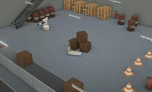

## PAL Robotics' TIAGo Titanium

%robot tiago-titanium images/robots/tiago_titanium/model.thumbnail.png

Designed by PAL Robotics, TIAGo Titanium is a two-wheeled human-like robot with a torso, a head and one articulated arm finished by a Hey5 hand as end-effector.
It is completely ROS based, fully customizable and expandable with extra sensors and devices like other end-effector (parallel gripper).

More information on the TIAGo Titanium robot can be found on their [website](http://pal-robotics.com/robots/tiago/) or in the [technical specifications datasheet](http://pal-robotics.com/wp-content/uploads/2019/07/Datasheet_TIAGo_Complete.pdf).

### TiagoTitanium PROTO

Derived from [Robot](../reference/robot.md).

```
TiagoTitanium {
  SFVec3f     translation      0 0 0
  SFRotation  rotation         1 0 0 -1.5708
  SFString    name             "TIAGo Titanium"
  SFString    controller       "tiagoTitanium"
  MFString    controllerArgs   []
  SFString    customData       ""
  SFBool      supervisor       FALSE
  SFBool      synchronization  TRUE
  SFBool      selfCollision    FALSE
  MFNode      lidarSlot        []
}
```

> **File location**: "[WEBOTS\_HOME/projects/robots/pal\_robotics/tiago\_titanium/protos/TiagoTitanium.proto](https://github.com/cyberbotics/webots/tree/master/projects/robots/pal_robotics/tiago_titanium/protos/TiagoTitanium.proto)"

### Sample

You will find the following sample in this folder: "[WEBOTS\_HOME/projects/robots/pal\_robotics/tiago\_titanium/worlds](https://github.com/cyberbotics/webots/tree/master/projects/robots/pal_robotics/tiago_titanium/worlds)".

#### tiago\_titanium.wbt

 This simulation shows a Tiago Titanium making hello with the sign "Peace" with these fingers in an industrial environment.
It can also be controlled using the arrows on the keyboard.
