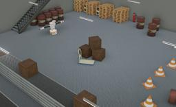

## PAL Robotics' TIAGo++

%robot tiagopp images/robots/tiago++/model.thumbnail.png

Designed by PAL Robotics, TIAGo++ is a two-wheeled human-like robot with two articulated arms finished by parallel grippers as end-effector.
The model includes two articulated arms with 7-DoF to perform coordinated dual-arm actions.
As the TIAGo model, this bi-manual version is completely ROS based, fully customizable and expandable with extra sensors and devices like end-effector (parallel gripper or Hey5 hand).

More information on the TIAGo++ robot can be found on their [website](http://blog.pal-robotics.com/tiago-bi-manual-robot-research/) or in the [technical specifications datasheet](http://pal-robotics.com/wp-content/uploads/2019/07/Datasheet_TIAGo_Complete.pdf).

### Movie Presentation


### Tiago++ PROTO

Derived from [Robot](../reference/robot.md).
```
Tiago++ {
  SFVec3f     translation           0 0 0
  SFRotation  rotation              1 0 0 -1.5708
  SFString    name                  "TIAGo++"
  SFString    controller            "tiago++"
  MFString    controllerArgs        []
  SFString    customData            ""
  SFBool      supervisor            FALSE
  SFBool      synchronization       TRUE
  SFBool      selfCollision         FALSE
  MFNode      lidarSlot             []
  MFNode      endEffectorRightSlot  TiagoGripper { name "right" }
  MFNode      endEffectorLeftSlot   TiagoGripper { name "left" }
}
```
> **File location**: "[WEBOTS\_HOME/projects/robots/pal\_robotics/tiago++/protos/Tiago++.proto](https://github.com/cyberbotics/webots/tree/master/projects/robots/pal_robotics/tiago++/protos/Tiago++.proto)"

#### Tiago++ Field Summary

- `endEffectorRightSlot`: Extends the right arm with new nodes (such as the `TiagoRightHey5` for example).
- `endEffectorLeftSlot`: Extends the left arm with new nodes (such as the `TiagoLeftHey5` for example).

### Sample

You will find the following sample in this folder: "[WEBOTS\_HOME/projects/robots/pal\_robotics/tiago++/worlds](https://github.com/cyberbotics/webots/tree/master/projects/robots/pal_robotics/tiago++/worlds)".

#### tiago++.wbt

 This simulation shows a Tiago++ making hello with both arms in an industrial environment. It can also be controlled using the arrows on the keyboard.
