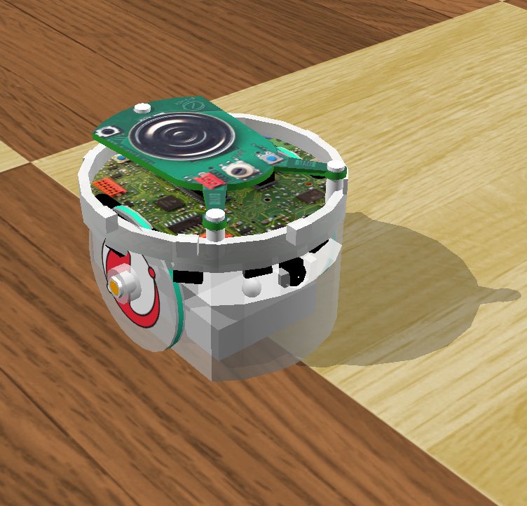

## Tutorial 1: Your First Simulation in Webots (20 Minutes)

In this first tutorial, you will create your first simulation.
This simulation will contain a simple environment (a light and an arena with floor and walls), a predefined robot (e-puck) and a controller program that will make the robot move (see [this figure](#what-you-should-see-at-the-end-of-the-tutorial)).
The objective of this tutorial is to familiarize yourself with the user interface and with the basic concepts of Webots.

%figure "What you should see at the end of the tutorial."



%end

### Create a New World

A World contains information like where the objects are, what they look like, how they interact with each other, what is the sky color, where is the gravity vector, etc.

> **Theory**: A **World** defines the initial state of a simulation.
The different objects are called **Nodes** and are organized hierarchically in a **Scene Tree**.
It means that a node can have some sub-nodes.

<!-- -->

> **Note**: A world is stored in a file having the ".wbt" extension.
The file format is derived from the **VRML97** language, and is human readable.
The world files must be stored directly in the project subdirectory called "worlds".

Webots is currently open and runs an arbitrary simulation.

> **Hands on**: Pause the current simulation by clicking on the `Pause` button of the 3D view.
The simulation is paused if the virtual time counter on the main toolbar is stable.

<!-- -->

> **Hands on**: Create a new world by selecting the `File / New World` menu item.

A new world is now open.
For now, the 3D window displays nothing.
The Scene Tree view (on the left hand side) currently lists the fundamental nodes:

- [WorldInfo](../reference/worldinfo.md): containing misc global parameters.
- [Viewpoint](../reference/viewpoint.md): defining the main camera parameters.

As no light and no 3D object are defined, the entire scene is empty, and thus nothing is displayed.

Each node has some customizable properties called **fields**.
The first step is about modifying the background color.

> **Hands on**: Create a [Background](../reference/background.md) node by clicking on the plus icon above the Scene Tree view, and select "Background" from the "New Node" option.
Modify the background color, by setting up the `skyColor` field of the [Background](../reference/background.md) node.
Choose a dark gray color (e.g. red = 0.2, green = 0.2 and blue = 0.2) using the color picker at the bottom of the Scene Tree view.
The background of the 3D view should be modified accordingly.

Now, we would like to add some environment object (a floor and some walls).
A predefined node called `RectangleArena` is designed to accomplish this task quickly.

> **Hands on**: Select the last node of the Scene Tree view ([Background](../reference/background.md)).
Click on the `Add` button at the top of the Scene Tree view.
In the open dialog box, choose `PROTO (Webots) / objects / floors / RectangleArena`.
The new node has been added and appears far away.
Use the left click and the wheel of the mouse in the 3D view to choose a better viewpoint.

However, the rectangle arena appears black because the scene is still unlit.
Now we would like to add some light to the scene.

> **Hands on**: Select the last node of the Scene Tree view (`RectangleArena`).
Click on the `Add` button.
In the open dialog box, choose `New node / DirectionalLight`.
The new node has been added and we can admire our rectangle arena's colors.

It's a good time to improve the scene light.

> **Hands on**: Modify the following fields of the `DirectionalLight` node:

    - `intensity` to 2.3.
    - `direction` to [-0.33 -1 0.5].
    - `castShadows` to TRUE.

<!-- -->

> **Note**: In the Scene Tree view, the fields are displayed in a different color (depending on the theme) if they differ from their default values.

Now your environment should look like the one depicted in the [figure](prerequisites.md#the-webots-main-window-splits-into-four-dockable-subwindows-the-scene-tree-view-on-the-left-hand-side-including-a-panel-at-the-bottom-for-editing-fields-values-the-3d-view-in-the-center-the-text-editor-on-the-right-hand-side-and-the-console-at-bottom-of-the-window-note-that-some-of-these-subwindows-have-a-toolbar-with-buttons-the-main-menus-appear-on-the-top-of-the-main-window-the-virtual-time-counter-and-the-speedometer-are-displayed-in-the-right-part-of-the-main-toolbar-the-status-text-is-displayed-in-the-bottom-left-of-the-main-window).

> **Hands on**: Save the new world into your project by selecting the `File / Save World As...` menu item.
Using the dialog box save the world into the "my\_webots\_projects/tutorials/worlds/my\_first\_simulation.wbt" file location.

<!-- -->

> **Hands on**: Reload the simulation by selecting the `File / Reload World` menu item.

<!-- -->

> **Note**: You can change the viewpoint of the 3D view by using the mouse buttons (left button, right button and the wheel).

<!-- -->

> **Theory**: Webots nodes stored in world files are organized in a tree structure called the **scene tree**.
The scene tree can be viewed in two subwindows of the main window: the 3D view (at the center of the main window) is the 3D representation of the scene tree and the scene tree view (on the left) is the hierarchical representation of the scene tree.
The scene tree view is where the nodes and the fields can be modified.

<!-- -->

> **Hands on**: In the 3D view, click on the floor to selected it.
When it is selected, the floor is surrounded by white lines and the corresponding node is selected in the Scene Tree view.
Now click on the blue sky to unselect the floor.

### Add an e-puck Robot

The e-puck is a small robot having differential wheels, 10 [LEDs](../reference/led.md), and several sensors including 8 [DistanceSensors](../reference/distancesensor.md) and a [Camera](../reference/camera.md).
In this tutorial we are only interested in using its wheels.
We will learn how to use some other e-puck features in the other tutorials.

Now, we are going to add an e-puck model to the world.
Make sure that the simulation is paused and that the virtual time elapsed is 0.

> **Theory**: When a Webots world is modified with the intention of being saved, it is fundamental that the simulation is first paused and reloaded to its initial state, i.e. the virtual time counter on the main toolbar should show 0:00:00:000.
Otherwise at each save, the position of each 3D objects can accumulate errors.
Therefore, any modification of the world should be performed in that order: **pause, reload, modify and save the simulation**.

As we don't need to create the e-puck robot from scratch, we will just have to import a special E-puck node (in fact: a PROTO node as the `RectangleArena` we introduced before).
A PROTO is an abstract assemblage of several nodes.
PROTO nodes are defined in separate ".proto", but this will be explained in more details later.
For now, consider the E-puck node as a black box that contains all the necessary nodes to define a e-puck robot.

> **Hands on**: Select the last node of the Scene Tree view (called `RectangleArena`).
In order to add the E-puck node, click on the `Add` button at the top of the Scene Tree view.
In the open dialog box, and choose `PROTO (Webots) / robots / gctronic / e-puck / E-puck (Robot)`.
Then save the simulation.

<!-- -->

> **Note**: Now if you run the simulation, the robot moves: that's because the robot uses a default controller with that behavior.
Please pause and reload the world before going on.

<!-- -->

> **Note**: You can change the robot's position in the 3D view using the translation and rotation handles (see [this section](the-3d-window.md#axis-aligned-handles)).

> Alternatively, the following keyboard shortcuts are available:

> *SHIFT + left-click + drag* to move the robot parallel to the floor;

> *SHIFT + mouse-wheel* to move the robot up or down.

> Finally, it is possible to apply a force to the robot: *ALT + left-click + drag*.

> **Note**: On Linux, you should also press the *CTRL* key in addition to *ALT + left-click + drag*.

<!-- -->

> **Note**: Starting the simulation by pressing the `Run` button will make Webots running the simulation as fast as possible.
In order to obtain a real-time simulation speed, the `Real-Time` button needs to be pressed.

Now we are going to modify the world and decrease the step of the physics simulation: this will increase the accuracy of the simulation.

> **Hands on**: In the Scene Tree view, expand the [WorldInfo](../reference/worldinfo.md) node (the first node).
Set its `basicTimeStep` field to *16*.
Then save the simulation.

Just after you add the E-puck node, a black window appears in the upper-left corner of the 3D view.
It shows the content of [Camera](../reference/camera.md) nodes, but it will stay black until not explicitly used during a simulation.
The camera can be resized by dragging the marked corner or hidden by clicking the "x" in the top-right of the camera window.

> **Hands on**: In this tutorial we will not use the [Camera](../reference/camera.md) devices of the E-puck.
So we can hide the window by clicking the "x" on the camera window.
Don't forget to reload the world before hiding the camera and to save it after the modifications.

### Create a New Controller

We will now program a simple controller that will just make the robot move forwards.
As there is no obstacle, the robot will move forwards for ever.
Firstly we will create and edit the C controller, then we will link it to the robot.

> **Theory**: A **controller** is a program that defines the behavior of a robot.
Webots controllers can be written in the following programming languages: C, C++, Java, Python, MATLAB, etc.
Note that C, C++ and Java controllers need to be compiled before they can be run as robot controllers.
Python and MATLAB controllers are interpreted languages so they will run without being compiled.
The `controller` field of a robot specifies which controller is currently linked with to it.
Please take notice that a controller can be used by several robots, but a robot can only use one controller at a time.

<!-- -->

> **Note**: Each robot controller is executed in a separate child process spawned by Webots.
Controllers don't share the same address space, and they can run on different processor cores.

<!-- -->

> **Note**: Other languages than C are available but may require a setup.
Please refer to the language chapter to setup other languages (see [this chapter](language-setup.md)).

<!-- -->

> **Hands on**: Create a new C controller called *e-puck\_go\_forward* using the `Wizards / New Robot Controller...` menu.
This will create a new "e-puck\_go\_forward" directory in "my\_webots\_projects/tutorials/controllers".
Select the option offering you to open the source file in the text editor.

The new C source file is displayed in Webots text editor window.
This C file can be compiled without any modification, however the code has no real effect.
We will now link the E-puck node with the new controller before modifying it.

> **Hands on**: Link the `E-puck` node with the *e-puck\_go\_forward* controller.
This can be done in the Scene Tree view by selecting the `controller` field of the E-puck node, then use the field editor at the bottom of the Scene Tree view: press the `Select...` button and then select *e-puck\_go\_forward* in the list.
Once the controller is linked, save the world.

<!-- -->

> **Hands on**: Modify the program by inserting an include statement (`#include <webots/motor.h>`), getting the motor devices (`WbDeviceTag motor = wb_robot_get_device("motor_name");`), and by applying a motor command (`wb_motor_set_position(motor, 10);`):

> ```c
> #include <webots/robot.h>
>
> // Added a new include file
> #include <webots/motor.h>
>
> #define TIME_STEP 64
>
> int main(int argc, char **argv)
> {
>   wb_robot_init();
>
>   // get the motor devices
>   WbDeviceTag left_motor = wb_robot_get_device("left wheel motor");
>   WbDeviceTag right_motor = wb_robot_get_device("right wheel motor");
>   // set the target position of the motors
>   wb_motor_set_position(left_motor, 10.0);
>   wb_motor_set_position(right_motor, 10.0);
>
>   while (wb_robot_step(TIME_STEP) != -1);
>
>   wb_robot_cleanup();
>
>   return 0;
> }
> ```

<!-- -->

> **Hands on**: Save the modified source code (`File / Save Text File`), and compile it (`Build / Build`).
Fix any compilation errors if necessary.
When Webots proposes to reload the world, choose `Yes`.

If everything is ok, your robot should move forwards.
The robot will move using it's maximum speed for a while and then stop once the wheels have rotated of 10 radians.

> **Note**: In the "controllers" directory of your project, a directory containing the *e-puck\_go\_forward* controller has been created.
The "e-puck\_go\_forward" directory contains an "e-puck\_go\_forward" binary file generated after the compilation of the controller.
Note that the controller directory name should match with the binary name.

### Extend the Controller to Speed Control

The wheels of differential wheels robots are often controlled in velocity and not in position like we did in the previous example.
In order to control the motors of the wheels in speed you need to set the target position to the infinity and the set the desired speed:

> ```c
> #include <webots/robot.h>
>
> // Added a new include file
> #include <webots/motor.h>
>
> #define TIME_STEP 64
>
> #define MAX_SPEED 6.28
>
> int main(int argc, char **argv)
> {
>   wb_robot_init();
>
>   // get a handler to the motors and set target position to infinity (speed control)
>   WbDeviceTag left_motor = wb_robot_get_device("left wheel motor");
>   WbDeviceTag right_motor = wb_robot_get_device("right wheel motor");
>   wb_motor_set_position(left_motor, INFINITY);
>   wb_motor_set_position(right_motor, INFINITY);
>
>   // set up the motor speeds at 10% of the MAX_SPEED.
>   wb_motor_set_velocity(left_motor, 0.1 * MAX_SPEED);
>   wb_motor_set_velocity(right_motor, 0.1 * MAX_SPEED);
>
>   while (wb_robot_step(TIME_STEP) != -1) {
>   }
>
>   wb_robot_cleanup();
>
>   return 0;
> }
> ```

Try to change your previous controller by this one, and then recompile and reload the world.
The robot will now move (the wheels will rotate at a speed of 1 radian per second) and never stop.

### Conclusion

We hope you enjoyed creating your first simulation.
You have been able to set up your environment, to add a robot and to program it.
The important thing is that you learnt the fundamental concepts summarized below:

A Webots world is made up of nodes organized in a VRML97-like tree structure.
A world is saved in a ".wbt" file stored in a Webots project.
The project also contains the robot controllers which are the programs that define the robots' behavior.
Robot controllers can be written in C (or other languages).
C controllers have to be compiled before they can be executed.
Controllers are linked to robots via the `controller` fields of the robot nodes.
