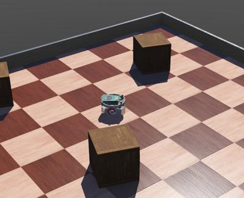

## Tutorial 1: Your First Simulation in Webots (30 Minutes)

The objective of this first tutorial is to familiarize yourself with the user interface and with the basic concepts of Webots.
You will create your first simulation containing a simple environment: an arena with floor and walls, a few boxes, an e-puck robot and a controller program that will make the robot move.

%figure "What you should see at the end of the first tutorial."

%end

### Start Webots

If not already done, download and install Webots, following these [installation instructions](installing-webots.md).

> **Hands-on #1**: [Start Webots](starting-webots.md) by double-clicking on its icon (or invoking it from a command line in a Terminal).
If you are running Webots for the first time on this computer, you may be prompted to select a graphical theme.
You may also be invited to follow the Webots guided tour, go ahead and close the guided tour.

If you never saw it, please take some time to view the demos featured in the guided tour.
They are telling a lot about the possibilities of Webots.
The guided tour is also available from the *Help* menu of Webots.

### Create a New World

A **World** is a file containing information like where the objects are, what they look like, how they interact with each other, what is the color of the sky, and the definitions of gravity, friction, masses of the objects, etc.
It defines the initial state of a simulation.
The different objects are called **Nodes** and are organized hierarchically in a **Scene Tree**.
Therefore, a node may contain sub-nodes.
A world is stored in a file having the `.wbt` extension.
The file format is derived from the **VRML97** language, and is human readable.
The world files must be stored directly in a directory called `worlds`.

> **Hands-on #2**: Pause the current simulation by clicking on the `Pause` button  of the 3D view (see the [user interface description](the-user-interface.md#simulation-menu) to find out the buttons).
The simulation is paused if the virtual time counter on the main toolbar is stopped.
Create a new project from the **File / New / New Project Directory...** menu item and follow the instructions:
1. Name the project directory `my_first_simulation` instead of the proposed `my_project`.
2. Name the world file `my_first_simulation.wbt` instead of the proposed `empty.wbt`.
3. Click all the tick boxes, including the "Add a rectangle arena" which is not ticked by default.

Webots displays a list of directories and files it just created.
This corresponds to the [standard file hierarchy of a Webots project](the-standard-file-hierarchy-of-a-project.md).
Click on the `Finish` (Windows, Linux) or `Done` (macOS) button to close this window.

Congratulations, you just created your very first Webots world!
The 3D view should display a square arena with a checkered floor.
You can move the viewpoint in the 3D view [using the mouse](the-3d-window.md#navigation-in-the-scene): left button, right button and the wheel.

Webots nodes stored in world files are organized in a tree structure called the **scene tree**.
The scene tree can be viewed in two sub-windows of the main window: the [3D view](the-3d-window.md) (at the center of the main window) is the 3D representation of the scene tree and the [scene tree view](the-scene-tree.md) (on the left) is the hierarchical representation of the scene tree.
The [scene tree view](the-scene-tree.md) is where the nodes and fields can be modified.
It should currently list the following nodes:

- [WorldInfo](../reference/worldinfo.md): contains global parameters of the simulation.
- [Viewpoint](../reference/viewpoint.md): defines the main viewpoint camera parameters.
- [TexturedBackground](https://webots.cloud/run?url={{ url.github_blob }}/projects/objects/backgrounds/protos/TexturedBackground.proto): defines the background of the scene (you should see mountains far away if you rotate a little bit the viewpoint)
- [TexturedBackgroundLight](https://webots.cloud/run?url={{ url.github_blob }}/projects/objects/backgrounds/protos/TexturedBackgroundLight.proto): defines the light associated with the above background.
- [RectangleArena](https://webots.cloud/run?url={{ url.github_blob }}/projects/objects/floors/protos/RectangleArena.proto): define the only object you see so far in this scene.

Each node has some customizable properties called **Fields**.
Let's modify these fields to change the rectangle arena:

> **Hands-on #3**: Double-click on the `RectangleArena` node in the scene tree.
This should open the node and display its fields.
1. Select the `floorTileSize` field and set its value to `0.25 0.25` instead of `0.5 0.5`.
You should see the effect immediately in the 3D view.
2. Select the `wallHeight` field and change its value to `0.05` instead of `0.1`.
The wall of the arena should now be lower.

In the [scene tree view](the-scene-tree.md), the fields are displayed in a different color (depending on the theme) if they differ from their default values.
Now, we would like to add some objects:

> **Hands-on #4**: Double-click on the `RectangleArena` in the scene tree to close it and select it.
Click on the `Add` button  at the top of the scene tree.
In the open dialog box, choose `PROTO nodes (Webots Projects) / objects / factory / containers / WoodenBox (Solid)`.
A big box should appear in the middle of the arena.
Double-click on it in the scene tree to open its fields.
1. Change its `size` to `0.1 0.1 0.1` instead of `0.6 0.6 0.6`.
2. Change its `translation` to `0 0 0.05` instead of `0 0 0.3`.
Alternatively, you may use the blue arrow that appears in the 3D view to adjust its `translation.z` field.
3. Now shift-click and drag the box in the 3D view and move it in some corner of the arena.
4. Select the box and press <kbd>ctrl</kbd>-<kbd>C</kbd>, <kbd>ctrl</kbd>-<kbd>V</kbd> (Windows, Linux) or <kbd>⌘ command</kbd>-<kbd>C</kbd>, <kbd>⌘ command</kbd>-<kbd>V</kbd> (macOS) to copy and paste it.
Shift-click and drag the new box to move it at some different location.
Create a third box this way.
5. Move the boxes, so that no box is at the center of the arena.
You may also use the blue rotation arrows to rotate the boxes along the vertical axis.
This can be done also by shift-click and drag with the right mouse button.
Alternatively, you can change the angle of the `rotation` field of the `WoodenBox` nodes in the scene tree.
6. Once you are satisfied with the result, save the world using the save button.

Using the translation and rotation handles to move objects is explained in [this section](the-3d-window.md#axis-aligned-handles).

### Add an e-puck Robot

The e-puck is a small robot having differential wheels, 10 [LEDs](../reference/led.md), and several sensors including 8 [DistanceSensors](../reference/distancesensor.md) and a [Camera](../reference/camera.md).
In this tutorial we are only interested in using its wheels.
We will learn how to use other capabilities in the next tutorials.

Now, we are going to add an e-puck model to the world.
Make sure that the simulation is paused and that the virtual time elapsed is 0.
If this is not the case, reset the simulation with the `Reset` button .

When a Webots world is modified with the intention of being saved, it is fundamental that the simulation is first paused and reloaded to its initial state, i.e. the virtual time counter on the main toolbar should show 0:00:00:000.
Otherwise at each save, the position of each 3D object can accumulate errors.
Therefore, any modification of the world should be performed in that order: **pause, reset, modify and save the simulation**.

We don't need to create the e-puck robot from scratch, we will just have to import a `E-puck` node.
This node is actually a [PROTO](../reference/proto.md) node, like the `RectangleArena` or the `WoodenBox` we introduced before. Prototyping allows you to create custom objects and to reuse them.

> **Hands-on #5**: Select the last node `WoodenBox` of the scene tree view.
Click on the `Add` button  at the top of the scene tree view.
In the dialog box, choose `PROTO nodes (Webots Projects) / robots / gctronic / e-puck / E-puck (Robot)`.
An e-puck robot should appear in the middle of the arena.
Move and rotate this robot, the same way you did it with the boxes.
Save the simulation and press the `Run real-time` button .

The robot should move, blink LEDs and avoid obstacles.
That's because it has a default controller with that behavior.
You may have noticed a small black window appearing in the upper-left corner of the 3D view.
It shows the image taken by the [Camera](../reference/camera.md) of the e-puck robot.
This image will remain black until the camera is explicitly enabled by the controller of the robot.
This small image window can be [moved](the-3d-window.md#moving-and-resizing-overlays) around by dragging it.
It can also be [resized](the-3d-window.md#moving-and-resizing-overlays) by dragging the bottom-right corner.
Finally, it can be closed by clicking the "x" in the top-right corner.
You can make it visible again from the **Overlays** menu, by selecting it in the **Camera Devices** submenu.
Because we won't need it, you can actually close it.

Now, while the simulation is running, let's play with the physics:

> **Hands-on #6**: [Apply a force](the-3d-window.md#applying-a-force-to-a-solid-object-with-physics) to the robot by pressing <kbd>alt</kbd> *+ left-click + drag* (use the <kbd>⌥ option</kbd> key on some Mac keyboards).
On Linux, you should also press the <kbd>ctrl</kbd> key in addition to <kbd>alt</kbd> *+ left-click + drag*.
It is not possible to apply a force to a `WoodenBox` node, because by default, they have no mass and are considered as glued on the floor.
To enable physics on the `WoodenBox` nodes, you should set their `mass` field to a certain value (for example 0.2 kg).
Once this is done, should be able to apply a force on them as well.

The simulation may be paused , run step-by-step , in real time  or in fast  modes.

Now we are going to modify the world and decrease the step of the physics simulation: this will increase the accuracy and stability of the simulation (but reduce the maximum simulation speed).

> **Hands-on #7**: Pause the simulation and revert it.
In the Scene Tree view, expand the [WorldInfo](../reference/worldinfo.md) node (the first node).
Set its `basicTimeStep` field to *16*.
Then save the simulation.

### Create a New Controller

We will now program a simple controller that will just make the robot move forwards.

A **controller** is a program that defines the behavior of a robot.
Webots controllers can be written in the following programming languages: C, C++, Java, Python, MATLAB, ROS, etc.
C, C++ and Java controllers need to be compiled before they can be run as robot controllers.
Python and MATLAB controllers are interpreted languages so they will run without being compiled.
In this tutorial, we are going to use C as a reference language but all the code snippets are also available in C++, Java, Python and MATLAB.
Refer to the [language chapter](language-setup.md) to setup a controller using a different programming language.

The `controller` field of a `Robot` node specifies which controller is currently associated to the robot.
Note that the same controller can be used by several robots, but a robot can only use one controller at a time.
Each controller is executed in a separate child process usually spawned by Webots.
Because they are independent processes, controllers don't share the same address space, and may run on different processor cores.

> **Hands-on #8**: Create a new C (or any other language) controller called `epuck_go_forward` (for C++ and Java call it `EPuckGoForward` instead) using the **File / New / New Robot Controller...** menu item.
This will create a new `epuck_go_forward` (or `EPuckGoForward`) directory in `my_first_simulation/controllers`.
Select the option offering you to open the source file in the text editor.

The new source file is displayed in Webots text editor window.
This source file may be compiled (if written in C, C++ or Java) without any modification, however the current code has no real effect.
We will now associate new `epuck_go_forward` (or `EPuckGoForward`) controller to the `E-puck` node.

%tab-component "language"
%tab "C"
> **Hands-on #9**: In the scene tree view, select the `controller` field of the `E-puck` node, then use the field editor at the bottom of the Scene Tree view: press the `Select...` button and then select `epuck_go_forward` in the list.
>Once the controller is associated with the robot, save the world.
>Modify the program by inserting an include statement (`#include <webots/motor.h>`), getting the motor devices (`WbDeviceTag motor = wb_robot_get_device("motor_name");`), and by applying a motor command (`wb_motor_set_position(motor, 10);`):
>```c
>#include <webots/robot.h>
>
>// Added a new include file
>#include <webots/motor.h>
>
>#define TIME_STEP 64
>
>int main(int argc, char **argv) {
>  wb_robot_init();
>
>  // get the motor devices
>  WbDeviceTag left_motor = wb_robot_get_device("left wheel motor");
>  WbDeviceTag right_motor = wb_robot_get_device("right wheel motor");
>  // set the target position of the motors
>  wb_motor_set_position(left_motor, 10.0);
>  wb_motor_set_position(right_motor, 10.0);
>
>  while (wb_robot_step(TIME_STEP) != -1);
>
>  wb_robot_cleanup();
>
>  return 0;
>}
>```
>Save the modified source code (`File / Save Text File`), and compile it (`Build / Build`).
>Fix any compilation errors if necessary.
>When Webots proposes to reset or reload the world, choose `Reset` and run the simulation.
%tab-end

%tab "C++"
> **Hands on #9**: In the scene tree view, select the `controller` field of the `E-puck` node, then use the field editor at the bottom of the Scene Tree view: press the `Select...` button and then select `EPuckGoForward` in the list.
>Once the controller is associated with the robot, save the world.
>Modify the program by inserting an include statement (`#include <webots/Motor.hpp>`), getting the motor devices (`Motor *leftMotor = robot->getMotor("left wheel motor");`), and by applying a motor command (`leftMotor->setPosition(10.0);`):
>```cpp
>#include <webots/Robot.hpp>
>
>// Added a new include file
>#include <webots/Motor.hpp>
>
>#define TIME_STEP 64
>
>// All the webots classes are defined in the "webots" namespace
>using namespace webots;
>
>int main(int argc, char **argv) {
>  Robot *robot = new Robot();
>
>  // get the motor devices
>  Motor *leftMotor = robot->getMotor("left wheel motor");
>  Motor *rightMotor = robot->getMotor("right wheel motor");
>  // set the target position of the motors
>  leftMotor->setPosition(10.0);
>  rightMotor->setPosition(10.0);
>
>  while (robot->step(TIME_STEP) != -1);
>
>  delete robot;
>
>  return 0;
>}
>```
>Save the modified source code (`File / Save Text File`), and compile it (`Build / Build`).
>Fix any compilation errors if necessary.
>When Webots proposes to reset or reload the world, choose `Reset` and run the simulation.
%tab-end

%tab "Python"
> **Hands on #9**: In the scene tree view, select the `controller` field of the `E-puck` node, then use the field editor at the bottom of the Scene Tree view: press the `Select...` button and then select `epuck_go_forward` in the list.
>Once the controller is associated with the robot, save the world.
>Modify the program by getting the motor devices (`leftMotor = robot.getDevice('left wheel motor')`), and by applying a motor command (`leftMotor.setPosition(10.0)`):
>```python
>from controller import Robot, Motor
>
>TIME_STEP = 64
>
># create the Robot instance.
>robot = Robot()
>
># get the motor devices
>leftMotor = robot.getDevice('left wheel motor')
>rightMotor = robot.getDevice('right wheel motor')
># set the target position of the motors
>leftMotor.setPosition(10.0)
>rightMotor.setPosition(10.0)
>
>while robot.step(TIME_STEP) != -1:
>    pass
>```
>Save the modified source code (`File / Save Text File`), reset and run the simulation.
%tab-end

%tab "Java"
> **Hands on #9**: In the scene tree view, select the `controller` field of the `E-puck` node, then use the field editor at the bottom of the Scene Tree view: press the `Select...` button and then select `EPuckGoForward` in the list.
>Once the controller is associated with the robot, save the world.
>Modify the program by inserting an import statement (`import com.cyberbotics.webots.controller.Motor;`), getting the motor devices (`Motor leftMotor = robot.getMotor("left wheel motor");`), and by applying a motor command (`leftMotor.setPosition(10.0);`):
>```java
>import com.cyberbotics.webots.controller.Robot;
>
>// Added a new include file
>import com.cyberbotics.webots.controller.Motor;
>
>public class EPuckGoForward {
>
>  public static void main(String[] args) {
>
>    int TIME_STEP = 64;
>
>    Robot robot = new Robot();
>
>    // get the motor devices
>    Motor leftMotor = robot.getMotor("left wheel motor");
>    Motor rightMotor = robot.getMotor("right wheel motor");
>    // set the target position of the motors
>    leftMotor.setPosition(10.0);
>    rightMotor.setPosition(10.0);
>
>    while (robot.step(TIME_STEP) != -1);
>  }
>}
>```
>Save the modified source code (`File / Save Text File`), and compile it (`Build / Build`).
>Fix any compilation errors if necessary.
>When Webots proposes to reset or reload the world, choose `Reset` and run the simulation.
%tab-end

%tab "MATLAB"
> **Hands on #9**: In the scene tree view, select the `controller` field of the `E-puck` node, then use the field editor at the bottom of the Scene Tree view: press the `Select...` button and then select `epuck_go_forward` in the list.
>Once the controller is associated with the robot, save the world.
>Modify the program by getting the motor devices (`left_motor = wb_robot_get_device('left wheel motor')`) and by applying a motor command (`wb_motor_set_position(right_motor, 10.0)`):
>```MATLAB
>function epuck_go_forward
>
>TIME_STEP = 64;
>
>% get the motor devices
>left_motor = wb_robot_get_device('left wheel motor');
>right_motor = wb_robot_get_device('right wheel motor');
>% set the target position of the motors
>wb_motor_set_position(left_motor, 10.0);
>wb_motor_set_position(right_motor, 10.0);
>
>while wb_robot_step(TIME_STEP) ~= -1
>end
>```
>Save the modified source code (`File / Save Text File`), reset and run the simulation.
%tab-end
%end

If everything is fine, your robot should move forwards.
The robot will move using its maximum speed for a while and then stop once the wheels have rotated of 10 radians.

In the `controllers` directory of your project, a directory containing the `epuck_go_forward` (or `EPuckGoForward`) controller has been created.
The `epuck_go_forward` (or `EPuckGoForward`) directory contains a `epuck_go_forward` (or `EPuckGoForward`) binary file generated after the compilation of the controller (on Windows, this file has the `.exe` extension).
The controller directory name should match with the binary name.

### Extend the Controller to Speed Control

The robots wheels are often controlled using velocity, and not position like we did in the previous example.
In order to control the motors of the wheels in speed you need to set the target position to the infinity and to set the desired speed:

%tab-component "language"
%tab "C"
> **Hands-on #10**: Modify the controller program as shown below, recompile it and run it:
> ```c
> #include <webots/robot.h>
>
> // Added a new include file
> #include <webots/motor.h>
>
> #define TIME_STEP 64
>
> #define MAX_SPEED 6.28
>
> int main(int argc, char **argv) {
>   wb_robot_init();
>
>   // get a handler to the motors and set target position to infinity (speed control)
>   WbDeviceTag left_motor = wb_robot_get_device("left wheel motor");
>   WbDeviceTag right_motor = wb_robot_get_device("right wheel motor");
>   wb_motor_set_position(left_motor, INFINITY);
>   wb_motor_set_position(right_motor, INFINITY);
>
>   // set up the motor speeds at 10% of the MAX_SPEED.
>   wb_motor_set_velocity(left_motor, 0.1 * MAX_SPEED);
>   wb_motor_set_velocity(right_motor, 0.1 * MAX_SPEED);
>
>   while (wb_robot_step(TIME_STEP) != -1) {
>   }
>
>   wb_robot_cleanup();
>
>   return 0;
> }
> ```
%tab-end

%tab "C++"
> **Hands on #10**: Modify the controller program as shown below, recompile it and run it:
>```cpp
>#include <webots/Robot.hpp>
>
>// Added a new include file
>#include <webots/Motor.hpp>
>
>#define TIME_STEP 64
>
>#define MAX_SPEED 6.28
>
>// All the webots classes are defined in the "webots" namespace
>using namespace webots;
>
>int main(int argc, char **argv) {
>  Robot *robot = new Robot();
>
>  // get a handler to the motors and set target position to infinity (speed control)
>  Motor *leftMotor = robot->getMotor("left wheel motor");
>  Motor *rightMotor = robot->getMotor("right wheel motor");
>  leftMotor->setPosition(INFINITY);
>  rightMotor->setPosition(INFINITY);
>
>  // set up the motor speeds at 10% of the MAX_SPEED.
>  leftMotor->setVelocity(0.1 * MAX_SPEED);
>  rightMotor->setVelocity(0.1 * MAX_SPEED);
>
>  while (robot->step(TIME_STEP) != -1);
>
>  delete robot;
>
>  return 0;
>}
>```
%tab-end

%tab "Python"
> **Hands on #10**: Modify the controller program as shown below, recompile it and run it:
>```python
>from controller import Robot, Motor
>
>TIME_STEP = 64
>
>MAX_SPEED = 6.28
>
># create the Robot instance.
>robot = Robot()
>
># get a handler to the motors and set target position to infinity (speed control)
>leftMotor = robot.getDevice('left wheel motor')
>rightMotor = robot.getDevice('right wheel motor')
>leftMotor.setPosition(float('inf'))
>rightMotor.setPosition(float('inf'))
>
># set up the motor speeds at 10% of the MAX_SPEED.
>leftMotor.setVelocity(0.1 * MAX_SPEED)
>rightMotor.setVelocity(0.1 * MAX_SPEED)
>
>while robot.step(TIME_STEP) != -1:
>    pass
>```
%tab-end

%tab "Java"
> **Hands on #10**: Modify the controller program as shown below, recompile it and run it:
>```java
>import com.cyberbotics.webots.controller.Robot;
>
>// Added a new include file
>import com.cyberbotics.webots.controller.Motor;
>
>public class EPuckGoForward {
>
>  public static void main(String[] args) {
>
>    int TIME_STEP = 64;
>
>    double MAX_SPEED = 6.28;
>
>    Robot robot = new Robot();
>
>    // get a handler to the motors and set target position to infinity (speed control)
>    Motor leftMotor = robot.getMotor("left wheel motor");
>    Motor rightMotor = robot.getMotor("right wheel motor");
>    leftMotor.setPosition(Double.POSITIVE_INFINITY);
>    rightMotor.setPosition(Double.POSITIVE_INFINITY);
>
>    // set up the motor speeds at 10% of the MAX_SPEED.
>    leftMotor.setVelocity(0.1 * MAX_SPEED);
>    rightMotor.setVelocity(0.1 * MAX_SPEED);
>
>    while (robot.step(TIME_STEP) != -1);
>  }
>}
>```
%tab-end

%tab "MATLAB"
> **Hands on #10**: Modify the controller program as shown below, recompile it and run it:
>```MATLAB
>function epuck_go_forward
>
>TIME_STEP = 64;
>
>MAX_SPEED = 6.28;
>
>% get a handler to the motors and set target position to infinity (speed control)
>left_motor = wb_robot_get_device('left wheel motor');
>right_motor = wb_robot_get_device('right wheel motor');
>wb_motor_set_position(left_motor, inf);
>wb_motor_set_position(right_motor, inf);
>
>% set up the motor speeds at 10% of the MAX_SPEED.
>wb_motor_set_velocity(left_motor, 0.1 * MAX_SPEED);
>wb_motor_set_velocity(right_motor, 0.1 * MAX_SPEED);
>
>while wb_robot_step(TIME_STEP) ~= -1
>end
>```
%tab-end
%end

The robot will now move (the wheels will rotate at a speed of 0.2 radian per second) and never stop.
If nothing happens, don't forget to compile your code by selecting the `Build / Build` menu item or clicking on the gear icon  above the code area.
Compilation errors are displayed in red in the console.
If there are any, fix them and retry to compile.
Then, reload the world.

### Conclusion

We hope you enjoyed creating your first Webots simulation.
You have been able to set up a world, add a robot and program it.
The important thing is that you learned the fundamental concepts summarized below:

- A world is made up of nodes organized in a tree structure.
- A world is saved in a `.wbt` file stored in a Webots project.
- The project also contains the robot controller programs which define the behavior of the robots.
- Controllers may be written in C or other languages.
- C, C++ and Java controllers have to be explicitly compiled before they can be executed.
- Controllers are associated with robots via the `controller` fields of the `Robot` node.
