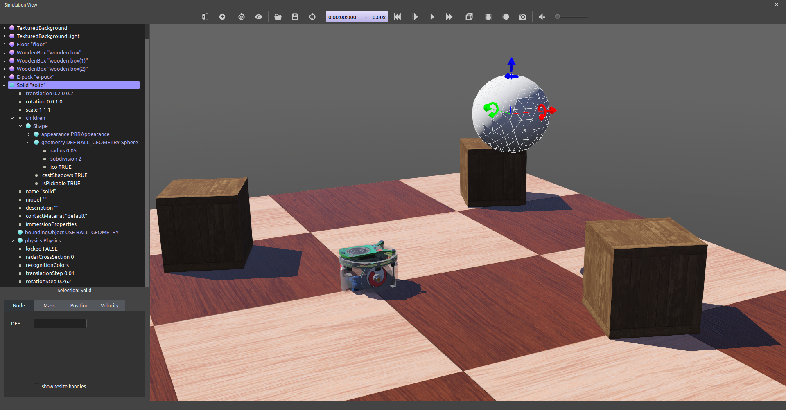
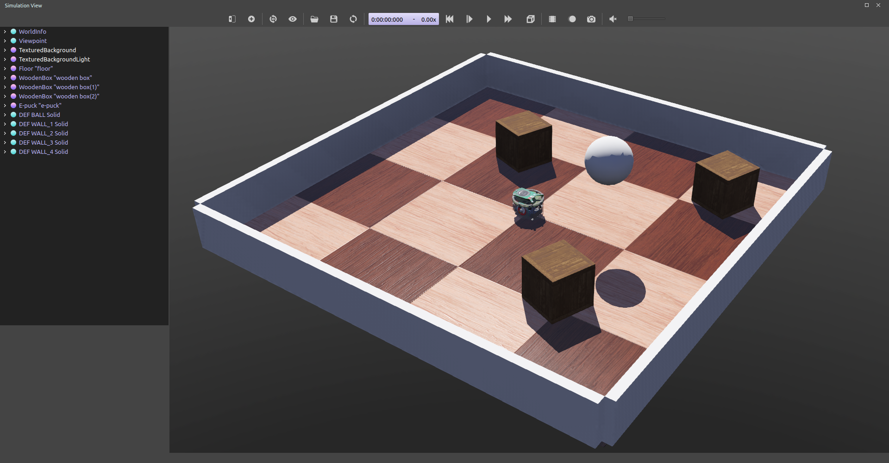

## Tutorial 2: Modification of the Environment (20 Minutes)

In this tutorial, we will teach you how to create simple objects in the environment.
The first step will be to create a ball which will interact with the environment.
We will tackle several concepts related to the nodes: what is their meaning, how to create them, how they have to be affiliated, etc.
Moreover we will see how to set up physics.

Several kinds of nodes will be introduced.
Their detailed definition can be found in [Reference Manual](../reference/nodes-and-api-functions.md).
Having the [nodes chart diagram](../reference/node-chart.md) in front of you, will also help understanding the nodes inheritance relationship.

### A New Simulation

First we create a new simulation based on the one created in Tutorial 1.

> **Hands on**: Make sure the "my\_first\_simulation.wbt" world file is open, and that the simulation is paused and is at a virtual time of 0.
Using the `File / Save World As...` menu, save the simulation as "obstacles.wbt".

### A Better Background

With the PBRAppearance node for an object's appearance, ambient light comes from the background node.
This means we can add a skybox around the world, and ambiently light our scene using the skybox texture itself!
This technique is known as Image-Based Lighting or IBL for short.
Carefully combining Webots lights and skybox textures, it is possible to very realistically light objects.

> **Hands on**: Delete the `Background` and `DirectionalLight` nodes, and using the Add button, add a `TexturedBackground` and a `TexturedBackgroundLight` node to the scene. This loads a mountainous skybox and a matching `DirectionalLight` to the scene, realistically lighting it.

### Modifying the Floor

The default `RectangleArena` PROTO defines a simple floor pinned on the statical environment, i.e. without [Physics](../reference/physics.md) node, and surrounded by walls.

> **Note**: In order to define an object as static, its physics node has not to be set (NULL).

Other pre-built floors are available in the Webots objects library.
We will now delete the default arena and add a simple floor that we will manually surround the walls later in this tutorial.

> **Hands on**: To remove the `RectangleArena`, select it either in the 3D view or in the scene tree view with a left click and press the `Delete` key on your keyboard. Alternatively, you can right click on it in the 3D view and select `Delete` in the context menu (you can also use the context menu directly in the scene tree view).

<!-- -->

> **Hands on**: In order to add a different floor PROTO, select the `DirectionalLight` node and click on the `Add` button.
In the open dialog box, and choose `PROTO (Webots) / objects / floors / Floor (Solid)`.

The newly added `Floor` PROTO has a default size of 10mx10m, but it is possible to adjust its size, its position and texture by changing the corresponding fields.

> **Hands on**: In the scene tree view select and expand the `Floor`.
Modify the `size` fields and set it to *{1, 1}* to resize it to 1mx1m.

### The Solid Node

This subsection introduces the most important node in Webots: the [Solid](../reference/solid.md) node.
But let's start with a definition.

> **Theory**: A **rigid body** is a body in which deformation can be neglected.
The distance between any two given points of a rigid body remains constant in time regardless of external forces exerted on it.
Soft bodies and articulated objects are not rigid bodies, e.g. the following are not rigid bodies: a rope, a tyre, a sponge and an articulated robot arm.
However, an articulated entity can be broken into of several indivisible rigid bodies.
For example a table, a robot finger phalanx or a wheel are indivisible rigid bodies.

The physics engine of Webots is designed for simulating rigid bodies.
An important step, when designing a simulation, is to break up the various entities into indivisible rigid bodies.

> **Theory**: In Webots there is a direct match between a rigid body and a [Solid](../reference/solid.md) node.
A [Solid](../reference/solid.md) node (or a node which inherits the [Solid](../reference/solid.md) node) will be created for each rigid body.

To define a rigid body, you will have to create a [Solid](../reference/solid.md) node.
Inside this node you will find different subnodes corresponding to the characteristics of the rigid body.
The [figure](#the-simplest-model-of-a-rigid-body-in-webots-having-a-graphical-representation-shape-a-physical-bound-boundingobject-and-being-in-the-dynamical-environment-physics) depicts a rigid body and its subnodes.
The graphical representation of the [Solid](../reference/solid.md) is defined by the[Shape](../reference/shape.md) nodes populating its `children` list.
The collision bounds are defined by its `boundingObject` field.
The graphical representation and the collision shape are often but not necessarily identical.
Finally, the `physics` field defines if the object belongs to the dynamical or to the statical environment.
All these subnodes are optional, but the `physics` field needs the `boundingObject` to be defined.

%figure "DEF-USE mechanism applied on the Shape node of a Solid."
%chart
graph TD
  Solid[[Solid](../reference/solid.md)] -->|physics| Physics[[Physics](../reference/physics.md)]
  Solid -->|boundingObject| Geometry1[Geometry]
  Solid -->|children| Shape[[Shape](../reference/shape.md)]
    Shape -->|geometry| Geometry2[Geometry]

  class Solid highlightedNode;
%end
%end

The Geometry box (in [this figure](#the-simplest-model-of-a-rigid-body-in-webots-having-a-graphical-representation-shape-a-physical-bound-boundingobject-and-being-in-the-dynamical-environment-physics)) stands for any kind of geometrical primitive.
In fact, it can be substituted by a [Sphere](../reference/sphere.md), a [Box](../reference/box.md), a [Cylinder](../reference/cylinder.md), etc.

### Create a Ball

We will now add a ball to the simulation.
That ball will be modeled as a rigid body as shown in this [figure](#the-simplest-model-of-a-rigid-body-in-webots-having-a-graphical-representation-shape-a-physical-bound-boundingobject-and-being-in-the-dynamical-environment-physics).
As Geometry nodes we will use [Spheres](../reference/sphere.md).

> **Hands on**: In the scene tree view, select the last node and add a [Solid](../reference/solid.md) node using the `Add` button.
Similarly select the `children` field of the [Solid](../reference/solid.md) node, and add a [Shape](../reference/shape.md) node to it.
In order to get a shaded object as shown in the figure, it is necessary to specify an appearance.
To do this, select the `appearance` field of the [Shape](../reference/shape.md) node and use the `Add` button.
Add a `PBRAppearance` node, change the `metalness` field to 0 and the `roughness` field to 1.
Add a [Sphere](../reference/sphere.md) node as the `geometry` field of the newly created [Shape](../reference/shape.md) node.
Add another [Sphere](../reference/sphere.md) node to the `boundingObject` field of the [Solid](../reference/solid.md).
Finally add a [Physics](../reference/physics.md) node to the `physics` field of the [Solid](../reference/solid.md).
By modifying the `translation` field of the [Solid](../reference/solid.md) node, place the ball in front of the robot (at *{0, 0.1, -0.2}* for example).
Save the simulation.
The result is depicted in [this figure](#your-first-rigid-body-in-webots).

%figure "Your first rigid body in Webots."

%end

> **Note**: When the simulation is started, the ball hits the floor.
You can move the ball by adding a force to it (CTRL + ALT + left-click + drag).
The contact points between the ball and the floor can be displayed as cyan lines by enabling the `View / Optional Rendering / Show Contact Points` menu item.

### Geometries

To define the ball, we used the [Sphere](../reference/sphere.md) node in two different contexts: for the graphical representation (`children`) and to define the physical bounds (`boundingObject`).
All Geometry node (such as the [Sphere](../reference/sphere.md) node) can be used in a graphical context.
However, only a subset of them can be used in a physical context.
Take a look at the [nodes chart diagram](../reference/node-chart.md) to know which primitive you can use.

We now want to reduce the size of the [Sphere](../reference/sphere.md) and to increase its graphical quality by increasing the number of triangles used to represent it.

> **Hands on**: For each [Sphere](../reference/sphere.md) node defining the ball, set its `radius` field to *0.05* and its `subdivision` field to *2*.
Refer to the [Reference Manual](../reference/sphere.md) to understand what the `subdivision` field stands for.

### DEF-USE Mechanism

We will see in this subsection a mechanism which can be useful to avoid redundancy in the world files.

> **Theory**: The **DEF-USE mechanism** allows to define a node in one place and to reuse that definition elsewhere in the Scene Tree.
This avoids the duplication of identical nodes and this allows to modify several nodes at the same time.
Here is how it works: first a node is labeled with a DEF string, and then copies of this node are reused elsewhere with the USE keyword.
Only the fields of the DEF node can be edited, the fields of the USE nodes assume similar values.
This mechanism is dependent on the apparition order of the nodes in the world file, because the DEF node should appear first.

The two [Sphere](../reference/sphere.md) definitions that we have used earlier to define the ball, are redundant.
We will now merge these two [Spheres](../reference/sphere.md) into only once using the DEF-USE mechanism.

> **Hands on**: Select the first [Sphere](../reference/sphere.md) node (the child of the [Shape](../reference/shape.md)) in the scene tree view.
The field editor of the scene tree view allows you to enter the DEF string.
Enter *"BALL\_GEOMETRY"*.
Select the `boundingObject` field (containing the second [Sphere](../reference/sphere.md) node), and empty it by right clicking the field in the scene tree and choosing the `Delete` entry in the context menu that pops up.
Then, click on the `Add` button, and select the `USE / BALL_GEOMETRY` in the dialog box.
The result is shown in [this figure](#def-use-mechanism-on-the-sphere-node-called-ball_geometry).

<!-- -->

> **Note**: Now, changing the `radius` field of the first [Sphere](../reference/sphere.md) node does also modify the `boundingObject`.

%figure "DEF-USE mechanism on the Sphere node called BALL_GEOMETRY."

%end

%figure "The simplest model of a rigid body in Webots having a graphical representation (Shape), a physical bound (boundingObject) and being in the dynamical environment (Physics)."
%chart
graph TD
  Solid[[Solid](../reference/solid.md)] -->|physics| Physics[[Physics](../reference/physics.md)]
  Solid -->|boundingObject| USEBALLGEOMETRY[USE BALL_GEOMETRY]
  Solid -->|children| Shape[[Shape](../reference/shape.md)]
    Shape -->|geometry| Sphere[[DEF BALL_GEOMETRY Sphere](../reference/sphere.md)]
    USEBALLGEOMETRY -.- Sphere

  class Solid highlightedNode;
  class USEBALLGEOMETRY,Shape secondaryNode;
%end
%end

### Add Walls

> **Theory**: For convenience, the `boundingObject` field accepts also the [Shape](../reference/shape.md) node (rather than the [Sphere](../reference/sphere.md) node directly).
It would be also possible to use the same DEF-USE mechanism at the [Shape](../reference/shape.md) level as shown in [this figure](#def-use-mechanism-applied-on-the-shape-node-of-a-solid).
For now the greatest benefit is being able to also use this [Shape](../reference/shape.md) directly for graphical purposes.
Later this mechanism will turn out to be very useful for some sensors.

In order to verify your progression, implement by yourself four walls to surround the environment.
The walls have to be defined statically to the environment, and use as much as possible the DEF-USE mechanism at the [Shape](../reference/shape.md) level rather than at the Geometry level.
Indeed it's more convenient to add an intermediate[Shape](../reference/shape.md) node in the `boundingObject` field of the [Solid](../reference/solid.md) node.
The best Geometry primitive to implement the walls is the Box node.
Only one [Shape](../reference/shape.md) has to be defined for all the walls.
The expected result is shown in [this figure](#the-simulation-state-at-the-end-of-this-second-tutorial).

> **Hands on**: Add four walls without physics and using only one definition of the [Shape](../reference/shape.md) node.

The solution is located in the solution directory under the "obstacle.wbt".

%figure "The simulation state at the end of this second tutorial."

%end

### Efficiency

> **Theory**: The simulation of rigid bodies is computationally expensive.
The simulation speed can be increased by minimizing the number of bounding objects, minimizing the constraints between them (more information about the constraints in the next tutorials), and maximizing the `WorldInfo.basicTimeStep` field.
On each simulation, a **trade-off** has to be found between simulation speed and realism.

### Conclusion

At the end of this tutorial, you are able to create simple environments based on rigid bodies.
You are able to add nodes from the scene tree view and to modify their fields.
You have become acquainted with the [Solid](../reference/solid.md), [Physics](../reference/physics.md), [Shape](../reference/shape.md), [Sphere](../reference/sphere.md) and [Box](../reference/box.md) nodes.
You also saw the DEF-USE mechanism that allows to reduce node redundancy of the scene tree.
