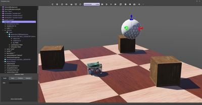
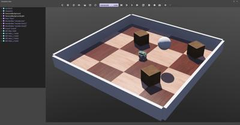

## Tutorial 2: Modification of the Environment (30 Minutes)

In this tutorial, we will teach you how to create simple objects in the environment.
The first step will be to create a ball which will interact with the environment.
We will tackle several concepts related to the nodes: what is their meaning, how to create them, how they have to be affiliated, etc.
Moreover we will see how to set up physics.

Several kinds of nodes will be introduced.
Their detailed definition can be found in [Reference Manual](../reference/nodes-and-api-functions.md).
Having the [nodes chart diagram](../reference/node-chart.md) in front of you, will also help understanding the nodes inheritance relationship.

### A New Simulation

First we create a new simulation based on the one created in Tutorial 1.

> **Hands-on #1**: Make sure the `my_first_simulation.wbt` world file is open, and that the simulation is paused and is at a virtual time of 0.
Using the `File / Save World As...` menu, save the simulation as `obstacles.wbt`.

### Modifying the Floor

The default `RectangleArena` PROTO defines a simple floor pinned on the static environment, i.e. without [Physics](../reference/physics.md) node, and surrounded by walls.
Other pre-built floors are available in the Webots objects library.
We will now delete the `RectangleArena` node and add a simple floor that we will manually surround with walls later in this tutorial.

> **Hands-on #2**: To remove the `RectangleArena`, select it either in the 3D view or in the scene tree view with a left click and press the <kbd>del</kbd> key on your keyboard.
Alternatively, you can right click on it in the 3D view and select `Delete` in the context menu (you can also use the context menu directly in the scene tree view).
Select the `TexturedBackgroundLight` node and click on the `Add` button.
In the open dialog box, and choose `PROTO nodes (Webots Projects) / objects / floors / Floor (Solid)`.

The newly added `Floor` PROTO has a default size of 10mx10m, but it is possible to adjust its size, its position and texture by changing the corresponding fields.

> **Hands-on #3**: In the scene tree view select and expand the `Floor`.
Modify the `size` field and set it to `{1, 1}` to resize it to 1mx1m.

### The Solid Node

This subsection introduces the most important base node in Webots: the [Solid](../reference/solid.md) node, from which many other nodes derive.

A [Solid](../reference/solid.md) node represents a **rigid body**, that is a body in which deformation can be neglected.
The distance between any two given points of a rigid body remains constant in time regardless of external forces exerted on it.
For example a table, a robot finger phalanx or a wheel are rigid bodies.
Soft bodies and articulated objects are not rigid bodies.
For example, a rope, a tire, a sponge or an articulated robot arm are not rigid bodies.
However, an articulated entity can be broken into several rigid bodies.

The physics engine of Webots is designed for simulating rigid bodies only.
An important step, when designing a simulation, is to break up the various entities into separate rigid bodies.

To define a rigid body, you will have to create a [Solid](../reference/solid.md) node.
Inside this node you will set up different sub-nodes corresponding to the characteristics of the rigid body.
The following [figure](#the-simplest-model-of-a-rigid-body-in-webots-having-a-graphical-representation-a-physical-bounding-object-and-being-in-the-dynamical-environment) depicts a rigid body and its sub-nodes.
The graphical representation of the [Solid](../reference/solid.md) node is defined by the [Shape](../reference/shape.md) nodes populating its `children` list.
The collision bounds are defined in its `boundingObject` field.
The graphical representation and the collision shape are often but not necessarily identical.
Finally, the `physics` field defines if the object belongs to the dynamical or to the static environment.
All these sub-nodes are optional, but the `physics` field needs the `boundingObject` to be defined.

%figure "The simplest model of a rigid body in Webots having a graphical representation, a physical bounding object and being in the dynamical environment."
%chart
graph TD
  Solid[[Solid](../reference/solid.md)] -->|physics| Physics[[Physics](../reference/physics.md)]
  Solid -->|boundingObject| Geometry1[Geometry]
  Solid -->|children| Shape[[Shape](../reference/shape.md)]
    Shape -->|geometry| Geometry2[Geometry]

  class Solid highlightedNode;
%end
%end

The Geometry box (in [this figure](#the-simplest-model-of-a-rigid-body-in-webots-having-a-graphical-representation-a-physical-bounding-object-and-being-in-the-dynamical-environment)) stands for any kind of geometrical primitive.
In fact, it can be substituted by a [Sphere](../reference/sphere.md), a [Box](../reference/box.md), a [Cylinder](../reference/cylinder.md), etc.

### Create a Ball

We will now add a ball to the simulation.
That ball will be modeled as a rigid body as shown in this [figure](#the-simplest-model-of-a-rigid-body-in-webots-having-a-graphical-representation-a-physical-bounding-object-and-being-in-the-dynamical-environment).
A [Sphere](../reference/sphere.md) node will be used to define the geometry of our ball.

> **Hands-on #4**: In the scene tree view, select the last node and press the `Add` button.
In the dialog, open the `Bases nodes` section and select the [Solid](../reference/solid.md) node.
In the scene tree view, expand the [Solid](../reference/solid.md) node and select its `children` field.
Add a [Shape](../reference/shape.md) node to it by using the `Add` button.
Select the `appearance` field of the [Shape](../reference/shape.md) node and use the `Add` button to add a `PBRAppearance` node.
1. Add a [Sphere](../reference/sphere.md) node as the `geometry` field of the newly created [Shape](../reference/shape.md) node.
2. Expand the `PBRAppearance` node and change its `metalness` field to 0 and its `roughness` field to 1.
3. Add another [Sphere](../reference/sphere.md) node to the `boundingObject` field of the [Solid](../reference/solid.md).
4. Finally add a [Physics](../reference/physics.md) node to the `physics` field of the [Solid](../reference/solid.md).
5. By modifying the `translation` field of the [Solid](../reference/solid.md) node, place the ball in front of the robot (at `{0.2, 0, 0.2}` for example).
6. Save the simulation.
7. The result is depicted in [this figure](#your-first-rigid-body-in-webots).

%figure "Your first rigid body in Webots."

%end

When the simulation is started, the ball hits the floor.
You can move the ball by [applying a force](the-3d-window.md#applying-a-force-to-a-solid-object-with-physics) to it (<kbd>ctrl</kbd> + <kbd>alt</kbd> + left-click + drag).
The contact points between the ball and the floor can be displayed as cyan lines by enabling the `View / Optional Rendering / Show Contact Points` menu item.

### Geometries

To define the ball, we used the [Sphere](../reference/sphere.md) node in two different contexts: for the graphical representation (`children`) and to define the physical bounds (`boundingObject`).
All Geometry nodes (such as the [Sphere](../reference/sphere.md) node) can be used in a graphical context.
However, only a subset of them can be used in a physical context.
The [nodes chart diagram](../reference/node-chart.md) indicates which nodes are supported in each context.

We are now going to reduce the size of the [Sphere](../reference/sphere.md) and increase its graphical quality by increasing the number of triangles used to represent it.

> **Hands-on #5**: For each [Sphere](../reference/sphere.md) node defining the ball, set its `radius` field to `0.05` and its `subdivision` field to `2`.
Refer to the [Reference Manual](../reference/sphere.md) to understand what the `subdivision` field stands for.

### DEF-USE Mechanism

The **DEF-USE mechanism** allows to define a node in one place and to reuse that definition elsewhere in the scene tree.
This is useful to avoid the duplication of identical nodes in world files.
Moreover, it also allows users to modify several objects at the same time.
Here is how it works: first a node is labeled with a DEF string.
Then copies of this node can be reused elsewhere with the USE keyword.
Only the fields of the DEF node can be edited, the fields of the USE inherit from the DEF node and cannot be changed.
This mechanism is dependent on the order of the nodes in the world file.
A DEF node should be defined before any corresponding USE node.

The two [Sphere](../reference/sphere.md) definitions that we have used earlier to define the ball, are redundant.
We will now merge these two [Spheres](../reference/sphere.md) into only once using the DEF-USE mechanism.

> **Hands-on #6**: Select the first [Sphere](../reference/sphere.md) node (the child of the [Shape](../reference/shape.md)) in the scene tree view.
The [field editor](the-scene-tree.md#field-editor) of the scene tree view allows you to enter the DEF string.
1. Enter `BALL_GEOMETRY` in this field.
2. Select the `boundingObject` field (containing the second [Sphere](../reference/sphere.md) node), and empty it by right clicking the field in the scene tree and choosing the `Delete` entry in the context menu that pops up.
3. Then, select the `boundingObject` field and click on the `Add` button, and select the `USE / BALL_GEOMETRY` in the dialog box.
4. The result is shown in [this figure](#def-use-mechanism-on-the-sphere-node-called-ball_geometry).

Now, changing the `radius` field of the first [Sphere](../reference/sphere.md) node also modifies its `boundingObject`.

For convenience, the `boundingObject` field also accepts the [Shape](../reference/shape.md) node (rather than the [Sphere](../reference/sphere.md) node directly).
It would be also possible to use the same DEF-USE mechanism at the [Shape](../reference/shape.md) level as shown in [this figure](#def-use-mechanism-applied-on-the-sphere-node-of-a-solids-geometry).
For now the greatest benefit is being able to also use this [Shape](../reference/shape.md) directly for graphical purposes.
Later this mechanism will turn out to be very useful for some sensors.

%figure "DEF-USE mechanism on the Sphere node called BALL_GEOMETRY."

%end

%figure "DEF-USE mechanism applied on the Sphere node of a Solid's geometry."
%chart
graph TD
  Solid[[Solid](../reference/solid.md)] -->|physics| Physics[[Physics](../reference/physics.md)]
  Solid -->|boundingObject| USEBALLGEOMETRY[USE BALL_GEOMETRY]
  Solid -->|children| Shape[[Shape](../reference/shape.md)]
    Shape -->|geometry| Sphere[[DEF BALL_GEOMETRY Sphere](../reference/sphere.md)]
    USEBALLGEOMETRY -.- Sphere

  class Solid highlightedNode;
  class USEBALLGEOMETRY,Shape secondaryNode;
%end
%end

> **Hands-on #7**: Create a second ball with the same parameters but using the  [Shape](../reference/shape.md) node (rather than the [Sphere](../reference/sphere.md) node directly) for the DEF-USE mechanism.

### Add Walls

In order to verify your progression, implement by yourself four walls to surround the environment.
The walls have to be defined statically to the environment.
To understand the difference between static and dynamic, let's take a defined object (the ball) above the ground.
If the [Physics](../reference/physics.md) node is NULL, it will remain frozen in the air during the simulation (static case).
If the `physics` field contains a [Physics](../reference/physics.md) nodes, it will fall under the effect of gravity (dynamic case).

Use as much as possible the DEF-USE mechanism at the [Shape](../reference/shape.md) level rather than at the Geometry level.
Indeed it's more convenient to add an intermediate [Shape](../reference/shape.md) node in the `boundingObject` field of the [Solid](../reference/solid.md) node.
The best Geometry primitive to implement the walls is the Box node.
Only one [Shape](../reference/shape.md) has to be defined for all the walls.
The expected result is shown in [this figure](#the-simulation-state-at-the-end-of-this-second-tutorial).

> **Hands-on #8**: Add four walls without physics and using only one definition of the [Shape](../reference/shape.md) node.

### Solution: World File

To compare your world with the solution, go to your files and find the folder named "my\_first\_simulation" created in [Tutorial 1](tutorial-1-your-first-simulation-in-webots.md), then go to the "worlds" folder and open with a text editor the right world.
[This solution]({{ url.github_tree }}/projects/samples/tutorials/worlds/obstacles.wbt) as the others is located in the [solution directory]({{ url.github_tree }}/projects/samples/tutorials/worlds/).

%figure "The simulation state at the end of this second tutorial."

%end

### Efficiency

The simulation of rigid bodies is computationally expensive.
The simulation speed can be increased by minimizing the number of bounding objects, minimizing the constraints between them (more information about the constraints in the next tutorials), and maximizing the `WorldInfo.basicTimeStep` field.
On each simulation, a **trade-off** has to be found between simulation speed and realism.

### Conclusion

At the end of this tutorial, you are able to create simple environments based on rigid bodies.
You are able to add nodes from the scene tree view and to modify their fields.
You have become acquainted with the [Solid](../reference/solid.md), [Physics](../reference/physics.md), [Shape](../reference/shape.md), [Sphere](../reference/sphere.md) and [Box](../reference/box.md) nodes.
You also saw the DEF-USE mechanism that allows to reduce node redundancy of the scene tree.
