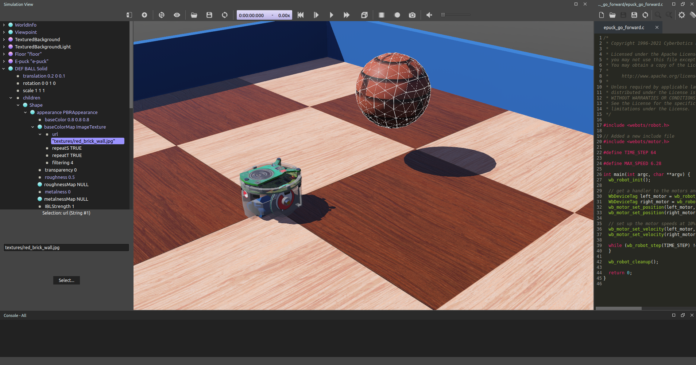

## Tutorial 3: Appearance (15 Minutes)

The aim of this tutorial is to familiarize yourself with some nodes related to the graphical rendering.
Good looking simulations can be created very quickly when these nodes are used adequately.
A good graphics quality does not only enhance the user's experience, it is also essential for simulations where robots perceive their environment (camera image processing, line following, etc.).

The result at the end of this tutorial is shown in [this figure](#simulation-after-having-setup-the-light-and-the-pbrappearance-nodes).

### New Simulation

> **Hands on**: From the results of the previous tutorial, create a new simulation called "appearance.wbt" by using the `File / Save World As...` menu.

### Lights

> **Theory**: The lighting of a world is determined by light nodes.
There are three types of light nodes: the DirectionalLight, the [PointLight](../reference/pointlight.md) and the [SpotLight](../reference/spotlight.md).
A [DirectionalLight](../reference/directionallight.md) simulates a light which is infinitely far (ex: the sun), a [PointLight](../reference/pointlight.md) simulates light emitted from a single point (ex: a light bulb), and a [SpotLight](../reference/spotlight.md) simulates a conical light (ex: a flashlight).
Each type of light node can cast shadows.
You can find their complete documentation in the [Reference Manual](../reference/nodes-and-api-functions.md).

<!-- -->

> **Note**: Lights are costly in term of performance.
Minimizing the number of lights increases the rendering speed.
A maximum of 8 lights is allowed if the shaders are disabled in the Webots preferences.
A [PointLight](../reference/pointlight.md) is more efficient than a [SpotLight](../reference/spotlight.md), but less than a DirectionalLight.
Note finally that casting shadows can reduce the simulation speed drastically.

### Modify the Appearance of the Walls

The aim of this subsection is to color the walls in blue.

> **Theory**: The [Appearance](../reference/appearance.md) and [PBRAppearance](../reference/pbrappearance.md) nodes of the [Shape](../reference/shape.md) node determine the graphical appearance of the object.
Among other things, these nodes are responsible for the color and texture of objects.

<!-- -->

> **Hands on**: In the [Shape](../reference/shape.md) node representing graphically the first wall, add a [PBRAppearance](../reference/pbrappearance.md) node to the `appearance` field.
Set its `baseColor` field to blue using the color selector.
Set its `metalness` field to 0 using the field editor.
Finally, set its `roughness` field to 0.5 using the field editor.
If the DEF-USE mechanism of the previous tutorial has been correctly implemented, all the walls should turn blue.

### Add a Texture to the Ball

The aim of this subsection is to apply a texture on the ball.
A texture on a rolling object can help to appreciate its movement.

> **Hands on**: Similarly add a [PBRAppearance](../reference/pbrappearance.md) node to the ball. As before, set the `metalness` field to 0 and the `roughness` field to 1. Add an [ImageTexture](../reference/imagetexture.md) node to the `baseColorMap` field of the [PBRAppearance](../reference/pbrappearance.md) node.
Add an item to the [ImageTexture](../reference/imagetexture.md)'s `url` field using the `Add` button.
Then set the value of the newly added `url` item to "WEBOTS\_HOME/projects/default/worlds/textures/red\_brick\_wall.jpg" using the file selection dialog.

<!-- -->

> **Note**: The texture URLs must be defined either relative to the "worlds" directory of your project directory or relative to the default project directory "WEBOTS\_HOME/projects/default/worlds".
In the default project directory you will find textures that are available for every world.

<!-- -->

> **Note**: Open the "red\_brick\_wall.jpg" texture in an image viewer while you observe how it is mapped onto the [Sphere](../reference/sphere.md) node in Webots.

<!-- -->

> **Theory**: Textures are mapped onto Geometry nodes according to predefined **UV mapping** functions described in the [Reference Manual](../reference/imagetexture.md).
A UV mapping function maps a 2D image representation to a 3D model.

%figure "Simulation after having setup the Light and the PBRAppearance nodes."

%end

### Rendering Options

Webots offers several rendering modes available in the `View` menu.

> **Hands on**: View the simulation in wireframe mode by using the `View / Wireframe Rendering` menu item.
Then restore the plain rendering mode: `View / Plain Rendering`.

### Conclusion

In this tutorial, you have learnt how to set up a good looking environment using the [PBRAppearance](../reference/pbrappearance.md) node and the light nodes.

You can go further on this topic by reading the detailed description of these nodes in the `Reference Manual`.
This [section](modeling.md#how-to-get-a-realisitc-and-efficient-rendering) will give you a method to efficiently setup these nodes.
