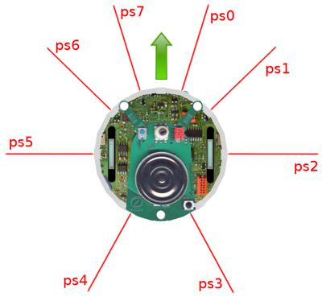

## Tutorial 4: More about Controllers (30 Minutes)

Now we start to tackle the topics related to programming robot controllers.
We will design a simple controller that avoids the obstacles created in the previous tutorials.

This tutorial will introduce you to the basics of robot programming in Webots.
At the end of this chapter, you should understand what is the link between the scene tree nodes and the controller API, how the robot controller has to be initialized and cleaned up, how to initialize the robot devices, how to get the sensor values, how to command the actuators, and how to program a simple feedback loop.

This tutorial only addresses the correct usage of Webots functions.
The study of robotics algorithms is beyond the goals of this tutorial and so it won't be addressed here.
Some rudimentary programming knowledge is required to tackle this chapter (any C tutorial should be a sufficient introduction).
At the end of the chapter, links to further robotics algorithms are given.

### New World and New Controller

> **Hands on #1**: Save the previous world as `collision_avoidance.wbt`.
Create a new C (or any other language) controller called `epuck_avoid_collision` (for C++ and Java call it `EPuckAvoidCollision` instead) from the **File / New / New Robot Controller...** menu item.
Modify the `controller` field of the `E-puck` node in order to associate it to the new controller.

%spoiler "**Reminder**: How to create a new controller?"

Select the **File / New / New Robot Controller...** menu item and choose your programming language and the file name.

%end

### Understand the e-puck Model

Controller programming requires some information related to the e-puck model.
In order to create the collision avoidance algorithm, we need to read the values of its 8 infra-red distance sensors located around its turret, and we need to actuate its two wheels.
The way that the distance sensors are distributed around the turret and the e-puck direction are depicted in [this figure](#top-view-of-the-e-puck-model-the-green-arrow-indicates-the-front-of-the-robot-the-red-lines-represent-the-directions-of-the-infrared-distance-sensors-the-string-labels-corresponds-to-the-distance-sensor-names).

The distance sensors are modeled by 8 [DistanceSensor](../reference/distancesensor.md) nodes in the hierarchy of the robot.
These nodes are referenced by their `name` fields (from `ps0` to `ps7`).
We will explain later how these nodes are defined.
For now, simply note that a [DistanceSensor](../reference/distancesensor.md) node can be accessed through the related module of the Webots API (through the `webots/distance_sensor.h` include file).
The values returned by the distance sensors are scaled between 0 and 4096 (piecewise linearly to the distance).
While 4096 means that a big amount of light is measured (an obstacle is close) and 0 means that no light is measured (no obstacle).

The **controller API** is the programming interface that gives you access to the simulated sensors and actuators of the robot.
For example, including the `webots/distance_sensor.h` file allows to use the `wb_distance_sensor_*` functions and with these functions you can query the values of the [DistanceSensor](../reference/distancesensor.md) nodes.
The documentation on the API functions can be found in [Reference Manual](../reference/nodes-and-api-functions.md) together with the description of each node.

%figure "Top view of the e-puck model. The green arrow indicates the front of the robot. The red lines represent the directions of the infrared distance sensors. The string labels corresponds to the distance sensor names."



%end

%figure "UML state machine of a simple feedback loop"
%chart
graph LR
  init[initialize robot] --> step[simulation step]
    subgraph feedback loop
      step --> read[read sensors]
      read --> process[process behavior]
      process --> write[write actuators]
        write --> step
    end
    step --> cleanup[cleanup robot]
%end
%end

### Program a Controller

We would like to program a very simple collision avoidance behavior.
You will program the robot to go forwards until an obstacle is detected by the front distance sensors, and then to turn towards the obstacle-free direction.
In order to do that, we will use the simple feedback loop depicted in the UML state machine in [this figure](#uml-state-machine-of-a-simple-feedback-loop).

The complete code of this controller is given in the next subsection.

%tab-component "language"
%tab "C"
> **Hands on #2**: At the beginning of the controller file, add the include directives corresponding to the [Robot](../reference/robot.md), the [DistanceSensor](../reference/distancesensor.md) and the [Motor](../reference/motor.md) nodes in order to be able to use the corresponding API:
> ```c
> #include <webots/robot.h>
> #include <webots/distance_sensor.h>
> #include <webots/motor.h>
> ```
Just after the include statements add a macro that defines the duration of each physics step.
This macro will be used as argument to the `wb_robot_step` function, and it will also be used to enable the devices.
This duration is specified in milliseconds and it must be a multiple of the value in the `basicTimeStep` field of the [WorldInfo](../reference/worldinfo.md) node.
> ```c
> #define TIME_STEP 64
> ```
%tab-end

%tab "C++"
> **Hands on #2**: At the beginning of the controller file, add the include directives corresponding to the [Robot](../reference/robot.md), the [DistanceSensor](../reference/distancesensor.md) and the [Motor](../reference/motor.md) nodes in order to be able to use the corresponding API:
> ```cpp
> #include <webots/Robot.hpp>
> #include <webots/DistanceSensor.hpp>
> #include <webots/Motor.hpp>
> ```
Just after the include statements add a macro that defines the duration of each physics step.
This macro will be used as argument to the `Robot::step` function, and it will also be used to enable the devices.
This duration is specified in milliseconds and it must be a multiple of the value in the `basicTimeStep` field of the [WorldInfo](../reference/worldinfo.md) node.
> ```cpp
> #define TIME_STEP 64
> ```
Finally, use the `webots` namespace which is required to use the webots classes.
> ```cpp
>// All the webots classes are defined in the "webots" namespace
>using namespace webots;
> ```
%tab-end

%tab "Python"
> **Hands on #2**: At the beginning of the controller file, add the import directives corresponding to the [Robot](../reference/robot.md), the [DistanceSensor](../reference/distancesensor.md) and the [Motor](../reference/motor.md) nodes in order to be able to use the corresponding API:
>```python
> from controller import Robot, DistanceSensor, Motor
>```
Just after the import statements define a variable that defines the duration of each physics step.
This macro will be used as argument to the `Robot::step` function, and it will also be used to enable the devices.
This duration is specified in milliseconds and it must be a multiple of the value in the `basicTimeStep` field of the [WorldInfo](../reference/worldinfo.md) node.
> ```python
> TIME_STEP = 64
> ```
%tab-end

%tab "Java"
> **Hands on #2**: At the beginning of the controller file, add the import directives corresponding to the [Robot](../reference/robot.md), the [DistanceSensor](../reference/distancesensor.md) and the [Motor](../reference/motor.md) nodes in order to be able to use the corresponding API:
> ```java
> import com.cyberbotics.webots.controller.Robot;
> import com.cyberbotics.webots.controller.DistanceSensor;
> import com.cyberbotics.webots.controller.Motor;
> ```
Just after the import statements create the `EPuckAvoidCollision class` (the name of the class should match exactly the name of the file) and the `main` function.
In the `main function`, define a variable that defines the duration of each physics step.
This macro will be used as argument to the `Robot::step` function, and it will also be used to enable the devices.
This duration is specified in milliseconds and it must be a multiple of the value in the `basicTimeStep` field of the [WorldInfo](../reference/worldinfo.md) node.
> ```c
> public class EPuckAvoidCollision {
>
>   public static void main(String[] args) {
>
>     int TIME_STEP = 64;
>   }
> }
> ```
%tab-end

%tab "MATLAB"
> **Hands on #2**: At the beginning of the controller file, add the `function` declaration (the name of the class should match exactly the name of the file).
>```MATLAB
> function epuck_avoid_collision
>```
Just after the function declaration define a variable that defines the duration of each physics step.
This macro will be used as argument to the `wb_robot_step` function, and it will also be used to enable the devices.
This duration is specified in milliseconds and it must be a multiple of the value in the `basicTimeStep` field of the [WorldInfo](../reference/worldinfo.md) node.
> ```MATLAB
> TIME_STEP = 64;
> ```
%tab-end
%end


The `main` function is where the controller program starts execution.
The arguments passed to the `main` function are given by the `controllerArgs` field of the [Robot](../reference/robot.md) node.
The Webots API has to be initialized using the `wb_robot_init` function and it has to be cleaned up using the `wb_robot_cleanup` function.

%tab-component "language"
%tab "C"
> **Hands on #3**: Write the prototype of the `main` function as follows:
> ```c
> // entry point of the controller
> int main(int argc, char **argv) {
>   // initialize the Webots API
>   wb_robot_init();
>   // initialize devices
>   // feedback loop: step simulation until receiving an exit event
>   while (wb_robot_step(TIME_STEP) != -1) {
>     // read sensors outputs
>     // process behavior
>     // write actuators inputs
>   }
>   // cleanup the Webots API
>   wb_robot_cleanup();
>   return 0; //EXIT_SUCCESS
> }
> ```
%tab-end

%tab "C++"
> **Hands on #3**: Write the prototype of the `main` function as follows:
>```cpp
> // entry point of the controller
> int main(int argc, char **argv) {
>   // create the Robot instance.
>   Robot *robot = new Robot();
>   // initialize devices
>   // feedback loop: step simulation until receiving an exit event
>   while (robot->step(TIME_STEP) != -1) {
>     // read sensors outputs
>     // process behavior
>     // write actuators inputs
>   }
>   delete robot;
>   return 0; //EXIT_SUCCESS
>}
>```
%tab-end

%tab "Python"
> **Hands on #3**: In Python there is no main function, the program starts it's execution from the start of the file:
>```python
> # create the Robot instance.
> robot = Robot()
> # initialize devices
> # feedback loop: step simulation until receiving an exit event
> while robot.step(TIME_STEP) != -1:
>     # read sensors outputs
>     # process behavior
>     # write actuators inputs
>```
%tab-end

%tab "Java"
> **Hands on #3**: Write the prototype of the `main` function as follows:
>```java
> // entry point of the controller
> public static void main(String[] args) {
>
>   int TIME_STEP = 64;
>
>   // create the Robot instance.
>   Robot robot = new Robot();
>   // initialize devices
>   // feedback loop: step simulation until receiving an exit event
>   while (robot.step(TIME_STEP) != -1) {
>     // read sensors outputs
>     // process behavior
>     // write actuators inputs
>   };
> }
>```
%tab-end

%tab "MATLAB"
> **Hands on #3**: In Matlab, the "main" function is the function definition at the start of the file:
>```MATLAB
> % initialize devices
> % feedback loop: step simulation until receiving an exit event
> while wb_robot_step(TIME_STEP) ~= -1
>   % read sensors outputs
>   % process behavior
>   % write actuators inputs
>   % if your code plots some graphics, it needs to flushed like this:
>   drawnow;
> end
>```
%tab-end
%end

A robot device is referenced by a `WbDeviceTag`.
The `WbDeviceTag` is retrieved by the `wb_robot_get_device` function.
Then it is used as first argument in every function call concerning this device.
A sensor such as the [DistanceSensor](../reference/distancesensor.md) has to be enabled before use.
The second argument of the enable function defines at which rate the sensor will be refreshed.


%tab-component "language"
%tab "C"
> **Hands on #4**: Just after the comment `// initialize devices`, get and enable the distance sensors as follows:
> ```c
> // initialize devices
> int i;
> WbDeviceTag ps[8];
> char ps_names[8][4] = {
>   "ps0", "ps1", "ps2", "ps3",
>   "ps4", "ps5", "ps6", "ps7"
> };
>
> for (i = 0; i < 8; i++) {
>   ps[i] = wb_robot_get_device(ps_names[i]);
>   wb_distance_sensor_enable(ps[i], TIME_STEP);
> }
> ```
After initialization of the devices, initialize the motors:
> ```c
> WbDeviceTag left_motor = wb_robot_get_device("left wheel motor");
> WbDeviceTag right_motor = wb_robot_get_device("right wheel motor");
> wb_motor_set_position(left_motor, INFINITY);
> wb_motor_set_position(right_motor, INFINITY);
> wb_motor_set_velocity(left_motor, 0.0);
> wb_motor_set_velocity(right_motor, 0.0);
> ```
In the main loop, just after the comment `// read sensors outputs`, read the distance sensor values as follows:
> ```c
> // read sensors outputs
> double ps_values[8];
> for (i = 0; i < 8 ; i++)
>   ps_values[i] = wb_distance_sensor_get_value(ps[i]);
> ```
In the main loop, just after the comment `// process behavior`, detect if a collision occurs (i.e., the value returned by a distance sensor is bigger than a threshold) as follows:
> ```c
> // detect obstacles
> bool right_obstacle =
>   ps_values[0] > 80.0 ||
>   ps_values[1] > 80.0 ||
>   ps_values[2] > 80.0;
> bool left_obstacle =
>   ps_values[5] > 80.0 ||
>   ps_values[6] > 80.0 ||
>   ps_values[7] > 80.0;
> ```
Finally, use the information about the obstacle to actuate the wheels as follows:
> ```c
> #define MAX_SPEED 6.28
> ...
> // initialize motor speeds at 50% of MAX_SPEED.
> double left_speed  = 0.5 * MAX_SPEED;
> double right_speed = 0.5 * MAX_SPEED;
> // modify speeds according to obstacles
> if (left_obstacle) {
>   // turn right
>   left_speed  = 0.5 * MAX_SPEED;
>   right_speed = -0.5 * MAX_SPEED;
> }
> else if (right_obstacle) {
>   // turn left
>   left_speed  = -0.5 * MAX_SPEED;
>   right_speed = 0.5 * MAX_SPEED;
> }
> // write actuators inputs
> wb_motor_set_velocity(left_motor, left_speed);
> wb_motor_set_velocity(right_motor, right_speed);
> ```
Compile your code by selecting the `Build / Build` menu item.
Compilation errors are displayed in red in the console.
If there are any, fix them and retry to compile.
Reload the world.
%tab-end

%tab "C++"
> **Hands on #4**: Just after the comment `// initialize devices`, get and enable the distance sensors as follows:
> ```cpp
> // initialize devices
> DistanceSensor *ps[8];
> char psNames[8][4] = {
>   "ps0", "ps1", "ps2", "ps3",
>   "ps4", "ps5", "ps6", "ps7"
> };
>
> for (int i = 0; i < 8; i++) {
>   ps[i] = robot->getDistanceSensor(psNames[i]);
>   ps[i]->enable(TIME_STEP);
> }
> ```
After initialization of the devices, initialize the motors:
> ```cpp
> Motor *leftMotor = robot->getMotor("left wheel motor");
> Motor *rightMotor = robot->getMotor("right wheel motor");
> leftMotor->setPosition(INFINITY);
> rightMotor->setPosition(INFINITY);
> leftMotor->setVelocity(0.0);
> rightMotor->setVelocity(0.0);
> ```
In the main loop, just after the comment `// read sensors outputs`, read the distance sensor values as follows:
> ```cpp
> // read sensors outputs
> double psValues[8];
> for (int i = 0; i < 8 ; i++)
>   psValues[i] = ps[i]->getValue();
> ```
In the main loop, just after the comment `// process behavior`, detect if a collision occurs (i.e., the value returned by a distance sensor is bigger than a threshold) as follows:
> ```cpp
> // detect obstacles
> bool right_obstacle =
>   psValues[0] > 80.0 ||
>   psValues[1] > 80.0 ||
>   psValues[2] > 80.0;
> bool left_obstacle =
>   psValues[5] > 80.0 ||
>   psValues[6] > 80.0 ||
>   psValues[7] > 80.0;
> ```
Finally, use the information about the obstacle to actuate the wheels as follows:
> ```cpp
> #define MAX_SPEED 6.28
> ...
> // initialize motor speeds at 50% of MAX_SPEED.
> double leftSpeed  = 0.5 * MAX_SPEED;
> double rightSpeed = 0.5 * MAX_SPEED;
> // modify speeds according to obstacles
> if (left_obstacle) {
>   // turn right
>   leftSpeed  = 0.5 * MAX_SPEED;
>   rightSpeed = -0.5 * MAX_SPEED;
> }
> else if (right_obstacle) {
>   // turn left
>   leftSpeed  = -0.5 * MAX_SPEED;
>   rightSpeed = 0.5 * MAX_SPEED;
> }
> // write actuators inputs
> leftMotor->setVelocity(leftSpeed);
> rightMotor->setVelocity(rightSpeed);
> ```
Compile your code by selecting the `Build / Build` menu item.
Compilation errors are displayed in red in the console.
If there are any, fix them and retry to compile.
Reload the world.
%tab-end

%tab "Python"
> **Hands on #4**: Just after the comment `// initialize devices`, get and enable the distance sensors as follows:
> ```python
> # initialize devices
> ps = []
> psNames = [
>     'ps0', 'ps1', 'ps2', 'ps3',
>     'ps4', 'ps5', 'ps6', 'ps7'
> ]
>
> for i in range(8):
>     ps.append(robot.getDevice(psNames[i]))
>     ps[i].enable(TIME_STEP)
> ```
After initialization of the devices, initialize the motors:
> ```python
> leftMotor = robot.getDevice('left wheel motor')
> rightMotor = robot.getDevice('right wheel motor')
> leftMotor.setPosition(float('inf'))
> rightMotor.setPosition(float('inf'))
> leftMotor.setVelocity(0.0)
> rightMotor.setVelocity(0.0)
> ```
In the main loop, just after the comment `# read sensors outputs`, read the distance sensor values as follows:
> ```python
> # read sensors outputs
> psValues = []
> for i in range(8):
>     psValues.append(ps[i].getValue())
> ```
In the main loop, just after the comment `# process behavior`, detect if a collision occurs (i.e., the value returned by a distance sensor is bigger than a threshold) as follows:
> ```python
> # detect obstacles
> right_obstacle = psValues[0] > 80.0 or psValues[1] > 80.0 or psValues[2] > 80.0
> left_obstacle = psValues[5] > 80.0 or psValues[6] > 80.0 or psValues[7] > 80.0
> ```
Finally, use the information about the obstacle to actuate the wheels as follows:
> ```python
> MAX_SPEED = 6.28
> ...
> # initialize motor speeds at 50% of MAX_SPEED.
> leftSpeed  = 0.5 * MAX_SPEED
> rightSpeed = 0.5 * MAX_SPEED
> # modify speeds according to obstacles
> if left_obstacle:
>     # turn right
>     leftSpeed  = 0.5 * MAX_SPEED
>     rightSpeed = -0.5 * MAX_SPEED
> elif right_obstacle:
>     # turn left
>     leftSpeed  = -0.5 * MAX_SPEED
>     rightSpeed = 0.5 * MAX_SPEED
> # write actuators inputs
> leftMotor.setVelocity(leftSpeed)
> rightMotor.setVelocity(rightSpeed)
> ```
Save your code by selecting the `File / Save Text File` menu item.
Reload the world.
%tab-end

%tab "Java"
> **Hands on #4**: Just after the comment `// initialize devices`, get and enable the distance sensors as follows:
> ```java
> // initialize devices
> DistanceSensor[] ps = new DistanceSensor[8];
> String[] psNames = {
>   "ps0", "ps1", "ps2", "ps3",
>   "ps4", "ps5", "ps6", "ps7"
> };
>
> for (int i = 0; i < 8; i++) {
>   ps[i] = robot.getDistanceSensor(psNames[i]);
>   ps[i].enable(TIME_STEP);
> }
> ```
After initialization of the devices, initialize the motors:
> ```java
> Motor leftMotor = robot.getMotor("left wheel motor");
> Motor rightMotor = robot.getMotor("right wheel motor");
> leftMotor.setPosition(Double.POSITIVE_INFINITY);
> rightMotor.setPosition(Double.POSITIVE_INFINITY);
> leftMotor.setVelocity(0.0);
> rightMotor.setVelocity(0.0);
> ```
In the main loop, just after the comment `// read sensors outputs`, read the distance sensor values as follows:
> ```java
> // read sensors outputs
> double[] psValues = {0, 0, 0, 0, 0, 0, 0, 0};
> for (int i = 0; i < 8 ; i++)
>   psValues[i] = ps[i].getValue();
> ```
In the main loop, just after the comment `// process behavior`, detect if a collision occurs (i.e., the value returned by a distance sensor is bigger than a threshold) as follows:
> ```java
> // detect obstacles
>  boolean right_obstacle =
>   psValues[0] > 80.0 ||
>   psValues[1] > 80.0 ||
>   psValues[2] > 80.0;
>  boolean left_obstacle =
>   psValues[5] > 80.0 ||
>   psValues[6] > 80.0 ||
>   psValues[7] > 80.0;
> ```
Finally, use the information about the obstacle to actuate the wheels as follows:
> ```java
> int MAX_SPEED = 6.28;
> ...
> // initialize motor speeds at 50% of MAX_SPEED.
> double leftSpeed  = 0.5 * MAX_SPEED;
> double rightSpeed = 0.5 * MAX_SPEED;
> // modify speeds according to obstacles
> if (left_obstacle) {
>   // turn right
>   leftSpeed  = 0.5 * MAX_SPEED;
>   rightSpeed = -0.5 * MAX_SPEED;
> }
> else if (right_obstacle) {
>   // turn left
>   leftSpeed  = -0.5 * MAX_SPEED;
>   rightSpeed = 0.5 * MAX_SPEED;
> }
> // write actuators inputs
> leftMotor.setVelocity(leftSpeed);
> rightMotor.setVelocity(rightSpeed);
> ```
Compile your code by selecting the `Build / Build` menu item.
Compilation errors are displayed in red in the console.
If there are any, fix them and retry to compile.
Reload the world.
%tab-end

%tab "MATLAB"
> **Hands on #4**: Just after the comment `% initialize devices`, get and enable the distance sensors as follows:
> ```MATLAB
> % initialize devices
> ps = [];
> ps_names = [ "ps0", "ps1", "ps2", "ps3", "ps4", "ps5", "ps6", "ps7" ];
>
> for i = 1:8
>   ps(i) = wb_robot_get_device(convertStringsToChars(ps_names(i)));
>   wb_distance_sensor_enable(ps(i), TIME_STEP);
> end
> ```
After initialization of the devices, initialize the motors:
> ```MATLAB
> left_motor = wb_robot_get_device('left wheel motor');
> right_motor = wb_robot_get_device('right wheel motor');
> wb_motor_set_position(left_motor, inf);
> wb_motor_set_position(right_motor, inf);
> wb_motor_set_velocity(left_motor, 0.0);
> wb_motor_set_velocity(right_motor, 0.0);
> ```
In the main loop, just after the comment `% read sensors outputs`, read the distance sensor values as follows:
> ```MATLAB
> % read sensors outputs
> ps_values = [];
> for i = 1:8
>   ps_values(i) = wb_distance_sensor_get_value(ps(i));
> end
> ```
In the main loop, just after the comment `% process behavior`, detect if a collision occurs (i.e., the value returned by a distance sensor is bigger than a threshold) as follows:
> ```MATLAB
> % detect obstacles
> right_obstacle = ps_values(1) > 80.0 | ps_values(2) > 80.0 | ps_values(3) > 80.0;
> left_obstacle = ps_values(6) > 80.0 | ps_values(7) > 80.0 | ps_values(8) > 80.0;
> ```
Finally, use the information about the obstacle to actuate the wheels as follows:
> ```MATLAB
> MAX_SPEED = 6.28;
> ...
> % initialize motor speeds at 50% of MAX_SPEED.
> left_speed  = 0.5 * MAX_SPEED;
> right_speed = 0.5 * MAX_SPEED;
> % modify speeds according to obstacles
> if left_obstacle
>   % turn right
>   left_speed  = 0.5 * MAX_SPEED;
>   right_speed = -0.5 * MAX_SPEED;
> elseif right_obstacle
>   % turn left
>   left_speed  = -0.5 * MAX_SPEED;
>   right_speed = 0.5 * MAX_SPEED;
> end
> % write actuators inputs
> wb_motor_set_velocity(left_motor, left_speed);
> wb_motor_set_velocity(right_motor, right_speed);
> ```
Save your code by selecting the `File / Save Text File` menu item.
Reload the world.
%tab-end
%end


### The Controller Code

Here is the complete code of the controller detailed in the previous subsection.


%tab-component "language"
%tab "C"
```c
#include <webots/robot.h>
#include <webots/distance_sensor.h>
#include <webots/motor.h>

// time in [ms] of a simulation step
#define TIME_STEP 64

#define MAX_SPEED 6.28

// entry point of the controller
int main(int argc, char **argv) {
  // initialize the Webots API
  wb_robot_init();

  // internal variables
  int i;
  WbDeviceTag ps[8];
  char ps_names[8][4] = {
    "ps0", "ps1", "ps2", "ps3",
    "ps4", "ps5", "ps6", "ps7"
  };

  // initialize devices
  for (i = 0; i < 8 ; i++) {
    ps[i] = wb_robot_get_device(ps_names[i]);
    wb_distance_sensor_enable(ps[i], TIME_STEP);
  }

  WbDeviceTag left_motor = wb_robot_get_device("left wheel motor");
  WbDeviceTag right_motor = wb_robot_get_device("right wheel motor");
  wb_motor_set_position(left_motor, INFINITY);
  wb_motor_set_position(right_motor, INFINITY);
  wb_motor_set_velocity(left_motor, 0.0);
  wb_motor_set_velocity(right_motor, 0.0);

  // feedback loop: step simulation until an exit event is received
  while (wb_robot_step(TIME_STEP) != -1) {
    // read sensors outputs
    double ps_values[8];
    for (i = 0; i < 8 ; i++)
      ps_values[i] = wb_distance_sensor_get_value(ps[i]);

    // detect obstacles
    bool right_obstacle =
      ps_values[0] > 80.0 ||
      ps_values[1] > 80.0 ||
      ps_values[2] > 80.0;
    bool left_obstacle =
      ps_values[5] > 80.0 ||
      ps_values[6] > 80.0 ||
      ps_values[7] > 80.0;

    // initialize motor speeds at 50% of MAX_SPEED.
    double left_speed  = 0.5 * MAX_SPEED;
    double right_speed = 0.5 * MAX_SPEED;

    // modify speeds according to obstacles
    if (left_obstacle) {
      // turn right
      left_speed  = 0.5 * MAX_SPEED;
      right_speed = -0.5 * MAX_SPEED;
    }
    else if (right_obstacle) {
      // turn left
      left_speed  = -0.5 * MAX_SPEED;
      right_speed = 0.5 * MAX_SPEED;
    }

    // write actuators inputs
    wb_motor_set_velocity(left_motor, left_speed);
    wb_motor_set_velocity(right_motor, right_speed);
  }

  // cleanup the Webots API
  wb_robot_cleanup();
  return 0; //EXIT_SUCCESS
}
```
%tab-end

%tab "C++"
```cpp
#include <webots/Robot.hpp>
#include <webots/DistanceSensor.hpp>
#include <webots/Motor.hpp>

// time in [ms] of a simulation step
#define TIME_STEP 64

#define MAX_SPEED 6.28

// All the webots classes are defined in the "webots" namespace
using namespace webots;

// entry point of the controller
int main(int argc, char **argv) {
  // create the Robot instance.
  Robot *robot = new Robot();

  // initialize devices
  DistanceSensor *ps[8];
  char psNames[8][4] = {
    "ps0", "ps1", "ps2", "ps3",
    "ps4", "ps5", "ps6", "ps7"
  };

  for (int i = 0; i < 8; i++) {
    ps[i] = robot->getDistanceSensor(psNames[i]);
    ps[i]->enable(TIME_STEP);
  }

  Motor *leftMotor = robot->getMotor("left wheel motor");
  Motor *rightMotor = robot->getMotor("right wheel motor");
  leftMotor->setPosition(INFINITY);
  rightMotor->setPosition(INFINITY);
  leftMotor->setVelocity(0.0);
  rightMotor->setVelocity(0.0);

  // feedback loop: step simulation until an exit event is received
  while (robot->step(TIME_STEP) != -1) {
    // read sensors outputs
    double psValues[8];
    for (int i = 0; i < 8 ; i++)
      psValues[i] = ps[i]->getValue();

    // detect obstacles
    bool right_obstacle =
      psValues[0] > 80.0 ||
      psValues[1] > 80.0 ||
      psValues[2] > 80.0;
    bool left_obstacle =
      psValues[5] > 80.0 ||
      psValues[6] > 80.0 ||
      psValues[7] > 80.0;

    // initialize motor speeds at 50% of MAX_SPEED.
    double leftSpeed  = 0.5 * MAX_SPEED;
    double rightSpeed = 0.5 * MAX_SPEED;
    // modify speeds according to obstacles
    if (left_obstacle) {
      // turn right
      leftSpeed  = 0.5 * MAX_SPEED;
      rightSpeed = -0.5 * MAX_SPEED;
    }
    else if (right_obstacle) {
      // turn left
      leftSpeed  = -0.5 * MAX_SPEED;
      rightSpeed = 0.5 * MAX_SPEED;
    }
    // write actuators inputs
    leftMotor->setVelocity(leftSpeed);
    rightMotor->setVelocity(rightSpeed);
  }

  delete robot;
  return 0; //EXIT_SUCCESS
}
```
%tab-end

%tab "Python"
```python
from controller import Robot, DistanceSensor, Motor

# time in [ms] of a simulation step
TIME_STEP = 64

MAX_SPEED = 6.28

# create the Robot instance.
robot = Robot()

# initialize devices
ps = []
psNames = [
    'ps0', 'ps1', 'ps2', 'ps3',
    'ps4', 'ps5', 'ps6', 'ps7'
]

for i in range(8):
    ps.append(robot.getDevice(psNames[i]))
    ps[i].enable(TIME_STEP)

leftMotor = robot.getDevice('left wheel motor')
rightMotor = robot.getDevice('right wheel motor')
leftMotor.setPosition(float('inf'))
rightMotor.setPosition(float('inf'))
leftMotor.setVelocity(0.0)
rightMotor.setVelocity(0.0)

# feedback loop: step simulation until receiving an exit event
while robot.step(TIME_STEP) != -1:
    # read sensors outputs
    psValues = []
    for i in range(8):
        psValues.append(ps[i].getValue())

    # detect obstacles
    right_obstacle = psValues[0] > 80.0 or psValues[1] > 80.0 or psValues[2] > 80.0
    left_obstacle = psValues[5] > 80.0 or psValues[6] > 80.0 or psValues[7] > 80.0

    # initialize motor speeds at 50% of MAX_SPEED.
    leftSpeed  = 0.5 * MAX_SPEED
    rightSpeed = 0.5 * MAX_SPEED
    # modify speeds according to obstacles
    if left_obstacle:
        # turn right
        leftSpeed  = 0.5 * MAX_SPEED
        rightSpeed = -0.5 * MAX_SPEED
    elif right_obstacle:
        # turn left
        leftSpeed  = -0.5 * MAX_SPEED
        rightSpeed = 0.5 * MAX_SPEED
    # write actuators inputs
    leftMotor.setVelocity(leftSpeed)
    rightMotor.setVelocity(rightSpeed)
```
%tab-end

%tab "Java"
```java
import com.cyberbotics.webots.controller.Robot;
import com.cyberbotics.webots.controller.DistanceSensor;
import com.cyberbotics.webots.controller.Motor;

public class EPuckAvoidCollision {

  public static void main(String[] args) {
    // time in [ms] of a simulation step
    int TIME_STEP = 64;

    double MAX_SPEED = 6.28;

    // create the Robot instance.
    Robot robot = new Robot();

    // initialize devices
    DistanceSensor[] ps = new DistanceSensor[8];
    String[] psNames = {
      "ps0", "ps1", "ps2", "ps3",
      "ps4", "ps5", "ps6", "ps7"
    };

    for (int i = 0; i < 8; i++) {
      ps[i] = robot.getDistanceSensor(psNames[i]);
      ps[i].enable(TIME_STEP);
    }

    Motor leftMotor = robot.getMotor("left wheel motor");
    Motor rightMotor = robot.getMotor("right wheel motor");
    leftMotor.setPosition(Double.POSITIVE_INFINITY);
    rightMotor.setPosition(Double.POSITIVE_INFINITY);
    leftMotor.setVelocity(0.0);
    rightMotor.setVelocity(0.0);

    // feedback loop: step simulation until receiving an exit event
    while (robot.step(TIME_STEP) != -1) {
      // read sensors outputs
      double[] psValues = {0, 0, 0, 0, 0, 0, 0, 0};
      for (int i = 0; i < 8 ; i++)
        psValues[i] = ps[i].getValue();

      // detect obstacles
      boolean right_obstacle =
        psValues[0] > 80.0 ||
        psValues[1] > 80.0 ||
        psValues[2] > 80.0;
      boolean left_obstacle =
        psValues[5] > 80.0 ||
        psValues[6] > 80.0 ||
        psValues[7] > 80.0;

      // initialize motor speeds at 50% of MAX_SPEED.
      double leftSpeed  = 0.5 * MAX_SPEED;
      double rightSpeed = 0.5 * MAX_SPEED;
      // modify speeds according to obstacles
      if (left_obstacle) {
        // turn right
        leftSpeed  = 0.5 * MAX_SPEED;
        rightSpeed = -0.5 * MAX_SPEED;
      }
      else if (right_obstacle) {
        // turn left
        leftSpeed  = -0.5 * MAX_SPEED;
        rightSpeed = 0.5 * MAX_SPEED;
      }
      // write actuators inputs
      leftMotor.setVelocity(leftSpeed);
      rightMotor.setVelocity(rightSpeed);
    };
  }
}
```
%tab-end

%tab "MATLAB"
```MATLAB
function epuck_avoid_collision

% time in [ms] of a simulation step
TIME_STEP = 64;

MAX_SPEED = 6.28;

% initialize devices
ps = [];
ps_names = [ "ps0", "ps1", "ps2", "ps3", "ps4", "ps5", "ps6", "ps7" ];

for i = 1:8
  ps(i) = wb_robot_get_device(convertStringsToChars(ps_names(i)));
  wb_distance_sensor_enable(ps(i), TIME_STEP);
end

left_motor = wb_robot_get_device('left wheel motor');
right_motor = wb_robot_get_device('right wheel motor');
wb_motor_set_position(left_motor, inf);
wb_motor_set_position(right_motor, inf);
wb_motor_set_velocity(left_motor, 0.0);
wb_motor_set_velocity(right_motor, 0.0);

% feedback loop: step simulation until receiving an exit event
while wb_robot_step(TIME_STEP) ~= -1
  % read sensors outputs
  ps_values = [];
  for i = 1:8
    ps_values(i) = wb_distance_sensor_get_value(ps(i));
  end

  % detect obstacles
  right_obstacle = ps_values(1) > 80.0 | ps_values(2) > 80.0 | ps_values(3) > 80.0;
  left_obstacle = ps_values(6) > 80.0 | ps_values(7) > 80.0 | ps_values(8) > 80.0;

  % initialize motor speeds at 50% of MAX_SPEED.
  left_speed  = 0.5 * MAX_SPEED;
  right_speed = 0.5 * MAX_SPEED;
  % modify speeds according to obstacles
  if left_obstacle
    % turn right
    left_speed   = 0.5 * MAX_SPEED;
    right_speed  = -0.5 * MAX_SPEED;
  elseif right_obstacle
    % turn left
    left_speed  = -0.5 * MAX_SPEED;
    right_speed = 0.5 * MAX_SPEED;
  end
  % write actuators inputs
  wb_motor_set_velocity(left_motor, left_speed);
  wb_motor_set_velocity(right_motor, right_speed);

  % if your code plots some graphics, it needs to flushed like this:
  drawnow;
end
```
%tab-end
%end

### Solution: World File

To compare your world with the solution, go to your files and find the folder named "my\_first\_simulation" created in [Tutorial 1](tutorial-1-your-first-simulation-in-webots.md), then go to the "worlds" folder and open with a text editor the right world.
[This solution]({{ url.github_tree }}/projects/samples/tutorials/worlds/collision_avoidance.wbt) as the others is located in the [solution directory]({{ url.github_tree }}/projects/samples/tutorials/worlds/).

### Conclusion

Here is a quick summary of the key points you just learned:

- The controller entry point is the `main` function like any standard C program.
- No Webots API function should be called before the call of the `wb_robot_init` function.
- The last function to call before leaving the main function is the `wb_robot_cleanup` function.
- A device is referenced by the `name` field of its device node.
The reference of the node can be retrieved thanks to the `wb_robot_get_device` function.
- Each controller program is executed as a child process of the Webots process.
A controller process does not share any memory with Webots (except the cameras' images) and it can run on another CPU (or CPU core) than Webots.
- The controller code is linked with the "libController" dynamic library.
This library handles the communication between your controller and Webots.

This [section](controller-programming.md) explains in more details controller programming.
You should read it carefully to go further with robot programming in Webots.
