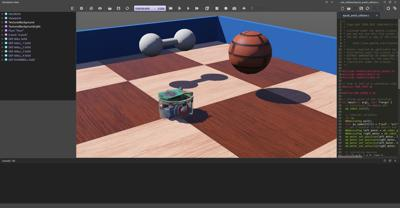

## Tutorial 5: Compound Solid and Physics Attributes (15 Minutes)

The aim of this tutorial is to explore in more detail the physics simulation by creating a solid with several bounding objects: a dumbbell made of two spheres and one cylinder.
The expected result is depicted in [this figure](#expected-result-at-the-end-of-the-tutorial-about-compound-solids).

%figure "Expected result at the end of the tutorial about compound solids."

%end

### New Simulation

> **Hands on #1**: Start from the results of the previous tutorial and create a new simulation called `compound_solid.wbt` by using the menu `File / Save World As...`.

### Compound Solid

It is possible to build [Solid](../reference/solid.md) nodes more complex than what we have seen before by aggregating [Shape](../reference/shape.md) nodes.
In fact, both the physical and the graphical properties of a [Solid](../reference/solid.md) can be made of several [Shape](../reference/shape.md) nodes.
Moreover each [Shape](../reference/shape.md) node can be placed in a [Pose](../reference/pose.md) node in order to change its relative position and orientation.
[Group](../reference/group.md) nodes can also be used to group several sub-nodes.

We want to implement a dumbbell made of a handle ([Cylinder](../reference/cylinder.md)) and of two weights ([Sphere](../reference/sphere.md)) located at each end of the handle.
This [figure](#representation-of-the-subnodes-of-a-compound-solid-made-of-several-transformed-geometries) depicts the [Solid](../reference/solid.md) nodes and its sub-nodes required to implement the dumbbell.

> **Hands on #2**: Create the dumbbell by following the [figure](#representation-of-the-subnodes-of-a-compound-solid-made-of-several-transformed-geometries).
Create the handle first without placing it in a [Pose](../reference/pose.md) node (so the handle axis will have the same direction as the z-axis of the solid).
The handle should have a length of 0.1 m and a radius of 0.01 m.
The weights should have a radius of 0.03 m and a subdivision of 2.
The weights can be moved at the handle extremities thanks to the `translation` field of their [Pose](../reference/pose.md) nodes.

%figure "Representation of the subnodes of a compound solid made of several transformed geometries."
%chart
graph TD
  Solid[[Solid](../reference/solid.md)] -->|physics| Physics[[Physics](../reference/physics.md)]
  Solid -->|boundingObject| USEG0[USE G0]
  Solid -->|children| Group[[DEF G0 Group](../reference/group.md)]
    Group -->|children| Shape1[[Shape](../reference/shape.md)]
      Shape1 -->|geometry| Cylinder[[Cylinder](../reference/cylinder.md)]
    Group -->|children| Pose1[[Pose](../reference/pose.md)]
      Pose1 -->|children| Shape2[[Shape](../reference/shape.md)]
        Shape2 -->|geometry| Sphere1[[Sphere](../reference/sphere.md)]
    Group -->|children| Pose2[[Pose](../reference/pose.md)]
      Pose2 -->|children| Shape3[[Shape](../reference/shape.md)]
        Shape3 -->|geometry| Sphere2[[Sphere](../reference/sphere.md)]
    USEG0 -.- Group

  class Solid highlightedNode;
  class USEG0,Group secondaryNode;
%end
%end

### Physics Attributes

The aim of this subsection is to learn how to set some simple physics properties for a [Solid](../reference/solid.md) node.
The [Physics](../reference/physics.md) node contains fields related to the physics of the current rigid body ([Solid](../reference/solid.md)).

The **mass** of a [Solid](../reference/solid.md) node is given by its `density` or `mass` field.
Only one of these two fields can be specified at a time (the other should be set to *-1*).
When the `mass` is specified, it defines the total mass of the solid (in [kg]).
When the `density` is specified, its value (in [kg/m3]) is multiplied by the volume of the bounding objects, and the product gives the total mass of the solid.
A density of 1000 [kg/m³] corresponds to the density of water (default value).

> **Hands on #3**: Set the mass of the dumbbell to *2* [kg].
The density is not used and should be set to *-1*.

By default, the **center of mass** of a [Solid](../reference/solid.md) node is set at its origin (defined by the translation field of the solid).
The center of mass can be modified using the `centerOfMass` field of the [Physics](../reference/physics.md) node.
The center of mass is specified relatively to the origin of the [Solid](../reference/solid.md).

> **Hands on #4**: Let's say that one of the weights is heavier than the other one.
Move the center of mass of the dumbbell of `0.01` [m] along the z-axis.

Note that when the solid is selected, the center of mass is represented in the 3D view by a coordinate system which is darker than the coordinate system representing the solid center.

### The Rotation Field

The `rotation` field of the [Pose](../reference/pose.md) node determines the rotation of this node (and of its children) using the [Euler axis and angle](https://en.wikipedia.org/wiki/Axis%E2%80%93angle_representation) representation.
A **Euler axis and angle** rotation is defined by four components.
The first three components are a unit vector that defines the rotation axis.
The fourth component defines the rotation angle about the axis (in [rad]).

The rotation occurs in the sense prescribed by the right-hand rule.

> **Hands on #5**: Modify the rotation of the [Solid](../reference/solid.md) node of the dumbbell in order to move the handle's axis (z-axis) parallel to the ground.
A unit axis (`0, 1, 0`) and an angle of &pi;/2 (~ `1.5708`) is a possible solution.

### How to Choose Bounding Objects?

As said before, minimizing the number of bounding objects increases the simulation speed.
However, choosing the bounding objects primitives carefully is also crucial to increase the simulation speed.

Using a combination of [Sphere](../reference/sphere.md), [Box](../reference/box.md), [Capsule](../reference/capsule.md) and [Cylinder](../reference/cylinder.md) nodes for defining objects is very efficient.
Generally speaking, the efficiency of these primitives can be sorted like this: [Sphere](../reference/sphere.md) > [Box](../reference/box.md) > [Capsule](../reference/capsule.md) > [Cylinder](../reference/cylinder.md), where the [Sphere](../reference/sphere.md) is the most efficient.
But this can be neglected under common usage.

The [IndexedFaceSet](../reference/indexedfaceset.md) geometry primitive can also be used in a bounding object.
But this primitive is less efficient than the other primitives listed above.
Moreover its behavior is sometimes buggy.
For this reasons, we don't recommend using the [IndexedFaceSet](../reference/indexedfaceset.md) when another solution using a combination of the other primitives is possible.

Grounds can be defined using the [Plane](../reference/plane.md) or the [ElevationGrid](../reference/elevationgrid.md) primitives.
The [Plane](../reference/plane.md) node is much more efficient than the [ElevationGrid](../reference/elevationgrid.md) node, but it can only be used to model a flat terrain while the [ElevationGrid](../reference/elevationgrid.md) can be used to model an uneven terrain.

### Contacts

When two solids collide, **contacts** are created at the collision points.
[ContactProperties](../reference/contactproperties.md) nodes can be used to specify the desired behavior of the contacts (e.g. the friction between the two solids).

Each solid belongs to a material category referenced by their `contactMaterial` field (`default` by default).
The [WorldInfo](../reference/worldinfo.md) node has a `contactProperties` field that stores a list of [ContactProperties](../reference/contactproperties.md) nodes.
These nodes allow to define the contact properties between two categories of [Solids](../reference/solid.md).

We want now to modify the friction model between the dumbbell and the other solids of the environment.

> **Hands on #6**: Set the `contactMaterial` field of the dumbbell to *"dumbbell"*.
In the [WorldInfo](../reference/worldinfo.md) node, add a [ContactProperties](../reference/contactproperties.md) node between the `default` and `dumbbell` categories.
Try to set the `coulombFriction` field to `0` and remark that the dumbbell slides (instead of rotating) on the floor because no more friction is applied.

### `basicTimeStep`, `ERP` and `CFM`

The most critical parameters for a physics simulation are stored in the `basicTimeStep`, `ERP` and `CFM` fields of the [WorldInfo](../reference/worldinfo.md) node.

The `basicTimeStep` field determines the duration (in [ms]) of a physics step.
The bigger this value is, the quicker the simulation is, the less precise the simulation is.
We recommend values between *8* and *16* for regular use of Webots.

It's more difficult to explain the behavior of the `ERP` and `CFM` fields.
These values are directly used by the physics engine to determine how the constraints are solved.
The default values are well defined for regular use of Webots.
We recommend to read the [Reference Manual](../reference/worldinfo.md) and the documentation of [ODE](http://ode.org/wiki/index.php?title=Manual) (physics engine used in Webots) to understand completely their purpose.

### Minor Physics Parameters

There are also other physics parameters which are less useful in a regular use of Webots, for example some of the fields of the [Physics](../reference/physics.md), [WorldInfo](../reference/worldinfo.md) and [ContactProperties](../reference/contactproperties.md) nodes.

> **Hands on #7**: Search how to add a linear damping on all the objects, how to use the inertia matrix and how to use the `physicsDisableTime` property.

### Solution: World File

To compare your world with the solution, go to your files and find the folder named "my\_first\_simulation" created in [Tutorial 1](tutorial-1-your-first-simulation-in-webots.md), then go to the "worlds" folder and open with a text editor the right world.
[This solution]({{ url.github_tree }}/projects/samples/tutorials/worlds/compound_solid.wbt) as the others is located in the [solution directory]({{ url.github_tree }}/projects/samples/tutorials/worlds/).

### Conclusion

You are now able to build a wide range of solids including those being composed of several rigid bodies.
You know that a Geometry node can be moved and rotated if it is included in a [Pose](../reference/pose.md) node.
You are aware about all the physics parameters allowing you to design robust simulations.
The next step will be to create your own robot.

You can test your skills by creating common objects such as a table.
