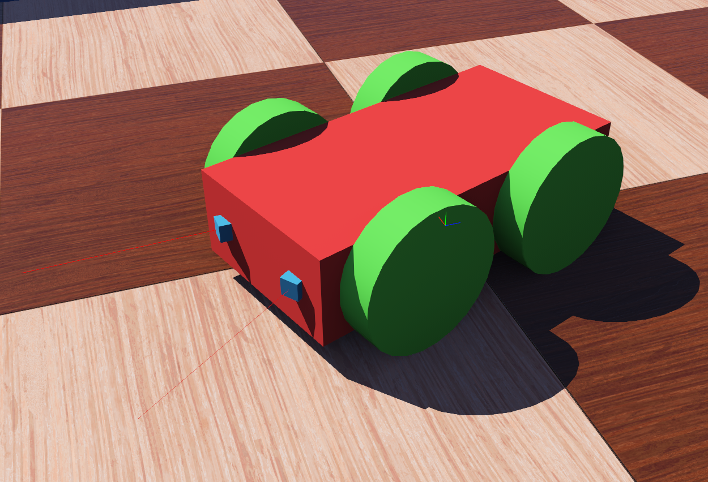
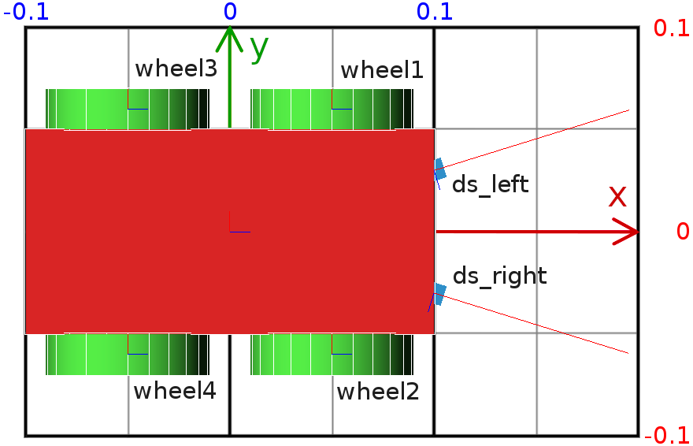

## Tutorial 6: 4-Wheels Robot

The aim of this tutorial is to create your first robot from scratch.
This robot will be made of a body, four wheels, and two distance sensors.
The result is depicted on [this figure](#3d-view-of-the-4-wheels-robot-note-that-the-coordinate-system-representations-of-the-robot-body-and-of-its-wheels-are-oriented-the-same-way-their-px-vector-defines-the-left-of-the-robot-their-py-vector-defines-the-top-of-the-robot-and-their-pz-vector-defines-the-front-of-the-robot-the-distance-sensors-are-oriented-in-a-different-way-their-px-vector-indicates-the-direction-of-the-sensor).
The [next figure](#top-view-of-the-4-wheels-robot-the-grid-behind-the-robot-has-a-dimension-of-0-2-x-0-3-meters-the-text-labels-correspond-to-the-name-of-the-devices) shows the robot from a top view.

%figure "3D view of the 4 wheels robot. Note that the coordinate system representations of the robot body and of its wheels are oriented the same way. Their +x-vector (in red) defines the left of the robot, their +y-vector (in green) defines the top of the robot, and their +z-vector (in blue) defines the front of the robot. The distance sensors are oriented in a different way, their +x-vector indicates the direction of the sensor."



%end

%figure "Top view of the 4 wheels robot. The grid behind the robot has a dimension of 0.2 x 0.3 meters. The text labels correspond to the name of the devices."



%end

### New Simulation

> **Hands on #1**: Save the world of the previous tutorial as `4_wheels_robot.wbt`.
Remove the nodes defining the e-puck, the ball, the dumbbell and the contact properties.
The ground, the walls and the lighting are kept.

### Separating the Robot in Solid Nodes

Some definitions are required before giving rules to create a robot model.

The set containing the [Solid](../reference/solid.md) node and all its derived nodes is called the *solid nodes*.
A similar definition is applied for the [Device](../reference/device.md), [Robot](../reference/robot.md), [Joint](../reference/joint.md) and [Motor](../reference/motor.md) nodes.
You can get more information about the node hierarchy in the [nodes chart diagram](../reference/node-chart.md).
Note that most of the sensors and actuators are [Solid](../reference/solid.md) and [Device](../reference/device.md) nodes at the same time.

The main structure of a [Robot](../reference/robot.md) model is a tree of [Solid](../reference/solid.md) nodes linked together.
The root node of this tree should be a [Robot](../reference/robot.md) node.
The solids are linked together by [Joint](../reference/joint.md) nodes.
A [Device](../reference/device.md) node should be the direct child of either a [Robot](../reference/robot.md) node, a [Solid](../reference/solid.md) node or a [Joint](../reference/joint.md) node.

A [Joint](../reference/joint.md) node is used to add one (or two) degree(s) of freedom (DOF), between its parent and its child.
The direct parent and child of a [Joint](../reference/joint.md) node are both [Solid](../reference/solid.md) nodes.

The nodes derived from [Joint](../reference/joint.md) allow creating different kinds of constraints between the linked [Solid](../reference/solid.md) nodes.
The most used one in robotics, is the [HingeJoint](../reference/hingejoint.md) allowing to model amongst others rotational motors including wheels.

A [Joint](../reference/joint.md) node can be monitored or actuated by adding respectively a [PositionSensor](../reference/positionsensor.md) node, or a motor node to its `device` field.

Having these rules in mind, we can start to design the node hierarchy used to model the robot.
The first step is to determine which part of the robot should be modeled as a [Solid](../reference/solid.md) node.

In our example, this operation is quite obvious.
The robot has 4 DOF corresponding to the wheel motors.
It can be divided in five solid nodes: the body and the four wheels.

Depending on the expected application of the robot model, reducing the number of DOF when modeling could be important to get an efficient simulation.
For example, when modeling a caster wheel, a realistic approach implies to model 2 DOF.
But if this degree of precision is useless for the simulation, a more efficient approach can be found.
For example, to model the caster wheel as a [Sphere](../reference/sphere.md) having a null friction coefficient with the ground.

The second step is to determine which [Solid](../reference/solid.md) node is the [Robot](../reference/robot.md) node (the root node).
This choice is arbitrary, but a solution is often much easier to implement.
For example, in the case of an humanoid robot, the robot node would be typically the robot chest, because the robot symmetry facilitates the computation of the joint parameters.

In our case, the body box is obviously the better choice.
The [figure](#high-level-representation-of-the-4-wheels-robot) depicts the solid nodes hierarchy of the robot.

> **Hands on #2**: At the end of the scene tree, add a [Robot](../reference/robot.md) node having four [HingeJoint](../reference/hingejoint.md) nodes having a [Solid](../reference/solid.md) node as `endPoint`.
Please refer to [this figure](#high-level-representation-of-the-4-wheels-robot).
Add a [Shape](../reference/shape.md) node containing a Box geometry to the [Robot](../reference/robot.md) node.
Set the color of the [Shape](../reference/shape.md) to red.
Use the [Shape](../reference/shape.md) to define also the `boundingObject` field of the [Robot](../reference/robot.md) node.
The dimension of the box is `(0.1, 0.05, 0.2)`.
Add a [Physics](../reference/physics.md) node to the [Robot](../reference/robot.md).
The [figure](#low-level-representation-of-the-4-wheels-robot) represents all the nodes defining the robot.
So far only the direct children nodes of the root [Robot](../reference/robot.md) node are implemented.

%figure "High level representation of the 4 wheels robot"
%chart
graph TD
  Robot[[Robot](../reference/robot.md)] -->|children| HingeJoint[[HingeJoint](../reference/hingejoint.md)]
    HingeJoint -->|endPoint| Solid[[DEF WHEEL1 Solid](../reference/solid.md)]
  Robot -.->|children| OtherWheels[Other wheels]
  style HingeJoint fill:#ffe4bf;
  class Robot highlightedNode;
%end
%end

%figure "Low level representation of the 4 wheels robot"
%chart
graph TD
  Robot[[Robot](../reference/robot.md)] -->|physics| Physics1[[Physics](../reference/physics.md)]
  Robot -->|boundingObject| USEBODY[USE BODY]
  Robot -->|children| Shape1[[DEF BODY Shape](../reference/shape.md)]
    Shape1 -->|geometry| Box[[Box](../reference/box.md)]
    Shape1 -.- USEBODY
  Robot -->|children| HingeJoint[[HingeJoint](../reference/hingejoint.md)]
    HingeJoint -->|devices| RotationalMotor[[RotationalMotor](../reference/rotationalmotor.md)]
    HingeJoint -->|jointParameters| HingeJointParameters[[HingeJointParameters](../reference/hingejointparameters.md)]
    HingeJoint -->|endPoint| Solid[[DEF WHEEL1 Solid](../reference/solid.md)]
      Solid -->|physics| Physics2[[DEF WHEEL_PH Physics](../reference/physics.md)]
      Solid -->|boundingObject| USEWHEEL[USE WHEEL]
      Solid -->|children| Transform[[DEF WHEEL Transform](../reference/transform.md)]
        Transform -->|children| Shape2[[Shape](../reference/shape.md)]
          Transform -.- USEWHEEL
          Shape2 -->|geometry| Cylinder[[Cylinder](../reference/cylinder.md)]
  Robot -.->|children| OtherWheels["Other wheels (using WHEEL and WHEEL_PH)"]

  style HingeJoint fill:#ffe4bf;
  class Robot highlightedNode;
  class Shape1,USEBODY,Transform,USEWHEEL secondaryNode;
%end
%end

### `HingeJoint`

The initial position of the Wheel is defined by the translation and the rotation fields of the [Solid](../reference/solid.md) node.
While the rotation origin (anchor) and the rotation axis (axis) are defined by the optional [HingeJointParameters](../reference/hingejointparameters.md) child of the [HingeJoint](../reference/hingejoint.md) node.

%figure "Representation of a hinge joint"


%end

For the first wheel, the [Solid](../reference/solid.md) translation should be defined to `(0.06, 0, 0.05)` in order to define the relative gap between the body and the wheel.
The [HingeJointParameters](../reference/hingejointparameters.md) anchor should also be defined to `(0.06, 0, 0.05)` to define the rotation origin (relatively to the body).
Finally the [HingeJointParameters](../reference/hingejointparameters.md) axis should define the rotation axis.
In our case it's along the x-axis (so `(1, 0, 0)`).

> **Hands on #3**: Add a [HingeJointParameters](../reference/hingejointparameters.md) node, and enter the field values as described above.
Some signs obviously have to be updated for other wheels.

We want now to implement the cylinder shape of the wheels.
As the [Cylinder](../reference/cylinder.md) node is defined along the *y*-axis, a [Transform](../reference/transform.md) node should encapsulate the [Shape](../reference/shape.md) to rotate the [Cylinder](../reference/cylinder.md) along the along the *x*-axis.

> **Hands on #4**: Complete the missing nodes to get the same structure as the one depicted in [this figure](#low-level-representation-of-the-4-wheels-robot).
Don't forget the [Physics](../reference/physics.md) nodes.
Rotate the [Transform](../reference/transform.md) node by an Euler axis and angle of `(0, 0, 1, 1.5708)` in order to inverse the *x*-axis and the *y*-axis.
The [Cylinder](../reference/cylinder.md) should have a `radius` of `0.04` and a `height` of `0.02`.
Set the color of the wheels to green.
In order to be able to actuate the wheels, add a [RotationalMotor](../reference/rotationalmotor.md) to each [HingeJoint](../reference/hingejoint.md), and change their `name` fields from `wheel1` to `wheel4`.
These labels will be used to reference the wheels from the controller.

### Sensors

The last part of the robot modeling is to add the two distance sensors to the robot.
This can be done by adding two [DistanceSensor](../reference/distancesensor.md) nodes as direct children of the [Robot](../reference/robot.md) node.
Note that the distance sensor acquires its data along the +*x*-axis.
So rotating the distance sensors in order to point their *x*-axis outside the robot is necessary (see the [figure](#top-view-of-the-4-wheels-robot-the-grid-behind-the-robot-has-a-dimension-of-0-2-x-0-3-meters-the-text-labels-correspond-to-the-name-of-the-devices)).

> **Hands on #5**: Add the two distance sensors as explained above.
The distance sensors are at an angle to 0.3 [rad] with the robot front vector.
Set their graphical and physical shape to a cube (not transformed) having a edge of `0.01` [m].
Set their color to blue.
Set their `name` field according to the labels of [this figure](#top-view-of-the-4-wheels-robot-the-grid-behind-the-robot-has-a-dimension-of-0-2-x-0-3-meters-the-text-labels-correspond-to-the-name-of-the-devices).

### Controller

In the previous tutorials, you have learnt how to setup a feedback loop and how to read the distance sensor values.
However, actuating a [RotationalMotor](../reference/rotationalmotor.md) node is something new.
To program the rotational motors, the first step is to include the API module corresponding to the [RotationalMotor](../reference/rotationalmotor.md) node:

%tab-component
%tab "C"
```c
#include <webots/motor.h>
```
%tab-end

%tab "C++"
```cpp
#include <webots/Motor.hpp>
```
%tab-end

%tab "Python"
```python
from controller import Motor
```
%tab-end

%tab "Java"
```java
import com.cyberbotics.webots.controller.Motor;
```
%tab-end

%tab "MATLAB"
In MATLAB controller you don't need to include the API, Webots will do this for you.
%tab-end
%end

Then to get the references of the [RotationalMotor](../reference/rotationalmotor.md) nodes:

%tab-component
%tab "C"
```c
// initialize motors
WbDeviceTag wheels[4];
char wheels_names[4][8] = {
  "wheel1", "wheel2", "wheel3", "wheel4"
};
int i;
for (i = 0; i < 4 ; i++)
  wheels[i] = wb_robot_get_device(wheels_names[i]);
```
%tab-end

%tab "C++"
```cpp
// initialize motors
Motor *wheels[4];
char wheelsNames[4][8] = {"wheel1", "wheel2", "wheel3", "wheel4"};
for (int i = 0; i < 4 ; i++)
  wheels[i] = robot->getMotor(wheelsNames[i]);
```
%tab-end

%tab "Python"
```python
# initialize motors
Motor wheels = []
wheelsNames = ['wheel1', 'wheel2', 'wheel3', 'wheel4']
for name in wheelsNames:
    wheels.append(robot.getMotor(name))
```
%tab-end

%tab "Java"
```java
// initialize motors
Motor[4] wheels;
String[] wheelsNames = {"wheel1", "wheel2", "wheel3", "wheel4"};
for (int i = 0; i < wheelsNames.length; i++)
  wheels[i] = robot.getMotor(wheelsNames[i]);
```
%tab-end

%tab "MATLAB"
```matlab
% initialize motors
wheels_names = ["wheel1", "wheel2", "wheel3", "wheel4"];
wheels = [];
for i = 1:4
  wheels[i] = wb_robot_get_device(wheels_names[i]);
end
```
%tab-end
%end

A [Motor](../reference/motor.md) can be actuated by setting its position, its velocity, its acceleration or its force.
Here we are interested in setting its velocity.
This can be achieved by setting its position at infinity, and by bounding its velocity:

%tab-component
%tab "C"
```c
double speed = -1.5; // [rad/s]
wb_motor_set_position(wheels[0], INFINITY);
wb_motor_set_velocity(wheels[0], speed);
```
%tab-end

%tab "C++"
```cpp
double speed = -1.5; // [rad/s]
wheels[0]->setPosition(INFINITY);
wheels[0]->setVelocity(speed);
```
%tab-end

%tab "Python"
```python
speed = -1.5  # [rad/s]
wheels[0].setPosition(float('inf'))
wheels[0].setVelocity(speed)
```
%tab-end

%tab "Java"
```java
double speed = -1.5; // [rad/s]
wheels[0].setPosition(Double.POSITIVE_INFINIT);
wheels[0].setVelocity(speed);
```
%tab-end

%tab "MATLAB"
```matlab
speed = -1.5; % [rad/s]
wb_motor_set_position(wheels[0], inf);
wb_motor_set_velocity(wheels[0], speed);
```
%tab-end
%end

> **Hands on #6**: Implement a controller called `4_wheels_collision_avoidance` moving the robot and avoiding obstacles by detecting them by the distance sensors.

Note that the `lookupTable` field of the [DistanceSensor](../reference/distancesensor.md) nodes indicates which values are returned by the sensor.

Don't forget to set the `controller` field of the [Robot](../reference/robot.md) node to indicate your new controller.

As usual a possible solution of this exercise is located in the tutorials directory.

### Conclusion

You are now able to design simple robot models, to implement them and to create their controllers.

More specifically, you learnt the different kinds of nodes involved in the building of the robot models, the way to translate and rotate a solid relative to another and the way that a rotational motor is actuated by the controller.
