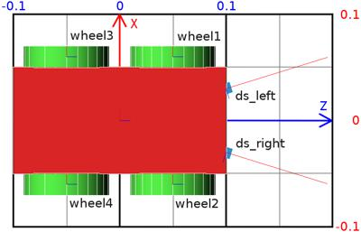
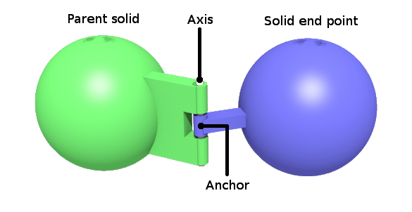

## Tutorial 6: 4-Wheeled Robot (60 Minutes)

This tutorial aims at creating your first robot from scratch.
The robot will consist of a body, four wheels, and two distance sensors.
The result is depicted on [this figure](#3d-view-of-the-4-wheels-robot-note-that-the-coordinate-system-representations-of-the-robot-body-and-of-its-wheels-are-oriented-the-same-way-their-px-vector-in-red-defines-the-left-of-the-robot-their-py-vector-in-green-defines-the-top-of-the-robot-and-their-pz-vector-in-blue-defines-the-front-of-the-robot-the-distance-sensors-are-oriented-in-a-different-way-their-px-vector-indicates-the-direction-of-the-sensor).
The [next figure](#top-view-of-the-4-wheeled-robot-the-grid-behind-the-robot-has-a-dimension-of-0-2-x-0-3-meters-the-text-labels-correspond-to-the-name-of-the-device) shows the robot from a top view.

%figure "3D view of the 4 wheels robot. Note that the coordinate system representations of the robot body and of its wheels are oriented the same way. Their +x-vector (in red) defines the left of the robot, their +y-vector (in green) defines the top of the robot, and their +z-vector (in blue) defines the front of the robot. The distance sensors are oriented in a different way, their +x-vector indicates the direction of the sensor."


%end

%figure "Top view of the 4 wheeled robot. The grid behind the robot has a dimension of 0.2 x 0.3 meters. The text labels correspond to the name of the device."



%end

### New Simulation

> **Hands on #1**: Save the world of the previous tutorial as `4_wheeled_robot.wbt`.
Remove the nodes defining the e-puck, the ball, the dumbbell and the contact properties.
The ground, the walls and the lighting are kept.

### Separating the Robot in Solid Nodes

Some definitions and rules to create the robot model:

- The set containing the [Solid](../reference/solid.md) node and all its derived nodes are called the *solid nodes*.

- A similar definition is applied for the [Device](../reference/device.md), [Robot](../reference/robot.md), [Joint](../reference/joint.md) and [Motor](../reference/motor.md) nodes.
You can get more information about the node hierarchy in the [nodes chart diagram](../reference/node-chart.md).

- Most sensors and actuators are both [Solid](../reference/solid.md) and [Device](../reference/device.md) nodes at the same time.

- The main structure of a [Robot](../reference/robot.md) model is a tree of [Solid](../reference/solid.md) nodes linked together.
The root node of this tree should be a [Robot](../reference/robot.md) node.

- The solids are linked together by [Joint](../reference/joint.md) nodes.
A [Device](../reference/device.md) node should be the direct child of either a [Robot](../reference/robot.md) node, a [Solid](../reference/solid.md) node or a [Joint](../reference/joint.md) node.

- A [Joint](../reference/joint.md) node is used to add one (or two) degree(s) of freedom (DOF), between its parent and its child.
The direct parent and child of a [Joint](../reference/joint.md) node are both [Solid](../reference/solid.md) nodes.

- The nodes derived from [Joint](../reference/joint.md) allow creating different kinds of constraints between the linked [Solid](../reference/solid.md) nodes.
The most used one in robotics, is the [HingeJoint](../reference/hingejoint.md) allowing to model amongst others rotational motors including wheels.

- A [Joint](../reference/joint.md) node can be monitored or actuated by adding a [PositionSensor](../reference/positionsensor.md) node, or a motor node to its `device` field respectively.


Having these rules in mind, we can start designing the node hierarchy used to model the robot.
The first step is to determine which part of the robot should be modeled as a [Solid](../reference/solid.md) node.

In our example, this operation is quite obvious.
The robot has 4 DOF corresponding to the wheel motors.
It can be divided in five solid nodes: the body and the four wheels.

Depending on the expected application of the robot model, reducing the DOF while modelling might be necessary to get an efficient simulation.
For example, when modeling a caster wheel, a realistic approach implies to model 2 DOF.
But if this degree of precision is useless for the simulation, a more efficient approach can be found.
For example, to model the caster wheel as a [Sphere](../reference/sphere.md) having a null friction coefficient with the ground.

The second step is to determine which [Solid](../reference/solid.md) node is the [Robot](../reference/robot.md) node (the root node).
This choice is arbitrary, but a solution is often much easier to implement.
For example, in the case of a humanoid robot, the robot node would be typically the robot chest, because the robot symmetry facilitates the computation of the joint parameters.

In our case, the body box is obviously the better choice.
The [figure](#high-level-representation-of-the-4-wheeled-robot) depicts the solid nodes hierarchy of the robot.

> **Hands on #2**: At the end of the scene tree, add a [Robot](../reference/robot.md) node having four [HingeJoint](../reference/hingejoint.md) nodes having a [Solid](../reference/solid.md) node as `endPoint`.
Please refer to [this figure](#high-level-representation-of-the-4-wheeled-robot).
Add a [Shape](../reference/shape.md) node containing a Box geometry to the [Robot](../reference/robot.md) node.
Set the color of the [Shape](../reference/shape.md) to red.
Use the [Shape](../reference/shape.md) to define the `boundingObject` field of the [Robot](../reference/robot.md) node.
The dimension of the box is `(0.2, 0.1, 0.05)`.
Add a [Physics](../reference/physics.md) node to the [Robot](../reference/robot.md).
The [figure](#high-level-representation-of-the-4-wheeled-robot) represents all the nodes defining the robot.
So far, only the direct children nodes of the root [Robot](../reference/robot.md) node has been implemented.

%figure "High level representation of the 4 wheeled robot"
%chart
graph TD
  Robot[[Robot](../reference/robot.md)] -->|children| HingeJoint[[HingeJoint](../reference/hingejoint.md)]
    HingeJoint -->|endPoint| Solid[[DEF WHEEL1 Solid](../reference/solid.md)]
  Robot -.->|children| OtherWheels[Other wheels]
  style HingeJoint fill:#ffe4bf;
  class Robot highlightedNode;
%end
%end

### `HingeJoint`

The initial position of the wheel is defined by the translation and the rotation fields of the [Solid](../reference/solid.md) node.

The rotation origin (anchor) and the rotation axis (axis) are defined by the optional [HingeJointParameters](../reference/hingejointparameters.md) child of the [HingeJoint](../reference/hingejoint.md) node.

%figure "Representation of a hinge joint"



%end

The radius of the wheel is 0.04 and its thickness (height of the cylinder) is 0.02.
For the first wheel, the [Solid](../reference/solid.md) translation should be defined to `(0.05, 0.06, 0)` in order to define the relative gap between the body and the wheel, and the rotation to `(1 0 0 1.5708)` for the wheel cylinder to be correctly oriented.
The [HingeJointParameters](../reference/hingejointparameters.md) anchor should also be defined to `(0.05, 0.06, 0)` to define the rotation origin (relatively to the body).
Finally, the [HingeJointParameters](../reference/hingejointparameters.md) axis should define the rotation axis.
In our case it's along the y-axis (so `(0, 1, 0)`).

> **Hands on #3**: Add a [HingeJointParameters](../reference/hingejointparameters.md) node, and enter the field values as described above.
Some signs obviously have to be updated for other wheels.

Now, let's implement the cylinder shape of the wheels.

For each [HingeJoint](../reference/hingejoint.md), there are three fields in which nodes need to be added.
- **jointParameters**: Add a [HingeJointParameters](../reference/hingejointparameters.md) and configure the anchor (0.05 -0.06 0) and axis (0 1 0) fields.
  These values have to be modified according to the location of the wheel.
- **device**: Add a [RotationalMotor](../reference/rotationalmotor.md) in order to be able to actuate the wheels. Change their `name` fields from `wheel1` to `wheel4` according to [this figure](#top-view-of-the-4-wheeled-robot-the-grid-behind-the-robot-has-a-dimension-of-0-2-x-0-3-meters-the-text-labels-correspond-to-the-name-of-the-device).
  These labels will be used to reference the wheels from the controller.
- **endPoint**: Add a [Solid](../reference/solid.md) node, then a [Shape](../reference/shape.md) node in the `children` field of the [Solid](../reference/solid.md), and finally, add a [Cylinder](../reference/cylinder.md) in the `geometry` field of the [Shape](../reference/shape.md) node.
  The [Cylinder](../reference/cylinder.md) should have a `radius` of `0.04` and a `height` of `0.02`.
Set the color of the wheels to green.

> **Hands on #4**: Complete the missing nodes to get the same structure as the one depicted in [this figure](#low-level-representation-of-the-4-wheeled-robot).
Don't forget the [Physics](../reference/physics.md) nodes.

%figure "Low level representation of the 4 wheeled robot"
%chart
graph TD
  Robot[[Robot](../reference/robot.md)] -->|physics| Physics1[[Physics](../reference/physics.md)]
  Robot -->|boundingObject| USEBODY[USE BODY]
  Robot -->|children| Shape1[[DEF BODY Shape](../reference/shape.md)]
    Shape1 -->|geometry| Box[[Box](../reference/box.md)]
    Shape1 -.- USEBODY
  Robot -->|children| HingeJoint[[HingeJoint](../reference/hingejoint.md)]
    HingeJoint -->|device| RotationalMotor[[RotationalMotor](../reference/rotationalmotor.md)]
    HingeJoint -->|jointParameters| HingeJointParameters[[HingeJointParameters](../reference/hingejointparameters.md)]
    HingeJoint -->|endPoint| Solid[[DEF WHEEL1 Solid](../reference/solid.md)]
      Solid -->|physics| Physics2[[DEF WHEEL_PH Physics](../reference/physics.md)]
      Solid -->|boundingObject| USEWHEEL[USE WHEEL]
      Solid -->|children| Shape2[[DEF WHEEL Shape](../reference/shape.md)]
          Shape2 -.- USEWHEEL
          Shape2 -->|geometry| Cylinder[[Cylinder](../reference/cylinder.md)]
  Robot -.->|children| OtherWheels["Other wheels (using WHEEL and WHEEL_PH)"]

  style HingeJoint fill:#ffe4bf;
  class Robot highlightedNode;
  class Shape1,USEBODY,USEWHEEL secondaryNode;
%end
%end


### Sensors

The sensors used on the e-puck of [Tutorial 4](tutorial-4-more-about-controllers.md) are not the same as the ones used in this section. Pay attention to their measuring interval which is between `0 cm = 0` and `10 cm = 1000`.
Find more information about the `lookupTable` field [here](../reference/distancesensor.md#lookup-table).


The last part of the robot modeling is to add the two distance sensors to the robot.
This can be done by adding two [DistanceSensor](../reference/distancesensor.md) nodes as direct children of the [Robot](../reference/robot.md) node.
Note that the distance sensor acquires its data along the positive x-axis.
So, it is necessary to rotate the distance sensor to point their x-axis outside the robot (see the [figure](#top-view-of-the-4-wheeled-robot-the-grid-behind-the-robot-has-a-dimension-of-0-2-x-0-3-meters-the-text-labels-correspond-to-the-name-of-the-device)).

%spoiler "**Reminder**: How to know the orientation of the distance sensor?"

As already says in [Tutorial 3](tutorial-3-appearance.md), the distance sensor rays can be viewed using the shortcut <kbd>ctrl</kbd>-<kbd>F10</kbd> or `View / Optional Rendering / Show DistanceSensor Rays`.

%end

> **Hands on #5**: Add the two distance sensors as explained above.
The distance sensors are at an angle to 0.3 [rad] with the front vector of the robot.
Set the graphical and physical shape to a cube (not transformed) having a edge of `0.01` [m].
Set the color to blue.
Set the `name` field according to the labels of [this figure](#top-view-of-the-4-wheeled-robot-the-grid-behind-the-robot-has-a-dimension-of-0-2-x-0-3-meters-the-text-labels-correspond-to-the-name-of-the-device).

%spoiler "**Tips**: How to precisely orient distance sensors?"

In the [DistanceSensor](../reference/distancesensor.md) node, the rotation field has 4 parameters. If you set the angle parameter to 0, then you can use the mouse wheel to increment/decrement by steps of 0.1309 rad (= 7.5 degree).

%end

### Controller

In the previous tutorials, you have learnt how to setup a feedback loop and how to read the distance sensor values.
However, actuating a [RotationalMotor](../reference/rotationalmotor.md) node is something new.
To program the rotational motors, the first step is to include the API module corresponding to the [RotationalMotor](../reference/rotationalmotor.md) node:

%tab-component "language"
%tab "C"
```c
#include <webots/motor.h>
```
%tab-end

%tab "C++"
```cpp
#include <webots/Motor.hpp>
```
%tab-end

%tab "Python"
```python
from controller import Motor
```
%tab-end

%tab "Java"
```java
import com.cyberbotics.webots.controller.Motor;
```
%tab-end

%tab "MATLAB"
In MATLAB controller you don't need to include the API, Webots will do this for you.
%tab-end
%end

Then to get the references of the [RotationalMotor](../reference/rotationalmotor.md) nodes:

%tab-component "language"
%tab "C"
```c
// initialize motors
WbDeviceTag wheels[4];
char wheels_names[4][8] = {
  "wheel1", "wheel2", "wheel3", "wheel4"
};
int i;
for (i = 0; i < 4 ; i++)
  wheels[i] = wb_robot_get_device(wheels_names[i]);
```
%tab-end

%tab "C++"
```cpp
// initialize motors
Motor *wheels[4];
char wheelsNames[4][8] = {"wheel1", "wheel2", "wheel3", "wheel4"};
for (int i = 0; i < 4 ; i++)
  wheels[i] = robot->getMotor(wheelsNames[i]);
```
%tab-end

%tab "Python"
```python
# initialize motors
wheels = []
wheelsNames = ['wheel1', 'wheel2', 'wheel3', 'wheel4']
for name in wheelsNames:
    wheels.append(robot.getDevice(name))
```
%tab-end

%tab "Java"
```java
// initialize motors
Motor[4] wheels;
String[] wheelsNames = {"wheel1", "wheel2", "wheel3", "wheel4"};
for (int i = 0; i < wheelsNames.length; i++)
  wheels[i] = robot.getMotor(wheelsNames[i]);
```
%tab-end

%tab "MATLAB"
```MATLAB
% initialize motors
wheels = [];
wheels_names = [ "wheel1", "wheel2", "wheel3", "wheel4" ];
for i = 1:4
  wheels(i) = wb_robot_get_device(convertStringsToChars(wheels_names(i)));
end
```
%tab-end
%end

A [Motor](../reference/motor.md) can be actuated by setting its position, its velocity, its acceleration or its force.
Here we are interested in setting its velocity.
This can be achieved by setting its position to infinity, and by bounding its velocity:

%tab-component "language"
%tab "C"
```c
double speed = -1.5; // [rad/s]
wb_motor_set_position(wheels[0], INFINITY);
wb_motor_set_velocity(wheels[0], speed);
```
%tab-end

%tab "C++"
```cpp
double speed = -1.5; // [rad/s]
wheels[0]->setPosition(INFINITY);
wheels[0]->setVelocity(speed);
```
%tab-end

%tab "Python"
```python
speed = -1.5  # [rad/s]
wheels[0].setPosition(float('inf'))
wheels[0].setVelocity(speed)
```
%tab-end

%tab "Java"
```java
double speed = -1.5; // [rad/s]
wheels[0].setPosition(Double.POSITIVE_INFINIT);
wheels[0].setVelocity(speed);
```
%tab-end

%tab "MATLAB"
```MATLAB
speed = -1.5; % [rad/s]
wb_motor_set_position(wheels(1), inf);
wb_motor_set_velocity(wheels(1), speed);
```
%tab-end
%end

> **Hands on #6**: Implement a controller called `four_wheeled_collision_avoidance` moving the robot and avoiding obstacles by detecting them by the distance sensors.

Note that the `lookupTable` field of the [DistanceSensor](../reference/distancesensor.md) nodes indicates the values returned by the sensor.
To help in the debugging with the sensors, it is possible to see the value of the sensors in the real-time in the [robot-window](controller-plugin.md#robot-window).
To open the [robot-window](controller-plugin.md#robot-window), double-click on the robot body and it will bring up a menu on the left with the [DistanceSensor](../reference/distancesensor.md) and [RotationalMotor](../reference/rotationalmotor.md) graph.
Run the simulation to see the evolution.

Don't forget to set the `controller` field of the [Robot](../reference/robot.md) node to indicate your new controller.

As usual a possible solution of this exercise is located in the tutorials directory.

### The Controller Code

Here is the complete code of the controller developed in the previous subsection.

%tab-component "language"
%tab "C"
```c
#include <webots/distance_sensor.h>
#include <webots/motor.h>
#include <webots/robot.h>

#define TIME_STEP 64

int main(int argc, char **argv) {
  wb_robot_init();
  int i;
  bool avoid_obstacle_counter = 0;
  WbDeviceTag ds[2];
  char ds_names[2][10] = {"ds_left", "ds_right"};
  for (i = 0; i < 2; i++) {
    ds[i] = wb_robot_get_device(ds_names[i]);
    wb_distance_sensor_enable(ds[i], TIME_STEP);
  }
  WbDeviceTag wheels[4];
  char wheels_names[4][8] = {"wheel1", "wheel2", "wheel3", "wheel4"};
  for (i = 0; i < 4; i++) {
    wheels[i] = wb_robot_get_device(wheels_names[i]);
    wb_motor_set_position(wheels[i], INFINITY);
  }
  while (wb_robot_step(TIME_STEP) != -1) {
    double left_speed = 1.0;
    double right_speed = 1.0;
    if (avoid_obstacle_counter > 0) {
      avoid_obstacle_counter--;
      left_speed = 1.0;
      right_speed = -1.0;
    } else { // read sensors
      double ds_values[2];
      for (i = 0; i < 2; i++)
        ds_values[i] = wb_distance_sensor_get_value(ds[i]);
      if (ds_values[0] < 950.0 || ds_values[1] < 950.0)
        avoid_obstacle_counter = 100;
    }
    wb_motor_set_velocity(wheels[0], left_speed);
    wb_motor_set_velocity(wheels[1], right_speed);
    wb_motor_set_velocity(wheels[2], left_speed);
    wb_motor_set_velocity(wheels[3], right_speed);
  }
  wb_robot_cleanup();
  return 0;  // EXIT_SUCCESS
}
```
%tab-end

%tab "C++"
```cpp
#include <webots/DistanceSensor.hpp>
#include <webots/Motor.hpp>
#include <webots/Robot.hpp>

#define TIME_STEP 64
using namespace webots;

int main(int argc, char **argv) {
  Robot *robot = new Robot();
  DistanceSensor *ds[2];
  char dsNames[2][10] = {"ds_right", "ds_left"};
  for (int i = 0; i < 2; i++) {
    ds[i] = robot->getDistanceSensor(dsNames[i]);
    ds[i]->enable(TIME_STEP);
  }
  Motor *wheels[4];
  char wheels_names[4][8] = {"wheel1", "wheel2", "wheel3", "wheel4"};
  for (int i = 0; i < 4; i++) {
    wheels[i] = robot->getMotor(wheels_names[i]);
    wheels[i]->setPosition(INFINITY);
    wheels[i]->setVelocity(0.0);
  }
  int avoidObstacleCounter = 0;
  while (robot->step(TIME_STEP) != -1) {
    double leftSpeed = 1.0;
    double rightSpeed = 1.0;
    if (avoidObstacleCounter > 0) {
      avoidObstacleCounter--;
      leftSpeed = 1.0;
      rightSpeed = -1.0;
    } else { // read sensors
      for (int i = 0; i < 2; i++) {
        if (ds[i]->getValue() < 950.0)
          avoidObstacleCounter = 100;
      }
    }
    wheels[0]->setVelocity(leftSpeed);
    wheels[1]->setVelocity(rightSpeed);
    wheels[2]->setVelocity(leftSpeed);
    wheels[3]->setVelocity(rightSpeed);
  }
  delete robot;
  return 0;  // EXIT_SUCCESS
}
```
%tab-end

%tab "Python"
```python
from controller import Robot

TIME_STEP = 64
robot = Robot()
ds = []
dsNames = ['ds_right', 'ds_left']
for i in range(2):
    ds.append(robot.getDevice(dsNames[i]))
    ds[i].enable(TIME_STEP)
wheels = []
wheelsNames = ['wheel1', 'wheel2', 'wheel3', 'wheel4']
for i in range(4):
    wheels.append(robot.getDevice(wheelsNames[i]))
    wheels[i].setPosition(float('inf'))
    wheels[i].setVelocity(0.0)
avoidObstacleCounter = 0
while robot.step(TIME_STEP) != -1:
    leftSpeed = 1.0
    rightSpeed = 1.0
    if avoidObstacleCounter > 0:
        avoidObstacleCounter -= 1
        leftSpeed = 1.0
        rightSpeed = -1.0
    else:  # read sensors
        for i in range(2):
            if ds[i].getValue() < 950.0:
                avoidObstacleCounter = 100
    wheels[0].setVelocity(leftSpeed)
    wheels[1].setVelocity(rightSpeed)
    wheels[2].setVelocity(leftSpeed)
    wheels[3].setVelocity(rightSpeed)
```
%tab-end

%tab "Java"
```
import com.cyberbotics.webots.controller.Robot;
import com.cyberbotics.webots.controller.DistanceSensor;
import com.cyberbotics.webots.controller.Motor;

public class FourWheelsCollisionAvoidance {
  public static void main(String[] args) {
    int TIME_STEP = 64;
    Robot robot = new Robot();
    DistanceSensor[] ds = new DistanceSensor[2];
    String[] dsNames = {"ds_right", "ds_left"};
    for (int i = 0; i < 2; i++) {
      ds[i] = robot.getDistanceSensor(dsNames[i]);
      ds[i].enable(TIME_STEP);
    }
    Motor[] wheels = new Motor[4];
    String[] wheelsNames = {"wheel1", "wheel2", "wheel3", "wheel4"};
    for (int i = 0; i < 4; i++) {
      wheels[i] = robot.getMotor(wheelsNames[i]);
      wheels[i].setPosition(Double.POSITIVE_INFINITY);
      wheels[i].setVelocity(0.0);
    }
    int avoidObstacleCounter = 0;
    while (robot.step(TIME_STEP) != -1) {
      double leftSpeed = 1.0;
      double rightSpeed = 1.0;
      if (avoidObstacleCounter > 0) {
        avoidObstacleCounter--;
        leftSpeed = 1.0;
        rightSpeed = -1.0;
      } else { // read sensors
        for (int i = 0; i < 2; i++) {
          if (ds[i].getValue() < 950.0)
            avoidObstacleCounter = 100;
        }
      }
      wheels[0].setVelocity(leftSpeed);
      wheels[1].setVelocity(rightSpeed);
      wheels[2].setVelocity(leftSpeed);
      wheels[3].setVelocity(rightSpeed);
    }
  }
}
```
%tab-end

%tab "MATLAB"
```MATLAB
function four_wheeled_collision_avoidance

TIME_STEP = 64;
ds = [];
ds_names = [ "ds_right", "ds_left" ];
for i = 1:2
  ds(i) = wb_robot_get_device(convertStringsToChars(ds_names(i)));
  wb_distance_sensor_enable(ds(i), TIME_STEP);
end
wheels = [];
wheels_names = [ "wheel1", "wheel2", "wheel3", "wheel4" ];
for i = 1:4
  wheels(i) = wb_robot_get_device(convertStringsToChars(wheels_names(i)));
  wb_motor_set_position(wheels(i), inf);
  wb_motor_set_velocity(wheels(i), 0.0);
end
avoid_obstacle_counter = 0;

while wb_robot_step(TIME_STEP) ~= -1
  left_speed = 1.0;
  right_speed = 1.0;
  if avoid_obstacle_counter > 0
    avoid_obstacle_counter = avoid_obstacle_counter - 1;
    left_speed = 1.0;
    right_speed = -1.0;
  else % read sensors
    for i = 1:2
      if wb_distance_sensor_get_value(ds(i)) < 950.0
        avoid_obstacle_counter = 100;
      end
    end
  end
  wb_motor_set_velocity(wheels(1), left_speed);
  wb_motor_set_velocity(wheels(2), right_speed);
  wb_motor_set_velocity(wheels(3), left_speed);
  wb_motor_set_velocity(wheels(4), right_speed);
  % if your code plots some graphics, it needs to flushed like this:
  drawnow;
end
```
%tab-end

%end

### Solution: World File

To compare your world with the solution, go to your files and find the folder named "my\_first\_simulation" created in [Tutorial 1](tutorial-1-your-first-simulation-in-webots.md), then go to the "worlds" folder and open with a text editor the right world.
[This solution]({{ url.github_tree }}/projects/samples/tutorials/worlds/4_wheels_robot.wbt) as the others is located in the [solution directory]({{ url.github_tree }}/projects/samples/tutorials/worlds/).

### Conclusion

You are now able to design simple robot models, to implement them and to create their controllers.

More specifically, you learnt all the different nodes involved in the design of a robot model, methods to translate and rotate a solid relative to another and the way that a rotational motor is actuated by the controller.
